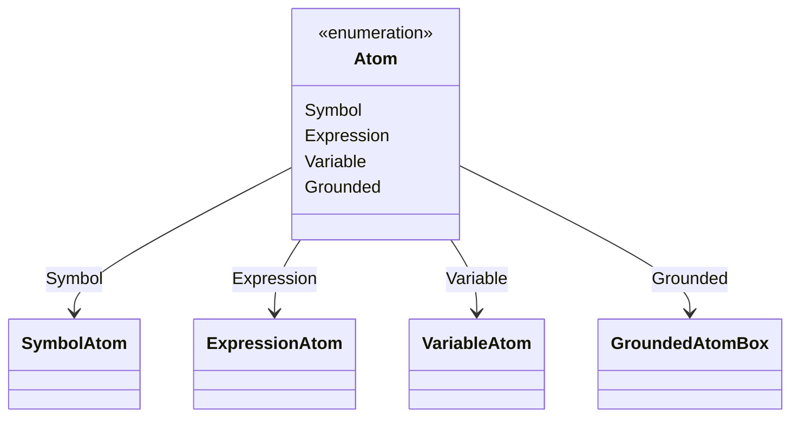
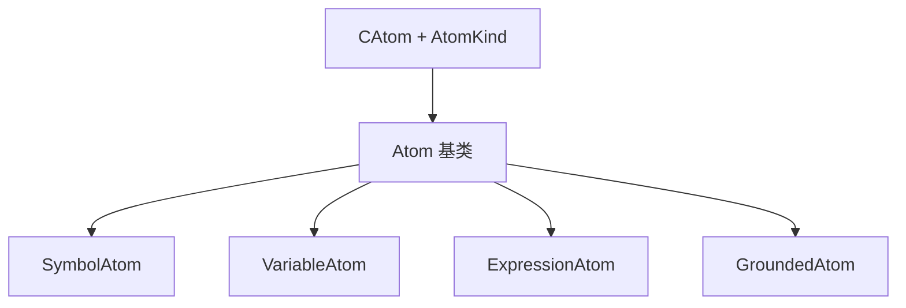
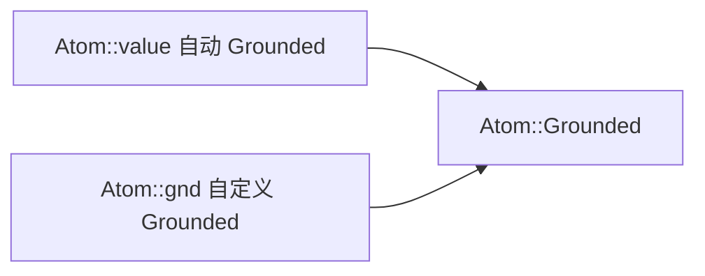
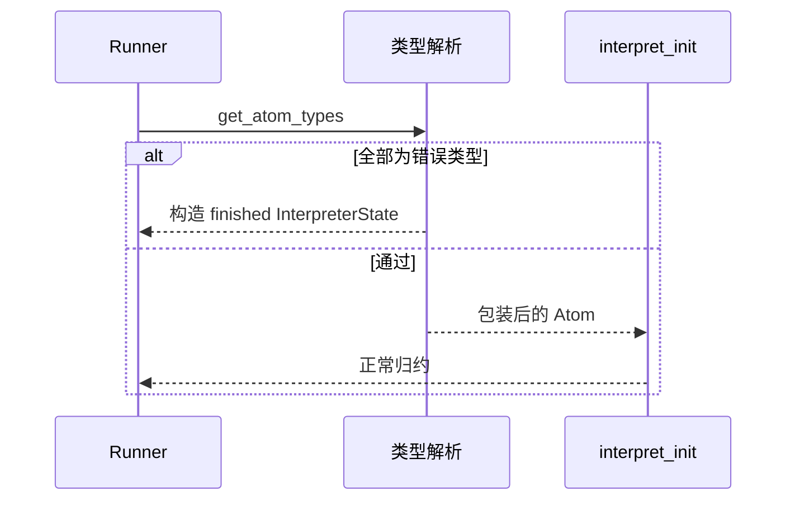

# 原子类型体系

Hyperon 用 **`Atom`** 统一表示符号、组合式、变量与承载宿主数据的 **grounded** 值。Rust 侧为 **`enum Atom`**；Python 侧通过 **`hyperonpy`** 的 **`AtomKind`** 分派到子类。

## Rust：`Atom` 四变体



## Python：类层次与 `Atom._from_catom`

Python **`Atom`** 为基类；**`SymbolAtom`**、**`VariableAtom`**、**`ExpressionAtom`**、**`GroundedAtom`** 根据 **`atom_get_metatype`** 构造。构造辅助函数 **`S` / `V` / `E`** 对应常见字面形式。



## Grounded：`GroundedAtom` trait 与 `Grounded`

Rust 中 **grounded** 载荷实现 **`Grounded`**（**`Display` + `type_()`**），并可选实现 **`CustomExecute`**（可执行）、**`CustomMatch`**（可匹配）、以及序列化。运行时以 **`Box<dyn GroundedAtom>`** 存储，**`GroundedAtom`** 作为对象安全擦除层。

```mermaid
flowchart TB
    subgraph erased["对象安全层"]
        GAtrait["trait GroundedAtom"]
    end
    subgraph behavior["行为 trait"]
        G["trait Grounded"]
        CE["trait CustomExecute"]
        CM["trait CustomMatch"]
    end
    G --> CE
    G --> CM
    GAtrait --> G : as_grounded
```

## 自动包装与自定义类型

满足 **`AutoGroundedType`**（**`'static + PartialEq + Clone + Debug`**）的值可用 **`Atom::value(x)`** 自动包装。自定义可执行或可匹配类型需实现 **`Grounded`** 与 **`Display`**（**`CustomGroundedType`**），再通过 **`Atom::gnd(...)`** 入树。



## 类型元数据与 MeTTa 类型层

MeTTa 程序中的 **`:`** 与类型检查使用 **类型 Atom**（如预置的 **`Type`**、**`Atom`** 等）与 **`get_atom_types`** 等 API；开启 **`type-check=auto`** 时，**`RunContext::step`** 在 **`interpret_init`** 之前可短路为类型错误结果。



## Rust ↔ Python 对照表

| Rust `Atom` | Python 类 | 说明 |
|-------------|-----------|------|
| `Symbol` | `SymbolAtom` | 概念名，按名字相等 |
| `Variable` | `VariableAtom` | 模式与绑定 |
| `Expression` | `ExpressionAtom` | 子节点列表 |
| `Grounded` | `GroundedAtom` | 可含 `OperationAtom` 等 |

## 小结

- **语义核心在 Rust**：Python 子类主要是 **CAtom 句柄** 与 **绑定/迭代** 的包装。
- **扩展点**：新算子实现 **`Grounded` + CustomExecute**；新匹配语义实现 **`CustomMatch`**。
- **类型与值分离**：**`type_()`** 返回的 Atom 描述 grounded 值的 MeTTa 类型，不等同于 Rust 的 `std::any::TypeId` 字符串形式（后者常用于 **`rust_type_atom`** 默认实现）。
