# 架构图表集

本文集中列出文档站常用的 **Mermaid** 图，便于单独引用或嵌入其它页面。图中 **节点 ID** 不使用空格；含特殊字符的标签使用引号包裹。

## 1. 总体分层栈

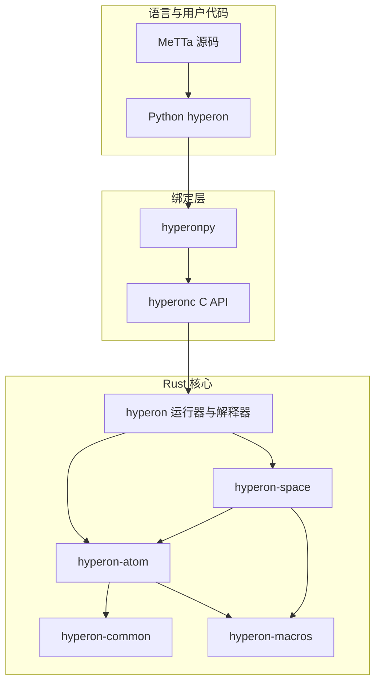

## 2. Cargo Workspace 七个成员依赖

箭头由 **依赖方** 指向 **被依赖的 crate**（与 `Cargo.toml` 一致；**`hyperon-macros`** 仅依赖 `litrs`，不依赖 `hyperon-common`）。

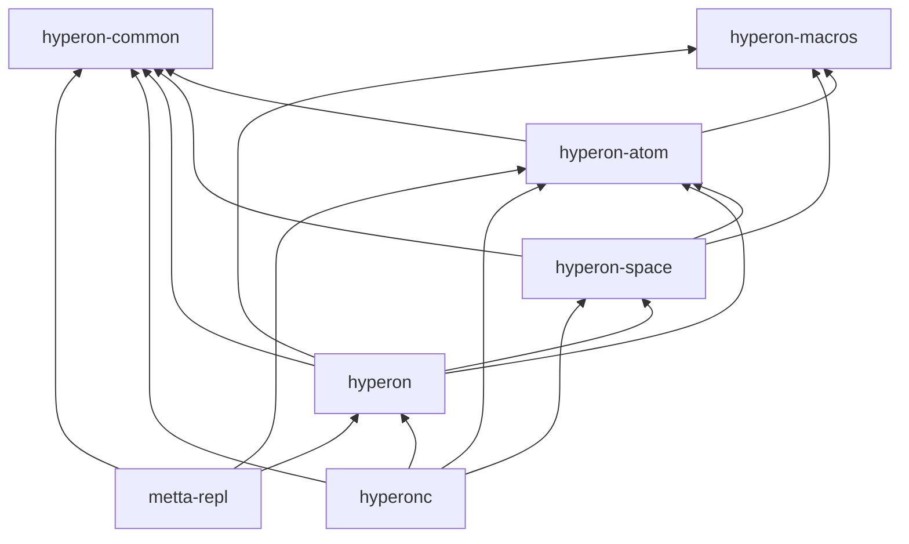

## 3. 端到端数据流（Python → Rust）

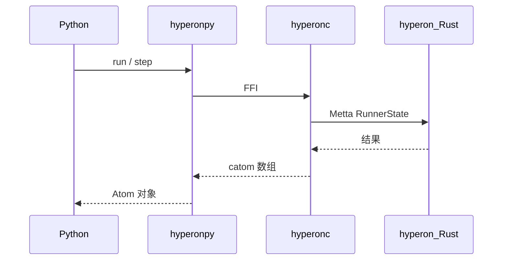

## 4. MeTTa 执行总流水线


## 5. 解析：字符流到 Atom 树

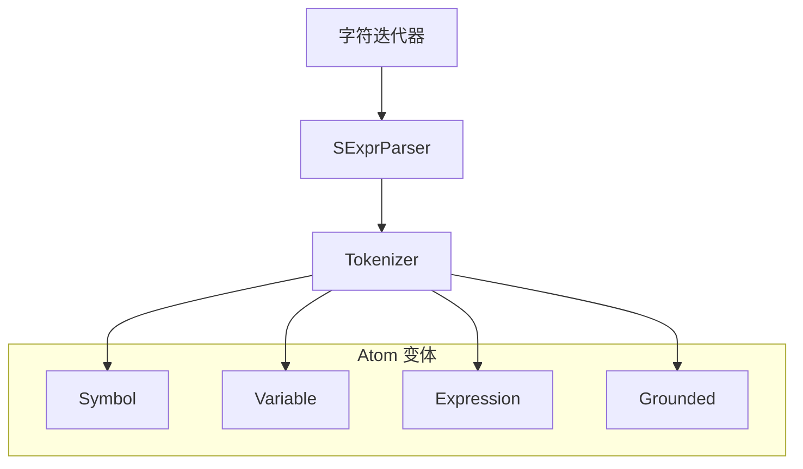

## 6. Runner 状态机（MettaRunnerMode）

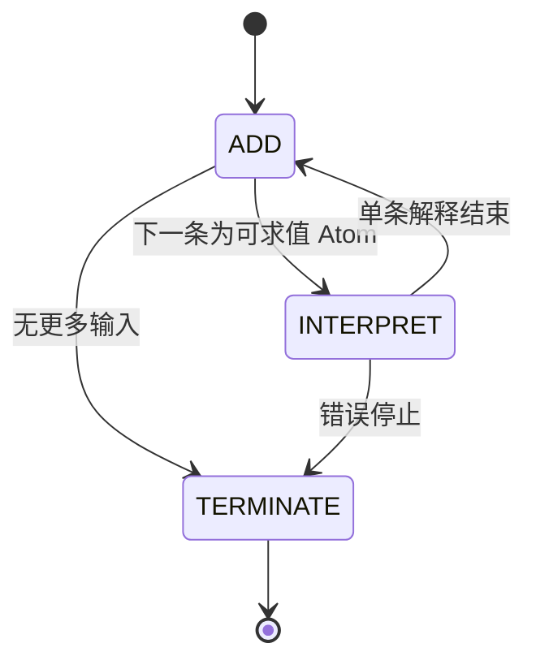

## 7. RunContext::step 决策

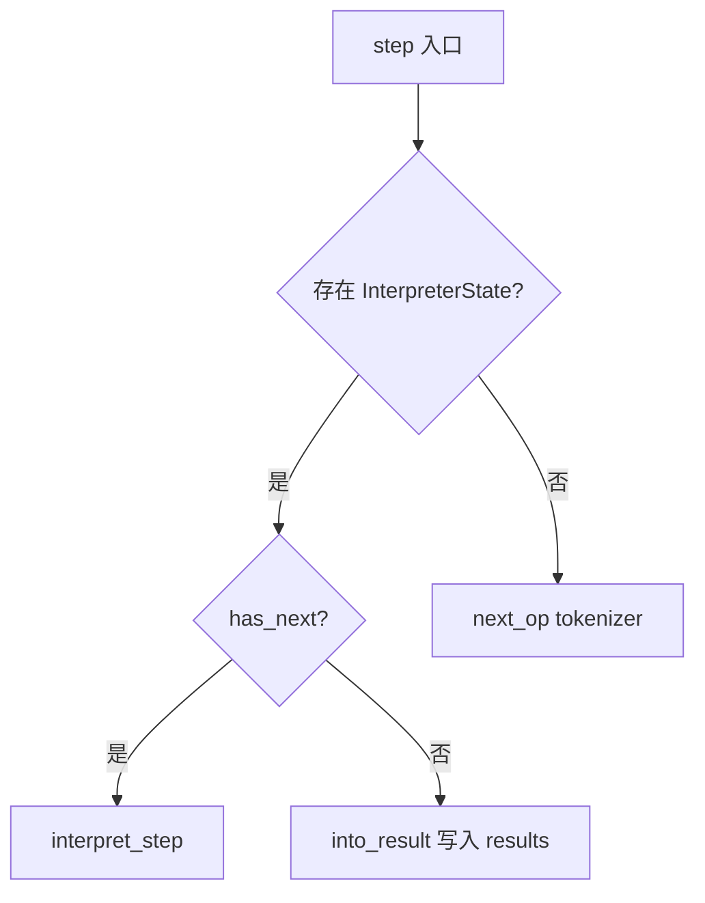

## 8. interpret_step 主循环


## 9. eval / 求值路径（INTERPRET 模式）

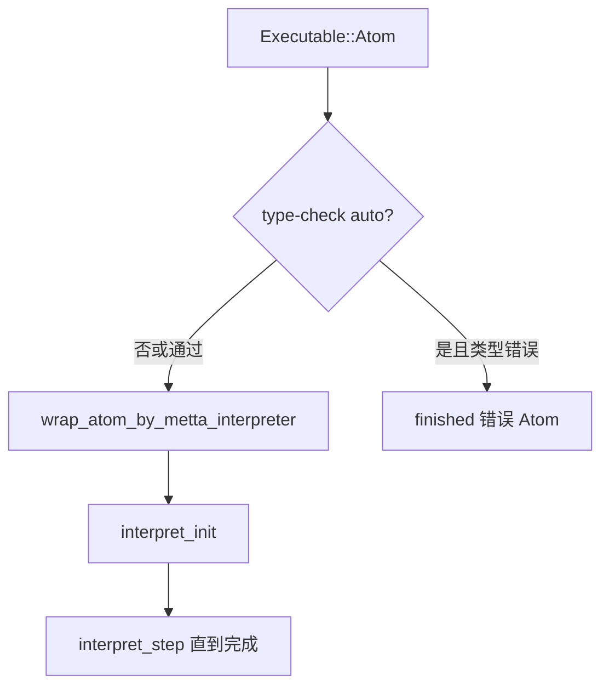

## 10. 类型检查流程

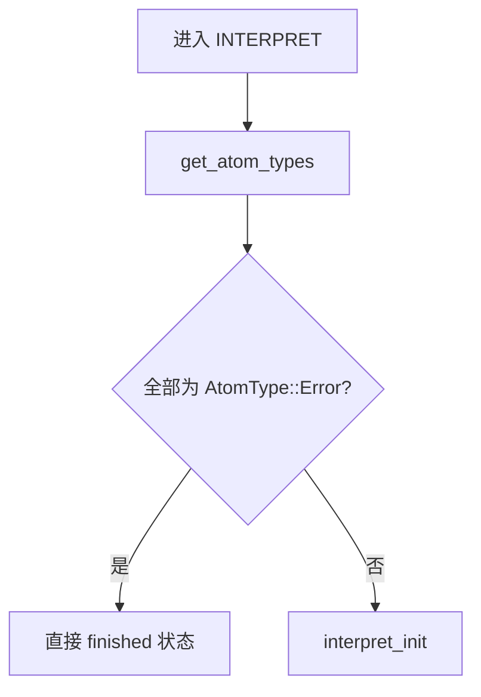

## 11. Rust Atom 枚举结构

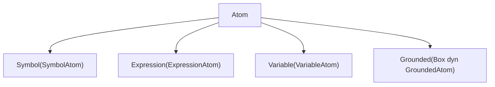

## 12. Python 原子类层次

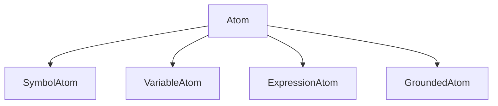

## 13. Grounded trait 体系

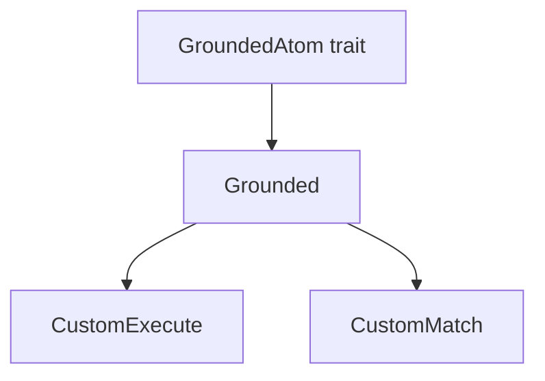

## 14. Grounded 算子执行时序

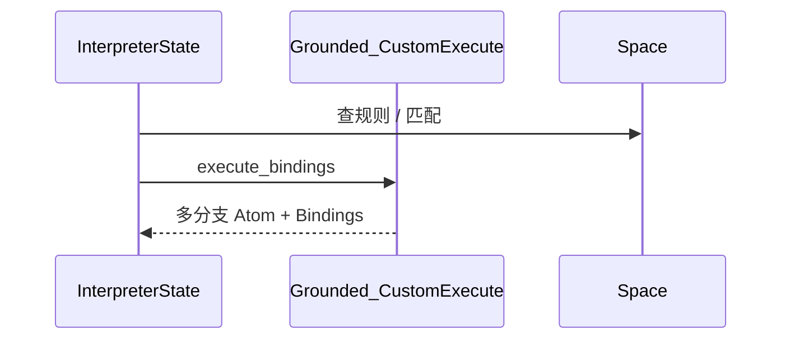

## 15. Space / SpaceMut / DynSpace

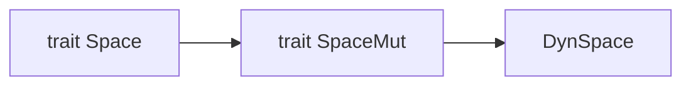

## 16. GroundingSpace 与 AtomIndex

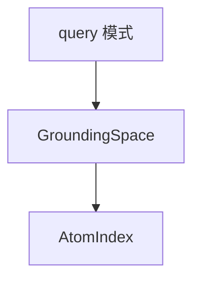

## 17. ModuleSpace 组合视图

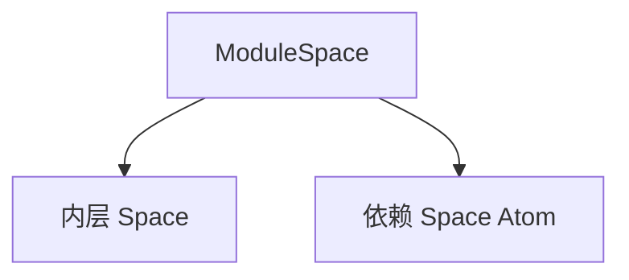

## 18. Python 空间桥接（AbstractSpace → CSpace）

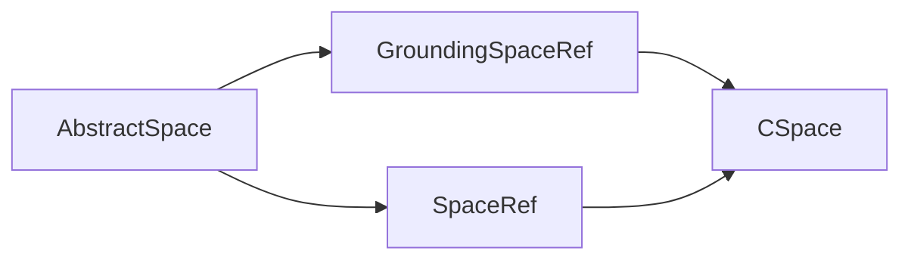

## 19. Bindings 与模式匹配

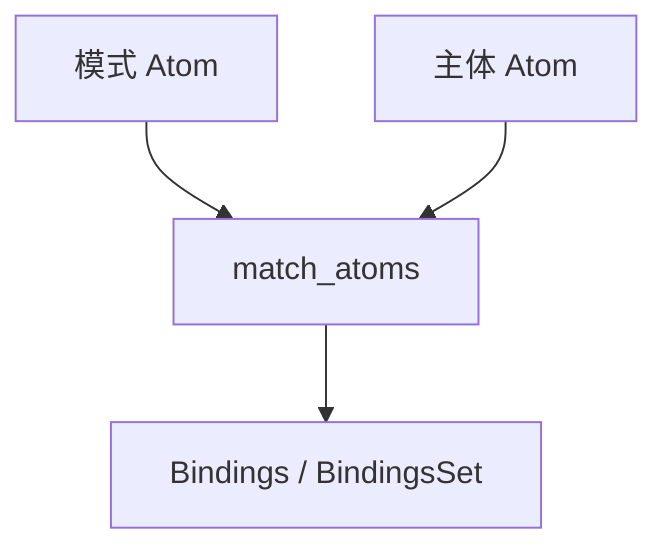

## 20. 非确定性分支（多结果）

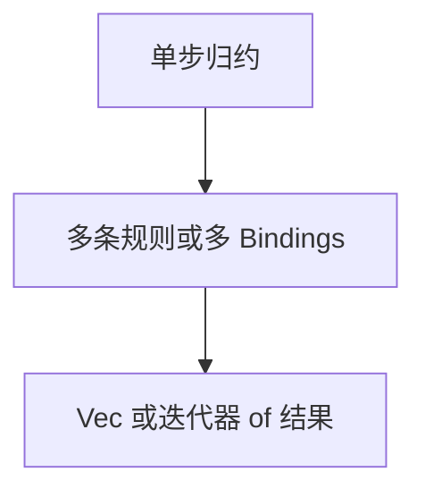

## 21. import! 到 RunContext

```mermaid
flowchart LR
    IM["ImportOp"]
    LM["RunContext::load_module"]
    ML["ModuleLoader"]
    MM["MettaMod"]
    IM --> LM
    LM --> ML
    ML --> MM
```

## 22. 模块加载序列（含 init_self_module）

```mermaid
sequenceDiagram
    participant RC as RunContext
    participant LD as ModuleLoader
    participant RS as RunnerState
    RC->>LD: prepare
    RC->>RS: 子加载 RunnerState
    RS->>RC: init_self_module
    RS-->>RC: finalize_loading
```

## 23. Runner 初始化（stdlib / corelib）

```mermaid
sequenceDiagram
    participant M as Metta::new_with_stdlib_loader
    participant CL as CoreLibLoader
    participant ST as StdlibLoader
    M->>CL: load_module_direct corelib
    M->>ST: load_module_direct stdlib
    M-->>M: top MettaMod + GroundingSpace
```

## 24. 标准库功能分组（示意）

```mermaid
flowchart TB
    subgraph std["stdlib 模块族"]
        sp["space 空间算子"]
        md["module import 等"]
        at["atom 与类型辅助"]
        lg["逻辑与控制"]
    end
    core["corelib 内核规则"]
    core --> std
```

## 25. AtomIndex 与 Trie 令牌（概念）

```mermaid
flowchart TB
    atom["Atom 子结构"]
    key["TrieKey 令牌序列"]
    idx["AtomIndex 查询"]
    atom --> key
    key --> idx
```

## 26. C API FFI 桥接层次

```mermaid
flowchart TB
    Py["Python"]
    Pyo3["PyO3 hyperonpy"]
    Chdr["C 头文件 ABI"]
    RustC["hyperonc 实现"]
    RustL["hyperon lib"]
    Py --> Pyo3
    Pyo3 --> Chdr
    Chdr --> RustC
    RustC --> RustL
```

## 27. Trie / MultiTrie（stdlib atom 辅助）

```mermaid
flowchart LR
    A2K["atom_to_trie_key"]
    MT["MultiTrie"]
    IDX2["规则或 RHS 索引"]
    A2K --> MT
    MT --> IDX2
```

---

**说明**：部分图为 **概念示意**；模块导入与类型检查的边界行为以源码与测试为准。若与独立章节文档重复，可优先引用本页图号以保持站点图表一致。
