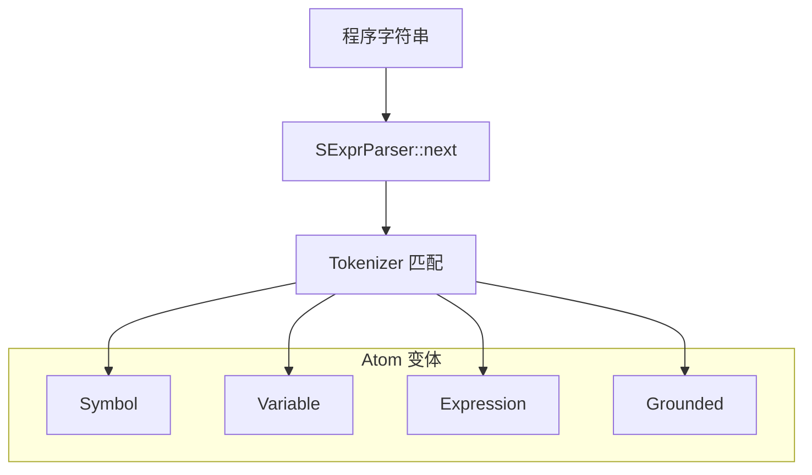
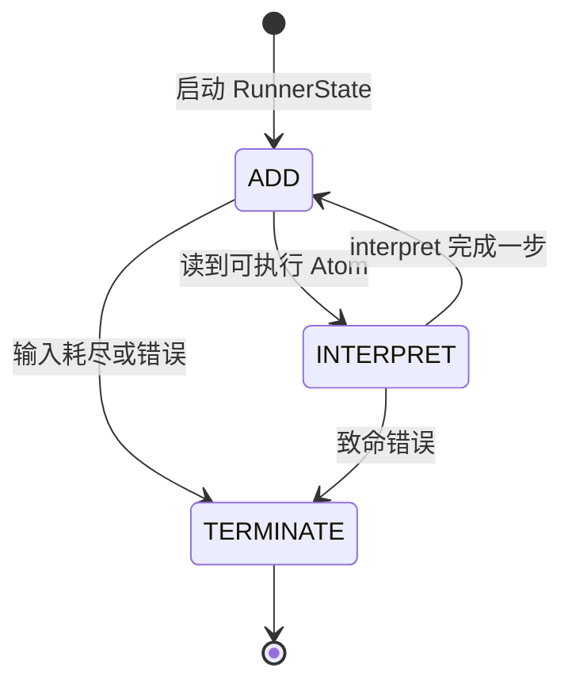
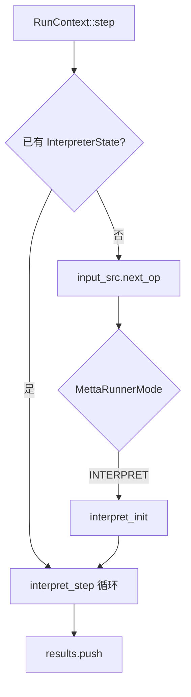
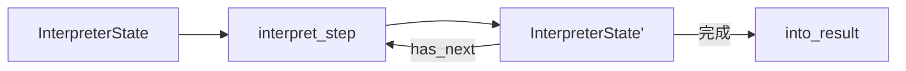
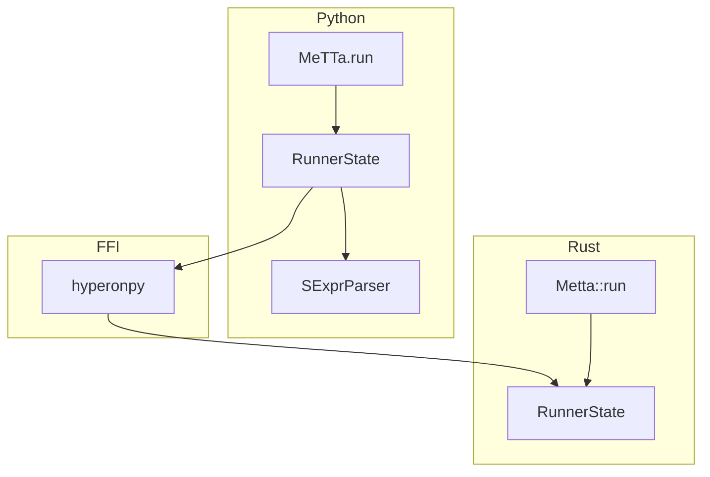

# MeTTa 程序执行流程

本节描述 **MeTTa 程序** 从字符串到 **结果原子向量** 的典型路径，对应 Rust 中的 `SExprParser`、`Tokenizer`、`Metta::run` / `RunnerState` 与 `interpret_step` 循环。

## 总览流水线

## 解析阶段：文本到 Atom

`SExprParser` 消费字符流，结合当前模块的 **`Tokenizer`**（正则 → 构造子）将词法单元还原为 **`Atom`**：`Symbol`、`Variable`、`Expression` 或 `Grounded`）。

## 运行器：`Metta::run` 与 `RunnerState`

`Metta::run(parser)` 会构造 **`RunnerState::new_with_parser`**，在 `run_to_completion` 中反复调用 **`RunContext::step`**，直到模式变为 **`TERMINATE`**。

## `RunContext::step` 与解释器 handoff

当不存在进行中的 **`InterpreterState`** 时，`step` 从 **`InputStream`** 取出下一操作（`Executable::Atom` 或 `Func`）。在 **`INTERPRET`** 模式下，对 Atom 做可选类型检查与包装后，调用 **`interpret_init(space, atom)`** 创建 **`InterpreterState`**。若已存在解释器状态，则调用 **`interpret_step`** 直至 **`has_next()`** 为假，再将结果压入 **`results`**。

## 解释器内核：`interpret_step` 归约

**`InterpreterState`** 在 **`interpret_step`** 驱动下对表达式进行归约：查找定义、匹配规则、调用 **grounded** 算子的 **`CustomExecute`**，并维护栈与非确定性分支（多结果时用 **`BindingsSet`** 等结构传播）。

## Python 侧对应关系

Python **`MeTTa.run(program)`** 使用 **`SExprParser`** 与 **`hp.runner_state_new_with_parser`**，逐步 **`runner_state_step`** 或一次性跑完；语义上与 Rust **`Metta::run`** 对齐。

## 小结

- **两阶段循环**：外层 **`RunnerState`** 调度输入与 ADD/INTERPRET 模式；内层 **`interpret_step`** 完成表达式归约。
- **Tokenizer 与模块绑定**：解析使用的分词表来自当前 **`MettaMod`**，因此 **import!** 会影响后续源码如何变成 Atom。
- **可观测性**：`interpret_step` 入口有调试日志，可在开发时跟踪当前被解释的 Atom。
