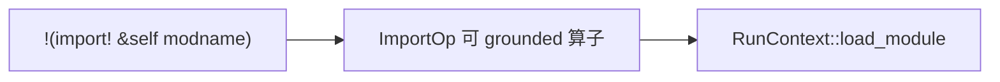
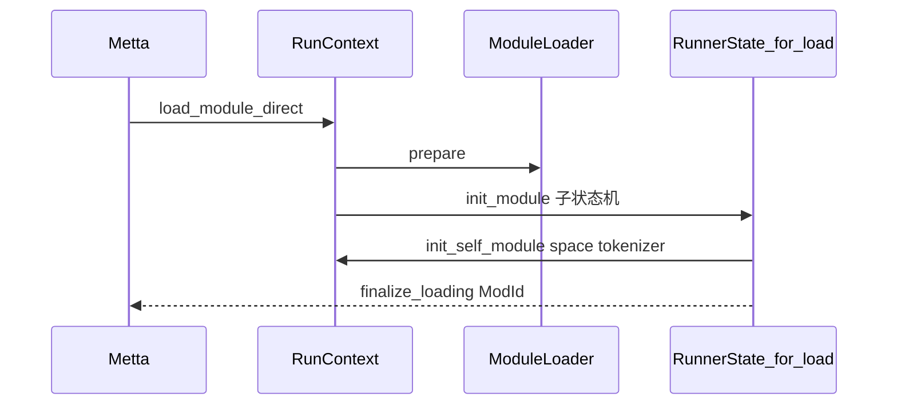
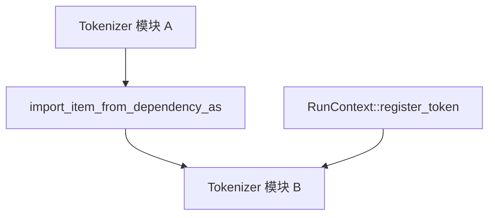
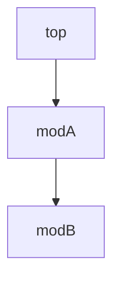
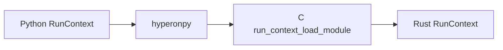

# 模块系统

Hyperon 的 **模块** 是带 **空间（Space）**、**分词器（Tokenizer）** 与 **资源目录** 的 **`MettaMod`** 实例。顶层模块名为 **`top`**；**`import!`** 在用户程序中触发依赖解析与空间可见性变更。

## 用户视角：`import!`

**`import!`** 接受目标空间描述符（如 **`&self`**）与模块名（可含 **`outer:inner`** 相对路径）。实现位于标准库模块 **`stdlib`** 的 **`ImportOp`**，内部使用 **`RunContext::load_module`** 等 API。

## 加载管线：`ModuleLoader` 与 `MettaMod`

**`Metta::load_module_direct`** 与 **`RunContext::load_module_direct`** 接受 **`Box<dyn ModuleLoader>`**。Loader 在 **`prepare`** 阶段可返回进一步 loader；在加载态 **`RunnerState`** 中运行初始化 MeTTa 代码，并必须调用 **`RunContext::init_self_module`** 一次，以绑定新模块的空间与 tokenizer。

## Token 注册与可见性

模块初始化代码常调用 **`register-token!`** 或 **`RunContext::register_token`**，将正则映射到 **Atom 构造子**。导入依赖时，**`import_item_from_dependency_as`** 等路径可把依赖模块 tokenizer 中的符号解析到当前模块。

## 空间合并：`import_all_from_dependency`

**`RunContext::import_all_from_dependency`** 将依赖模块的 **整个空间作为 grounded Atom** 放入当前模块空间，从而实现类似「全量导入」的查询视图（行为仍在演进中，见源码注释）。

## 名称树与 `ModId`

运行器维护 **模块名 → `ModId`** 的树；**`merge_init_state`** 在嵌套加载后重映射临时 **`ModId`** 并合并子树。相对名 **`normalize_relative_module_name`** 依赖当前模块路径。

## Python：`RunContext.load_module`

Python **`RunContext.load_module`** 调用 **`hp.run_context_load_module`**，与 Rust 同一套 **`ModId`** 语义；**`MeTTa`** 构造时可注入 **`env_builder`**、**include 路径** 与 **`fs_module_fmt`**（如 **`_PyFileMeTTaModFmt`**）以解析磁盘上的模块格式。

## 小结

- **初始化契约**：新模块必须通过 **`init_self_module`** 与运行器状态机关联。
- **双载体**：模块知识存在于 **Space 中的 Atom** 与 **Tokenizer 中的语法扩展**。
- **与执行交错**：模块加载使用与普通程序相同的 **`RunnerState::step`** 机制，因此加载过程本身可执行任意 MeTTa。
