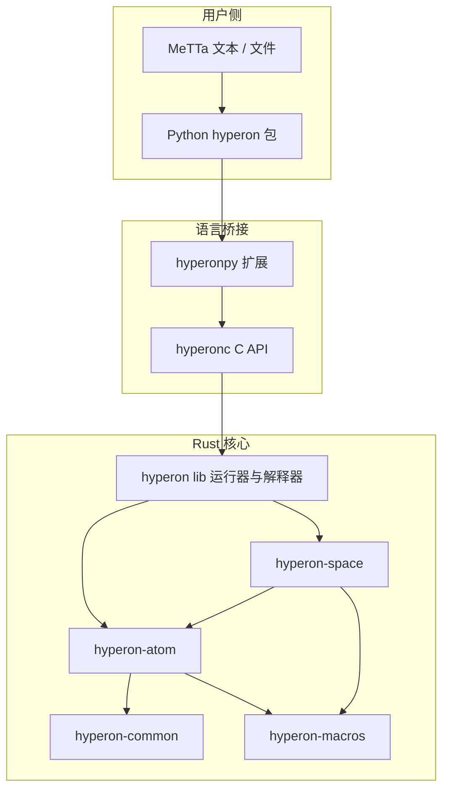
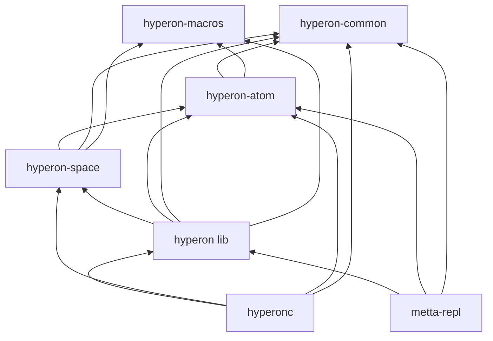
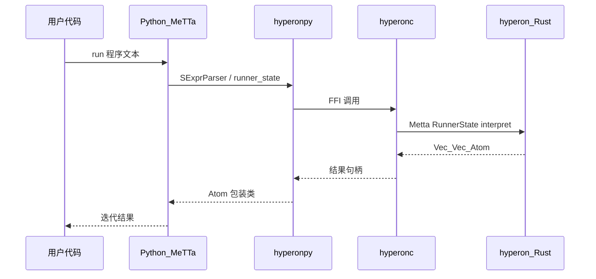

# 整体架构

OpenCog Hyperon 将 **MeTTa 语言** 的解析、求值与 **原子空间** 统一在 Rust 核心中实现；**Python `hyperon` 包** 通过 **hyperonpy（PyO3 + C ABI）** 与 **`hyperonc` C API** 暴露相同语义，便于脚本、REPL 与宿主语言扩展。

## 分层栈

自顶向下，职责边界如下：

- **MeTTa 源码**：S 表达式形式的程序与数据。
- **`hyperon`（Python）**：`MeTTa`、`RunnerState`、`RunContext`、原子与空间的面向对象封装；业务逻辑仍在 Rust。
- **hyperonpy**：Python 扩展模块，将 `CAtom`、`CSpace`、`cmetta` 等句柄与 PyO3 胶水函数对接。
- **`hyperonc`（C API）**：稳定的 C 头文件级接口，封装 `hyperon` crate 的类型与生命周期。
- **`hyperon`（Rust lib）**：解释器、`Metta` 运行器、模块系统、标准库算子、与空间的编排。
- **`hyperon-space` / `hyperon-atom` / `hyperon-common` / `hyperon-macros`**：空间 trait、原子 ADT、公共工具与过程宏。

## Cargo Workspace：七个成员 crate

根目录 `Cargo.toml` 的 `[workspace].members` 包含七个包：`hyperon-common`、`hyperon-macros`、`hyperon-atom`、`hyperon-space`、`hyperon`（路径 `lib/`）、`hyperonc`（路径 `c/`）、`metta-repl`（路径 `repl/`）。其中 **`hyperon` 与 `hyperonc` 聚合上层功能**；**`metta-repl`** 依赖 `hyperon`，提供命令行 REPL。

## 数据与控制流概览

## 小结

- **单一语义核心**：求值与模块加载逻辑集中在 Rust `hyperon` crate，Python 侧主要是薄封装。
- **FFI 边界**：C API 是 Python 与其它语言共享的稳定切面；扩展 grounded 算子时需注意跨边界生命周期与线程模型。
- **Workspace 拆分**：`hyperon-atom` 与 `hyperon-space` 可独立演进，减少解释器与底层数据结构的耦合。
