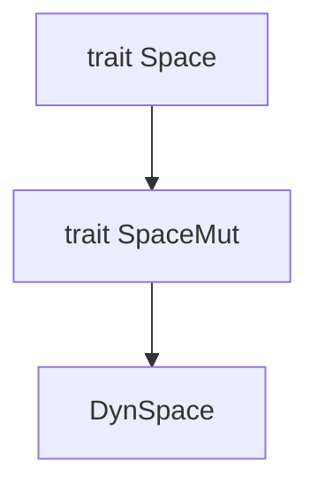
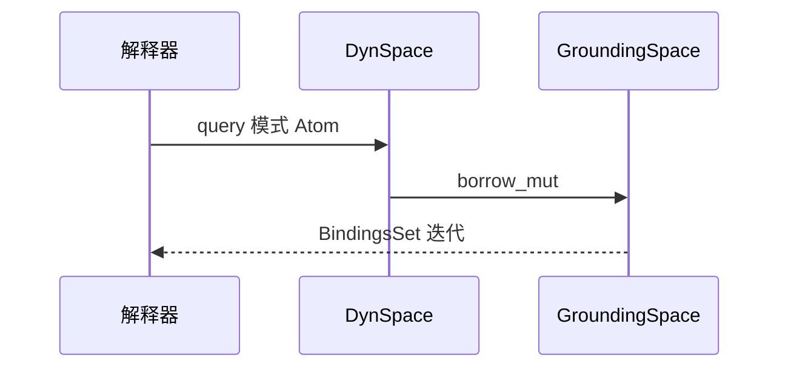
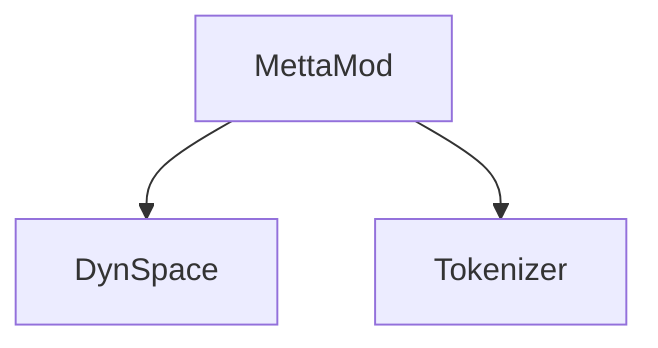

# 空间架构

**空间（Space）** 存储可查询、可变更的原子集合。Rust 在 **`hyperon-space`** 中定义 **`Space` / `SpaceMut` / `DynSpace`**；**`hyperon`** crate 提供 **`GroundingSpace`**（带 **`AtomIndex`** 索引）与 **`ModuleSpace`**（模块组合视图）。Python 通过 **`GroundingSpaceRef`**、**`SpaceRef`** 与 **`AbstractSpace`** 对接原生或纯 Python 实现。

## Rust：`Space` 族谱



**`DynSpace`** 内部为 **`Rc<RefCell<dyn SpaceMut>>`**，可嵌入 **`Atom::gnd(...)`** 并参与 **`CustomMatch`**。

## 核心实现：`GroundingSpace` 与 `ModuleSpace`

- **`GroundingSpace`**：可变空间，使用 **`AtomIndex`** 加速查询；是默认顶层模块空间。
- **`ModuleSpace`**：将依赖空间 **`add` / `query`** 等操作编排为模块语义（含导入的依赖空间）。

```mermaid
flowchart LR
    GS["GroundingSpace"]
    MS["ModuleSpace"]
    IDX["AtomIndex"]
    GS --> IDX
    MS --> GS : 包装或组合
```

## 查询与变更 API

**`Space`** 提供 **`query`** 等只读接口；**`SpaceMut`** 扩展 **`add` / `remove` / `replace`**。**`GroundingSpace::query`** 与模式匹配、规则索引协同工作。



## Python：`AbstractSpace` → `SpaceRef` → C API

**`AbstractSpace`** 定义 **`query` / `add` / `remove` / `replace`**；**`GroundingSpace`** 子类委托 **`GroundingSpaceRef`**。自定义 Python 空间经 **`hp.space_new_custom`** 注册回调，由 **`hyperonpy`** 在 C 侧转发到 **`_priv_call_*_on_python_space`**。

```mermaid
flowchart TB
    AS["AbstractSpace"]
    GSR["GroundingSpaceRef"]
    SR["SpaceRef"]
    C["CSpace"]
    AS --> GSR : GroundingSpace 子类
    AS --> SR : 自定义实现
    SR --> C
    GSR --> C
    C --> FFI["hyperonc space_*"]
```

## Grounded 空间 Atom

**`DynSpace`** 实现 **`Grounded`**（及 **`CustomMatch`**），使空间可作为 Atom 传递并在模式中出现。


## 与模块系统的关系

每个 **`MettaMod`** 持有 **`DynSpace`**。加载子模块时，空间可能被 **`ModuleSpace`** 包装，以便 **`import!`** 将依赖空间合并进 **`&self`** 的查询视图。



## 小结

- **性能关键路径**：**`GroundingSpace` + AtomIndex** 为默认索引-backed 实现。
- **扩展点**：Python **`AbstractSpace`** 或 Rust **`SpaceMut`** 新类型，经 **`DynSpace::new`** 接入。
- **一致性**：查询语义需与 **`match_atoms` / BindingsSet** 一致，避免破坏规则与 **`!` 求值** 行为。
