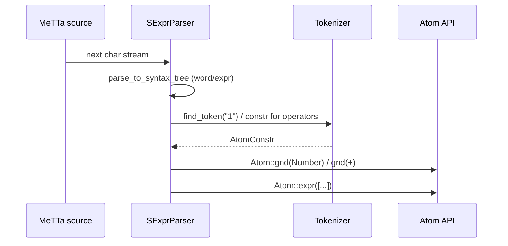
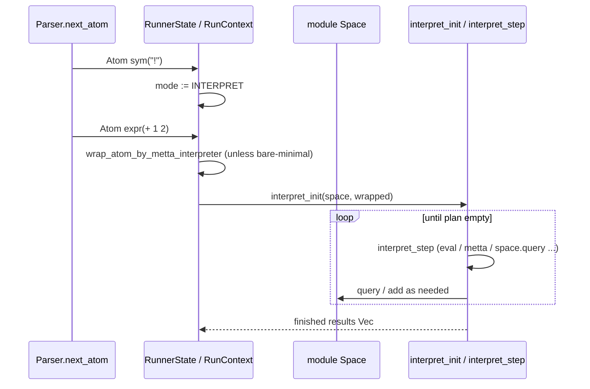

# MeTTa 基础语法：从文本到 Atom 的全链分析

本文档追踪 **MeTTa surface syntax**（表面语法）在 **OpenCog Hyperon** 中的实现路径：**MeTTa 源码文本 → `SExprParser` → `Tokenizer` → `Atom` 构造**。执行前缀 `!` 在 **Runner** 层的语义单独成章。文中 **Rust**、**Python**、**C API** 术语保持英文。

---

## 1. 总览与形式语义（informal）

MeTTa 程序是 **S-expression** 序列。词法层将输入流切分为：

- **Whitespace** / **Comment**（不产生 Atom）
- **Variable token**：`$` 引导
- **String literal**：`"..."` 与转义
- **Word token**：其它由空白或括号界定的片段（可能经 **Tokenizer** 映射为 **Symbol**、**Grounded** 等）
- **Parenthesized expression**：`(...)`，递归为 **Expression** Atom

**形式化（简化）**：设 $\mathcal{A}$ 为 Atom 集合，解析函数可视为

$$
\text{parse} : (\text{String} \times \mathcal{T}) \to \mathcal{A}_\bot
$$

其中 $\mathcal{T}$ 为 **Tokenizer** 携带的正则→构造子映射；**Comment**/**Whitespace** 的语法树节点在 `as_atom` 阶段被丢弃（返回 `None`），解析器循环直到得到第一个“有值”Atom 或 **EOF**。

---

## 2. 核心 Rust 模块与常量

| 职责 | 路径 |
|------|------|
| **Tokenizer**、**SExprParser**、`SyntaxNode` | `lib/src/metta/text.rs` |
| **MeTTa 常量**（`UNIT_ATOM`、`EQUAL_SYMBOL` 等） | `lib/src/metta/mod.rs` |
| **Runner**（`!` 前缀、`ADD`/`INTERPRET` 模式） | `lib/src/metta/runner/mod.rs` |
| **stdlib Tokenizer 注册**（数字、`True`/`False`、运算符） | `lib/src/metta/runner/stdlib/arithmetics.rs` 等 |

**单元 Atom 与类型常量**（节选，便于后文引用）：

```50:52:d:\dev\hyperon-experimental\lib\src\metta\mod.rs
pub const UNIT_ATOM: Atom = metta_const!(());
pub const UNIT_TYPE: Atom = metta_const!((->));
```

空表达式 `()` 对应 **`UNIT_ATOM`**（零子项的 **Expression**）。

---

## 3. Tokenizer：正则优先级与全词匹配

**Tokenizer** 将 **WordToken** / **StringToken** 的字符串交给 `find_token`：自 **向量尾部向前** 查找第一个“整 token 完全匹配”的正则（**longest / last-registered wins** 的实用语义）。

关键实现（**L74–L81**）：

```74:81:d:\dev\hyperon-experimental\lib\src\metta\text.rs
    pub fn find_token(&self, token: &str) -> Option<&AtomConstr> {
        self.tokens.iter().rfind(|descr| {
            match descr.regex.find_at(token, 0) {
                Some(m) => m.start() == 0 && m.end() == token.len(),
                None => false,
            }
        }).map(|descr| &*(descr.constr))
```

**语义要点**：

- 必须 **整串匹配**（`m.end() == token.len()`），避免前缀误匹配。
- **`move_back` / `move_front`** 与注释所述一致：因 **rfind**，后追加的条目优先尝试（见 **L57–L72**）。

**stdlib** 在 `arithmetics::register_context_independent_tokens` 注册数字与布尔（**L162–L170**）：

```162:170:d:\dev\hyperon-experimental\lib\src\metta\runner\stdlib\arithmetics.rs
pub(super) fn register_context_independent_tokens(tref: &mut Tokenizer) {
    tref.register_fallible_token(regex(r"[\-\+]?\d+"),
        |token| { Ok(Atom::gnd(Number::from_int_str(token)?)) });
    tref.register_fallible_token(regex(r"[\-\+]?\d+\.\d+"),
        |token| { Ok(Atom::gnd(Number::from_float_str(token)?)) });
    tref.register_fallible_token(regex(r"[\-\+]?\d+(\.\d+)?[eE][\-\+]?\d+"),
        |token| { Ok(Atom::gnd(Number::from_float_str(token)?)) });
    tref.register_token(regex(r"True|False"),
        |token| { Atom::gnd(Bool::from_str(token)) });
```

**错误路径**：`register_fallible_token` 的构造子返回 `Err` 时，`SyntaxNode::as_atom` 会包装为带 **byte range** 的字符串错误（**L211–L215**）。

---

## 4. SExprParser：从字符流到语法树再到 Atom

### 4.1 对外入口 `parse`

**L378–L391**：循环 `parse_to_syntax_tree`，直到某节点 `as_atom` 得到 `Some(atom)` 或输入耗尽。

```378:391:d:\dev\hyperon-experimental\lib\src\metta\text.rs
    pub fn parse(&mut self, tokenizer: &Tokenizer) -> Result<Option<Atom>, String> {
        loop {
            match self.parse_to_syntax_tree()? {
                Some(node) => {
                    if let Some(atom) = node.as_atom(tokenizer)? {
                        return Ok(Some(atom))
                    }
                },
                None => {
                    return Ok(None);
                },
            }
        }
    }
```

### 4.2 顶层调度 `parse_to_syntax_tree`

**L413–L442**：首字符分派：

- `;` → **Comment**
- **whitespace** → **Whitespace** 节点
- `$` → **Variable**
- `(` → **Expression**
- `)` → **ErrorGroup**（意外右括号）
- 其它 → **parse_token**（string 或 word）

```413:441:d:\dev\hyperon-experimental\lib\src\metta\text.rs
    pub fn parse_to_syntax_tree(&mut self) -> Result<Option<SyntaxNode>, String> {
        if let Some((idx, c)) = self.peek()? {
            match c {
                ';' => {
                    return self.parse_comment();
                },
                _ if c.is_whitespace() => {
                    let whispace_node = SyntaxNode::new(SyntaxNodeType::Whitespace, idx..idx+1, vec![]);
                    self.skip_next();
                    return Ok(Some(whispace_node));
                },
                '$' => {
                    return self.parse_variable().map(Some);
                },
                '(' => {
                    return self.parse_expr().map(Some);
                },
                ')' => {
                    let close_paren_node = SyntaxNode::new(SyntaxNodeType::CloseParen, idx..idx+1, vec![]);
                    self.skip_next();
                    let leftover_text_node = self.parse_leftovers(idx + 1, "Unexpected right bracket".to_string())?;
                    let error_group_node = SyntaxNode::new_error_group(idx..self.cur_idx(), vec![close_paren_node, leftover_text_node]);
                    return Ok(Some(error_group_node));
                },
                _ => {
                    return self.parse_token();
                },
            };
        }
        Ok(None)
    }
```

---

## 5. 各语法特性详述

### 5.1 Symbol（符号）

**语法**：未被 `"` 包裹、不以 `$` 开头、不含空白/括号/分号的 **word**（**`parse_word` L638–L651**）。

**Atom 构造**（**`SyntaxNode::as_atom` L208–L219**）：

- 若 `tokenizer.find_token(token_text)` 命中 → 调用注册的构造子；
- 否则 → **`Atom::sym(token_text)`**。

```208:219:d:\dev\hyperon-experimental\lib\src\metta\text.rs
            SyntaxNodeType::StringToken |
            SyntaxNodeType::WordToken => {
                let token_text = self.parsed_text.as_ref().unwrap();
                let constr = tokenizer.find_token(token_text);
                if let Some(constr) = constr {
                    let new_atom = constr(token_text)
                        .map_err(|e| format!("byte range = ({:?}) | {e}", self.src_range))?;
                    Ok(Some(new_atom))
                } else {
                    let new_atom = Atom::sym(token_text);
                    Ok(Some(new_atom))
                }
            },
```

**示例**：

```metta
foo
```

→ **Symbol** `foo`（在空 **Tokenizer** 下）；在完整 **Runner** 下，若某正则抢先匹配同一字符串则可能变为 **Grounded**。

---

### 5.2 Variable（变量）

**语法**：`parse_variable`（**L654–L672**）：吞掉 `$` 后，读取至空白/`(`/`)` 停止；若遇到 `#` 则报错 **reserved for internal usage**。

```654:672:d:\dev\hyperon-experimental\lib\src\metta\text.rs
    fn parse_variable(&mut self) -> Result<SyntaxNode, String> {
        let (start_idx, _c) = self.peek()?.unwrap();
        self.skip_next();

        let mut token = String::new();
        while let Some((_idx, c)) = self.peek()? {
            if c.is_whitespace() || c == '(' || c == ')' {
                break;
            }
            if c == '#' {
                let leftover_node = self.parse_leftovers(start_idx, "'#' char is reserved for internal usage".to_string());
                return leftover_node;
            }
            token.push(c);
            self.skip_next();
        }
        let var_token_node = SyntaxNode::new_token_node(SyntaxNodeType::VariableToken, start_idx..self.cur_idx(), token);
        Ok(var_token_node)
    }
```

**`as_atom`**（**L203–L206**）：**`Atom::var(token_text)`**。

**注意**：**`$`** 在变量名体内允许（除 `#`）；与 **Tokenizer** 无关（变量分支在 **`$`** 已分派）。

---

### 5.3 String（字符串字面量）

**语法**：`parse_string`（**L534–L588**）：起始 `"`，结束 `"`；支持 `\\`, `\"`, `\n`, `\r`, `\t`, `\xHH`（**仅 ≤0x7F**，见 **L591–L608**），`\u{...}` **Unicode**（**L611–635**）。

**`as_atom`**：字符串节点走 **WordToken/StringToken** 分支，因此 **同样经过 `Tokenizer`**；默认 **Tokenizer** 下整串（含引号）常作为 **Symbol** 存储（测试 **`test_text_quoted_string`** 期望 `expr!("\"te st\"")` 风格）。

**错误边界**（节选）：

- 缺起始引号：**Double quote expected**（**L541–542**）
- 未闭合：**Unclosed String Literal**（**L587–588**）
- 非法转义 / 未完成转义：**Invalid escape sequence** / **Escaping sequence is not finished**（**L550–580**）
- `\x` 超出 ASCII：**Invalid escape sequence**（测试 **L725–726**）

---

### 5.4 Number（数值 Grounded）

**非语法硬编码**：由 **stdlib** **Tokenizer** 将匹配的数字串构造为 **`Atom::gnd(Number::...)`**（见第 3 节 **arithmetics.rs L163–168**）。

**示例**：

```metta
42
-3.5
1e-6
```

在完整环境中为 **Grounded** **Number**；仅用 **`Tokenizer::new()`** 解析时仍为 **Symbol**（因无注册）。

---

### 5.5 Bool（布尔 Grounded）

**Tokenizer** 匹配 **`True|False`**（**arithmetics.rs L169–170**）→ **`Atom::gnd(Bool::from_str(...))`**。

---

### 5.6 Expression（S-表达式）与空表达式 `()`

**`parse_expr`**（**L472–L517**）：在 `(` 与 `)` 之间递归调用 `parse_to_syntax_tree`；允许内部 **comment** 与 **whitespace** 子节点；子解析失败则 **ErrorGroup** 上抛。

**`as_atom`**（**L221–L238**）：子节点 `filter_map` 聚合为 **`Atom::expr(children)`**。

```221:238:d:\dev\hyperon-experimental\lib\src\metta\text.rs
            SyntaxNodeType::ExpressionGroup => {
                let mut err_encountered = Ok(());
                let expr_children: Vec<Atom> = self.sub_nodes.iter().filter_map(|node| {
                    match node.as_atom(tokenizer) {
                        Err(err) => {
                            err_encountered = Err(err);
                            None
                        },
                        Ok(atom) => atom
                    }
                }).collect();
                match err_encountered {
                    Ok(_) => {
                        let new_expr_atom = Atom::expr(expr_children);
                        Ok(Some(new_expr_atom))
                    },
                    Err(err) => Err(err)
                }
            },
```

**空列表 `()`**：**ExpressionGroup** 子节点仅有 **OpenParen**/**CloseParen**（及可选空白/注释），**filter_map** 后 **children 为空** → **`Atom::expr([])`** 即 **`UNIT_ATOM`**（见 **`mod.rs`**）。

---

### 5.7 Comments（`;` 行注释）

**`parse_comment`**（**L451–463**）：从 `;` 起读到换行（不含吞掉换行后的逻辑由后续 `peek` 处理）。

**`as_atom`**：**Comment** → **`Ok(None)`**（**L199–L200**），故 **`parse`** 循环跳过。

**表达式内注释**：**`parse_expr`** 在 **`;`** 处插入 **Comment** 子节点（**L482–485**），同样不产生子 **Atom**。

---

### 5.8 执行前缀 `!`（Execution prefix）

**词法**：`!` 作为普通 **word**，默认 **Symbol** 原子，名称为 **`"!"`**。

**Runner 语义**（**`lib/src/metta/runner/mod.rs`**）：

- **`EXEC_SYMBOL`**（**L97**）与 **`sym!("!")`** 相等。
- **`RunContext::step`**（**L1071–L1109**）：若下一 **Atom** 为 **`EXEC_SYMBOL`**，置 **`MettaRunnerMode::INTERPRET`** 并 **return**（不消费后续 atom）；**下一个** 顶层 atom 进入 **解释** 分支（**wrap** 为 **`metta` 调用** 等）。

```97:97:d:\dev\hyperon-experimental\lib\src\metta\runner\mod.rs
const EXEC_SYMBOL : Atom = sym!("!");
```

```1071:1109:d:\dev\hyperon-experimental\lib\src\metta\runner\mod.rs
                Some(Executable::Atom(atom)) => {
                    if atom == EXEC_SYMBOL {
                        self.i_wrapper.mode = MettaRunnerMode::INTERPRET;
                        return Ok(());
                    }
                    match self.i_wrapper.mode {
                        MettaRunnerMode::ADD => {
                            if let Err(errors) = self.module().add_atom(atom, self.metta.type_check_is_enabled()) {
                                self.i_wrapper.results.push(errors);
                                self.i_wrapper.mode = MettaRunnerMode::TERMINATE;
                                return Ok(());
                            }
                        },
                        MettaRunnerMode::INTERPRET => {

                            if self.metta.type_check_is_enabled() {
                                let types = get_atom_types(&self.module().space(), &atom);
                                if types.iter().all(AtomType::is_error) {
                                    self.i_wrapper.interpreter_state = Some(InterpreterState::new_finished(self.module().space().clone(),
                                        types.into_iter().map(AtomType::into_error_unchecked).collect()));
                                    return Ok(())
                                }
                            }
                            let atom = if is_bare_minimal_interpreter(self.metta) {
                                atom
                            } else {
                                wrap_atom_by_metta_interpreter(self.module().space().clone(), atom)
                            };
                            self.i_wrapper.interpreter_state = Some(interpret_init(self.module().space().clone(), &atom));
```

**默认模式**：**`ADD`**（添加/定义到 **Space**）；**`!`** 切换到 **`INTERPRET`**；解释完成后模式回到 **`ADD`**（**L1109**）。

---

## 6. 全链 Mermaid 序列图（解析与 Runner）

### 6.1 纯解析：`!(+ 1 x)` 中的 `+` / `1`（仅示意解析阶段）



### 6.2 含 Runner：`!(+ 1 2)` 端到端



---

## 7. Python 包装层（`hyperon`）

| Python | 职责 | 路径 |
|--------|------|------|
| **`SExprParser.parse`** | 调 **C** **`sexpr_parser_parse`** | `python/hyperon/base.py` **L366–L388** |
| **`Tokenizer.register_token`** | **`tokenizer_register_token`** | `python/hyperon/base.py` **L285–L325** |
| **`Atom._from_catom` / `V` / `S` / `E`** | **C Atom** 包装 | `python/hyperon/atoms.py` **L10–L113** |

**`SExprParser.parse`**（**L376–L388**）：失败时 **`SyntaxError(err_str)`**。

```376:388:d:\dev\hyperon-experimental\python\hyperon\base.py
    def parse(self, tokenizer):
        """
        Parses the S-expression using the provided Tokenizer.
        """
        catom = self.cparser.parse(tokenizer.ctokenizer)
        if (catom is None):
            err_str = self.cparser.sexpr_parser_err_str()
            if (err_str is None):
                return None
            else:
                raise SyntaxError(err_str)
        else:
            return Atom._from_catom(catom)
```

**`GroundedAtom` / `ValueAtom`**：Python 值经 **`hp.atom_py`** 进入 **Rust**（**atoms.py L199–L231**）。

---

## 8. C API 桥接（`c/src/metta.rs`）

| C 函数 | Rust 对应 |
|--------|-----------|
| **`sexpr_parser_new` / `sexpr_parser_parse`** | **`SExprParser::new` / `next_atom`** |
| **`tokenizer_new` / `tokenizer_register_token`** | **`Tokenizer`** |
| **`interpret_init` / `interpret_step`** | **`interpreter::interpret_*`** |

**`sexpr_parser_parse`**（工程内注释与实现）绑定 **`rust_parser.next_atom(tokenizer)`**（见 **grep** 结果 **`c/src/metta.rs` L250+`**）。

**测试**：**`c/tests/check_sexpr_parser.c`**、**`c/tests/check_runner.c`**（含 **`!(+ 1 ...)`**）。

---

## 9. 错误路径与边界情形汇总

| 场景 | 位置 | 行为 |
|------|------|------|
| 意外 `)` | **text.rs L430–435** | **ErrorGroup** + **Unexpected right bracket** |
| 表达式未闭合 | **L509–517** | **Unexpected end of expression** / **member** |
| **`$name#`** | **parse_variable L663–665** | 保留字符错误 |
| **Tokenizer** 构造失败 | **as_atom L213–214** | **`Err`** 带 **byte range** |
| **IO** 读字符失败 | **peek/next L393–406** | **`Err("Input read error...")`** |
| **`register_fallible_token` 解析失败** | 测试 **text.rs L867–877** | **`parse` Err** |

---

## 10. 评估轨迹示例（解析层）

**输入**（同一行内注释）：

```metta
(a ; tail comment
 5)
```

1. **`parse_expr`**：`(` → 子节点 `a`（**Word**）→ **Comment** → 空白 → `5` → `)`。
2. **`as_atom`**：**Comment/Whitespace** 跳过 → **`expr!("a" "5")`**。
3. 对应测试思路见 **`test_comment_in_sexpr`**（**text.rs L889–896**）。

**输入**：

```metta
!(+ 1 2)
```

1. **`Parser`** 先产出 **`sym("!")`** → **Runner** 设 **INTERPRET**。
2. 再产出 **`expr!(+ {1} {2})`**（**`+`** 与数字由 **Tokenizer** 注册）。
3. **Runner** **wrap** 后进入 **解释器**（详见文档 02/03）。

---

## 11. 与后续文档的衔接

- **文档 02**：**`=`** 定义在 **Space** 中的角色，以及 **`eval` → `query` → `match_atoms`** 的归约链。
- **文档 03**：**`(: ...)`** / **`(:< ...)`** / **`(-> ...)`** 如何进入 **`get_atom_types`** / **`check_type`**，及 **`pragma! type-check auto`** 对 **Runner** 的影响。

---

## 12. 参考索引（行号速查）

| 主题 | 文件 | 行号（约） |
|------|------|------------|
| **Tokenizer::find_token** | `text.rs` | 74–81 |
| **SyntaxNode::as_atom** | `text.rs` | 190–243 |
| **SExprParser::parse / parse_to_syntax_tree** | `text.rs` | 378–442 |
| **parse_expr / parse_string / parse_variable** | `text.rs` | 472–672 |
| **EXEC_SYMBOL & step** | `runner/mod.rs` | 97, 1071–1109 |
| **数字/布尔 Token** | `arithmetics.rs` | 162–170 |
| **UNIT_ATOM** | `metta/mod.rs` | 50–51 |

以上行号均指向仓库 **`cf4c5375`** 时间点的源文件结构；若上游重构，请以 **`git blame`** 校准。
