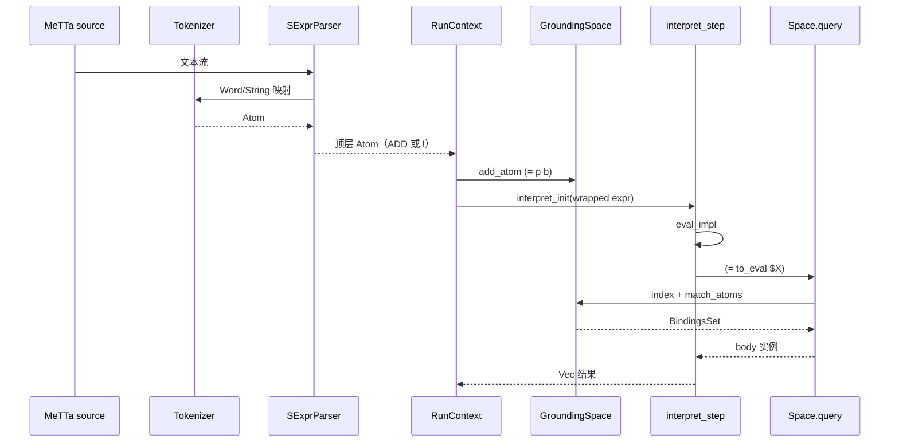

# MeTTa 函数与等式：Space、`eval`、查询与合一

本文档追踪 **`(= pattern body)`** 从 **MeTTa 源码** 进入 **GroundingSpace**，再经 **Runner** 与 **`interpreter`** 的 **`eval` → `query` → Space 匹配 → `Bindings` 应用** 的完整链条。文中保留 **Rust** / **Python** / **C API** / **`match_atoms`** 等英文技术词。

---

## 1. 语法、形式语义（informal）与示例

### 1.1 定义式

**表面语法**：

```metta
(= <pattern> <body>)
```

- **`<pattern>`**、**`<body>`** 均为任意 **Atom**（常为含 **Variable** 的 **Expression**）。
- 整条 **`(= ...)`** 是 **一个 Expression**，不是特殊 parser 关键字；**`=`** 只是 **`Symbol`**。

**操作语义（简化）**：设 **Space** 为多重集 \(S\)。**ADD** 模式执行 **`(= p b)`** 相当于 \(S \leftarrow S \cup \{(= p b)\}\)。

**求值**：对闭式或可约式 \(t\)，**`eval`** 路径在 **`query`** 中构造模式

\[
Q(t) = (=\; t\; X^{\text{fresh}})
\]

对 **Space** 求 **query**，每条成功绑定 \(\sigma\) 若 **`resolve(X)=b'`** 且无环，则产生后继状态 **`eval_result(..., apply_bindings b', ...)`**。

### 1.2 函数调用示例

```metta
(= (double $x) (* 2 $x))
!(double 21)
```

1. **`(= (double $x) ...)`** 入 **Space**。
2. **`!(double 21)`**：**Runner** 见 **`!`** 后解释 **`(double 21)`**（经 **`metta` 包装**，见第 7 节）。
3. 内部 **`eval`** 需将 **`(double 21)`** 归约：若 **`double`** 非 **可执行 Grounded**，走 **`query`**：**`(= (double 21) $X)`** 与定义合一 → **`$X -> (* 2 21)`**，再继续 **`eval`** **算术**。

---

## 2. `EQUAL_SYMBOL` 与相关常量

```21:24:d:\dev\hyperon-experimental\lib\src\metta\mod.rs
pub const HAS_TYPE_SYMBOL : Atom = metta_const!(:);
pub const SUB_TYPE_SYMBOL : Atom = metta_const!(:<);
pub const EQUAL_SYMBOL : Atom = metta_const!(=);
pub const ARROW_SYMBOL : Atom = metta_const!(->);
```

**`NOT_REDUCIBLE_SYMBOL`**：**`lib/src/metta/mod.rs` L29**，在无法匹配 **`(= ...)`** 时由 **`return_not_reducible()`** 返回（**`interpreter.rs` L462–464, L633–634**）。

---

## 3. Runner：定义进入 Space（ADD 模式）

### 3.1 `step` 中的 ADD 分支

```1076:1082:d:\dev\hyperon-experimental\lib\src\metta\runner\mod.rs
                        MettaRunnerMode::ADD => {
                            if let Err(errors) = self.module().add_atom(atom, self.metta.type_check_is_enabled()) {
                                self.i_wrapper.results.push(errors);
                                self.i_wrapper.mode = MettaRunnerMode::TERMINATE;
                                return Ok(());
                            }
                        },
```

**默认模式**：解析出的顶层 **Atom**（非 **`!`**）以 **ADD** 加入当前 **module space**。

### 3.2 `MettaMod::add_atom`

```286:296:d:\dev\hyperon-experimental\lib\src\metta\runner\modules\mod.rs
    pub(crate) fn add_atom(&self, atom: Atom, type_check: bool) -> Result<(), Vec<Atom>> {
        if type_check {
            let types = get_atom_types(&self.space, &atom);
            if types.iter().all(AtomType::is_error) {
                return Err(types.into_iter().map(AtomType::into_error_unchecked).collect());
            }
        }
        self.space.borrow_mut().add(atom);
        Ok(())
    }
```

**`pragma! type-check auto`** 时 **`type_check`** 为 **true**：类型全为 **error** 的 **`(= ...)`** 可能无法写入 **Space**（见文档 **03**）。

### 3.3 GroundingSpace 查询管线

```147:162:d:\dev\hyperon-experimental\lib\src\space\grounding\mod.rs
    pub fn query(&self, query: &Atom) -> BindingsSet {
        complex_query(query, |query| self.single_query(query))
    }

    /// Executes simple `query` without sub-queries on the space.
    fn single_query(&self, query: &Atom) -> BindingsSet {
        log::debug!("GroundingSpace::single_query: {} query: {}", self, query);
        let mut result = BindingsSet::empty();
        let query_vars: HashSet<&VariableAtom> = query.iter().filter_type::<&VariableAtom>().collect();
        for bindings in self.index.query(query) {
            let bindings = bindings.narrow_vars(&query_vars);
            log::trace!("single_query: push result: {}", bindings);
            result.push(bindings);
        }
        log::debug!("GroundinSpace::single_query: {} result: {}", self, result);
        result
    }
```

**`complex_query`** 支持 **逗号** 连接子查询（文档见 **L128–129**）；**解释器 `query`** 使用单查询形式。

---

## 4. `interpret_init` 与 `InterpreterState`

```254:261:d:\dev\hyperon-experimental\lib\src\metta\interpreter.rs
pub fn interpret_init(space: DynSpace, expr: &Atom) -> InterpreterState {
    let context = InterpreterContext::new(space);
    InterpreterState {
        plan: vec![InterpretedAtom(atom_to_stack(expr.clone(), None), Bindings::new())],
        finished: vec![],
        context,
        max_stack_depth: 0,
    }
}
```

**`push` 逻辑**（**L227–234**）：若栈帧 **finished** 且为根，将 **`apply_bindings_to_atom_move`**  applied 的结果推入 **`finished`**，否则回 **plan** —— 这是 **多分支结果** 汇聚的基础。

```227:234:d:\dev\hyperon-experimental\lib\src\metta\interpreter.rs
    fn push(&mut self, atom: InterpretedAtom) {
        if atom.0.prev.is_none() && atom.0.finished {
            let InterpretedAtom(stack, bindings) = atom;
            let atom = apply_bindings_to_atom_move(stack.atom, &bindings);
            self.finished.push(atom);
        } else {
            self.plan.push(atom);
        }
    }
```

---

## 5. `eval` / `eval_impl`：应用顺序

### 5.1 `eval` 取子项

```492:501:d:\dev\hyperon-experimental\lib\src\metta\interpreter.rs
fn eval(context: &InterpreterContext, stack: Stack, bindings: Bindings) -> Vec<InterpretedAtom> {
    let Stack{ prev, atom: eval, vars, .. } = stack;
    let to_eval = match_atom!{
        eval ~ [_op, to_eval] => to_eval,
        _ => {
            let error = format!("expected: ({} <atom>), found: {}", EVAL_SYMBOL, eval);
            return finished_result(error_msg(eval, error), bindings, prev);
        }
    };
    eval_impl(to_eval, &context.space, bindings, prev, vars)
}
```

### 5.2 `eval_impl` 完整分支

```504:556:d:\dev\hyperon-experimental\lib\src\metta\interpreter.rs
fn eval_impl(to_eval: Atom, space: &DynSpace, bindings: Bindings, prev: Option<Rc<RefCell<Stack>>>, vars: Variables) -> Vec<InterpretedAtom> {
    let to_eval = apply_bindings_to_atom_move(to_eval, &bindings);
    log::debug!("eval: to_eval: {}", to_eval);
    match atom_as_slice(&to_eval) {
        Some([Atom::Grounded(op), args @ ..]) => {
            match op.as_grounded().as_execute() {
                None => query(space, prev, to_eval, bindings, vars),
                Some(executable) => {
                    let exec_res = executable.execute_bindings(args);
                    match exec_res {
                        Ok(results) => {
                            let call_stack = call_to_stack(to_eval, vars, prev.clone());
                            let results: Vec<InterpretedAtom> = results.into_iter()
                                .flat_map(|(atom, b)| {
                                    let c = move |b| (apply_bindings_to_atom_move(atom.clone(), &b), b);
                                    match b {
                                        None => BindingsSet::from(bindings.clone()).into_iter().map(c),
                                        Some(b) => b.merge(&bindings).into_iter().map(c),
                                    }
                                })
                                .map(|(res, b)| eval_result(prev.clone(), res, &call_stack, b))
                                .collect();
                            log::debug!("eval: execution results: {:?}", results);
                            if results.is_empty() {
                                finished_result(EMPTY_SYMBOL, bindings, prev)
                            } else {
                                results
                            }
                        },
                        Err(ExecError::Runtime(err)) =>
                            finished_result(error_msg(to_eval, err), bindings, prev),
                        Err(ExecError::NoReduce) =>
                            finished_result(return_not_reducible(), bindings, prev),
                        Err(ExecError::IncorrectArgument) =>
                            finished_result(return_not_reducible(), bindings, prev),
                    }
                },
            }
        },
        _ if is_embedded_op(&to_eval) =>
            vec![InterpretedAtom(atom_to_stack(to_eval, prev), bindings)],
        _ => query(space, prev, to_eval, bindings, vars),
    }
}
```

**顺序总结**：

1. **`apply_bindings_to_atom_move`** 先应用到 **`to_eval`**。
2. 若为 **`(Grounded op, args...)`** 且 **`as_execute` 存在** → **Grounded 路径**（可能多结果 + **`execute_bindings`**）。
3. 否则若为 **embedded minimal op**（**`eval`/`chain`/`metta`/...** 见 **`is_embedded_op` L293–309**）→ **继续展开栈**。
4. **否则** → **`query`**（**`(= to_eval $X)`**）。

**“函数应用顺序”**：**头部先**判定 **Grounded 可执行**；**不可执行** 才 **查 Space**。这与 **typed `metta` 管道**（**`interpret_expression`**）里 “先类型再 **`eval`**” 可能产生 **注释中已知的张力**（**`metta_call` L1430–1437**）。

---

## 6. `query`：`(= to_eval $X)` 与绑定合并

```604:637:d:\dev\hyperon-experimental\lib\src\metta\interpreter.rs
fn query(space: &DynSpace, prev: Option<Rc<RefCell<Stack>>>, to_eval: Atom, bindings: Bindings, vars: Variables) -> Vec<InterpretedAtom> {
    #[cfg(not(feature = "variable_operation"))]
    if is_variable_op(&to_eval) {
        return finished_result(return_not_reducible(), bindings, prev)
    }
    let var_x = &VariableAtom::new("X").make_unique();
    let query = Atom::expr([EQUAL_SYMBOL, to_eval.clone(), Atom::Variable(var_x.clone())]);
    let results = space.borrow().query(&query);
    log::debug!("interpreter::query: query: {}", query);
    log::debug!("interpreter::query: results.len(): {}, bindings.len(): {}, results: {} bindings: {}",
        results.len(), bindings.len(), results, bindings);
    let call_stack = call_to_stack(to_eval, vars, prev.clone());
    let result = |res, bindings| eval_result(prev.clone(), res, &call_stack, bindings);
    let results: Vec<InterpretedAtom> = results.into_iter().flat_map(|b| {
        log::debug!("interpreter::query: b: {}", b);
        b.merge(&bindings).into_iter()
    }).filter_map(move |b| {
        b.resolve(&var_x).map_or(None, |res| {
            if b.has_loops() {
                None
            } else {
                Some(result(res, b))
            }
        })
    })
    .collect();
    if results.is_empty() {
        finished_result(return_not_reducible(), bindings, prev)
    } else {
        results
    }
}
```

**要点**：

- **`var_x`**：**`make_unique()`** 避免与用户 **Space** 中变量混淆。
- **`b.merge(&bindings)`**：将 **Space 匹配绑定** 与 **当前解释绑定** 组合。
- **`has_loops()`**：丢弃 **循环绑定**。
- **`eval_result`**：若 **`res`** 为 **`(function ...)`**，进入 **函数栈**（第 8 节）。

---

## 7. `unify` 与 `match_atoms`（显式合一）

```809:819:d:\dev\hyperon-experimental\lib\src\metta\interpreter.rs
fn unify(stack: Stack, bindings: Bindings) -> Vec<InterpretedAtom> {
    let Stack{ prev, atom: unify, .. } = stack;
    let (atom, pattern, then, else_) = match_atom!{
        unify ~ [_op, atom, pattern, then, else_] => (atom, pattern, then, else_),
        _ => {
            let error: String = format!("expected: ({} <atom> <pattern> <then> <else>), found: {}", UNIFY_SYMBOL, unify);
            return finished_result(error_msg(unify, error), bindings, prev);
        }
    };

    let matches: Vec<Bindings> = match_atoms(&atom, &pattern).collect();
```

**Space.query** 不在此文件实现，但 **索引查询** 同样依赖 **matcher** 对 **存储原子** 与 **查询模式** 的 **合一**；**`match_atoms`** 是 **hyperon_atom** crate 的公共 API。

---

## 8. `eval_result`、`function`、`return`

```559:578:d:\dev\hyperon-experimental\lib\src\metta\interpreter.rs
fn eval_result(prev: Option<Rc<RefCell<Stack>>>, res: Atom, call_stack: &Rc<RefCell<Stack>>, mut bindings: Bindings) -> InterpretedAtom {
    let stack = if is_function_op(&res) {
        let mut stack = function_to_stack(res, Some(call_stack.clone()));
        let call_stack = call_stack.borrow();
        bindings.apply_and_retain(&mut stack.atom, |v| call_stack.vars.contains(v));
        stack
    } else {
        Stack::finished(prev, res)
    };
    InterpretedAtom(stack, bindings)
}
```

**`function_ret`**（**L723–743**）要求 **`(return x)`** 形态结束函数；否则在 **无 embedded op** 时产生 **`NoReturn` 错误**。

---

## 9. Runner：`!`、INTERPRET、`wrap_atom_by_metta_interpreter`

**`EXEC_SYMBOL`**（**L97**）与 **`step`**（**L1071–1109**）见文档 **01**。

**包装**：

```1214:1217:d:\dev\hyperon-experimental\lib\src\metta\runner\mod.rs
fn wrap_atom_by_metta_interpreter(space: DynSpace, atom: Atom) -> Atom {
    let space = Atom::gnd(space);
    let interpret = Atom::expr([METTA_SYMBOL, atom, ATOM_TYPE_UNDEFINED, space]);
    interpret
}
```

**`Metta::evaluate_atom`**（**L467–479**）在 **非 bare-minimal** 时也会 **wrap**，并在 **type-check auto** 下先 **`get_atom_types`** 过滤全 **error** 情形。

---

## 10. `stdlib::interpret` 与 `max-stack-depth`

```49:61:d:\dev\hyperon-experimental\lib\src\metta\runner\stdlib\mod.rs
pub fn interpret(space: DynSpace, expr: &Atom, settings: PragmaSettings) -> Result<Vec<Atom>, String> {
    let expr = Atom::expr([METTA_SYMBOL, expr.clone(), ATOM_TYPE_UNDEFINED, Atom::gnd(space.clone())]);
    let mut state = crate::metta::interpreter::interpret_init(space, &expr);
    
    if let Some(depth) = settings.get_string("max-stack-depth") {
        let depth = depth.parse::<usize>().unwrap();
        state.set_max_stack_depth(depth);
    }

    while state.has_next() {
        state = crate::metta::interpreter::interpret_step(state);
    }
    state.into_result()
}
```

---

## 11. 多定义与非确定性

**测试** **L1520–1531**：**`(= color red/green/blue)`**，**`(eval color)`** 得 **三结果无序**。

**`chain` + 非确定** **L1691–1701**：**`(eval (color))`** 多分支传入 **`chain`** 模板。

**stdlib**：**`superpose`**、**`collapse`**、**`collapse-bind`** 等用于 **枚举/收集** 多世界解释结果（**`core.rs`** 测试 **L377–396** 等）。

---

## 12. Mermaid：MeTTa → Parser → Runner → Interpreter → Space



---

## 13. Python 包装与 C API

**`GroundingSpace.query`**：**`python/hyperon/base.py` L67–72** 委托 **`GroundingSpaceRef.query`**（**L248–253**）。

**`Atom.match_atom`**：**`python/hyperon/atoms.py` L42–43**，**C** 层 **`atom_match_atom`**。

**`interpret`**：**`base.py` L397–446**，逐步 **`interpret_step`**。

**C**：**`c/src/metta.rs`** **`interpret_init` / `interpret_step`**；**Runner** 级 **`metta_run`** 含模块与 **`!`** 语义。

---

## 14. 错误路径与边界（汇总）

| 条件 | 行为 | 参考行 |
|------|------|--------|
| **`(eval)`** 参数个数错误 | **Error 表达式** | **L494–498** |
| **无匹配 `=`** | **NotReducible** | **L633–634** |
| **Grounded NoReduce** | **NotReducible** | **L543–546** |
| **Grounded IncorrectArgument** | **NotReducible** | **L547–548** |
| **绑定环** | 丢弃 | **L625–626** |
| **execute 返回空列表** | **EMPTY_SYMBOL** | **L527–536** |
| **variable_operation 关闭** | variable head **NotReducible** | **L604–611** |
| **函数无 return** | **NoReturn Error** | **L723–738** |

---

## 15. 评估轨迹（手写）

### 15.1 纯符号 + 单条 `=`

**Space**：**`(= (foo $a B) $a)`**  
**输入**（最小解释器视角）：**`(eval (foo A $b))`**

1. **`bindings`** 空；**`to_eval`** = **`(foo A $b)`**。
2. **`query`**：**`(= (foo A $b) $X)`**。
3. 与 **Space** 中 **`(= (foo $a B) $a)`** 合一：**`$a=A`**, **`$b=B`**, **`$X=A`**（示意）。
4. **`eval_result`**：**finished** **`A`**。

（对齐测试 **L1512–1516**。）

### 15.2 Grounded 头优先

**Space**：**`(= ($x > $y) (> $x $y))`**（测试 **L1643–1648**）  
**求值 **`(eval ({1} > {2}))`**：头部 **`>`** 为 **Grounded** 且 **可执行** → **直接 execute**，**不**先查 **`(= ...)`**。

---

## 16. `metta_call` 与 `eval` 的潜在冲突（注释原文）

**`interpreter.rs` L1430–1437** 注释说明：**`metta_call`** 已决定 **tuple vs function** 后，内部 **`eval`** 仍会 **独立** 判定 **Grounded vs 匹配**，可能与用户 **`(= ...)`** 定义 **冲突**（例如 **Grounded 操作符** 与 **同名规则**）。阅读 **issue/实现** 时需保留此 **edge case**。

---

## 17. 行号速查表

| 主题 | 文件 | 行号 |
|------|------|------|
| **EQUAL_SYMBOL** | `lib/src/metta/mod.rs` | 23 |
| **interpret_init / push** | `lib/src/metta/interpreter.rs` | 254–261, 227–234 |
| **eval / eval_impl** | 同上 | 492–556 |
| **query** | 同上 | 604–637 |
| **unify + match_atoms** | 同上 | 809+ |
| **is_embedded_op** | 同上 | 293–309 |
| **GroundingSpace::query** | `lib/src/space/grounding/mod.rs` | 147–162 |
| **ADD / INTERPRET** | `lib/src/metta/runner/mod.rs` | 1076–1109 |
| **wrap metta** | 同上 | 1214–1217 |
| **add_atom** | `lib/src/metta/runner/modules/mod.rs` | 286–296 |
| **stdlib interpret** | `lib/src/metta/runner/stdlib/mod.rs` | 49–61 |

---

## 18. 与文档 03 的衔接

- **`(: ...)`** / **`(:< ...)`** 改变 **`get_atom_types`**，从而影响 **`add_atom`** 与 **`!`** 前的 **type-check**。
- **`(-> ...)`** 与 **`interpret_expression`** 决定 **函数调用** 的 **类型引导** 归约路径。

基准提交：**`cf4c5375`**。若上游移动行号，请以当前 **`lib/src/metta/interpreter.rs`** 为准。
