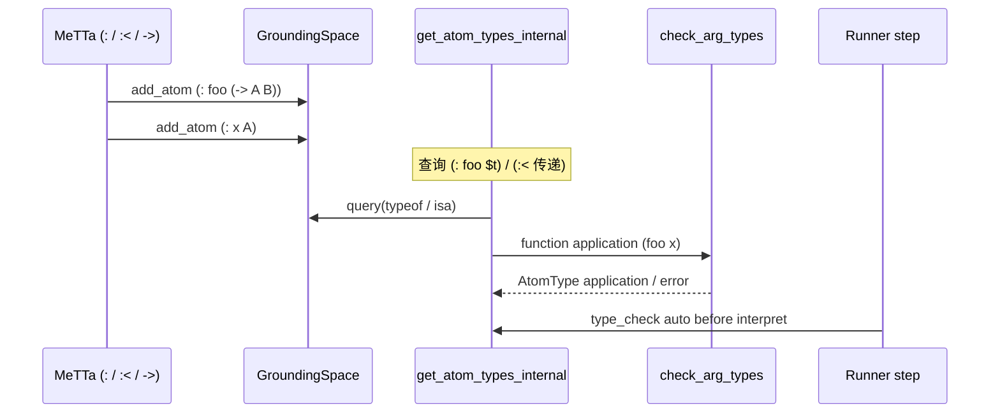

# MeTTa 类型系统：`(:` / `(:<` / `->` / `%Undefined%` / `pragma!`

本文档从 **MeTTa 语法**、**Space 中的类型事实**、**`types.rs` 查询与检查算法**、**解释器 `metta_impl` / `interpret_expression` 中的类型引导求值**，一直延伸到 **Runner** 的 **`pragma! type-check auto`** 与 **Python/C API**。英文标识符如 **`AtomType`**、**`check_type`**、**`get_atom_types`** 保持原文。

---

## 1. 语法与语义概要

### 1.1 类型断言 `(:` atom type)

**示例**：

```metta
(: foo (-> Number Number))
(: x Number)
```

**语义**：向 **Space** 添加 **`(: foo (-> Number Number))`** 原子，表示 **typing fact**：**`foo`** 具有函数类型 **`(-> Number Number)`**。

**Rust 常量**：**`HAS_TYPE_SYMBOL`**（**`lib/src/metta/mod.rs` L21**）。

### 1.2 子类型 `(:` sub super)

**示例**：**`(:< Nat Int)`** — **Nat** 是 **Int** 的子类型。

**常量**：**`SUB_TYPE_SYMBOL`**（**`mod.rs` L22**）。

### 1.3 函数类型 `(-> arg1 ... ret)`

**表面**：**`->`** 为 **head** 的 **Expression**；**`is_func`**（**`types.rs` L127–134**）判定 **children 首元为 `ARROW_SYMBOL` 且长度 > 1**。

```127:134:d:\dev\hyperon-experimental\lib\src\metta\types.rs
pub fn is_func(typ: &Atom) -> bool {
    match typ {
        Atom::Expression(expr) => {
            (expr.children().first() == Some(&ARROW_SYMBOL)) && (expr.children().len() > 1)
        },
        _ => false,
    }
}
```

### 1.4 `%Undefined%`

**常量**：**`ATOM_TYPE_UNDEFINED`**（**`mod.rs` L13**）。**未标注**符号默认在类型推断中视为 **`%Undefined%`**（见 **`types.rs` 模块注释 L18–19**）。

### 1.5 元类型（metatypes）

**`mod.rs` L15–19**：

```15:19:d:\dev\hyperon-experimental\lib\src\metta\mod.rs
pub const ATOM_TYPE_ATOM : Atom = metta_const!(Atom);
pub const ATOM_TYPE_SYMBOL : Atom = metta_const!(Symbol);
pub const ATOM_TYPE_VARIABLE : Atom = metta_const!(Variable);
pub const ATOM_TYPE_EXPRESSION : Atom = metta_const!(Expression);
pub const ATOM_TYPE_GROUNDED : Atom = metta_const!(Grounded);
```

**文档注释**（**`types.rs` L11–16**）说明：**Atom / Symbol / Variable / Expression / Grounded** 通常 **不** 由用户显式 **`(: x Symbol)`** 赋值给 **值**，但可出现在 **`(-> ...)`** 参数位置以约束 **形参** 的 **形态**（**不归约** 或 **BadArgType**）。

---

## 2. Space 查询构造：`typeof_query` 与 `isa_query`

**私有函数**（**`types.rs` L29–35**）：

```29:35:d:\dev\hyperon-experimental\lib\src\metta\types.rs
fn typeof_query(atom: &Atom, typ: &Atom) -> Atom {
    Atom::expr(vec![HAS_TYPE_SYMBOL, atom.clone(), typ.clone()])
}

fn isa_query(sub_type: &Atom, super_type: &Atom) -> Atom {
    Atom::expr(vec![SUB_TYPE_SYMBOL, sub_type.clone(), super_type.clone()])
}
```

**`query_has_type`**（**L37–39**）：**`space.borrow().query(&typeof_query(sub_type, super_type))`** —— 用于 **“某 atom 是否被断言为某 type”** 的 **模式匹配**（第二位置 **Variable** 捕获）。

**`query_super_types`**（**L41–47**）：查询 **`(:< sub $X)`**，收集 **超类型** 列表。

**`add_super_types`**（**L49–63**）：**传递闭包** 展开 **子类型链**（支持多层 **`(:< ...)`**）。

---

## 3. `get_atom_types`：核心入口

### 3.1 公共 API

```327:334:d:\dev\hyperon-experimental\lib\src\metta\types.rs
pub fn get_atom_types(space: &DynSpace, atom: &Atom) -> Vec<AtomType> {
    let atom_types = get_atom_types_internal(space, atom);
    if atom_types.is_empty() {
        vec![AtomType::undefined()]
    } else {
        atom_types
    }
}
```

**空向量** → **单一 `AtomType::undefined()`**（即 **`%Undefined%`** 语义）。

### 3.2 `get_atom_types_internal` 分情形

```376:410:d:\dev\hyperon-experimental\lib\src\metta\types.rs
fn get_atom_types_internal(space: &DynSpace, atom: &Atom) -> Vec<AtomType> {
    log::trace!("get_atom_types_internal: atom: {}", atom);
    let types = match atom {
        Atom::Variable(_) => vec![],
        Atom::Grounded(gnd) => {
            let typ = gnd.type_();
            if typ == ATOM_TYPE_UNDEFINED {
                vec![]
            } else {
                vec![AtomType::value(make_variables_unique(gnd.type_()))]
            }
        },
        Atom::Symbol(_) => query_types(space, atom).into_iter()
            .map(AtomType::value).collect(),
        Atom::Expression(expr) if expr.children().len() == 0 => vec![],
        Atom::Expression(expr) => {
            let type_info = ExprTypeInfo::new(space, expr);
            let mut types = get_tuple_types(space, atom, &type_info);
            let applications = get_application_types(atom, expr, type_info);
            types.extend(applications.into_iter());
            types
        },
    };
    log::debug!("get_atom_types_internal: return atom {} types {}", atom, types.iter().format(", "));
    types
}
```

**要点**：

- **Variable**：**无** intrinsic 类型（**空** → 外层 **`get_atom_types`** 变 **`undefined()`**）。
- **Grounded**：**`gnd.type_()`**；若为 **`ATOM_TYPE_UNDEFINED`** 则 **空**。
- **Symbol**：**`query_types`** = **`(: sym $t)`** 查询 + **超类型展开**。
- **空 Expression `()`**：当前返回 **空** → 外层 **`undefined()`**（注释 **L397–398** 提到与 **unit type** 的 TODO）。
- **非空 Expression**：**tuple 类型**（**各子项类型笛卡尔组合**）与 **function application 类型** **并集**。

---

## 4. `ExprTypeInfo` 与 tuple / application

**`ExprTypeInfo::new`**（**L342–367**）：分离 **op** 的 **函数类型**（**`is_function()`**）与 **非函数类型**；对每个 **实参** 递归 **`get_atom_types_internal`**。

**`get_tuple_types`**（**L477–491**）：在 **op 有值类型** 时组合 **`(t_op t_arg1 ...)`** 形式；并 **并入** **对整表达式直接断言的 `(: (f a) T)`**（**`query_types(space, atom)`**）。

**`get_application_types`**（**L512–522**）：对每个 **函数类型** **`fn_type`**，取 **形参列** 与 **返回类型**（**`get_arg_types` L152–164**），调用 **`check_arg_types`**。

```512:522:d:\dev\hyperon-experimental\lib\src\metta\types.rs
fn get_application_types(atom: &Atom, expr: &ExpressionAtom, type_info: ExprTypeInfo) -> Vec<AtomType> {
    let args = get_args(expr);
    let meta_arg_types: Vec<Vec<Atom>> = args.iter().map(|a| vec![get_meta_type(a), ATOM_TYPE_ATOM]).collect();
    let mut types = Vec::with_capacity(type_info.op_func_types.len());
    for fn_type in type_info.op_func_types.into_iter() {
        let (expected, ret_typ) = get_arg_types(&fn_type);
        let fn_type_atom = fn_type.as_atom();
        check_arg_types(&type_info.arg_types, meta_arg_types.as_slice(), &mut types, expected, ret_typ, atom, fn_type_atom);
    }
    log::trace!("get_application_types: function application {} types {}", atom, types.iter().format(", "));
    types
}
```

**`meta_arg_types`**：每个实参允许 **“元类型匹配”** 或 **`Atom`**（**`check_arg_types_internal` L78–100**）。

---

## 5. `check_arg_types` / `check_arg_types_internal`

**入口**（**L65–71**）：**实参个数** 与 **期望列** 长度不一致 → **`IncorrectNumberOfArguments`** **error AtomType**。

**递归**（**L73–112**）：

- 若 **实际类型列表空** 或 **期望为 `%Undefined%`** 或 **期望属于 meta 列表** → **直接继承 bindings** 不强制 **match_reducted_types**。
- 否则 **对每个候选实际类型** **`match_reducted_types(typ, expected)`**；若无匹配 → **`BadArgType`**（含 **参数索引** **`Number::Integer(idx)`**）。

**成功叶子**（**L103–106**）：**`AtomType::application(apply_bindings_to_atom_move(ret_typ, &bindings))`**。

---

## 6. `%Undefined%` 与 `match_reducted_types`

**`UndefinedTypeMatch` Grounded**（**L525–547**）：在 **`replace_undefined_types`** 中把 **`%Undefined%` 占位** 替换为 **可匹配任意** 的 **Grounded matcher**。

**`match_reducted_types`**（**L563–567**）：左右两侧 **replace** 后调用 **`matcher::match_atoms`**。

```563:567:d:\dev\hyperon-experimental\lib\src\metta\types.rs
pub fn match_reducted_types(left: &Atom, right: &Atom) -> matcher::MatchResultIter {
    let left = replace_undefined_types(left);
    let right = replace_undefined_types(right);
    matcher::match_atoms(&left, &right)
}
```

---

## 7. `check_type` 与 `validate_atom`

### 7.1 `check_type`

```602:604:d:\dev\hyperon-experimental\lib\src\metta\types.rs
pub fn check_type(space: &DynSpace, atom: &Atom, typ: &Atom) -> bool {
    check_meta_type(atom, typ) || !get_matched_types(space, atom, typ).is_empty()
}
```

**`get_matched_types`**（**L576–583**）：在 **`get_atom_types`** 的 **valid** 候选上 **`match_reducted_types(&t, typ)`**。

**`check_meta_type`**（**L615–617**）：**`typ == Atom` 或 typ == get_meta_type(atom)`** 即真（故 **错误类型的表达式** 仍可能 **`check_type(..., Atom)`** 为真 —— 测试 **TODO** 见 **L1177–1179**）。

### 7.2 `validate_atom`

```637:639:d:\dev\hyperon-experimental\lib\src\metta\types.rs
pub fn validate_atom(space: &DynSpace, atom: &Atom) -> bool {
    get_atom_types_internal(space, atom).iter().all(AtomType::is_valid)
}
```

**与 `get_atom_types` 的差异**：**内部** 返回 **空** 时 **不** 自动替换为 **`undefined`**；**空** 表示 **“无法合法类型化”**（见 **`get_application_types` 上方注释 L494–507** 的设计说明）。

---

## 8. 解释器中的类型：`get_meta_type` / `match_types` / `type_cast`

**`interpreter.rs`** 中 **`get_meta_type`**（**L1025–1032**）与 **`types::get_meta_type`** 平行（**Symbol/Variable/Expression/Grounded**）。

**`match_types`**（**L1053–1076**）：若任一侧 **`%Undefined%` 或 `Atom`** → **匹配成功**；否则 **`match_atoms(type1, type2)`** 展开。

**`type_cast`**（**L1034–1050**）：对 **Grounded/Symbol** 等 **非直接 metta 通过** 情形，取 **`get_atom_types`**，尝试 **`match_types(expected, actual)`**；失败则 **`BadType` Error**。

**`interpret_expression`**（**L1110–1188**）：根据 **op** 的 **类型** 划分 **tuple** 归约 vs **function** 归约；**`check_if_function_type_is_applicable`**（**L1260–1350**）逐步核对 **形参类型** 与 **实参类型**，错误时 **`BadArgType` / `IncorrectNumberOfArguments`**。

---

## 9. `pragma! type-check auto` 与 Runner

### 9.1 `PragmaOp`

**`lib/src/metta/runner/stdlib/core.rs` L16–52**：**`pragma!`** 将 **key/value** 写入 **`PragmaSettings`**。

```39:52:d:\dev\hyperon-experimental\lib\src\metta\runner\stdlib\core.rs
impl CustomExecute for PragmaOp {
    fn execute(&self, args: &[Atom]) -> Result<Vec<Atom>, ExecError> {
        let arg_error = || ExecError::from("pragma! expects key and value as arguments");
        let key = <&SymbolAtom>::try_from(args.get(0).ok_or_else(arg_error)?).map_err(|_| "pragma! expects symbol atom as a key")?.name();
        let value = args.get(1).ok_or_else(arg_error)?;
        match key {
            "max-stack-depth" => {
                value.to_string().parse::<usize>().map_err(|_| "UnsignedIntegerIsExpected")?;
            },
            _ => {},
        }
        self.settings.set(key.into(), value.clone());
        unit_result()
    }
}
```

**`type-check`** 键 **无特殊校验**，任意 **Atom** 值可存。

### 9.2 Runner：`type_check_is_enabled`

```482:484:d:\dev\hyperon-experimental\lib\src\metta\runner\mod.rs
    fn type_check_is_enabled(&self) -> bool {
        self.settings().get_string("type-check").map_or(false, |val| val == "auto")
    }
```

**启用条件**：**`get_string("type-check") == "auto"`**（**`sym!("auto")` 的字符串形式** 为 **`auto`**）。

### 9.3 影响 **`add_atom`**

**`modules/mod.rs` L286–296**（见文档 02）：**ADD** 时 **拒绝** 全 **error** 类型原子。

### 9.4 影响 **`!` 解释**

```1086:1092:d:\dev\hyperon-experimental\lib\src\metta\runner\mod.rs
                            if self.metta.type_check_is_enabled() {
                                let types = get_atom_types(&self.module().space(), &atom);
                                if types.iter().all(AtomType::is_error) {
                                    self.i_wrapper.interpreter_state = Some(InterpreterState::new_finished(self.module().space().clone(),
                                        types.into_iter().map(AtomType::into_error_unchecked).collect()));
                                    return Ok(())
                                }
                            }
```

**全 error** → **不进入** **`interpret_init`**，直接 **finished** 返回 **错误向量**。

### 9.5 `Metta::evaluate_atom`

```473:478:d:\dev\hyperon-experimental\lib\src\metta\runner\mod.rs
        if self.type_check_is_enabled()  {
            let types = get_atom_types(&self.module_space(ModId::TOP), &atom);
            if types.iter().all(AtomType::is_error) {
                return Ok(types.into_iter().map(AtomType::into_error_unchecked).collect());
            }
        }
```

---

## 10. 标准库说明摘录

**`stdlib.metta`**（工程内）含 **`(pragma! type-check auto)`** 说明（**grep** **L1244**）；与上文 **Runner** 行为一致。

---

## 11. Mermaid：类型事实 → `get_atom_types` → `check_type` / Runner



---

## 12. Python API

**`AtomType` 常量**：**`python/hyperon/atoms.py` L115–129**（**`UNDEFINED`**、**`SYMBOL`**、**`GROUNDED`** 等，来自 **`hp.CAtomType`**）。

**`check_type` / `validate_atom` / `get_atom_types`**：**`python/hyperon/base.py` L448–488** → **`hp.check_type`**、**`hp.validate_atom`**、**`hp.get_atom_types`**。

```448:464:d:\dev\hyperon-experimental\python\hyperon\base.py
def check_type(gnd_space, atom, type):
    """
    Checks whether the given Atom has the specified type in the given space context.
    ...
    """
    return hp.check_type(gnd_space.cspace, atom.catom, type.catom)
```

---

## 13. C API

**`c/src/metta.rs`**：**`check_type`**（约 **L636–640**）转发 **`hyperon::metta::types::check_type`**。

---

## 14. 错误原子形态（类型检查）

- **`BadType`**：**`mod.rs` L26**；**解释器** **`type_cast` L1047–1049**。
- **`BadArgType`**：**L27**；**`check_arg_types_internal` L92–96**；**`check_if_function_type_is_applicable_` L1336–1338**。
- **`IncorrectNumberOfArguments`**：**L28**；**`check_arg_types` L66–68**；**`interpret_expression` L1266–1268**。

---

## 15. 评估 / 类型追踪示例

### 15.1 简单函数应用

**Space**：

```metta
(: inc (-> Number Number))
(: inc-body (-> Number Number))
(= (inc $x) (inc-body $x))
```

**`get_atom_types` on `(inc {5})`**：**`op`** 有 **`(-> Number Number)`** → **`check_arg_types`** 核对 **`{5}` : Number** → **application** 返回 **Number**。

### 15.2 元类型参数

**测试 `get_atom_types_function_call_meta_types`**（**`types.rs` L1048–1082**）：**`(: f_expr (-> Expression D))`** 与 **`(f_expr b)`**（**`b` 为 Symbol**）→ **`BadArgType` 1 Expression B**。

### 15.3 `pragma!` 阻断错误 **ADD**

**测试 `metta_add_type_check`**（**`runner/mod.rs` L1269–1279**）：**`(: foo (-> A B))`**，**`(foo b)`** 在 **type-check auto** 下 **ADD** 失败并 **TERMINATE**。

---

## 16. 边界与 TODO（源码注释）

- **空表达式 unit type**：**`types.rs` L397–398**。
- **`check_type` 与 `Atom` 元类型过于宽松**：**L1177–1179**、**L1225–1227**。
- **`get_application_types` 三态返回**：**L494–507** 长注释。

---

## 17. 行号总表

| 主题 | 文件 | 行号 |
|------|------|------|
| **类型常量 / 符号** | `lib/src/metta/mod.rs` | 13–27 |
| **typeof_query / isa_query** | `lib/src/metta/types.rs` | 29–35 |
| **query_types / super types** | 同上 | 136–150, 41–63 |
| **is_func / get_arg_types** | 同上 | 127–134, 152–164 |
| **get_atom_types** | 同上 | 327–334 |
| **get_atom_types_internal** | 同上 | 376–410 |
| **get_application_types** | 同上 | 512–522 |
| **check_arg_types** | 同上 | 65–112 |
| **match_reducted_types** | 同上 | 563–567 |
| **check_type / validate_atom** | 同上 | 602–604, 637–639 |
| **PragmaOp** | `runner/stdlib/core.rs` | 16–52 |
| **type_check_is_enabled** | `runner/mod.rs` | 482–484, 1086–1092, 473–478 |
| **interpreter type_cast / match_types** | `interpreter.rs` | 1034–1076 |
| **check_if_function_type_is_applicable** | `interpreter.rs` | 1260–1350 |

---

## 18. 与文档 01/02 的关系

- **01**：**Tokenizer** 如何产生 **`(: ...)`** 的 **Symbol**/**Expression**。
- **02**：**`(= ...)`** 存 **Space**；**类型** 与 **`eval`** 路径在 **`metta_call`** 中交汇。

基准提交：**`cf4c5375`**。
