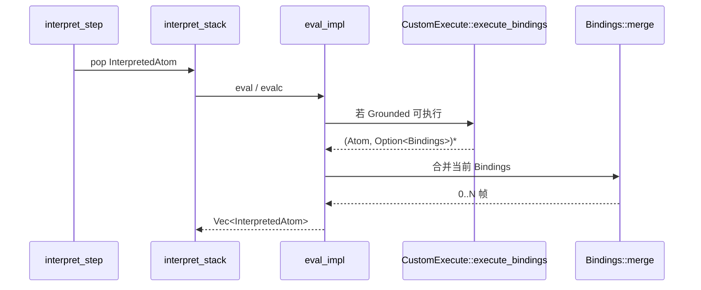
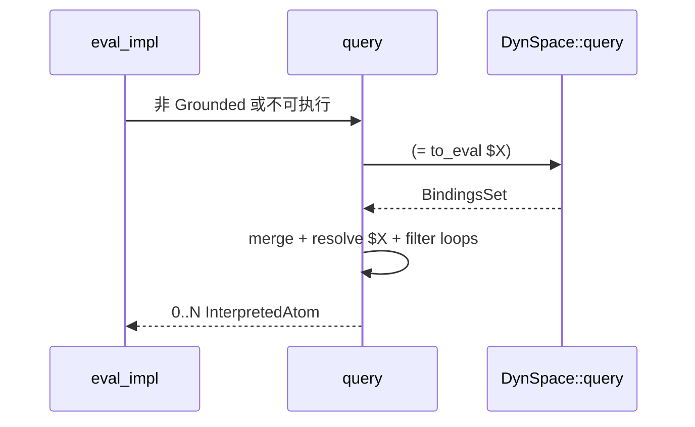
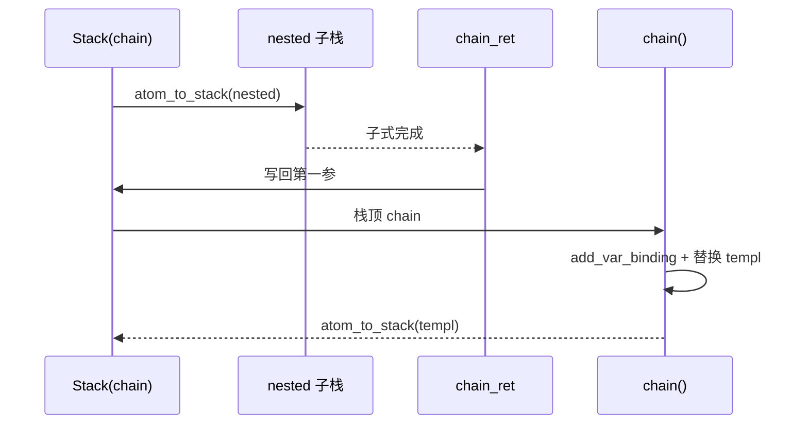
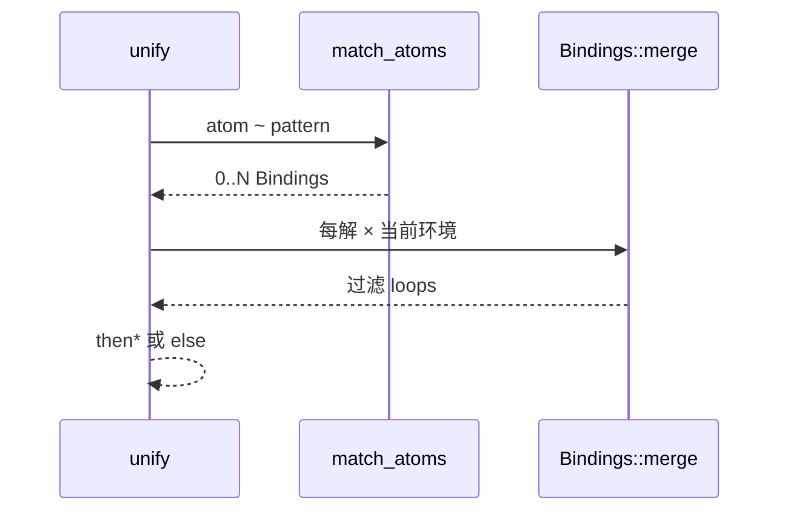
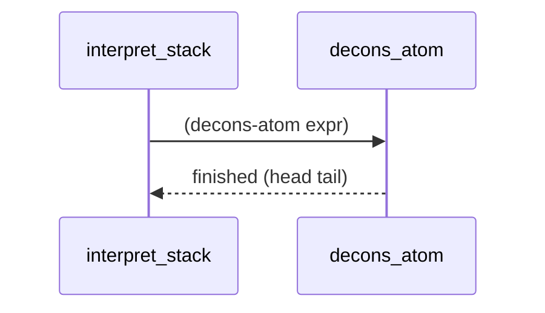
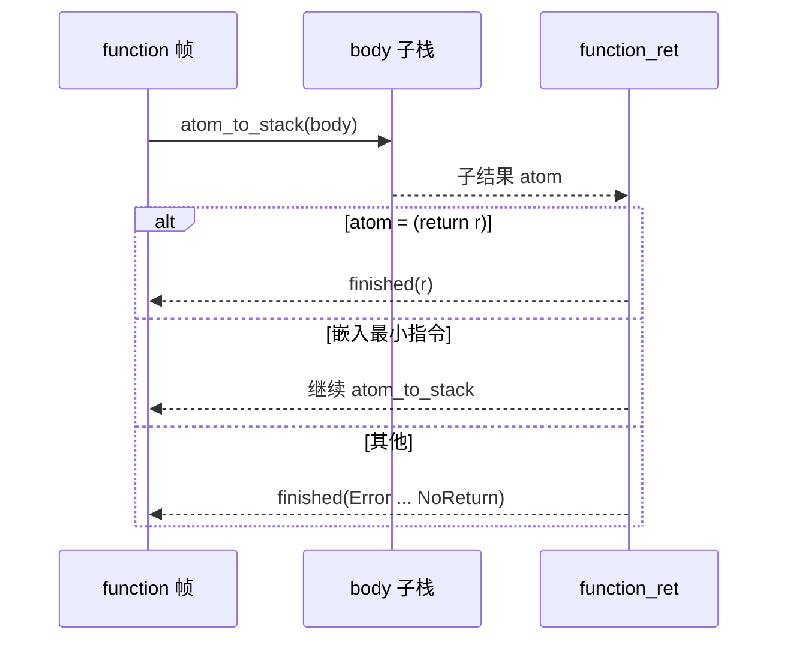
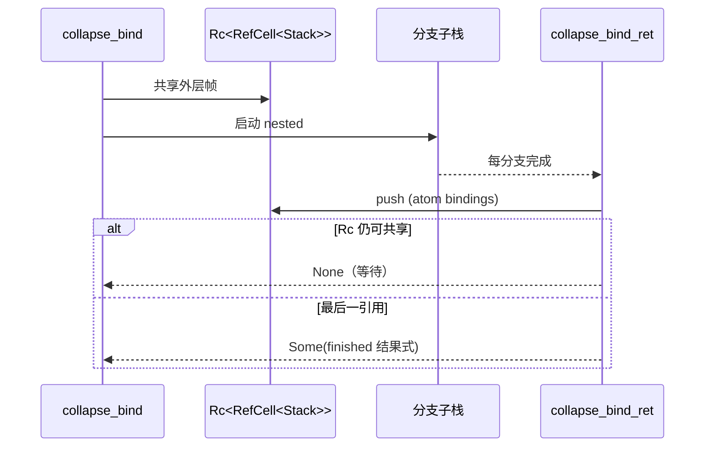
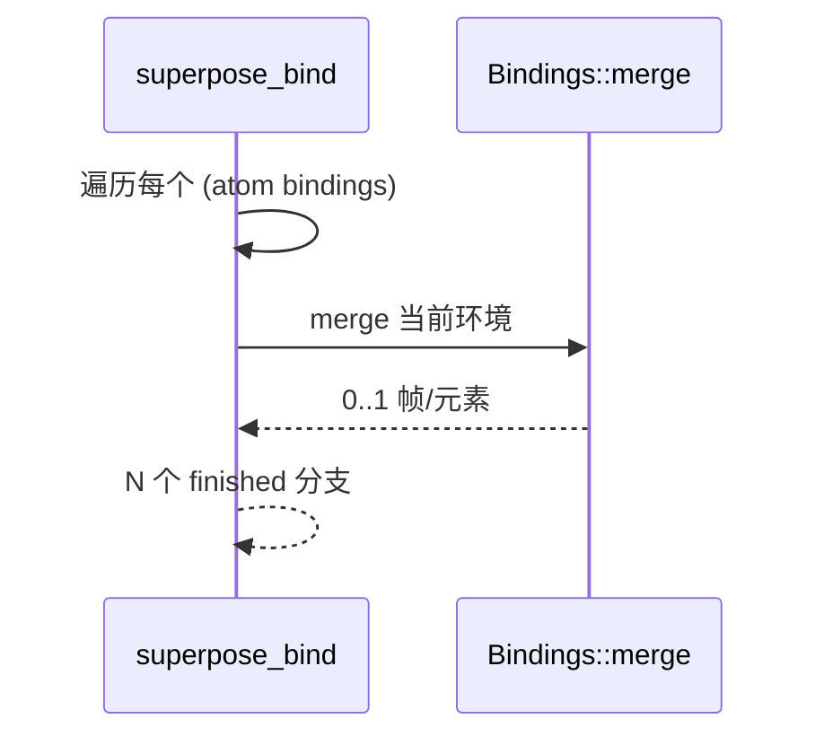
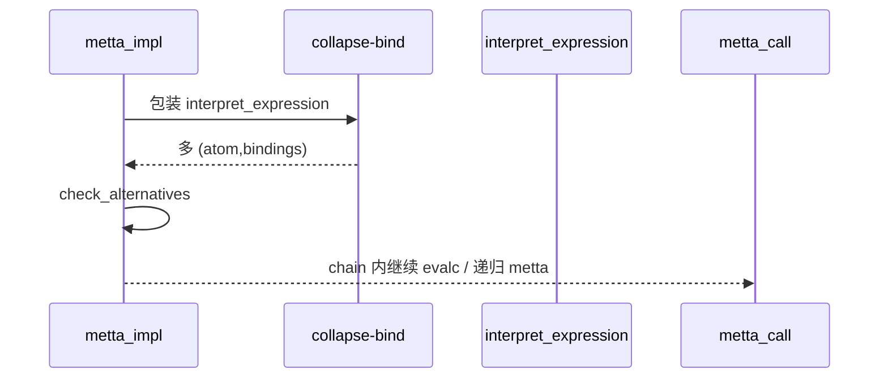
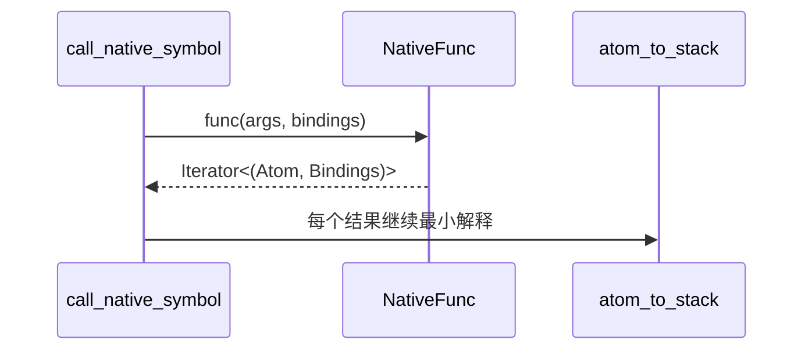

# 最小指令集：全链路实现

本文档追踪 **Minimal MeTTa**（汇编级语义）中各条最小指令从 **MeTTa 表面语法 / 标准库类型说明** → **Python 宿主 API** → **Rust 解释器核心** 的调用链。Rust 的权威实现位于 `lib/src/metta/interpreter.rs`；类型与文档见 `lib/src/metta/runner/stdlib/stdlib.metta`。

## 总览：解释器状态机

- **入口**：`interpret_init` 将待求值原子包装为 `InterpretedAtom(Stack, Bindings)` 放入 `InterpreterState.plan`（见 ```254:261:d:\dev\hyperon-experimental\lib\src\metta\interpreter.rs```）。
- **步进**：`interpret_step` 从 `plan` 弹出一项，调用 `interpret_stack` 展开为 0..N 个新 `InterpretedAtom` 再 `push` 回去（见 ```269:276:d:\dev\hyperon-experimental\lib\src\metta\interpreter.rs```、```374:459:d:\dev\hyperon-experimental\lib\src\metta\interpreter.rs```）。
- **完成**：若栈帧 `finished` 且无外层 `prev`，`InterpreterState::push` 将结果经 `apply_bindings_to_atom_move` 后写入 `finished`（见 ```227:234:d:\dev\hyperon-experimental\lib\src\metta\interpreter.rs```）。
- **嵌套返回**：`ReturnHandler` 在外层子表达式完成后被调用，用于 `chain` / `function` / `collapse-bind` 等（见 ```44:51:d:\dev\hyperon-experimental\lib\src\metta\interpreter.rs```、`Stack` 结构 ```53:68:d:\dev\hyperon-experimental\lib\src\metta\interpreter.rs```）。

### Python 层

- `MeTTa.run` / `MeTTa.evaluate_atom` 通过 `hyperonpy` 进入 Rust Runner，不直接调用 `interpret_step`；当启用 **bare-minimal** 解释器 pragma 或内部使用最小解释器时，Rust 侧会走 `interpret_init` / `interpret_step`（Runner 内引用见 `lib/src/metta/runner/stdlib/mod.rs` ```51:59:d:\dev\hyperon-experimental\lib\src\metta\runner\stdlib\mod.rs```）。
- C API 暴露 `interpret_init` / `interpret_step`（`c/src/metta.rs` 约 726–745 行），供多语言绑定。

```206:219:d:\dev\hyperon-experimental\python\hyperon\runner.py
    def run(self, program, flat=False):
        """Runs the MeTTa code from the program string containing S-Expression MeTTa syntax"""
        parser = SExprParser(program)
        results = hp.metta_run(self.cmetta, parser.cparser)
        self._run_check_for_error()
        if flat:
            return [Atom._from_catom(catom) for result in results for catom in result]
        else:
            return [[Atom._from_catom(catom) for catom in result] for result in results]

    def evaluate_atom(self, atom):
        result = hp.metta_evaluate_atom(self.cmetta, atom.catom)
        self._run_check_for_error()
        return [Atom._from_catom(catom) for catom in result]
```

---

## `eval` / `evalc`：单步求值

### MeTTa / 标准库

- 类型与语义说明：```56:69:d:\dev\hyperon-experimental\lib\src\metta\runner\stdlib\stdlib.metta```

### Rust：分派与实现

- **嵌入算子识别**（决定是否下钻子栈）：`is_embedded_op` ```293:309:d:\dev\hyperon-experimental\lib\src\metta\interpreter.rs```
- **`eval`**：```492:502:d:\dev\hyperon-experimental\lib\src\metta\interpreter.rs``` — 从 `(eval x)` 取出 `x`，调用 `eval_impl(..., context.space, ...)`。
- **`evalc`**：```478:490:d:\dev\hyperon-experimental\lib\src\metta\interpreter.rs``` — 从 `(evalc x space)` 取 **显式空间** 的 `DynSpace`。
- **核心 `eval_impl`**：```504:556:d:\dev\hyperon-experimental\lib\src\metta\interpreter.rs```

#### 算法（`eval_impl`）

1. `apply_bindings_to_atom_move(to_eval, &bindings)` 先做当前环境下的变量替换。
2. **Grounded 且可执行**（`as_execute()` 存在）：
   - 调用 `execute_bindings(args)`；对每个 `(atom, opt_bindings)`：
     - `opt_bindings == None`：在 **当前 bindings** 的每个展开帧上应用结果（`BindingsSet::from(bindings.clone()).into_iter()`）。
     - `Some(b)`：`b.merge(&bindings)` 做 **组合合并**（可能产生多帧）。
   - 每个结果经 `eval_result`：若结果是 `(function ...)` 则进入函数栈，否则标记 `finished`。
3. **若 `to_eval` 本身是嵌入最小指令**（`is_embedded_op`）：不在这里求值到底，而是 `atom_to_stack(to_eval, prev)` 入栈（单步延迟）。
4. **否则（纯 MeTTa / 符号应用等）**：走 `query(space, ...)`，即在空间里查 `(= to_eval $X)` 形式（见下节 `query`）。

#### 返回值

- 单步可能产生 **多个** `InterpretedAtom`（非确定性来自：`execute_bindings` 多结果、`Bindings::merge` 多帧、或 `query` 多条规则）。
- Grounded 返回 **空迭代**：实现选择解释为 `Empty`（```527:536:d:\dev\hyperon-experimental\lib\src\metta\interpreter.rs```）。

#### 错误 / 不可约

- `ExecError::Runtime` → `(Error <atom> <msg>)`。
- `NoReduce` / `IncorrectArgument` → `NotReducible`（```541:548:d:\dev\hyperon-experimental\lib\src\metta\interpreter.rs```）。
- 参数形状错误（`eval` / `evalc`）→ `(Error ... "expected: ...")`（```494:499:d:\dev\hyperon-experimental\lib\src\metta\interpreter.rs``` 等）。

### Mermaid：`eval`（Grounded 路径）



### Mermaid：`eval`（纯 MeTTa / 规则路径）



### Python

- 变量绑定与匹配在 Python 侧通过 `Atom.match_atom` → `hp.atom_match_atom`（底层 Rust `match_atoms`），与 **eval 内 query** 不同层（```42:44:d:\dev\hyperon-experimental\python\hyperon\atoms.py```）。

---

## `query`（`eval` 的纯 MeTTa 后端）

**函数名与位置**：`fn query` ```604:637:d:\dev\hyperon-experimental\lib\src\metta\interpreter.rs```

### 算法

1. （可选编译）变量算子热修复：直接 `NotReducible`（```605:611:d:\dev\hyperon-experimental\lib\src\metta\interpreter.rs```）。
2. 构造查询原子 `(= to_eval $X)`（唯一 `X`）（```612:614:d:\dev\hyperon-experimental\lib\src\metta\interpreter.rs```）。
3. `space.borrow().query(&query)` → `BindingsSet`。
4. 对每个匹配 `b`：`b.merge(&bindings)`，丢弃 `has_loops()`，对解析到的 `X` 调用 `eval_result`（支持 `(function ...)` 尾调用形态）。

### 错误 / 结果为空

- 无匹配：返回单个 finished 的 `NotReducible`（```633:636:d:\dev\hyperon-experimental\lib\src\metta\interpreter.rs```）。

### 与多条 `=` 的关系

空间中同一模式多条相等式 → `query` 返回多个绑定 → **多个分支** 进入 `plan`（非确定性来源之一）。

---

## `chain`：顺序求值 + 绑定 + 体替换

### 标准库

- 文档与类型：```71:78:d:\dev\hyperon-experimental\lib\src\metta\runner\stdlib\stdlib.metta```

### Rust

- **首次入栈**：`atom_to_stack` 对 `(chain ...)` 走 `chain_to_stack` ```643:644:d:\dev\hyperon-experimental\lib\src\metta\interpreter.rs```，实现 ```657:673:d:\dev\hyperon-experimental\lib\src\metta\interpreter.rs```。
- **子表达式完成后**：`chain_ret` ```675:685:d:\dev\hyperon-experimental\lib\src\metta\interpreter.rs```。
- **当 `chain` 帧成为栈顶且未 finished**：`chain` ```687:702:d:\dev\hyperon-experimental\lib\src\metta\interpreter.rs```。

### 算法

1. `chain_to_stack` 校验形状 `(chain <nested> <Var> <templ>)`，把 `nested` 换出为占位符并将 **nested 子栈** 挂到当前帧下；`ret` 设为 `chain_ret`。
2. 子表达式求值完成 → `chain_ret` 把结果写回 `(chain ...)` 的第一个参数位。
3. 栈顶再次为 `chain` 时：`chain` 用 **临时** `Bindings::add_var_binding(var, nested)`（注意此处 `nested` 已是结果原子），`apply_bindings_to_atom_move(templ, &b)`，再 `atom_to_stack(templ, prev)`；把当前帧的 `vars` 并入子栈外层（```698:700:d:\dev\hyperon-experimental\lib\src\metta\interpreter.rs```）。

### 返回值

- 继续求值：单个 `InterpretedAtom` 指向 **模板** 的新栈顶。
- 形状错误：`Stack::finished` 带 `Error`（```661:664:d:\dev\hyperon-experimental\lib\src\metta\interpreter.rs```）。

### Mermaid



---

## `unify`：双向匹配（`match_atoms`）

### 标准库

- 类型与语义：```80:88:d:\dev\hyperon-experimental\lib\src\metta\runner\stdlib\stdlib.metta```

### Rust

- 入栈：`unify_to_stack` ```798:807:d:\dev\hyperon-experimental\lib\src\metta\interpreter.rs```（形状校验）。
- 归约：`unify` ```809:840:d:\dev\hyperon-experimental\lib\src\metta\interpreter.rs```。

### 算法

1. 解析 `(unify atom pattern then else)`。
2. `match_atoms(&atom, &pattern)` 得到 `Vec<Bindings>`（对称、多解）。
3. 每解 `b`：`b.merge(&bindings)`，过滤 `has_loops()`，对 `then` 做 `apply_bindings_to_atom_move` 得 **多个** finished 结果。
4. 若无任何有效解：返回 **单个** finished 的 `else_`（注意 **不** 对 `else_` 应用匹配绑定，直接使用原样 ```836:837:d:\dev\hyperon-experimental\lib\src\metta\interpreter.rs```）。

### 错误

- 形状不合法：`(Error unify_atom "expected: ...")`（```811:816:d:\dev\hyperon-experimental\lib\src\metta\interpreter.rs```）。

### Mermaid



### Python

- 用户层 `Atom.match_atom` 暴露同一底层匹配思想；`Bindings.merge` 在 Python 为 `hp.bindings_merge`（```652:654:d:\dev\hyperon-experimental\python\hyperon\atoms.py```）。

---

## `cons-atom` / `decons-atom`

### 标准库

- `cons-atom`：```90:96:d:\dev\hyperon-experimental\lib\src\metta\runner\stdlib\stdlib.metta```
- `decons-atom`：```98:103:d:\dev\hyperon-experimental\lib\src\metta\runner\stdlib\stdlib.metta```

### Rust

- `decons_atom` ```843:856:d:\dev\hyperon-experimental\lib\src\metta\interpreter.rs```
- `cons_atom` ```858:870:d:\dev\hyperon-experimental\lib\src\metta\interpreter.rs```

### 算法与返回

- **decons**：要求参数为 **非空** `Expression`；返回 `(head tail_expr)` 的表达式（head 为首个子项，tail 为剩余子项组成的 expression）。
- **cons**：要求第二参为 `Expression`；结果为 `head` 与 tail 子项拼接的新 expression。

### 错误

- 形状不符 / 空表达式：`Error` 消息串说明期望形状（```847:850:d:\dev\hyperon-experimental\lib\src\metta\interpreter.rs```、```862:865:d:\dev\hyperon-experimental\lib\src\metta\interpreter.rs```）。

### Mermaid（decons）



---

## `function` / `return`：`ReturnHandler` 与 eval-until-return

### 标准库

- `return`：```42:47:d:\dev\hyperon-experimental\lib\src\metta\runner\stdlib\stdlib.metta```
- `function`：```49:54:d:\dev\hyperon-experimental\lib\src\metta\runner\stdlib\stdlib.metta```

### Rust

- `function_to_stack` ```704:716:d:\dev\hyperon-experimental\lib\src\metta\interpreter.rs```：`ret = function_ret`。
- `function_ret` ```723:744:d:\dev\hyperon-experimental\lib\src\metta\interpreter.rs```。
- 对 **调用** 生成的中间栈：`call_ret` ```718:721:d:\dev\hyperon-experimental\lib\src\metta\interpreter.rs```（`eval_result` 在结果形如 `(function ...)` 时构造，```559:578:d:\dev\hyperon-experimental\lib\src\metta\interpreter.rs```）。
- `eval_result` 在调用场景下 **裁剪 bindings** 仅保留调用点可见变量（```563:573:d:\dev\hyperon-experimental\lib\src\metta\interpreter.rs```）。

### 算法（直观）

1. `(function body)`：`body` 作为子栈求值；外层 `function_ret` 每次拿到子结果：
   - 若为 `(return x)`：`finished` 且结果为 `x`。
   - 若为嵌入算子：继续 `atom_to_stack` **同层** 循环。
   - 否则：构造 `Error`（`NoReturn`）关联外层 atom（```730:740:d:\dev\hyperon-experimental\lib\src\metta\interpreter.rs```）。
2. `dispatch` 中栈顶 `(function ...)` 直接 `panic!("Unexpected state")`（```426:428:d:\dev\hyperon-experimental\lib\src\metta\interpreter.rs```）—— 正常路径必须先经 `function_to_stack`。

### Mermaid



---

## `collapse-bind`：`Rc<RefCell<Stack>>` 与结果收集

### 标准库

- 文档与类型：```234:239:d:\dev\hyperon-experimental\lib\src\metta\runner\stdlib\stdlib.metta```

### Rust

- 实现：`collapse_bind` ```746:765:d:\dev\hyperon-experimental\lib\src\metta\interpreter.rs```
- 返回处理：`collapse_bind_ret` ```767:792:d:\dev\hyperon-experimental\lib\src\metta\interpreter.rs```
- 设计注释：`Stack` 字段说明 ```56:59:d:\dev\hyperon-experimental\lib\src\metta\interpreter.rs```

### 算法

1. 把 `(collapse-bind nested)` 改写为带 **结果缓冲区** 的表达式：第二位为可变 `Expression`，第三位压入 **当前 Bindings 的 grounded 副本**（```749:758:d:\dev\hyperon-experimental\lib\src\metta\interpreter.rs```）。
2. 构造外层 `Stack`，`ret = collapse_bind_ret`，`prev` 为 `Rc<RefCell<...>>`。
3. **同一步** 返回 **两个** `InterpretedAtom`（```763:764:d:\dev\hyperon-experimental\lib\src\metta\interpreter.rs```）：
   - `dummy`：`finished` 的 `Empty` —— 用于 **占位**，使 `Rc` 在所有分支结束前不被释放（```763:763:d:\dev\hyperon-experimental\lib\src\metta\interpreter.rs```）。
   - `cur`：真正的 `nested` 子栈。
4. 每当某分支完成并 bubble 到 `collapse_bind_ret`：若结果非 `Empty`，把 `(atom bindings)` 对压入结果列表（```767:777:d:\dev\hyperon-experimental\lib\src\metta\interpreter.rs```）。
5. 当 `Rc::into_inner` 成功（所有共享引用已释放）：取出累积表达式与第三位的 bindings，合成 **单一** `finished` 结果（```780:788:d:\dev\hyperon-experimental\lib\src\metta\interpreter.rs```）；否则返回 `None` 表示 **尚有分支**（```789:791:d:\dev\hyperon-experimental\lib\src\metta\interpreter.rs```）。

### 错误

- 内部状态不一致 → `panic!("Unexpected state")`（例如 `collapse` 结构被破坏）。

### Mermaid



---

## `superpose-bind`：从 collapse 结果展开多分支

### 标准库

- 文档与类型：```241:246:d:\dev\hyperon-experimental\lib\src\metta\runner\stdlib\stdlib.metta```

### Rust

- `superpose_bind` ```893:917:d:\dev\hyperon-experimental\lib\src\metta\interpreter.rs```

### 算法

1. 要求参数为 `(superpose-bind (: collapsed Expression))`，其中 `collapsed` 的每个孩子为 `(atom bindings)`（经 `atom_into_atom_bindings` 解析 ```872:878:d:\dev\hyperon-experimental\lib\src\metta\interpreter.rs```）。
2. 对每个子对：`b.merge(&bindings)`，过滤 `has_loops()`，生成 **多个 finished** `InterpretedAtom`，仅原子部分不同，bindings 为合并后环境。

### 错误

- 形状错误：`Error`（```897:900:d:\dev\hyperon-experimental\lib\src\metta\interpreter.rs```）。

### Mermaid



---

## `metta`：完整 MeTTa 求值管道

### 标准库

- 类型与语义：```248:255:d:\dev\hyperon-experimental\lib\src\metta\runner\stdlib\stdlib.metta```

### Rust（最小栈上的入口）

- `metta_sym` ```940:952:d:\dev\hyperon-experimental\lib\src\metta\interpreter.rs```：把 `(metta atom type space)` 转写为对 **`call-native` + `metta_impl`** 的嵌套求值（见 ```950:951:d:\dev\hyperon-experimental\lib\src\metta\interpreter.rs```）。
- `metta_impl` ```994:1022:d:\dev\hyperon-experimental\lib\src\metta\interpreter.rs```：**类型检查 / 早停** 与 **表达式** 情况的展开。

### 算法概要（`metta_impl`）

1. 元类型与 `Atom` / `Variable` / 已标记求值表达式等 **直接** `(return atom)`。
2. `Symbol` / `Grounded`：若类型不匹配则 `type_cast`（查询类型、`match_types` / `match_atoms`）（```1007:1010:d:\dev\hyperon-experimental\lib\src\metta\interpreter.rs```、`type_cast` ```1034:1050:d:\dev\hyperon-experimental\lib\src\metta\interpreter.rs```）。
3. **一般表达式**：生成 **嵌套 `chain`**：
   - 内层：`collapse-bind` 包裹 `call-native interpret_expression`，收集 **多解**；
   - 然后 `check_alternatives` 过滤错误分支、标记求值等（`interpret_expression` / `check_alternatives` ```1014:1020:d:\dev\hyperon-experimental\lib\src\metta\interpreter.rs```、```1079:1107:d:\dev\hyperon-experimental\lib\src\metta\interpreter.rs```）。

### 后续关键 native 步骤（仍在本文件）

- `interpret_expression` ```1110:1188:d:\dev\hyperon-experimental\lib\src\metta\interpreter.rs```：根据算子类型判断 **函数应用** vs **元组逐元求值**（`interpret_function` / `interpret_tuple`）。
- `metta_call` ```1415:1444:d:\dev\hyperon-experimental\lib\src\metta\interpreter.rs```：在类型已判定后，用 **`evalc` 单步** + `metta_call_return` 递归推进（```1439:1442:d:\dev\hyperon-experimental\lib\src\metta\interpreter.rs```）。

### 错误

- 参数形状：`(return (Error ...))`（```995:1001:d:\dev\hyperon-experimental\lib\src\metta\interpreter.rs```）。
- 类型失败：`BadType` 等（`type_cast` 中构造，```1047:1050:d:\dev\hyperon-experimental\lib\src\metta\interpreter.rs```）。

### Mermaid（表达式分支总览）



---

## `context-space` / `call-native`

### `context-space`

- 标准库：```105:109:d:\dev\hyperon-experimental\lib\src\metta\runner\stdlib\stdlib.metta```
- Rust：`context_space` ```954:965:d:\dev\hyperon-experimental\lib\src\metta\interpreter.rs```：返回 `Atom::gnd(context.space.clone())`。
- 错误：必须为 `(context-space)` 无参形式（```957:962:d:\dev\hyperon-experimental\lib\src\metta\interpreter.rs```）。

### `call-native`

- Rust：`call_native_symbol` ```922:937:d:\dev\hyperon-experimental\lib\src\metta\interpreter.rs```
- 形状：`(call-native <name> <func-grounded> <args>)`，其中 `func` 为 `NativeFunc`（`fn(Atom, Bindings) -> MettaResult`）（```920:920:d:\dev\hyperon-experimental\lib\src\metta\interpreter.rs```）。
- **调用栈**：`call_to_stack` 构造与 `eval` 调用 grounded 类似的变量收集栈（```933:936:d:\dev\hyperon-experimental\lib\src\metta\interpreter.rs```）。
- **返回**：`func` 产生迭代器，每项映射为 `atom_to_stack` 继续解释（```935:937:d:\dev\hyperon-experimental\lib\src\metta\interpreter.rs```）。
- 辅助宏：`call_native!` ```38:41:d:\dev\hyperon-experimental\lib\src\metta\interpreter.rs```、`call_native_atom` ```980:982:d:\dev\hyperon-experimental\lib\src\metta\interpreter.rs```。

### Mermaid：`call-native`



---

## 附：`atom_to_stack` 路由表

```640:654:d:\dev\hyperon-experimental\lib\src\metta\interpreter.rs
fn atom_to_stack(atom: Atom, prev: Option<Rc<RefCell<Stack>>>) -> Stack {
    let expr = atom_as_slice(&atom);
    let result = match expr {
        Some([op, ..]) if *op == CHAIN_SYMBOL =>
            chain_to_stack(atom, prev),
        Some([op, ..]) if *op == FUNCTION_SYMBOL =>
            function_to_stack(atom, prev),
        Some([op, ..]) if *op == EVAL_SYMBOL =>
            Stack::from_prev_keep_vars(prev, atom, no_handler),
        Some([op, ..]) if *op == UNIFY_SYMBOL =>
            unify_to_stack(atom, prev),
        _ =>
            Stack::from_prev_keep_vars(prev, atom, no_handler),
    };
    result
}
```

---

## 小结表

| 指令 | Rust 核心函数 | 大致行号 | Python 关联 |
|------|---------------|----------|-------------|
| `eval` | `eval` → `eval_impl` | 492–556 | `MeTTa.evaluate_atom` → Runner |
| `evalc` | `evalc` → `eval_impl` | 478–502 | 同上（显式 space） |
| `chain` | `chain_to_stack` / `chain_ret` / `chain` | 657–702 | 标准库用其定义高层形式 |
| `unify` | `unify` | 809–840 | `Atom.match_atom`（不同 API 层） |
| `cons-atom` | `cons_atom` | 858–870 | — |
| `decons-atom` | `decons_atom` | 843–856 | — |
| `function` / `return` | `function_to_stack` / `function_ret` | 704–744 | — |
| `collapse-bind` | `collapse_bind` / `collapse_bind_ret` | 746–792 | — |
| `superpose-bind` | `superpose_bind` | 893–917 | — |
| `metta` | `metta_sym` / `metta_impl` / `metta_call` | 940–952, 994+, 1415+ | `MeTTa.run` |
| `context-space` | `context_space` | 954–965 | `RunContext.space()` |
| `call-native` | `call_native_symbol` | 922–937 | 无直接 Python 暴露 |

以上行号均指向仓库内源文件；若本地分支与 `source_commit` 不一致，请以当前检出为准对照阅读。
