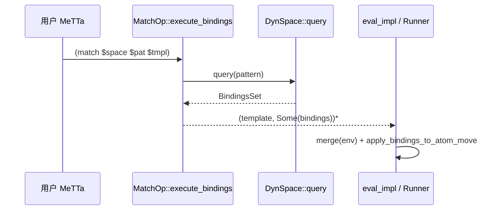
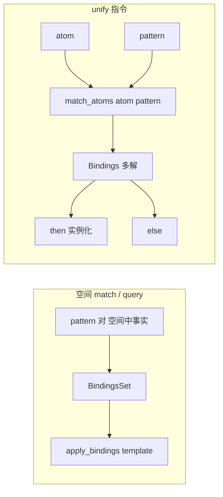
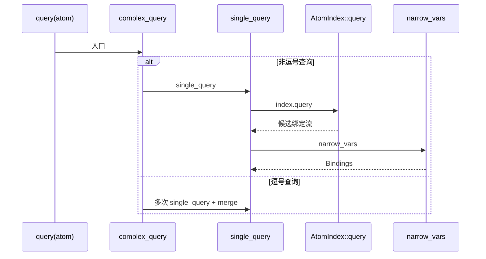
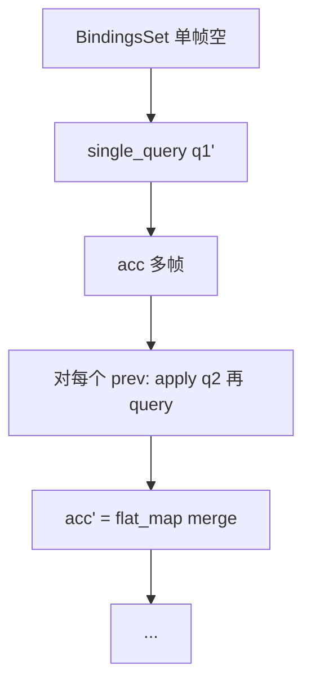
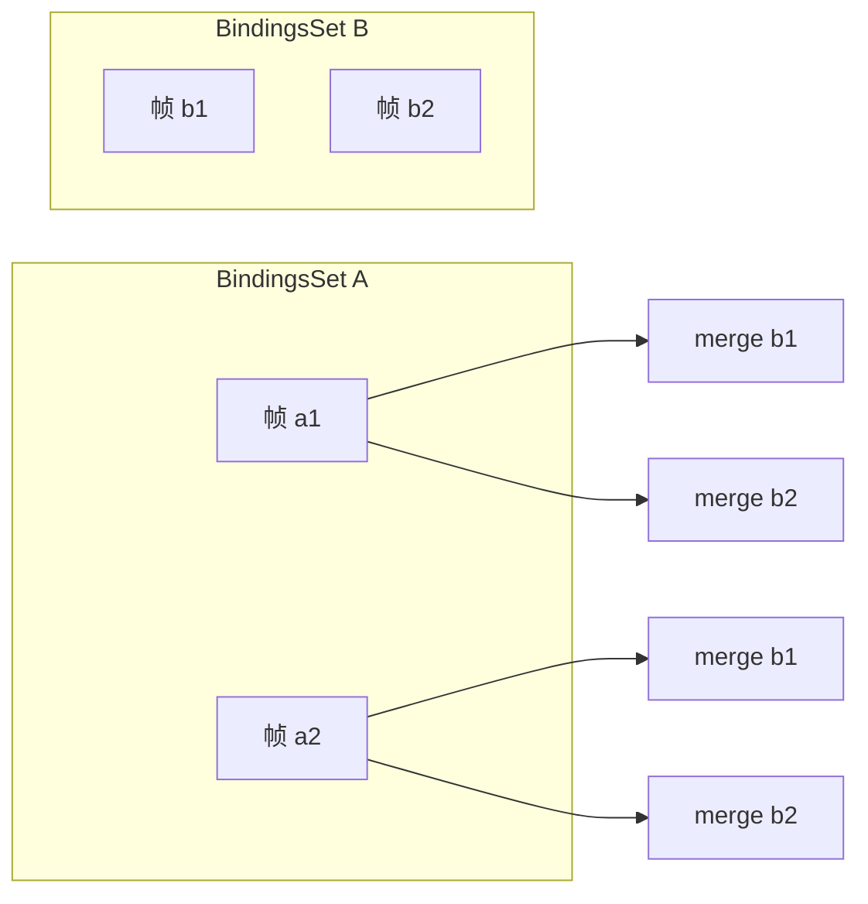

# 模式匹配与查询：全链路实现

本文档说明 **MeTTa 层** 的 `match` / `let` / `unify` 等与 **空间查询**、**`match_atoms` 双向合一**、**绑定合并** 之间的关系，并给出精确到函数与行号的 Rust 引用；Python 侧通过 `hyperonpy` 暴露匹配与 `Bindings` API。

---

## 1. `match` 操作：`MatchOp`（`core.rs`）

### MeTTa 标准库文档

- 用户可见 `match` 的语义描述（面向程序员）：```1050:1056:d:\dev\hyperon-experimental\lib\src\metta\runner\stdlib\stdlib.metta```

### Rust：`MatchOp::execute_bindings`

核心实现：```155:166:d:\dev\hyperon-experimental\lib\src\metta\runner\stdlib\core.rs```

```155:166:d:\dev\hyperon-experimental\lib\src\metta\runner\stdlib\core.rs
impl CustomExecute for MatchOp {
    fn execute_bindings(&self, args: &[Atom]) -> Result<BoxedIter<'static, (Atom, Option<Bindings>)>, ExecError> {
        let arg_error = || ExecError::from("match expects three arguments: space, pattern and template");
        let space = args.get(0).ok_or_else(arg_error)?;
        let pattern = args.get(1).ok_or_else(arg_error)?;
        let template = args.get(2).ok_or_else(arg_error)?.clone();
        log::debug!("MatchOp::execute: space: {:?}, pattern: {:?}, template: {:?}", space, pattern, template);
        let space = Atom::as_gnd::<DynSpace>(space).ok_or("match expects a space as the first argument")?;
        let results = space.borrow().query(&pattern);
        let results = results.into_iter().map(move |b| (template.clone(), Some(b)));
        Ok(Box::new(results))
    }
}
```

### 逐步算法

1. **参数校验**：三个参数 — `space`、`pattern`、`template`；`space` 必须是 **grounded** 的 `DynSpace`。
2. **查询**：`space.borrow().query(&pattern)` → `BindingsSet`（每个元素是一组变量绑定，对应空间中一次成功匹配）。
3. **结果流**：对每条绑定 `b`，输出二元组 `(template.clone(), Some(b))`。
4. **后续**（在 Runner / `eval` 路径中）：解释器对 `Some(b)` 会执行 `b.merge(&bindings)`（见 `eval_impl` ```517:522:d:\dev\hyperon-experimental\lib\src\metta\interpreter.rs```），再 `apply_bindings_to_atom_move` 得到实例化模板。

### 返回值与错误

- **成功**：迭代器元素为 `(模板原子, Some(Bindings))`；若空间无匹配，迭代器为空（上层可能得到空结果集）。
- **错误**：参数个数或类型不对 → `ExecError`（`execute_bindings` 的 `Result`）。

### Mermaid：`match` 与模板实例化



### Python

- `match` 作为注册到 Tokenizer 的 grounded 原子，从 Python `MeTTa.run` 调用链进入同一 Rust 实现；无单独 Python 重实现。
- 若要在 Python 中 **手动** 做类似事：对 `GroundingSpace` 的 C/Rust 引用调用 `query`（经 `SpaceRef`），或直接 `Atom.match_atom` 做 **两原子** `match_atoms`（见第 4 节）。

### 单元测试参考

- `match_op` / `match_op_issue_530`：```529:545:d:\dev\hyperon-experimental\lib\src\metta\runner\stdlib\core.rs```

---

## 2. `unify` 操作与 `match_atoms`（双向）

### 标准库类型说明

- ```80:88:d:\dev\hyperon-experimental\lib\src\metta\runner\stdlib\stdlib.metta```

### Rust 解释器：`unify`

- ```809:840:d:\dev\hyperon-experimental\lib\src\metta\interpreter.rs```（全文分析见《04-minimal-instructions》`unify` 节）

### 成功 / 失败路径（精确行为）

1. **成功**：`match_atoms(&atom, &pattern)` 产生 1..N 个无环 `Bindings`；与当前环境 `merge` 后实例化 `then`，可得到 **多个** finished 分支。
2. **失败**：无任何有效合并结果 → 返回 **单个** `else` 分支（不对 `else` 应用匹配绑定）。

### Mermaid：`unify` vs 空间 `query`



---

## 3. 空间查询机制：`GroundingSpace::query` 与 `AtomIndex`

### 3.1 `GroundingSpace::query` / `single_query`

```147:163:d:\dev\hyperon-experimental\lib\src\space\grounding\mod.rs
    pub fn query(&self, query: &Atom) -> BindingsSet {
        complex_query(query, |query| self.single_query(query))
    }

    /// Executes simple `query` without sub-queries on the space.
    fn single_query(&self, query: &Atom) -> BindingsSet {
        log::debug!("GroundingSpace::single_query: {} query: {}", self, query);
        let mut result = BindingsSet::empty();
        let query_vars: HashSet<&VariableAtom> = query.iter().filter_type::<&VariableAtom>().collect();
        for bindings in self.index.query(query) {
            let bindings = bindings.narrow_vars(&query_vars);
            log::trace!("single_query: push result: {}", bindings);
            result.push(bindings);
        }
        log::debug!("GroundinSpace::single_query: {} result: {}", self, result);
        result
    }
```

### 算法要点

1. **外层 `complex_query`**：若查询式为 **逗号连接子查询**，按第 5 节组合；否则直接 `single_query`。
2. **`AtomIndex::query`**：在 Trie 索引上检索可与模式合一的候选，并对每个候选计算绑定（迭代器见 ```191:196:d:\dev\hyperon-experimental\hyperon-space\src\index\mod.rs```）。
3. **`narrow_vars`**：只保留 **查询式中出现** 的变量及相关依赖（实现于 `hyperon-atom` `Bindings::narrow_vars`，见 matcher 文档块 ```518:550:d:\dev\hyperon-experimental\hyperon-atom\src\matcher.rs```），避免把匹配内部临时变量泄漏给模板。

### Mermaid：GroundingSpace 查询



### `Space` trait 转发

```185:187:d:\dev\hyperon-experimental\lib\src\space\grounding\mod.rs
    fn query(&self, query: &Atom) -> BindingsSet {
        GroundingSpace::query(self, query)
    }
```

---

## 4. `match_atoms` 算法（`hyperon-atom/src/matcher.rs`）

### 4.1 入口 `match_atoms`

```1084:1094:d:\dev\hyperon-experimental\hyperon-atom\src\matcher.rs
pub fn match_atoms<'a>(left: &'a Atom, right: &'a Atom) -> MatchResultIter {
    Box::new(match_atoms_recursively(left, right).into_iter()
        .filter(|binding| {
            if binding.has_loops() {
                log::trace!("match_atoms: remove bindings which contains a variable loop: {}", binding);
                false
            } else {
                true
            }
        }))
}
```

- **对称性**：左右原子地位相同；文档说明见 ```1046:1064:d:\dev\hyperon-experimental\hyperon-atom\src\matcher.rs```。
- **环检测**：`has_loops()` 为真则从迭代中剔除（与 `unify` / `query` 路径中的过滤一致）。

### 4.2 递归情形 `match_atoms_recursively`

```1096:1137:d:\dev\hyperon-experimental\hyperon-atom\src\matcher.rs
fn match_atoms_recursively(left: &Atom, right: &Atom) -> BindingsSet {
    let res = match (left, right) {
        (Atom::Symbol(a), Atom::Symbol(b)) if a == b => BindingsSet::single(),
        (Atom::Variable(dv), Atom::Variable(pv)) => {
            let mut bind = Bindings::new();
            let binding_id = bind.new_binding(dv.clone(), None);
            bind.add_var_to_binding(binding_id, pv.clone());
            BindingsSet::from(bind)
        },
        // TODO: If GroundedAtom is matched with VariableAtom there are
        // two way to calculate match: (1) pass variable to the
        // GroundedAtom::match(); (2) assign GroundedAtom to the Variable.
        // Returning both results breaks tests right now.
        (Atom::Variable(v), b) => {
            let mut bind = Bindings::new();
            bind.new_binding(v.clone(), Some(b.clone()));
            BindingsSet::from(bind)
        }, 
        (a, Atom::Variable(v)) => {
            let mut bind = Bindings::new();
            bind.new_binding(v.clone(), Some(a.clone()));
            BindingsSet::from(bind)
        }, 
        (Atom::Expression(ExpressionAtom{ children: a, ..  }), Atom::Expression(ExpressionAtom{ children: b, .. }))
        if a.len() == b.len() => {
            a.iter().zip(b.iter()).fold(BindingsSet::single(),
            |acc, (a, b)| {
                acc.merge(&match_atoms_recursively(a, b))
            })
        },
        (Atom::Grounded(a), _) if a.as_grounded().as_match().is_some() => {
            a.as_grounded().as_match().unwrap().match_(right).collect()
        },
        (_, Atom::Grounded(b)) if b.as_grounded().as_match().is_some() => {
            b.as_grounded().as_match().unwrap().match_(left).collect()
        },
        (Atom::Grounded(a), Atom::Grounded(b)) if a.eq_gnd(AsRef::as_ref(b)) => BindingsSet::single(),
        _ => BindingsSet::empty(),
    };
    log::trace!("match_atoms_recursively: {} ~ {} => {}", left, right, res);
    res
}
```

#### 分情形说明（用户文档常用分类）

| 情形 | 代码位置 | 行为 |
|------|-----------|------|
| **Symbol–Symbol** | 行 1097–1098 | 相等 → 空绑定单解；不等 → 落入 `_` 得空集 |
| **Variable–Variable** | 行 1099–1104 | 新建 **无值绑定** 并通过 `add_var_to_binding` 合并两变量（等价约束） |
| **Variable–任意** | 行 1109–1118 | 变量绑定到对立面原子的 **值拷贝**（单向赋值式绑定） |
| **Expression–Expression** | 行 1119–1125 | 长度一致则 **按位 zip**，用 `BindingsSet::merge` 做组合积；长度不等 → 空集 |
| **Grounded（自定义 match）** | 行 1126–1131 | 调用 `CustomMatch::match_`，结果收集为 `BindingsSet` |
| **Grounded–Grounded（无 CustomMatch）** | 行 1132 | `eq_gnd` 真 → 单解；否则空 |
| **其它** | 行 1133 | 空集 |

> 注释 **TODO**（1105–1108 行）说明：Variable 与 Grounded 同时出现时，理论上可 **二分**（自定义 match vs 直接绑定），当前实现选择固定策略以通过测试。

### 4.3 与 `DynSpace` 的匹配接口

`hyperon-space` 为 `DynSpace` 实现 `CustomMatch`：`match_` 即对包裹空间调用 `query`（```334:337:d:\dev\hyperon-experimental\hyperon-space\src\lib.rs```）。因此 **模式中出现空间 grounded 原子** 时，匹配可嵌套触发查询。

---

## 5. 复杂查询：逗号 `,`（`complex_query`）

### Rust 实现

```340:368:d:\dev\hyperon-experimental\hyperon-space\src\lib.rs
pub fn complex_query<F>(query: &Atom, single_query: F) -> BindingsSet
where
    F: Fn(&Atom) -> BindingsSet,
{
    log::debug!("complex_query: query: {}", query);
    match split_expr(query) {
        // Cannot match with COMMA_SYMBOL here, because Rust allows
        // it only when Atom has PartialEq and Eq derived.
        Some((sym @ Atom::Symbol(_), args)) if *sym == COMMA_SYMBOL => {
            args.fold(BindingsSet::single(),
                |mut acc, query| {
                    let result = if acc.is_empty() {
                        acc
                    } else {
                        acc.drain(0..).flat_map(|prev| -> BindingsSet {
                            let query = matcher::apply_bindings_to_atom_move(query.clone(), &prev);
                            let mut res = single_query(&query);
                            res.drain(0..)
                                .flat_map(|next| next.merge(&prev))
                                .collect()
                        }).collect()
                    };
                    log::debug!("ModuleSpace::query: current result: {}", result);
                    result
                })
        },
        _ => single_query(query),
    }
}
```

### 算法（直观）

1. 若查询式形如 `(, q1 q2 ... qn)`：从 **单帧空绑定** 开始累积。
2. 对每个子查询 `qi`：对 `acc` 中 **每一帧** `prev`，先将 `qi` 用 `prev` 做 `apply_bindings_to_atom_move`，再 `single_query`；每个新绑定与 `prev` **`merge`**，得到更新后的 `BindingsSet`。
3. 这是 **关系连接** 语义：后一子查询可依赖前一子查询绑定的变量（与文档示例 `(, ("A" x) (x "C"))` 一致，见 `GroundingSpace::query` 文档注释 ```128:146:d:\dev\hyperon-experimental\lib\src\space\grounding\mod.rs```）。

### 组合爆炸说明

- 每步 `merge` 可能产生 **多帧**；连续子查询在 fold 中 **帧数相乘**，与 `Bindings::merge` 的分裂语义一致（见第 6 节）。

### Mermaid：`,` 查询折叠



---

## 6. 绑定合并组合性（`Bindings::merge` / `BindingsSet::merge`）

### 6.1 两帧合并：`Bindings::merge`

```430:487:d:\dev\hyperon-experimental\hyperon-atom\src\matcher.rs
    /// Merges `b` bindings into self if they are compatible.  May return a [BindingsSet] containing
    /// multiple [Bindings] if appropriate.  If no compatible bindings can be merged, [BindingsSet::empty()]
    /// will be returned.
    ...
    pub fn merge(self, other: &Bindings) -> BindingsSet {
        ...
        let (results, _) = other.binding_by_var.iter().fold((smallvec::smallvec![self], HashMap::new()),
            |(results, mut other_vars_merged), (var, binding_id)| -> (smallvec::SmallVec<[Bindings; 1]>, HashMap<usize, &VariableAtom>) {
                ...
                if let Some(atom) = &binding.atom {
                    all_results.extend(results.into_iter()
                        .flat_map(|r| r.add_var_binding_internal(var, atom)));
                } else {
                    all_results = results;
                }
                ...
            });
        ...
        BindingsSet(results)
    }
```

**要点**：

- 合并 **不总** 得到单帧：当同一变量在不同帧中与 **不同但可合一** 的值约束组合时，`add_var_binding_internal` 可能返回 `BindingsSet` 多元素 → **分裂**。
- 冲突赋值 → 空 `BindingsSet`（文档示例 ```440:445:d:\dev\hyperon-experimental\hyperon-atom\src\matcher.rs```）。
- 对 **仅变量等价**（无值）的绑定，通过 `add_var_equality_internal` 路径处理（fold 中分支，见 ```465:467:d:\dev\hyperon-experimental\hyperon-atom\src\matcher.rs```）。

### 6.2 集合积：`BindingsSet::merge`

```1029:1037:d:\dev\hyperon-experimental\hyperon-atom\src\matcher.rs
    /// Merges each bindings from `other` to each bindings from `self`
    ///
    /// NOTE: this subsumes the functionality formerly in `match_result_product`
    pub fn merge(self, other: &BindingsSet) -> Self {
        let mut new_set = BindingsSet::empty();
        for other_binding in other.iter() {
            new_set.extend(self.clone().merge_bindings(other_binding).into_iter());
        }
        new_set
    }
```

- **解释**：笛卡尔式地将 `self` 的每一帧与 `other` 的每一帧做 `Bindings::merge`，再合并进新集合。
- **出现位置**：
  - `eval_impl` 中 grounded 返回的 `Option<Bindings>`（```517:522:d:\dev\hyperon-experimental\lib\src\metta\interpreter.rs```）。
  - `unify` 中 `b.merge(bindings_ref)`（```826:833:d:\dev\hyperon-experimental\lib\src\metta\interpreter.rs```）。
  - `query` 中空间结果与当前环境（```620:623:d:\dev\hyperon-experimental\lib\src\metta\interpreter.rs```）。
  - `superpose_bind`（```909:915:d:\dev\hyperon-experimental\lib\src\metta\interpreter.rs```）。
  - `match_types`（```1061:1063:d:\dev\hyperon-experimental\lib\src\metta\interpreter.rs```）。
  - 表达式逐子匹配 `match_atoms_recursively` 的 fold（```1121:1124:d:\dev\hyperon-experimental\hyperon-atom\src\matcher.rs```）。

### Mermaid：`BindingsSet.merge` 组合



---

## 7. 模式变量与绑定解析

### 7.1 `apply_bindings_to_atom_move`

```1141:1187:d:\dev\hyperon-experimental\hyperon-atom\src\matcher.rs
pub fn apply_bindings_to_atom_move(mut atom: Atom, bindings: &Bindings) -> Atom {
    apply_bindings_to_atom_mut(&mut atom, bindings);
    atom
}

pub fn apply_bindings_to_atom_mut(atom: &mut Atom, bindings: &Bindings) {
    ...
    if !bindings.is_empty() {
        atom.iter_mut().for_each(|atom| match atom {
            Atom::Variable(var) => {
                bindings.resolve(var).map(|value| {
                    *atom = value;
                    updated = true;
                });
            },
            _ => {},
        });
    }
    if updated {
        match atom {
            Atom::Expression(e) => e.evaluated = false,
            _ => {},
        }
    }
    ...
}
```

- **解析深度**：`Bindings::resolve` 会沿绑定链展开并检测环（见 ```241:248:d:\dev\hyperon-experimental\hyperon-atom\src\matcher.rs``` 文档示例）。
- **表达式标记**：替换发生后 `evaluated = false`，迫使上层重新进行类型/求值状态计算。

### 7.2 解释器内「保留外层变量」

当 finished 栈帧回到外层 `ReturnHandler` 时，`bindings.apply_and_retain(&mut atom, |v| outer_vars.contains(v))`（```386:388:d:\dev\hyperon-experimental\lib\src\metta\interpreter.rs```）—— **防止** 内层临时变量泄漏到错误的作用域；这与模式匹配在模板上的变量可见性密切相关。

---

## 8. Python API 对照

### 8.1 `Atom.match_atom` → `BindingsSet`

```42:44:d:\dev\hyperon-experimental\python\hyperon\atoms.py
    def match_atom(self, b):
        """Matches one Atom with another, establishing bindings between them."""
        return BindingsSet(hp.atom_match_atom(self.catom, b.catom))
```

- 对应 Rust **对称** `match_atoms`，用于 **两原子** 合一，不经过空间索引。

### 8.2 `Bindings.merge` → `BindingsSet`

```652:654:d:\dev\hyperon-experimental\python\hyperon\atoms.py
    def merge(self, other: 'Bindings') -> 'BindingsSet':
        """Merges with another Bindings instance, into a Bindings Set."""
        return BindingsSet(hp.bindings_merge(self.cbindings, other.cbindings))
```

### 8.3 `BindingsSet` 索引与迭代

```726:731:d:\dev\hyperon-experimental\python\hyperon\atoms.py
    def __getitem__(self, key):
        """Gets a Bindings frame by index"""
        if self.shadow_list is None:
            result = hp.bindings_set_unpack(self.c_set)
            self.shadow_list = [{k: Atom._from_catom(v) for k, v in bindings.items()} for bindings in result]
        return self.shadow_list[key]
```

---

## 9. `let` 与 `match` 的关系（标准库层）

- `let` 定义为 `unify` 的语法糖：```543:544:d:\dev\hyperon-experimental\lib\src\metta\runner\stdlib\stdlib.metta```
- 因此 **`let` 的合一语义** 最终仍落到底层 `unify` → `match_atoms`，而 **`match` 操作符** 走的是 **空间 `query` + 模板**，二者 **数据源不同**（本地原子 vs 空间事实）。

---

## 10. 小结

| 主题 | 核心 Rust 位置 | 行为一句话 |
|------|----------------|------------|
| `match` 三参 | `MatchOp::execute_bindings` `core.rs` 155–166 | `query(pattern)` → 流式 `(template, bindings)` |
| 空间查询 | `GroundingSpace::query` + `AtomIndex::query` | Trie 检索 + `narrow_vars` |
| 逗号查询 | `complex_query` `hyperon-space/src/lib.rs` 340–368 |  successive `merge` 连接子查询 |
| 双向合一 | `match_atoms` `matcher.rs` 1084–1137 | 对称、过滤环、Expression zip 合并 |
| 绑定积 | `BindingsSet::merge` `matcher.rs` 1029–1037 | 帧 × 帧 `Bindings::merge` |
| Python | `atoms.py` `match_atom` / `Bindings.merge` | C API 薄封装 |

若需将 **查询** 与 **最小指令 `unify`** 对照阅读，建议并行打开 `interpreter.rs` 的 `query`（604–637 行）与 `unify`（809–840 行）：前者依赖 **空间中 `(= ...)` 事实**，后者仅对 **传入的两原子** 做 `match_atoms`。
