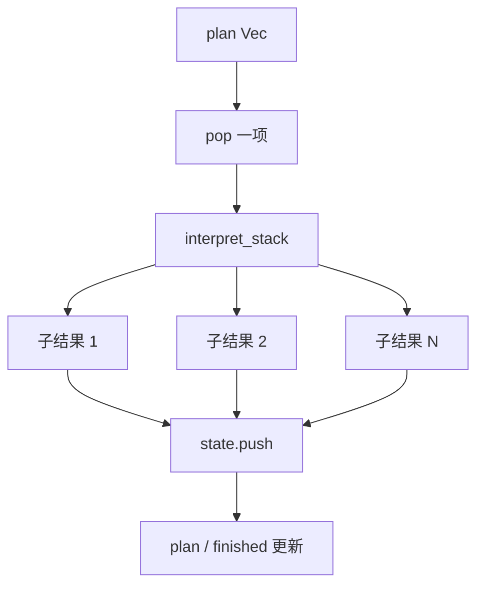
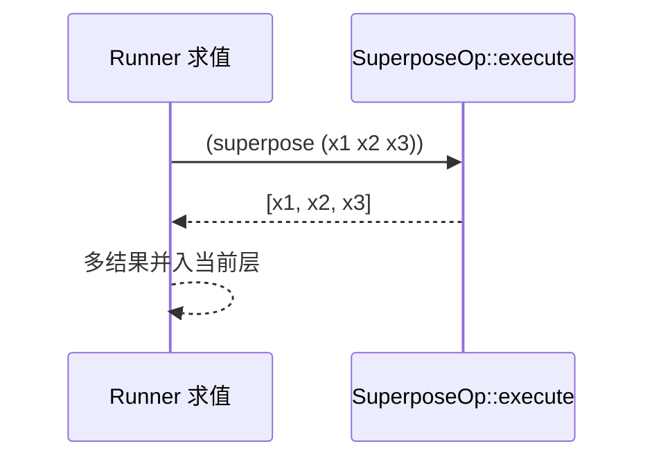
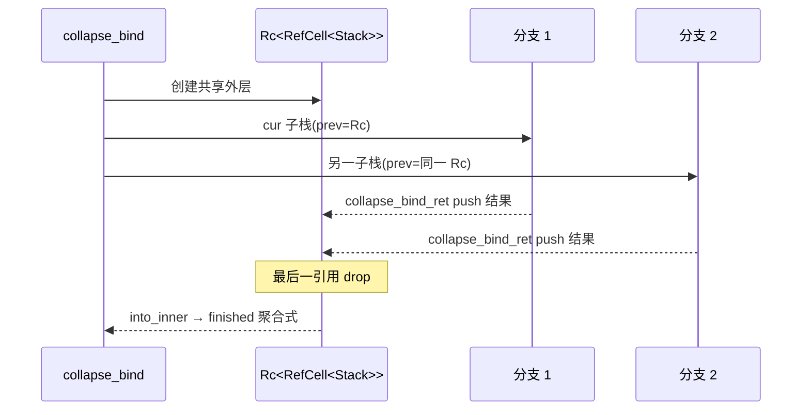

# 非确定性计算：全链路实现

本文档说明 Hyperon MeTTa 中 **多结果 / 多分支** 的来源：`superpose`、`collapse`、**多条 `=` 规则**、**`interpret_step` 的计划向量**、以及 **`collapse-bind` 的共享栈**。链路仍落点于 Rust `lib/src/metta/interpreter.rs` 与标准库 `stdlib.metta` / `core.rs`；Python 通过 `MeTTa.run` 取得 **结果向量**。

---

## 1. 非确定性在解释器中的载体：`InterpreterState.plan`

### Rust：`InterpreterState` 与 `push`

```172:182:d:\dev\hyperon-experimental\lib\src\metta\interpreter.rs
pub struct InterpreterState {
    /// List of the alternatives to evaluate further.
    plan: Vec<InterpretedAtom>,
    /// List of the completely evaluated results to be returned.
    finished: Vec<Atom>,
    /// Evaluation context.
    context: InterpreterContext,
    /// Maximum stack depth
    max_stack_depth: usize,
}
```

```227:234:d:\dev\hyperon-experimental\lib\src\metta\interpreter.rs
    fn push(&mut self, atom: InterpretedAtom) {
        if atom.0.prev.is_none() && atom.0.finished {
            let InterpretedAtom(stack, bindings) = atom;
            let atom = apply_bindings_to_atom_move(stack.atom, &bindings);
            self.finished.push(atom);
        } else {
            self.plan.push(atom);
        }
    }
```

- **`plan`**：待继续求值的 **并行分支**（顺序由 `pop` 决定：LIFO）。
- **`finished`**：已完全求值且栈为底的分支结果。
- **`interpret_stack` 返回 `Vec<InterpretedAtom>`** 时，可能一次 **扩容** 多个分支（例如 `superpose_bind`、`unify` 多解、`query` 多匹配、`eval_impl` 多 grounded 结果）。

### `interpret_step`

```269:276:d:\dev\hyperon-experimental\lib\src\metta\interpreter.rs
pub fn interpret_step(mut state: InterpreterState) -> InterpreterState {
    let interpreted_atom = state.pop().unwrap();
    log::debug!("interpret_step:\n{}", interpreted_atom);
    let InterpretedAtom(stack, bindings) = interpreted_atom;
    for result in interpret_stack(&state.context, stack, bindings, state.max_stack_depth) {
        state.push(result);
    }
    state
}
```

**求值顺序**：每步只从 `plan` **弹出栈顶**一项；若该项展开为 N 个后继，这 N 个被 `push` 回 `plan`（完成项进 `finished`）。因此 **顺序依赖栈与展开顺序**，多分支结果在集合语义上常被视为 **无序**（测试里常用 `assert_eq_no_order`）。

### Mermaid：`interpret_step` 与分支



---

## 2. `superpose`： grounded 算子展开为 **多返回值**

### 标准库文档

```1192:1196:d:\dev\hyperon-experimental\lib\src\metta\runner\stdlib\stdlib.metta
(@doc superpose
  (@desc "Turns a tuple (first argument) into a nondeterministic result")
  (@params (
    (@param "Tuple to be converted")))
  (@return "Argument converted to nondeterministic result"))
```

### Rust：`SuperposeOp::execute`

```215:221:d:\dev\hyperon-experimental\lib\src\metta\runner\stdlib\core.rs
impl CustomExecute for SuperposeOp {
    fn execute(&self, args: &[Atom]) -> Result<Vec<Atom>, ExecError> {
        let arg_error = || ExecError::from("superpose expects single expression as an argument");
        let atom = args.get(0).ok_or_else(arg_error)?;
        let expr  = TryInto::<&ExpressionAtom>::try_into(atom).map_err(|_| arg_error())?;
        Ok(expr.clone().into_children())
    }
}
```

### 算法

1. 参数必须为 **一个表达式原子** `(a1 a2 ... ak)`。
2. 返回 `Vec<Atom>` 长度 k —— 在 Runner 求值语义中，**同一求值步骤产生多个并行结果**（非确定性 **引入点**）。

### 与 `superpose-bind` 的区别

| 机制 | 层次 | 作用 |
|------|------|------|
| `superpose` | 常规 grounded 运算 / 主 Runner | 把 **元组子项** 拆成多结果 |
| `superpose-bind` | **最小 MeTTa** 指令 | 消费 `collapse-bind` 产出的 **(atom, bindings)** 列表，并与当前环境 `merge`（```893:917:d:\dev\hyperon-experimental\lib\src\metta\interpreter.rs```） |

用户文档常说「`superpose` → `superpose-bind`」时，通常指 **标准库中 `collapse` / `case` 等在 minimal 栈上的组合**（见第 4 节），而不是说 `SuperposeOp` 本身调用 `superpose-bind`。

### 测试参考

```377:387:d:\dev\hyperon-experimental\lib\src\metta\runner\stdlib\core.rs
    fn metta_superpose() {
        assert_eq_metta_results!(run_program("!(superpose (red yellow green))"),
            Ok(vec![vec![expr!("red"), expr!("yellow"), expr!("green")]]));
        let program = "
            (= (foo) FOO)
            (= (bar) BAR)
            !(superpose ((foo) (bar) BAZ))
        ";
        assert_eq_metta_results!(run_program(program),
            Ok(vec![vec![expr!("FOO"), expr!("BAR"), expr!("BAZ")]]));
    }
```

### Python

`MeTTa.run("!(superpose (a b))")` 经 `hp.metta_run` 返回的 **内层列表** 含多个 `Atom`，与 Rust `Vec<Vec<Atom>>` 对应（```206:214:d:\dev\hyperon-experimental\python\hyperon\runner.py```）。

### Mermaid：`superpose`



---

## 3. `collapse`：`stdlib.metta` → `collapse-bind` → 元组

### 标准库定义

```1198:1209:d:\dev\hyperon-experimental\lib\src\metta\runner\stdlib\stdlib.metta
(@doc collapse
  (@desc "Converts a nondeterministic result into a tuple")
  (@params (
    (@param "Atom which will be evaluated")))
  (@return "Tuple")))
(: collapse (-> Atom Atom))
(= (collapse $atom)
  (function
    (chain (context-space) $space
      (chain (collapse-bind (metta $atom %Undefined% $space)) $eval
        (chain (eval (foldl-atom $eval () $res $item (_collapse-add-next-atom-from-collapse-bind-result $res $item))) $result
          (return $result) )))))
```

### 算法链（概念）

1. **`context-space`**：取当前求值空间（`context_space` ```954:965:d:\dev\hyperon-experimental\lib\src\metta\interpreter.rs```）。
2. **`metta $atom %Undefined% $space`**：在 **完整 MeTTa 语义** 下求值 `$atom`，得到 **多分支**（类型 `%Undefined%` 放宽）。
3. **`collapse-bind`**：把上一步在 **最小栈** 上的所有分支 **收集** 为一个表达式，元素形如 `(atom Bindings)`（见第 5 节）。
4. **`foldl-atom` + `_collapse-add-next-atom-from-collapse-bind-result`**：把每对 `(atom, bindings)` 里的 atom 在绑定应用后 **顺序 cons** 进列表（Rust 辅助函数 ```256:267:d:\dev\hyperon-experimental\lib\src\metta\runner\stdlib\core.rs```）。

```256:267:d:\dev\hyperon-experimental\lib\src\metta\runner\stdlib\core.rs
fn collapse_add_next_atom_from_collapse_bind_result(args: &[Atom]) -> Result<Vec<Atom>, ExecError> {
    let arg0_error = || ExecError::from("Expression is expected as a first argument");
    let list = TryInto::<&ExpressionAtom>::try_into(args.get(0).ok_or_else(arg0_error)?).map_err(|_| arg0_error())?;
    let arg1_error = || ExecError::from("(Atom Bindings) pair is expected as a second argument");
    let atom_bindings = TryInto::<&ExpressionAtom>::try_into(args.get(1).ok_or_else(arg1_error)?).map_err(|_| arg1_error())?;
    let atom = atom_bindings.children().get(0).ok_or_else(arg1_error)?;
    let bindings = atom_bindings.children().get(1).and_then(|a| a.as_gnd::<Bindings>()).ok_or_else(arg1_error)?;

    let atom = apply_bindings_to_atom_move(atom.clone(), bindings);
    let mut list = list.clone();
    list.children_mut().push(atom);
    Ok(vec![Atom::Expression(list)])
}
```

### 测试：`collapse` 聚合多条规则

```389:405:d:\dev\hyperon-experimental\lib\src\metta\runner\stdlib\core.rs
    fn metta_collapse() {
        let program = "
            (= (color) red)
            (= (color) green)
            (= (color) blue)
            !(collapse (color))
        ";
        let result = run_program(program).expect("Successful result is expected");
        ...
        assert_eq_no_order!(actual, vec![expr!("red"), expr!("green"), expr!("blue")]);
    }
```

---

## 4. `case`：同时演示 `collapse-bind` 与 `superpose-bind`

```1224:1233:d:\dev\hyperon-experimental\lib\src\metta\runner\stdlib\stdlib.metta
(= (case $atom $cases)
  (function
    (chain (context-space) $space
    (chain (collapse-bind (metta $atom %Undefined% $space)) $c
    (chain (eval (== $c ())) $is_empty
    (unify $is_empty True
      (chain (eval (switch-minimal Empty $cases)) $r (return $r))
      (chain (superpose-bind $c) $e
        (chain (eval (switch-minimal $e $cases)) $r (return $r)) )))))))
```

**语义要点**：

- 先用 `collapse-bind` 把 `$atom` 的 **所有 MeTTa 结果** 收进 `$c`。
- 若 `$c` 为空列表：走 `Empty` 分支模式匹配。
- 否则：`superpose-bind` 把 **(atom, bindings)** 展开为 **多个并行分支**，每个分支再跑 `switch-minimal` —— 典型 **非确定性 case**。

---

## 5. `collapse-bind` 与 `Rc<RefCell<Stack>>` 的共享

### 实现摘录

```746:765:d:\dev\hyperon-experimental\lib\src\metta\interpreter.rs
fn collapse_bind(stack: Stack, bindings: Bindings) -> Vec<InterpretedAtom> {
    let Stack{ prev, atom: collapse, vars, .. } = stack;

    let mut nested = Atom::Expression(ExpressionAtom::new(CowArray::Allocated(Vec::new())));
    let collapse = match collapse {
        Atom::Expression(mut expr) => {
            let children = expr.children_mut();
            std::mem::swap(&mut nested, &mut children[1]);
            children.push(Atom::value(bindings.clone()));
            Atom::Expression(expr)
        },
        _ => panic!("Unexpected state"),
    };

    let prev = Stack::from_prev_with_vars(prev, collapse, vars, collapse_bind_ret);
    let prev = Rc::new(RefCell::new(prev));
    let cur = atom_to_stack(nested, Some(prev.clone()));
    let dummy = Stack::finished(Some(prev), EMPTY_SYMBOL);
    vec![InterpretedAtom(dummy, bindings.clone()), InterpretedAtom(cur, bindings)]
}
```

```767:791:d:\dev\hyperon-experimental\lib\src\metta\interpreter.rs
fn collapse_bind_ret(stack: Rc<RefCell<Stack>>, atom: Atom, bindings: Bindings) -> Option<(Stack, Bindings)> {
    let nested = atom;
    if nested != EMPTY_SYMBOL {
        let stack_ref = &mut *stack.borrow_mut();
        let Stack{ atom: collapse, .. } = stack_ref;
        match atom_as_slice_mut(collapse) {
            Some([_op, Atom::Expression(ref mut finished), _bindings]) => {
                finished.children_mut().push(atom_bindings_into_atom(nested, bindings));
            },
            _ => panic!("Unexpected state"),
        };
    }

    // all alternatives are evaluated
    match Rc::into_inner(stack).map(RefCell::into_inner) {
        Some(stack) => {
            let Stack{ prev, atom: collapse, .. } = stack;
            let (result, bindings) = match atom_into_array(collapse) {
                Some([_op, result, bindings]) => (result, atom_into_bindings(bindings)),
                None => panic!("Unexpected state"),
            };
            Some((Stack::finished(prev, result), bindings))
        },
        None => None,
    }
}
```

### 设计意图（与 `Stack` 注释一致）

```56:59:d:\dev\hyperon-experimental\lib\src\metta\interpreter.rs
    // Internal mutability is required to implement collapse-bind. All alternatives
    // reference the same collapse-bind Stack instance. When some alternative
    // finishes it modifies the collapse-bind state adding the result to the
    // collapse-bind list of results.
```

### 与 `plan` 的交互

1. `collapse_bind` **一步**产出两项：`dummy`（立即 finished，`Empty`）与 `cur`（真实子工作）。
2. 多个并行分支的栈帧共享 **同一** `Rc<RefCell<Stack>>`；每完成一分支，`collapse_bind_ret` 向共享 `Expression` **追加** 一条 `(atom bindings)`。
3. 仅当 **最后一个** `Rc` 释放（`into_inner` 成功），才生成最终 **单一** `finished` 结果返回上层；否则返回 `None`，解释器 **不产生** 新栈（当前分支“消失”，由其它分支继续驱动）。

### Mermaid：共享 `Rc` 生命周期



---

## 6. 多定义分支：同一函数多条 `=`

### 机制

- 空间中可共存 `(= (f ...) body1)`、`(= (f ...) body2)` …
- **最小 `eval` 的纯路径** `query` 构造 `(= to_eval $X)`（```612:614:d:\dev\hyperon-experimental\lib\src\metta\interpreter.rs```）；`GroundingSpace::query` 返回 **多条绑定** → `interpret_stack` 产生 **多个** `InterpretedAtom`。
- 与 `superpose` **独立**：前者来自 **知识库多重事实**，后者来自 **显式元组展开**。

### Mermaid：query 多解

```mermaid
flowchart LR
  E[(= (color) red)] --> Q[query]
  E2[(= (color) green)] --> Q
  E3[(= (color) blue)] --> Q
  Q --> B1[Bindings 1]
  Q --> B2[Bindings 2]
  Q --> B3[Bindings 3]
```

---

## 7. 其它非确定性来源（简表）

| 来源 | 代码锚点 | 说明 |
|------|-----------|------|
| Grounded `execute_bindings` 多结果 | `eval_impl` ```514:525:d:\dev\hyperon-experimental\lib\src\metta\interpreter.rs``` | 每对结果可再 `merge` |
| `Bindings::merge` 分裂 | `matcher.rs` ```447:487:d:\dev\hyperon-experimental\hyperon-atom\src\matcher.rs``` | 一帧变多帧 |
| `unify` 多解 | `unify` ```826:835:d:\dev\hyperon-experimental\lib\src\metta\interpreter.rs``` | `match_atoms` 积 |
| `superpose_bind` | `superpose_bind` ```902:917:d:\dev\hyperon-experimental\lib\src\metta\interpreter.rs``` | 列表 × 环境 |
| `metta` + `collapse-bind` | `metta_impl` ```1014:1020:d:\dev\hyperon-experimental\lib\src\metta\interpreter.rs``` | 表达式多解折叠 |

---

## 8. 求值顺序与结果累积（实践提示）

1. **`plan` 是栈**：LIFO；**不保证** 与源码中规则书写顺序一致（测试常用无序比较）。
2. **`finished` 顺序**：取决于分支 **何时** 弹尽栈并 `push` 完成项。
3. **`collapse`**：把 MeTTa 层非确定性 **转为** 确定性数据结构（大元组），便于再 `superpose` 展开或比较（`assertEqual` 等用 `collapse` 包一层，见 ```1095:1099:d:\dev\hyperon-experimental\lib\src\metta\runner\stdlib\stdlib.metta```）。
4. **`empty` / `Empty`**：标准库 `empty` 返回 `Empty`（```617:622:d:\dev\hyperon-experimental\lib\src\metta\runner\stdlib\stdlib.metta```）；在 `collapse-bind` 中 **跳过** 向结果列表追加（`nested != EMPTY_SYMBOL` 检查，```769:777:d:\dev\hyperon-experimental\lib\src\metta\interpreter.rs```），用于 **剪枝** 分支。

---

## 9. Python 视角：结果的形状

- `MeTTa.run`：`List[List[Atom]]` —— 外层为 **顶层命令序列**（如多个 `!`），内层为该命令的 **并行结果集**（```206:214:d:\dev\hyperon-experimental\python\hyperon\runner.py```）。
- `RunnerState.current_results`：同一结构，用于步进 API（```45:53:d:\dev\hyperon-experimental\python\hyperon\runner.py```）。

---

## 10. 小结

- **非确定性的核心容器** 是 `InterpreterState.plan: Vec<InterpretedAtom>`（```175:175:d:\dev\hyperon-experimental\lib\src\metta\interpreter.rs```）。
- **`superpose`** 在 ** grounded 返回多原子** 处引入分支；**`collapse`** 通过 **`collapse-bind` + fold** 再 **合并为单值表达式**。
- **`collapse-bind`** 用 **`Rc<RefCell<Stack>>`** 在并行分支间 **共享聚合状态**，并用 **dummy `Empty` finished** 帧维持引用计数。
- **多条 `=`** 通过 **`query` 的 `BindingsSet`** 与后续 `eval_result` 复制计划。

阅读本文时建议对照《04-minimal-instructions》中 `eval` / `collapse-bind` / `superpose-bind` 各节与本文第 2–5 节，形成 **“引入 → 聚合 → 再展开”** 的完整闭环。

---

## 11. 嵌套 `metta` 与栈深度计数（对非确定性的影响）

`interpret_stack` 在 `max_stack_depth > 0` 且当前帧为 `(metta ...)` 且深度超限时，**直接**返回栈溢出错误帧（不继续展开子分支）：

```392:413:d:\dev\hyperon-experimental\lib\src\metta\interpreter.rs
    } else if max_stack_depth > 0 && stack.depth >= max_stack_depth 
        && atom_as_slice(&stack.atom).map_or(false, |expr| expr[0] == METTA_SYMBOL)
    {
        // Return error if stack depth limit is reached.
        // Current implementation has the following pecularities:
        //
        // 1. The stack depth is calculated in terms of the minimal MeTTa
        // instructions not MeTTa instructions thus the actual stack depth can
        // be bigger than expected as minimal MeTTa instructions are more
        // detailed.
        //
        // 2. Execution is interrupted and returns error only on the next MeTTa
        // function call. This is required to correctly return error from the
        // minimal MeTTa stack when MeTTa program is executed.
        //
        // 3. Case/capture/superpose/collapse/assert operations call interpreter
        // from the interpreter stack and it leads to the creation of the new
        // stack. Thus if case (or other similar operation) is used the limit
        // counter is started from the beginning for the nested expression.
        let Stack{ prev, atom, .. } = stack;
        let stack = Stack::finished(prev, error_atom(atom, STACK_OVERFLOW_SYMBOL));
        vec![InterpretedAtom(stack, bindings)]
    } else {
```

**与非确定性的关系**：

- `collapse` / `case` 内部调用 **嵌套** `metta`（见 `stdlib.metta` 中 `chain (collapse-bind (metta ...))`）；注释第 3 点说明：这会 **新开栈**，深度计数 **重置** —— 外层已很深的 `plan` 不一定会阻止内层继续分支，行为需结合 `pragma! max-stack-depth` 测试理解（`core.rs` ```451:483:d:\dev\hyperon-experimental\lib\src\metta\runner\stdlib\core.rs```）。

---

## 12. `check_alternatives`：从多解里偏好 **成功** 分支

在完整 `metta` 管道中，`collapse-bind` 收集 `interpret_expression` 的多个 `(atom, bindings)` 后，由 `check_alternatives` **优先**返回非错误原子（若无则退回错误分支）：

```1079:1107:d:\dev\hyperon-experimental\lib\src\metta\interpreter.rs
fn check_alternatives(args: Atom, bindings: Bindings) -> MettaResult {
    let (original, expr) = match_atom!{
        args ~ [original, Atom::Expression(expr)] => (original, expr),
        _ => {
            let error = format!("expected args: ((: expr Expression)), found: {}", args);
            return once((return_atom(error_msg(call_native!(check_alternatives, args), error)), bindings));
        }
    };
    let results = expr.into_children().into_iter()
        .map(atom_into_atom_bindings);
    let mut succ = results.clone()
        .filter(|(atom, _bindings)| !atom_is_error(&atom))
        .map(move |(mut atom, bindings)| {
            if original == atom {
                match &mut atom {
                    Atom::Expression(e) => e.set_evaluated(),
                    _ => {},
                };
            }
            (return_atom(atom), bindings)
        })
        .peekable();
    let err = results
        .filter(|(atom, _bindings)| atom_is_error(&atom))
        .map(|(atom, bindings)| (return_atom(atom), bindings));
    match succ.peek() {
        Some(_) => Box::new(succ),
        None => Box::new(err),
    }
}
```

这提供了一层 **确定性偏好**：当类型检查与求值产生 **混合** 的成功 / 错误候选时，**只要存在成功项，错误项会被忽略**；仅当 **全部** 为错误时才传播错误。这与 `plan` 上 **并列保留所有 grounded 结果** 的策略互补——此处发生在 **`metta` 内部的 native 折叠阶段**，而不是最小 `eval` 的 `query` 阶段。

---

## 13. 术语对照（中文）

| 英文 | 含义 |
|------|------|
| alternative / branch | `plan` 中待求值的一条 `InterpretedAtom` 路径 |
| collapse | 把多并行结果 **收集** 为单一数据结构（大表达式） |
| superpose | 把元组 **拆回** 多并行结果（grounded）或 `superpose-bind` 在 minimal 层 **再展开** |
| bindings frame | `Bindings` 的一组变量约束；`BindingsSet` 含多帧 |
| nondeterminism | 同一求值点产生 **多个** 后继状态，由 `Vec` / `BindingsSet` / 迭代器承载 |
