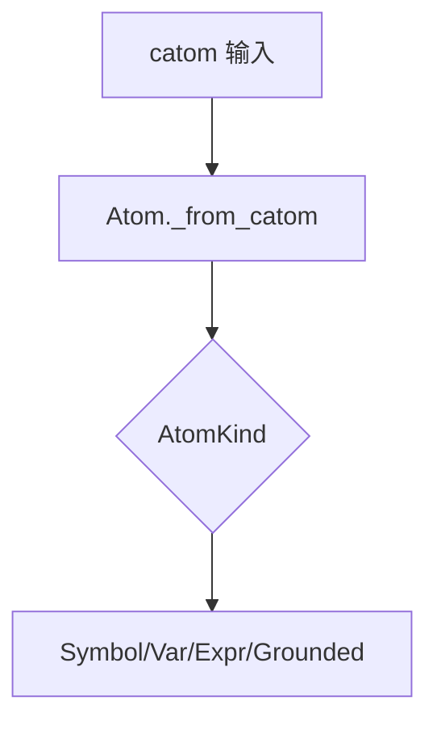
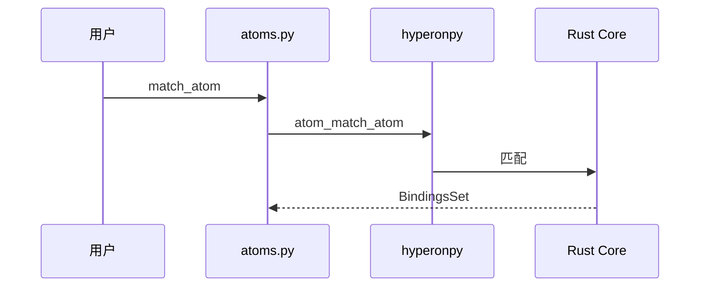
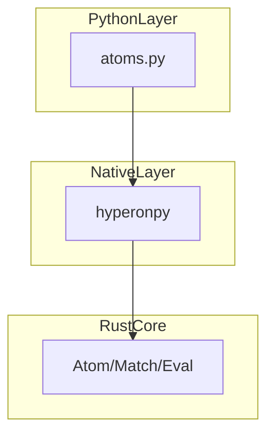

# `python/hyperon/atoms.py` Python 源码分析报告

## 1. 文件定位与职责

- **Atom 核心包装**：`Atom` 与子类 `SymbolAtom`/`VariableAtom`/`ExpressionAtom`/`GroundedAtom`，工厂 `S`/`V`/`E`/`G`（`L10-L114`、`L137-L201`）。
- **类型常量**：`AtomType`、`Atoms` 包装 `hp.CAtomType`/`hp.CAtoms`（`L115-L135`）。
- **绑定**：`Bindings`、`BindingsSet` 封装 `CBindings`/`CBindingsSet`（`L610-L791`）。
- **Grounding**：`GroundedObject`、`ValueObject`、`OperationObject`、`MatchableObject`；`OperationAtom`/`ValueAtom`/`PrimitiveAtom`/`MatchableAtom`（`L276-L607`）。
- **FFI 胶水（Rust→Python）**：`_priv_call_execute_on_grounded_atom`、`_priv_call_match_on_grounded_atom`、`_priv_call_serialize_on_grounded_atom`、`_priv_compare_value_atom`（`L233-L270`）。
- **异常**：`NoReduceError`、`IncorrectArgumentError`、`MettaError`（`L347-L363`）。
- 链：**用户/扩展 ↔ atoms.py ↔ hyperonpy ↔ Rust**。

**角色**：原子类型包装 / Grounding / 与 `conversion.ConvertingSerializer` 协同的类型桥接

## 2. 公共 API 清单（节选）

| 符号 | 类型 | hp.*（代表） | MeTTa 语义 |
|------|------|--------------|------------|
| `Atom` 及子类 | class | `atom_free`, `atom_eq`, … | 原子 |
| `S,V,E,G` | function | `atom_sym`, `atom_var`, `atom_expr`, `atom_py`/`atom_space` | 构造 |
| `AtomType`, `Atoms` | class | `CAtomType`, `CAtoms` | 类型/常量原子 |
| `atoms_are_equivalent` | function | `atoms_are_equivalent` | 等价 |
| `Bindings`, `BindingsSet` | class | `bindings_*`, `bindings_set_*` | 合一/非确定性匹配 |
| `OperationAtom`, `ValueAtom`, … | factory | `atom_py` | 注册操作与值 |
| `unwrap_args`, `get_string_value` | function | — | 参数展开 |
| `_priv_*` | 内部/回调 | 多种 | 见第 5 节 |

## 3. 核心类与数据结构

| 类 | 父类 | C 引用 | `__del__` | 要点 |
|----|------|--------|-----------|------|
| `Atom` | — | `catom` | `atom_free` | `_from_catom` 按 `AtomKind` 分发（`L47-L59`） |
| `Bindings` | — | `cbindings` | `bindings_free`；`__exit__` 释放（`L620-L646`） |
| `BindingsSet` | — | `c_set`；`shadow_list` 缓存 | `bindings_set_free` | `__getitem__` 惰性 `unpack`（`L726-L731`） |
| `OperationObject` | `GroundedObject` | 无 | 无 | `execute` 含 unwrap/`MettaError`→`Error`（`L447-L484`） |

## 4. hyperonpy 调用映射（分组）

| 分组 | hp.* |
|------|------|
| 生命周期/比较/展示 | `atom_free`, `atom_eq`, `atom_to_str`, `atom_get_metatype` |
| 结构 | `atom_iterate`, `atom_match_atom`, `atom_get_children`, `atom_expr`, `atom_sym`, `atom_var`, `atom_var_parse_name` |
| Grounded | `atom_is_cgrounded`, `atom_get_object`, `atom_get_grounded_type`, `atom_get_space`, `atom_gnd_serialize`, `atom_py`, `atom_space`, `atoms_are_equivalent` |
| Bindings | `bindings_new/free/eq/to_str/clone/merge/add_var_binding/is_empty/narrow_vars/resolve/list`；`atom_vec_new/push/free` |
| BindingsSet | `bindings_set_single/from_bindings/empty/free/eq/to_str/unpack/clone/is_empty/is_single/push/add_var_binding/add_var_equality/merge_into/list` |

**实现注意**（`L664-L670`）：`narrow_vars` 中 `hp.CVecAtom = hp.atom_vec_new()` 会向 **`hp` 模块赋值属性**，副作用异常；**无法从当前文件确定**是否为笔误。

## 5. 回调函数分析

| 回调 | 触发（推断） | 参数 | 返回/契约 | 错误 |
|------|--------------|------|-----------|------|
| `_priv_call_execute_on_grounded_atom` | grounded 执行 | `gnd`, `typ`, `args` | `gnd.execute` 结果 | `MettaError`→`Error` 表达式（在 `execute` 内） |
| `_priv_call_match_on_grounded_atom` | 匹配 | `gnd`, `catom` | `match_` 结果 | 用户实现 |
| `_priv_call_serialize_on_grounded_atom` | 序列化 | `gnd`, `serializer` | `serialize` | 文档警告未捕获异常或致 panic（`L156-L159`） |
| `_priv_compare_value_atom` | 值相等 | `gnd`, `catom` | `bool` | `TypeError`→`False` |

**注册点**：**无法从当前文件确定** hyperonpy 中绑定方式。

## 6. 算法与关键策略

### 6.1 算法清单

| 名 | 目标 | 步骤 | 复杂度 |
|----|------|------|--------|
| `_from_catom` | 类型分发 | `atom_get_metatype` 分支 | O(1) |
| `_priv_atom_gnd` | Py→Grounded | `cspace`/`ValueObject`原语/通用`atom_py`+`copy` | O(1) |
| `unwrap_args` | kwargs | 识别 `Kwargs` 子式（`L369-L382`） | O(n) |
| `OperationObject.execute` | 调用户函数 | unwrap 分支；`None`→`UNIT`；callable→`OperationAtom` | O(n) |
| `_type_sugar` | 类型语法糖 | 递归 `E(S("->"),…)`（`L540-L571`） | O(k) |
| `BindingsSet.__getitem__` | 索引帧 | 首次 `unpack` 填 `shadow_list` | 摊销 O(帧数) |

### 6.2 详解：`unwrap_args`（`L365-L392`）

- **动机**：MeTTa `Kwargs` 表达式映射 Python `**kwargs`。
- **失败**：格式 `RuntimeError`；非 grounded `NoReduceError`。

### 6.3 详解：`OperationObject.execute`（`L447-L484`）

- **动机**：统一 Python 函数与 MeTTa 结果列表。
- **hp 交互**：返回的 `Atom` 再入 Rust 解释器。

## 7. 执行流程

### 7.1 主流程

构造 `S("x")` → `atom_sym` → 子类包装；销毁 → `atom_free`。

### 7.2 异常与边界

- `get_object`：`TypeError`/`RuntimeError`（`L189-L194`）。
- `BindingsSet.empty` 定义为 `def empty():` 无 `@staticmethod`（`L733-L737`）：`BindingsSet.empty()` 调用语义**可能有缺陷**。

## 8. 装饰器与模块发现机制

本文件无 `@register_*`。

## 9. 状态变更与副作用矩阵（节选）

| 操作 | 副作用 |
|------|--------|
| `BindingsSet.push` 等 | 清空 `shadow_list` |
| `narrow_vars` | 可能改写 `hp.CVecAtom` 模块属性 |

## 10. 流程图（Mermaid）

## 11. 时序图（Mermaid）

## 12. 架构图（Mermaid）

## 13. 复杂度与性能要点

- `__repr__`/`iterate`/`get_children`/匹配/绑定可能高频 FFI。
- GIL：**无法从当前文件确定** hp 是否在长时间 Rust 调用中释放 GIL。

## 14. 异常处理全景

- 自定义：`NoReduceError`、`IncorrectArgumentError`、`MettaError`。
- `execute` 捕获 `MettaError` 转 `Error` 表达式（`L471-L472`）。

## 15. 安全性与一致性检查点

- `__del__` 与共享句柄：**无法从当前文件确定** Rust 引用计数。
- `_priv_atom_gnd` 要求通用对象有 `copy`（`L228-L230`）。

## 16. 对外接口与契约

- `unwrap=True` 的 `execute`：返回 **原子列表**；`None`→`Unit`（`L473-L474`）。

## 17. 关键代码证据

- `Atom`/`__del__`（`L10-L19`）；`_from_catom`（`L47-L59`）；`_priv_call_*`（`L233-L270`）；`OperationObject.execute`（`L447-L484`）；`BindingsSet`（`L683-L791`）。

## 18. 与 MeTTa 语义的关联

- 符号/变量/表达式/grounded 直接对应表面语法与运行时。
- `MettaError`→`(Error …)` 可约简错误（`L471-L472`）。

## 19. 未确定项与最小假设

- `_priv_call_*` 在 hyperonpy 的注册细节；`BindingsSet.empty` 设计意图；`narrow_vars` 中 `hp.CVecAtom` 赋值是否为 bug。

## 20. 摘要

- **职责**：Atom/绑定/grounded 执行与匹配的 Python 核心。
- **hyperonpy**：`atom_*`、`bindings_*`、`bindings_set_*`、`atom_py`/`atom_space` 等密集。
- **MeTTa**：原子模型、匹配、Python 操作、错误与 Unit。
- **依赖**：`hyperonpy`、`hyperon.conversion`、`base.SpaceRef`（延迟导入）。
