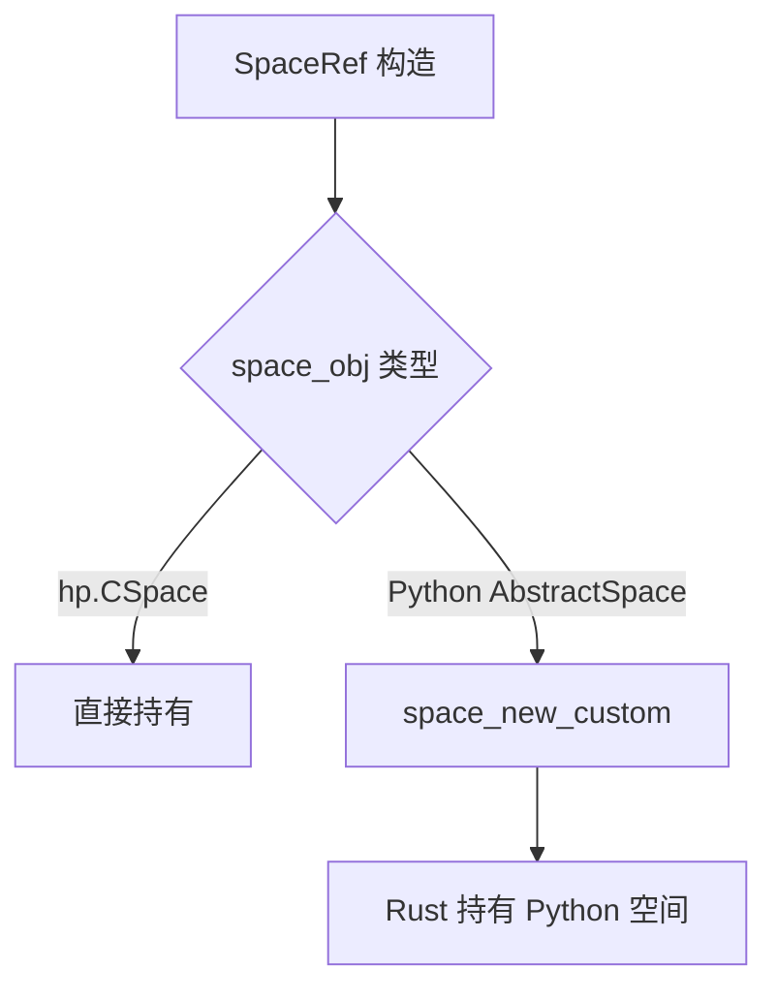
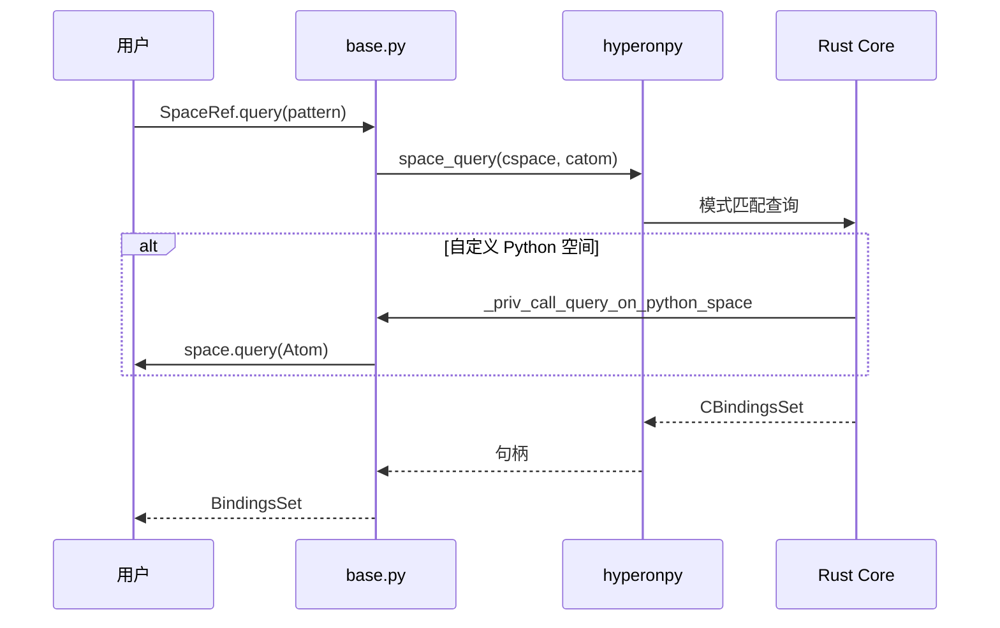
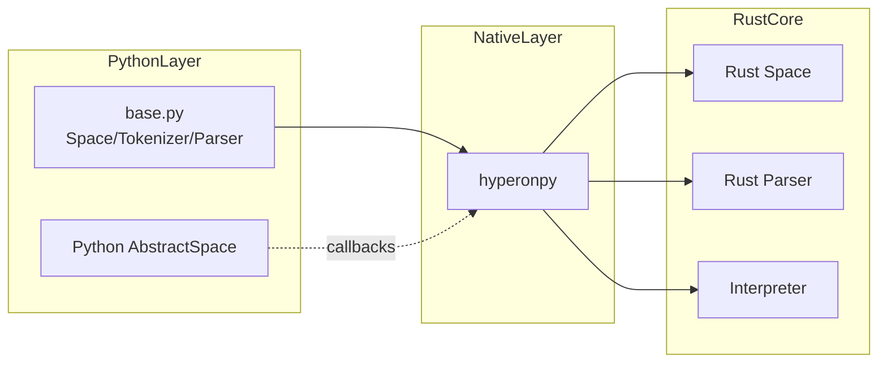

# `python/hyperon/base.py` Python 源码分析报告

## 1. 文件定位与职责

- **`AbstractSpace`**：定义 Python 侧「空间」协议：`query` / `add` / `remove` / `replace` 必须实现；`atom_count` / `atoms_iter` 可选（`L6-L54`）。
- **`GroundingSpace`**：组合 **`GroundingSpaceRef`**，将操作委托给原生 GroundingSpace（`L56-L105`）。
- **`SpaceRef` / `GroundingSpaceRef`**：统一 **原生 `CSpace`** 与 **自定义 Python 空间**（`hp.space_new_custom`），提供 `add_atom`、`query`、`subst` 等（`L168-L283`）。
- **`Tokenizer`**、**`SExprParser`**、**`SyntaxNode`**：封装 Rust 词法/语法解析管线（`L285-L395`）。
- **`Interpreter` + `interpret`**：逐步求值 API；`check_type`、`validate_atom`、`get_atom_types`、`atom_is_error` 暴露类型与错误判断（`L397-L492`）。
- **Python 空间 FFI 回调**：`_priv_call_query_on_python_space` 等六个函数，供 Rust 调用自定义空间（`L107-L166`）。
- 调用链位置：**Python Space/Parser ↔ `hp.*` ↔ Rust Space & Parser & Interpreter**。

**角色标签**：空间抽象 / 解析器包装 / 解释器薄封装（低级 API）

## 2. 公共 API 清单

| 符号名 | 类型 | 参数签名 | 返回值 | hp.* | MeTTa 语义 |
|--------|------|----------|--------|------|------------|
| `AbstractSpace` | class | — | — | 无 | 空间协议 |
| `GroundingSpace` | class | `()` | 实例 | 间接经 `GroundingSpaceRef` | 默认可扩展空间 |
| `_priv_call_*_on_python_space` | function | 见第 5 节 | 多种 | 无（被 Rust 调） | 自定义空间 |
| `SpaceRef` | class | `(space_obj)` | 实例 | `space_*`, `space_new_custom` | 空间引用 |
| `GroundingSpaceRef` | class | `(cspace=None)` | 实例 | `space_new_grounding` | 核心 GroundingSpace |
| `Tokenizer` | class | `(ctokenizer=None)` | 实例 | `tokenizer_*` | 分词 |
| `SyntaxNode` | class | `(cnode)` | 实例 | `syntax_node_*` | 语法树节点 |
| `SExprParser` | class | `(text)` | 实例 | `CSExprParser.*` | S 表达式解析 |
| `Interpreter` | class | `(gnd_space, expr)` | 实例 | `interpret_init`, `interpret_step` | 单表达式解释 |
| `interpret` | function | `(gnd_space, expr)` | `list[Atom]` | 同上循环 | 求值至完成 |
| `check_type` | function | `(gnd_space, atom, type)` | `bool` | `check_type` | 类型检查 |
| `validate_atom` | function | `(gnd_space, atom)` | `bool` | `validate_atom` | 良构类型 |
| `get_atom_types` | function | `(gnd_space, atom)` | `list[Atom]` | `get_atom_types` | 类型枚举 |
| `atom_is_error` | function | `(atom)` | `bool` | `atom_is_error` | 错误原子 |

## 3. 核心类与数据结构

| 类名 | 父类 | 关键属性 | C 引用 | `__del__` | 设计意图 |
|------|------|----------|--------|-----------|----------|
| `AbstractSpace` | — | 无 | 无 | 无 | 文档/协议 |
| `GroundingSpace` | `AbstractSpace` | `gspace: GroundingSpaceRef` | 间接 | 无 | Python 可子类化 |
| `SpaceRef` | — | `cspace` | `hp.CSpace` | `space_free` | 原生/自定义统一 |
| `GroundingSpaceRef` | `SpaceRef` | `cspace` | `CSpace` | 继承释放 | 新建或包装 grounding |
| `Tokenizer` | — | `ctokenizer` | ✅ | `tokenizer_free` | 注册 token |
| `SyntaxNode` | — | `cnode` | ✅ | `syntax_node_free` | AST 片段 |
| `SExprParser` | — | `cparser` | `CSExprParser` | **无显式 free**（**无法从当前文件确定** 所有权） | 解析文本 |
| `Interpreter` | — | `step_result` | 步进句柄 | **无 `__del__`** | 手动 `next` |

**Python 层额外逻辑**：`SExprParser.parse` 在 `catom is None` 时用 `sexpr_parser_err_str` 抛 `SyntaxError`（`L376-L386`）；`interpret` 循环直至结束（`L439-L446`）。

## 4. hyperonpy 调用映射

### 4.1 Space

| Python | hp.* | 语义 |
|--------|------|------|
| `SpaceRef.__init__` | `space_new_custom`（Py 对象）或持有 `CSpace` | 自定义 vs 原生 |
| `__del__` | `space_free` | 释放 |
| `__eq__` | `space_eq` | 相等 |
| `add_atom` | `space_add` | 添加 |
| `remove_atom` | `space_remove` | 删除 |
| `replace_atom` | `space_replace` | 替换 |
| `atom_count` | `space_atom_count` | 计数 |
| `get_atoms` | `space_list` → `Atom._from_catom` | 列举 |
| `get_payload` | `space_get_payload` | 取 Python 载荷 |
| `query` | `space_query` → `BindingsSet` | 模式查询 |
| `subst` | `space_subst` | 替换实例化 |
| `GroundingSpaceRef.__init__` | `space_new_grounding` | 新 grounding 空间 |

### 4.2 Tokenizer / Parser / SyntaxNode

| Python | hp.* |
|--------|------|
| `Tokenizer` | `tokenizer_new`, `tokenizer_free`, `tokenizer_register_token` |
| `SyntaxNode` | `syntax_node_free`, `syntax_node_type`, `syntax_node_src_range`, `syntax_node_unroll` |
| `SExprParser` | `CSExprParser`, `parse`, `parse_to_syntax_tree`, `sexpr_parser_err_str` |

### 4.3 Interpreter / 类型

| Python | hp.* |
|--------|------|
| `Interpreter` | `interpret_init`, `step_has_next`, `interpret_step`, `step_get_result`, `step_get_step_result` |
| `check_type` / `validate_atom` / `get_atom_types` / `atom_is_error` | 同名 `hp.*` |

## 5. 回调函数分析

| 回调函数名 | 被谁调用 | 触发时机 | 参数 | 返回值契约 | 错误处理 |
|------------|----------|----------|------|------------|----------|
| `_priv_call_query_on_python_space` | Rust/hp（自定义空间） | `query` | `space`, `query_catom` | `BindingsSet`（Python `space.query` 返回） | 用户 `query` 抛异常→**可能跨 FFI** |
| `_priv_call_add_on_python_space` | 同上 | `add` | `space`, `catom` | `None` | 同上 |
| `_priv_call_remove_on_python_space` | 同上 | `remove` | `space`, `catom` | 由 `space.remove` 定义 | 同上 |
| `_priv_call_replace_on_python_space` | 同上 | `replace` | `space`, `cfrom`, `cto` | 由 `space.replace` 定义 | 同上 |
| `_priv_call_atom_count_on_python_space` | 同上 | 计数 | `space` | `int`，未实现返回 `-1` | 安全回退 |
| `_priv_call_new_iter_state_on_python_space` | 同上 | 迭代 | `space` | 迭代器或 `None` | `hasattr` 检查 |

## 6. 算法与关键策略

### 6.1 算法清单

| 策略 | 目标 | 步骤 | 复杂度 |
|------|------|------|--------|
| `interpret` 循环 | 求值至不动点/完成 | `while has_next: next()` | 步数取决于程序 |
| `SpaceRef.get_atoms` | Python 列表 | `space_list` + 逐个包装 | O(n) |
| `SyntaxNode.unroll` | 收集叶节点 | `syntax_node_unroll` + 包装 | O(树大小) |

### 6.2 详解：`SExprParser.parse`（`L376-L388`）

- **动机**：把解析失败从 `None` 转为可诊断异常。
- **hyperonpy**：`cparser.parse(tokenizer.ctokenizer)`；错误串 `sexpr_parser_err_str`。
- **失败**：无错误串时返回 `None`（`L381-L384`）。

## 7. 执行流程

### 7.1 主流程

1. 用户创建 `GroundingSpaceRef()` → `space_new_grounding`。
2. `SExprParser(text).parse(Tokenizer())` → `Atom`。
3. `interpret(space, expr)` → 重复 `interpret_step` 直至结束 → 原子列表。

### 7.2 异常与边界

- `Interpreter.next`：无下一步时 `StopIteration`（`L420-L421`）。
- `get_result`：若未完成 `RuntimeError`（`L428-L429`）。

## 8. 装饰器与模块发现机制

不涉及。

## 9. 状态变更与副作用矩阵（节选）

| 操作 | 状态 | hp | 可观测 |
|------|------|-----|--------|
| `SpaceRef.add_atom` | 空间内容变 | `space_add` | — |
| `Tokenizer.register_token` | 规则表变 | `tokenizer_register_token` | — |
| `Interpreter.next` | 步进状态变 | `interpret_step` | — |

## 10. 流程图（Mermaid）

## 11. 时序图（Mermaid）

## 12. 架构图（Mermaid）

## 13. 复杂度与性能要点

- `get_atoms` 可能 O(n) FFI 分配；大空间慎用。
- `interpret` 每步穿越 FFI；多数应用更宜用 `MeTTa.run`（`runner.py`）。

## 14. 异常处理全景

- `SyntaxError`（解析）、`StopIteration`、`RuntimeError`（解释器状态）。
- 自定义空间方法异常：**跨 FFI 风险**（与 `atoms` 类似）。

## 15. 安全性与一致性检查点

- `SpaceRef.__del__` 调 `space_free`；与多引用共享句柄行为 **无法从当前文件确定**。
- `SpaceRef.copy` 返回 `self`（`L199-L203`）：非深拷贝语义。

## 16. 对外接口与契约

- `AbstractSpace` 子类须实现 `query/add/remove/replace`，否则 `RuntimeError`（`L19-L42`）。
- `interpret` 返回 **Python `Atom` 列表**。

## 17. 关键代码证据

- `AbstractSpace` / `GroundingSpace`（`L6-L105`）。
- `_priv_call_*`（`L107-L166`）。
- `SpaceRef`（`L168-L263`）。
- `SExprParser.parse`（`L376-L388`）。
- `Interpreter`（`L397-L436`）。

## 18. 与 MeTTa 语义的关联

- **Space**：对应知识库/规则存放与模式查询。
- **Tokenizer/SExprParser**：对应 MeTTa 表面语法。
- **Interpreter**：对应核心求值语义（低级逐步接口）。

## 19. 未确定项与最小假设

- `CSExprParser` 与 `Interpreter` 步进结果的 C 层释放策略。
- `SyntaxNodeType` 导入自 `hyperonpy` 但未在本文件使用（`L4`）——可能供类型注解或历史遗留。

## 20. 摘要

- **职责**：空间、分词、S 表达式解析、逐步解释器与类型 API。
- **核心类**：`SpaceRef`、`GroundingSpaceRef`、`Tokenizer`、`SExprParser`、`Interpreter`。
- **hyperonpy**：`space_*`、`tokenizer_*`、`syntax_node_*`、`interpret_*`、`check_type` 等。
- **MeTTa**：空间查询、解析、求值与类型检查。
- **性能**：解释器逐步 FFI；列举空间 O(n)。
- **依赖**：`atoms.Atom`、`BindingsSet`、`hyperonpy.SyntaxNodeType`（导入）。
