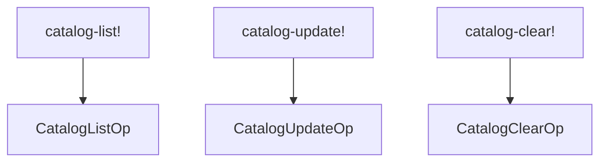
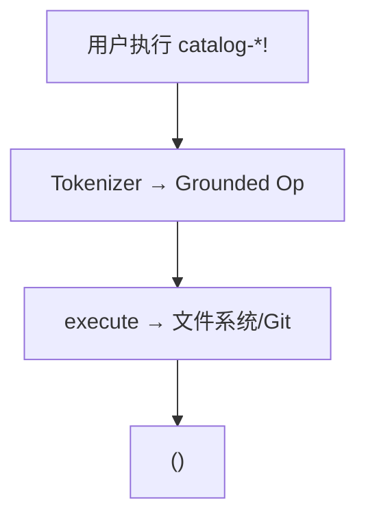
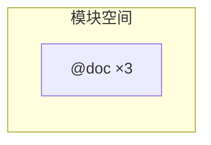

# `lib/src/metta/runner/builtin_mods/catalog.metta` MeTTa 源码分析报告

## 1. 文件定位与职责

- 描述 **包管理目录（catalog）** 的三种命令：`catalog-list!`、`catalog-update!`、`catalog-clear!`。
- 参数：目录名称或字符串 `"all"` 表示全部已管理目录。
- 返回：`@doc` 标为 **Unit 原子**（副作用为主：列出/更新/清空）。
- **文件类别**：内置模块接口 / 文档系统（依赖 `pkg_mgmt` 特性时完整生效）。

## 2. 原子清单与分类

| 行号 | 表达式（截断至80字符） | 分类 | 涉及的关键符号 | 语义说明 |
|------|------------------------|------|----------------|----------|
| L1-L5 | `(@doc catalog-list! ...)` | 文档 | `catalog-list!` | 列出支持 list 的目录内容 |
| L7-L11 | `(@doc catalog-update! ...)` | 文档 | `catalog-update!` | 更新已管理目录到最新模块版本 |
| L13-L17 | `(@doc catalog-clear! ...)` | 文档 | `catalog-clear!` | 清空已管理目录内容 |

## 3. 知识图谱（空间内容分析）

- 仅 `@doc` 原子。  
- 与 **catalog 运行时状态**（磁盘缓存、git 克隆）的关系在 Rust；本文件不声明规则。

## 4. 函数定义详解

无 `(= …)`。

### 4.1 核心函数详解

语义见 `@doc`；实现为 `CatalogListOp` 等（`catalog.rs`）。

## 5. 求值流程分析

### 5.1 执行表达式流程

无文件内 `!(…)`。用户典型：`!(catalog-list! all)`（**非本文件**）。

### 5.2 关键求值链详解

```
!(catalog-update! all)
→ Rust CatalogUpdateOp::execute
→ 更新各 managed catalog（git fetch/reset 等，实现细节在 Rust）
→ 返回 Unit
```

## 6. 类型系统分析

无 `(: …)`。

## 7. 推理模式分析

不涉及。

## 8. 状态与副作用分析

| 操作 | 行号 | 副作用类型 | 影响范围 | 时序依赖 |
|------|------|------------|----------|----------|
| `catalog-list!` | L1-L5 | 输出/IO | 控制台与 catalog 缓存 | — |
| `catalog-update!` | L7-L11 | 网络/Git/磁盘 | 本地 catalog 目录 | 可能耗时 |
| `catalog-clear!` | L13-L17 | 删除缓存内容 | 本地 catalog | 先于 update 或独立使用 |

## 9. 断言与预期行为

无。

## 10. 知识图谱图（Mermaid）



## 11. 求值链图（Mermaid）



## 12. 空间快照图（Mermaid）



## 13. MeTTa 语言特性覆盖

| 语言特性 | 使用位置 | 使用方式 | 底层实现 |
|----------|----------|----------|----------|
| `@doc` | L1-L17 | 三操作说明 | `get-doc` |
| `!` 后缀 | 操作名 | 副作用约定 | `catalog.rs` 注册 |

## 14. 底层实现映射

| MeTTa 操作 | Rust 实现位置 | 关键逻辑摘要 |
|------------|---------------|----------------|
| `catalog-list!` | `lib/src/metta/runner/builtin_mods/catalog.rs` | `CatalogListOp`；`register_token` |
| `catalog-update!` | 同上 | `CatalogUpdateOp` |
| `catalog-clear!` | 同上 | `CatalogClearOp` |

## 15. 复杂度与性能要点

`catalog-update!` 可能触发大量网络与磁盘操作；与 MeTTa 模式匹配无关。

## 16. 关键代码证据

- `L1-L17`：三段 `@doc`。

## 17. 教学价值分析

理解 **Hyperon 模块生态**：catalog 作为远程模块索引；MeTTa 层仅暴露命令式 API。

## 18. 未确定项与最小假设

- 无 `pkg_mgmt` 时这些操作是否注册或存根：**无法从当前文件确定**。

## 19. 摘要

- **功能**：catalog 三命令的文档。  
- **实现**：`catalog.rs`。  
- **副作用**：列表/更新/清空远程模块缓存。
