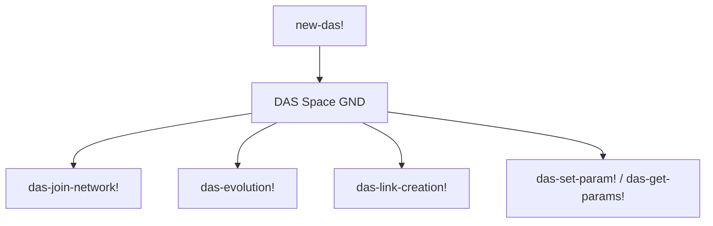
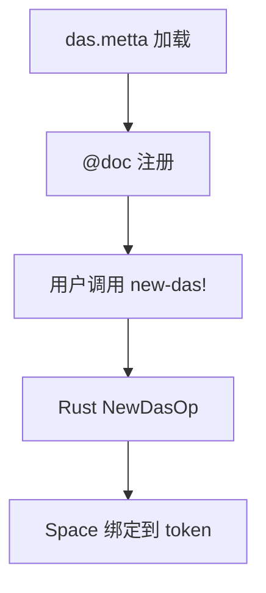
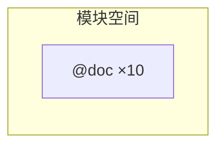

# `lib/src/metta/runner/builtin_mods/das.metta` MeTTa 源码分析报告

## 1. 文件定位与职责

- 文档化 **Distributed AtomSpace (DAS)** 相关 Grounded 操作：创建实例、加入网络、服务发现与状态、参数读写、上下文创建、进化（evolution）、链接创建、辅助函数（如 sleep）。
- 面向 **分布式空间与查询-进化-关联** 工作流；具体协议与后端在 Rust/外部服务。
- **文件类别**：内置模块接口 / 文档系统。

## 2. 原子清单与分类

| 行号 | 表达式（截断至80字符） | 分类 | 涉及的关键符号 | 语义说明 |
|------|------------------------|------|----------------|----------|
| L1-L6 | `(@doc new-das! ...)` | 文档 | `new-das!` | 服务端点 + 已知 peer → Space |
| L8-L11 | `(@doc das-join-network! ...)` | 文档 | `das-join-network!` | （重新）加入网络 |
| L13-L16 | `(@doc das-services! ...)` | 文档 | `das-services!` | 打印可用服务 |
| L18-L22 | `(@doc das-service-status! ...)` | 文档 | `das-service-status!` | 按名查服务状态字符串 |
| L24-L28 | `(@doc das-set-param! ...)` | 文档 | `das-set-param!` | 设置 DAS 配置参数 |
| L30-L33 | `(@doc das-get-params! ...)` | 文档 | `das-get-params!` | 打印当前参数 |
| L35-L40 | `(@doc das-create-context! ...)` | 文档 | `das-create-context!` | 创建查询上下文 |
| L42-L47 | `(@doc das-evolution! ...)` | 文档 | `das-evolution!` | 进化配置 + 模板 → 非确定性填充 |
| L49-L54 | `(@doc das-link-creation! ...)` | 文档 | `das-link-creation!` | 查询 + 模板创建链接 |
| L56-L61 | `(@doc das-helpers! ...)` | 文档 | `das-helpers!` | 辅助如 sleep |

## 3. 知识图谱（空间内容分析）

- 仅文档块；无 MeTTa 规则。  
- 运行时依赖：`new-das!` 返回的 **Space 实例** 常经 `bind!` 持有（示例见 `das.rs` 注释，**非本文件**）。

## 4. 函数定义详解

无 `(= …)`。

### 4.1 核心函数详解（选取）

- **`new-das!`**：两参数——带 **端口范围** 的服务端点、已知 peer 端点；返回代表 DAS 的 Space。  
- **`das-evolution!`**：配置为嵌套 ExpressionAtom（query、fitness、关联查询/替换/映射）；第二参为模板；**非确定性**结果。  
- **`das-link-creation!`**：查询模式 + 一个或多个模板。

## 5. 求值流程分析

### 5.1 执行表达式流程

无文件内 `!(…)`。

### 5.2 关键求值链详解（概念）

```
!(bind! &das (new-das! host:port-range peer))
→ Grounded 构造 DAS 客户端/空间
!(das-join-network!)
→ 网络层副作用
!(das-evolution! config template)
→ 多结果分支（与 MeTTa 非确定性模型衔接）
```

## 6. 类型系统分析

无 `(: …)`。

## 7. 推理模式分析

DAS 侧可能有内部推理/查询引擎；**无法从当前文件确定**。MeTTa 层表现为 **命令式 + 非确定性返回**。

## 8. 状态与副作用分析

| 操作 | 行号 | 副作用类型 | 影响范围 | 时序依赖 |
|------|------|------------|----------|----------|
| `new-das!` | L1-L6 | 网络/进程资源 | DAS 连接 | 最先 |
| `das-join-network!` 等 | 多行 | 网络、打印 | 分布式状态 | 在 new-das 之后 |
| `das-helpers! sleep` | L56-L61 | 阻塞 | 当前线程 | 显式时序 |

## 9. 断言与预期行为

无。

## 10. 知识图谱图（Mermaid）



## 11. 求值链图（Mermaid）



## 12. 空间快照图（Mermaid）



## 13. MeTTa 语言特性覆盖

| 语言特性 | 使用位置 | 使用方式 | 底层实现 |
|----------|----------|----------|----------|
| `@doc` | L1-L61 | 长文档块 | DAS 各 `*Op` |
| 非确定性（语义描述） | L42-L47 | evolution 返回说明 | Rust + 可能多结果 |

## 14. 底层实现映射

| MeTTa 操作 | Rust 实现位置 | 关键逻辑摘要 |
|------------|---------------|----------------|
| `new-das!` | `lib/src/metta/runner/builtin_mods/das.rs` | `NewDasOp`；端点解析 |
| `das-join-network!` 等 | 同上 | 各 `grounded_op!` 与 `register_token` |

**无法从当前文件确定**：各操作具体参数校验与错误字符串全集。

## 15. 复杂度与性能要点

- 分布式调用延迟与 `das-evolution!` 搜索空间远大于 MeTTa 本地模式匹配成本。  
- `das-evolution!` 可能与 **非确定性组合** 相关，需注意结果集规模。

## 16. 关键代码证据

- `L1-L61`：完整 `@doc` 集合。

## 17. 教学价值分析

展示 Hyperon 如何将 **外部分布式知识库** 暴露为 MeTTa Grounded Space 与操作集。

## 18. 未确定项与最小假设

- DAS 后端协议、失败重试、与 `match` 的互操作方式需读 `das.rs` 与外部文档。

## 19. 摘要

- **功能**：DAS API 文档（创建、网络、服务、参数、上下文、进化、链接、helpers）。  
- **无 MeTTa 等式**。  
- **实现**：`das.rs`；**非确定性**在 `das-evolution!` 中强调。
