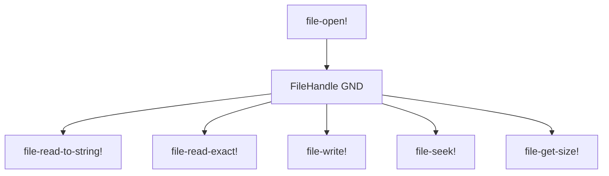
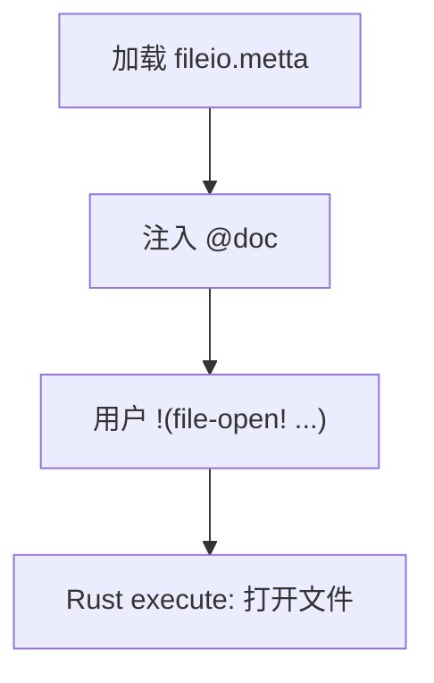

# `lib/src/metta/runner/builtin_mods/fileio.metta` MeTTa 源码分析报告

## 1. 文件定位与职责

- 描述 **文件 I/O Grounded 操作**：打开、读至字符串、写、定位、定长读、取大小。
- 打开选项字符：`r,w,c,a,t`（读/写/不存在则创建/追加/截断），组合约束见 `@doc`（例如 `rc` 非法等）。
- **文件类别**：内置模块接口 / 文档系统。

## 2. 原子清单与分类

| 行号 | 表达式（截断至80字符） | 分类 | 涉及的关键符号 | 语义说明 |
|------|------------------------|------|----------------|----------|
| L1-L9 | `(@doc file-open! ...)` | 文档 | `file-open!` | 路径 + 选项字符串 → 文件句柄或错误 |
| L11-L16 | `(@doc file-read-to-string! ...)` | 文档 | `file-read-to-string!` | 从当前位置读到 EOF → 字符串 |
| L18-L24 | `(@doc file-write! ...)` | 文档 | `file-write!` | 写入字符串内容 |
| L26-L32 | `(@doc file-seek! ...)` | 文档 | `file-seek!` | 设置光标位置 |
| L34-L41 | `(@doc file-read-exact! ...)` | 文档 | `file-read-exact!` | 读取至多 n 字节 → 字符串 |
| L43-L47 | `(@doc file-get-size! ...)` | 文档 | `file-get-size!` | 返回文件大小 |

## 3. 知识图谱（空间内容分析）

- **文档原子**：上述 6 组 `@doc`。  
- **函数等式 / 类型**：无。

依赖：Rust 侧 `FileHandle`（或等价）与 `file-open!` 注册。

## 4. 函数定义详解

无 `(= …)`。

### 4.1 核心函数详解

以 `@doc` 为准；错误情况返回 `Error` 形式由 Rust 定义。

## 5. 求值流程分析

### 5.1 执行表达式流程

无顶层 `!(…)`。

### 5.2 关键求值链详解（用户程序侧，概念性）

```
file-open! path opts → 句柄 gnd
→ file-read-to-string! 句柄 → 字符串
→ file-seek! 句柄 pos → Unit
→ file-write! 句柄 str → Unit
```

## 6. 类型系统分析

无 `(: …)`。

## 7. 推理模式分析

不涉及。

## 8. 状态与副作用分析

| 操作 | 行号 | 副作用类型 | 影响范围 | 时序依赖 |
|------|------|------------|----------|----------|
| `file-open!` 等 | @doc 描述 | OS 文件、句柄状态 | 进程文件表 | 先 open 再 read/write/seek |

## 9. 断言与预期行为

无。

## 10. 知识图谱图（Mermaid）



## 11. 求值链图（Mermaid）



## 12. 空间快照图（Mermaid）


## 13. MeTTa 语言特性覆盖

| 语言特性 | 使用位置 | 使用方式 | 底层实现 |
|----------|----------|----------|----------|
| `@doc` 体系 | L1-L47 | 正式文档 | `get-doc` / `help!`（stdlib） |
| `!` 后缀命名约定 | 操作名 | 标识副作用 | 约定；解析在 tokenizer |

## 14. 底层实现映射

| MeTTa 操作 | Rust 实现位置 | 关键逻辑摘要 |
|------------|---------------|----------------|
| `file-open!` | `lib/src/metta/runner/builtin_mods/fileio.rs` | 解析选项字符，打开 `File`，封装句柄 |
| `file-read-to-string!` 等 | 同上 | 对应 `Read`/`Seek`/`metadata` 等 API |

## 15. 复杂度与性能要点

读至字符串与 exact 读受磁盘与文件大小影响；无 MeTTa 级组合爆炸。

## 16. 关键代码证据

- `L1-L47`：六段 `@doc`。

## 17. 教学价值分析

说明 **副作用操作** 在 Hyperon 中常以 Grounded + `!` 命名；文档与实现分离。

## 18. 未确定项与最小假设

- 句柄类型的精确 Rust 结构与错误消息格式以 `fileio.rs` 为准。

## 19. 摘要

- **功能**：文件 I/O 族文档。  
- **实现**：`fileio.rs`；本文件无 MeTTa 逻辑。  
- **副作用**：打开/读/写/seek 均在外层 OS。
