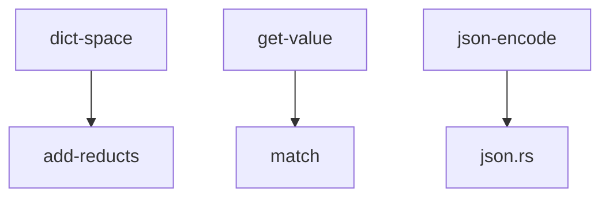
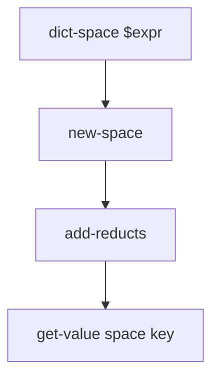
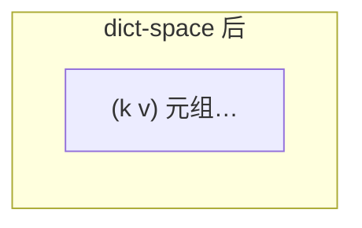

# `lib/src/metta/runner/builtin_mods/json.metta` MeTTa 源码分析报告

## 1. 文件定位与职责

- **混合**：`@doc` + MeTTa 层 `(: …)` / `(= …)`（`get-value`、`get-keys`、`dict-space`）；`json-encode` / `json-decode` 为 Rust Grounded，仅文档。
- JSON 对象映射为空间中 `(key value)`；与 `json.rs` 测试中的 `get-keys` 等配合。
- **文件类别**：内置模块接口 / 标准库式辅助 / 文档系统。

## 2. 原子清单与分类

| 行号 | 表达式（截断至80字符） | 分类 | 涉及的关键符号 | 语义说明 |
|------|------------------------|------|----------------|----------|
| L1-L8 | `(@doc get-value` + `(:` + `(=` | 文档+类型+函数 | `get-value`, `match` | 按键取值 |
| L10-L18 | `(@doc get-keys` + `(:` + `(=` | 文档+类型+函数 | `function`, `chain`, `unify` | 枚举键 |
| L20-L28 | `(@doc dict-space` + `(:` + `(=` | 文档+类型+函数 | `let*`, `new-space`, `add-reducts` | 构造字典空间 |
| L31-L41 | `(@doc json-encode` / `json-decode` | 文档 | `json-encode`, `json-decode` | Rust 编解码 |

## 3. 知识图谱（空间内容分析）

- **类型**：`get-value`, `get-keys`, `dict-space`。  
- **等式**：同上三函数。  
- **依赖**：`new-space`, `add-reducts`, `match`, `function`, `chain`, `return`, `unify`（stdlib / 解释器）。

## 4. 函数定义详解

| 函数名 | 等式数 | 递归? | 主要内置 |
|--------|--------|-------|----------|
| get-value | 1 | 否 | `match` |
| get-keys | 1 | 否 | `function`, `chain`, `unify`, `return` |
| dict-space | 1 | 否 | `let*`, `new-space`, `add-reducts` |

### 4.1 核心函数详解

#### `get-value`（`L7-L8`）

- `(= (get-value $dictspace $key) (match $dictspace ($key $value) $value))`：在空间上匹配 `(key value)`。

#### `get-keys`（`L16-L18`）

- 通过 `unify $dictspace ($key $value) $key Empty` 与 `function/chain/return` 产生键。

#### `dict-space`（`L26-L28`）

- `let*`：`new-space` + `add-reducts $dictspace $expr` → 返回空间。

## 5. 求值流程分析

### 5.1 执行表达式流程

无文件内 `!(…)`。

### 5.2 关键求值链

`dict-space` → `get-value`：见上文 4.1。

## 6. 类型系统分析

- `(: get-value (-> Grounded Atom %Undefined%))`  
- `(: get-keys (-> Grounded Atom))`  
- `(: dict-space (-> Expression Grounded))`

## 7. 推理模式分析

空间查询与前向 **事实构造**，非后向链。

## 8. 状态与副作用分析

| 操作 | 行号 | 副作用 | 影响范围 |
|------|------|--------|----------|
| dict-space | L26-L28 | 新空间 + add-reducts | 新 space |
| json-decode（Rust） | 文档 | 分配 Atom/Space | 运行时 |

## 9. 断言与预期行为

本文件无断言；见 `json.rs` 内嵌测试。

## 10. 知识图谱图（Mermaid）

## 11. 求值链图（Mermaid）

## 12. 空间快照图（Mermaid）

## 13. MeTTa 语言特性覆盖

`(:`, `(=`, `match`, `let*`, `function`, `chain`, `unify`, `return`, `@doc`。

## 14. 底层实现映射

| 操作 | Rust / 位置 |
|------|-------------|
| `json-encode` / `json-decode` | `builtin_mods/json.rs` |
| `get-value` / `get-keys` / `dict-space` | **本 .metta** |
| `new-space`, `add-reducts`, `match` | stdlib + `core.rs` |

## 15. 复杂度与性能要点

`get-keys` 随空间条目数分支增多。

## 16. 关键代码证据

`L7-L8`, `L16-L18`, `L26-L28`。

## 17. 教学价值分析

JSON 与 MeTTa 字典空间的桥接示例。

## 18. 未确定项与最小假设

`get-keys` 去重/顺序语义以运行时为准。

## 19. 摘要

- **MeTTa**：`get-value`, `get-keys`, `dict-space`。  
- **Rust**：`json-encode`, `json-decode`。
