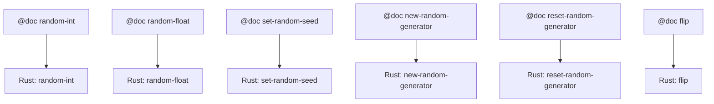
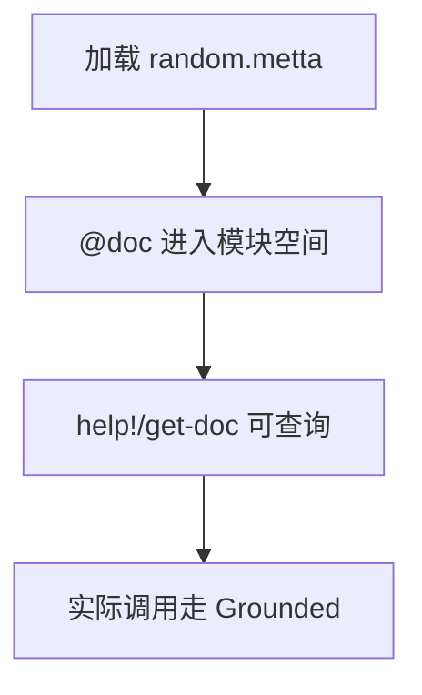

# `lib/src/metta/runner/builtin_mods/random.metta` MeTTa 源码分析报告

## 1. 文件定位与职责

- 为 **随机数相关 Grounded 操作** 提供 `@doc` 文档，便于 `get-doc` / `help!` 等从空间检索说明。
- 涵盖：整数/浮点区间随机、设置种子、新建生成器、重置为 OS RNG 行为、无参布尔 `flip`。
- **无** MeTTa 层 `(= …)` 实现；实际计算在 Rust。
- **文件类别**：内置模块接口 / 文档系统。

## 2. 原子清单与分类

| 行号 | 表达式（截断至80字符） | 分类 | 涉及的关键符号 | 语义说明 |
|------|------------------------|------|----------------|----------|
| L1-L7 | `(@doc random-int ...)` | 文档 | `random-int` | 在 [start,end] 上随机整数 |
| L8-L15 | `(@doc random-float ...)` | 文档 | `random-float` | 在 [start,end] 上随机浮点 |
| L17-L22 | `(@doc set-random-seed ...)` | 文档 | `set-random-seed` | 为给定生成器设种子 |
| L24-L28 | `(@doc new-random-generator ...)` | 文档 | `new-random-generator` | 由种子创建生成器 |
| L30-L34 | `(@doc reset-random-generator ...)` | 文档 | `reset-random-generator` | 重置为 `StdRng::from_os_rng()` 行为 |
| L36-L38 | `(@doc flip ...)` | 文档 | `flip` | 均匀随机布尔值 |

## 3. 知识图谱（空间内容分析）

加载后 `&self`（或对应模块空间）主要增加 **文档原子**（`@doc` 块）；**无**函数等式与 `(: …)`。

**依赖**：Rust `lib/src/metta/runner/builtin_mods/random.rs` 注册 `random-int` 等及 `&rng` 类 token。

## 4. 函数定义详解

无 `(= …)`。

### 4.1 核心函数详解

语义以 `@doc` 为准；实现为 Grounded。

## 5. 求值流程分析

### 5.1 执行表达式流程

无 `!(…)`。

### 5.2 关键求值链详解

用户侧典型：`!(bind! &rng (new-random-generator 123))` → `random-int &rng 0 5`。本文件仅提供文档。

## 6. 类型系统分析

无 `(: …)`。

## 7. 推理模式分析

不涉及。

## 8. 状态与副作用分析

| 操作 | 行号 | 副作用类型 | 影响范围 | 时序依赖 |
|------|------|------------|----------|----------|
| （@doc 描述的 RNG 操作） | L1-L38 | RNG 可变状态 | 生成器实例 | 创建/设种子/使用顺序 |

## 9. 断言与预期行为

无。

## 10. 知识图谱图（Mermaid）

## 11. 求值链图（Mermaid）

## 12. 空间快照图（Mermaid）

## 13. MeTTa 语言特性覆盖

| 语言特性 | 使用位置(行号) | 使用方式 | 底层实现 |
|----------|----------------|----------|----------|
| `@doc` | L1-L38 | 文档块 | `get-doc` |
| Grounded | 文档引用 | 名称 | `random.rs` |

## 14. 底层实现映射

| MeTTa 操作 | Rust 实现位置 | 关键逻辑摘要 |
|------------|---------------|----------------|
| `random-int` 等 | `lib/src/metta/runner/builtin_mods/random.rs` | `RandomGenerator`、`gen_range` 等 |

## 15. 复杂度与性能要点

单次调用 O(1)。

## 16. 关键代码证据

- `L1-L38`：完整 `@doc` 列表。

## 17. 教学价值分析

展示 **内置模块：MeTTa 仅文档、逻辑在 Rust** 的拆分方式。

## 18. 未确定项与最小假设

- 模块合并进 Runner 的路径由加载器决定。

## 19. 摘要

- **功能**：随机操作族文档。  
- **实现**：`random.rs`。  
- **无 MeTTa 等式**。
