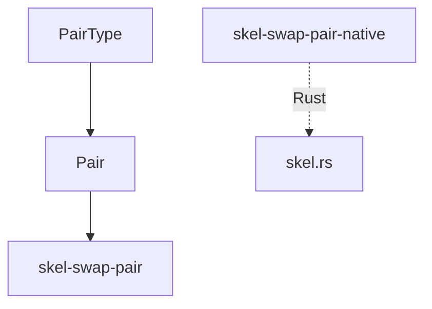
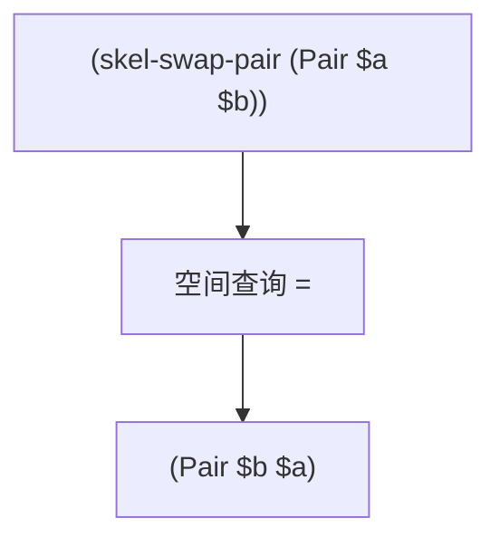
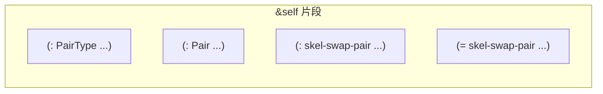

# `lib/src/metta/runner/builtin_mods/skel.metta` MeTTa 源码分析报告

## 1. 文件定位与职责

- 提供 **参数化类型** `PairType` 与值构造子 `Pair`，用于类型层面的二元组。
- 定义 **纯 MeTTa** 函数 `skel-swap-pair`：模式匹配 `(Pair $a $b)` → `(Pair $b $a)`。
- 文档化 **Rust 原生** 对应 `skel-swap-pair-native`（实现于 `skel.rs`），便于对照测试。
- **文件类别**：类型系统声明 / 内置模块接口 / 教学示例（MeTTa vs Rust 双实现）。

## 2. 原子清单与分类

| 行号 | 表达式（截断至80字符） | 分类 | 涉及的关键符号 | 语义说明 |
|------|------------------------|------|----------------|----------|
| L1 | `(: PairType (-> $ta $tb Type))` | 类型声明 | `PairType`, `$ta`, `$tb` | 依赖类型风格：由两类型参数构造 `Type` |
| L2 | `(: Pair (-> $ta $tb (PairType $ta $tb)))` | 类型声明 | `Pair` | 值具有 `(PairType $ta $tb)` |
| L4-L8 | `(@doc skel-swap-pair ...)` | 文档 | `skel-swap-pair` | 交换 Pair 分量 |
| L9 | `(: skel-swap-pair (-> (PairType $ta $tb) (PairType $tb $ta)))` | 类型声明 | 参数化箭头类型 | 交换后类型参数顺序对调 |
| L10-L11 | `(= (skel-swap-pair (Pair $a $b)) (Pair $b $a))` | 函数定义 | `Pair`, `$a`, `$b` | 单条等式，无递归 |
| L13-L17 | `(@doc skel-swap-pair-native ...)` | 文档 | `skel-swap-pair-native` | Rust 中交换 |

## 3. 知识图谱（空间内容分析）

- **类型事实**：`PairType`, `Pair` 的类型构造子声明。  
- **函数等式**：`skel-swap-pair` 一条。  
- **文档**：两处 `@doc`。

**依赖**：`Pair` 为表达式头；运行时需能归约 `(Pair a b)` 为合法表达式（与 tokenizer/解析一致）。

## 4. 函数定义详解

| 函数名 | 等式数量 | 模式变体 | 参数类型(声明) | 返回类型(声明) | 递归? | 内置操作 | 求值策略 |
|--------|----------|----------|----------------|----------------|-------|----------|----------|
| skel-swap-pair | 1 | `(Pair $a $b)` | (PairType $ta $tb) | (PairType $tb $ta) | 否 | 无（纯结构重写） | 模式匹配一次成功即返回 |

### 4.1 核心函数详解：`skel-swap-pair`

- **功能**：对称交换；展示 **代数数据类型** 在 MeTTa 中的极简形式。  
- **模式**：要求首原子为 `Pair`；否则**无匹配等式**（可能进入未归约或其它错误路径，**无法从当前文件确定**默认行为）。  
- **变量**：`$a`,`$b` 原样进入结果。  
- **终止**：单次重写，无递归。

## 5. 求值流程分析

### 5.1 执行表达式流程

无 `!(…)`。

### 5.2 关键求值链详解

```
(skel-swap-pair (Pair x y))
→ 匹配 (= (skel-swap-pair (Pair $a $b)) (Pair $b $a))
→ 绑定 $a=x, $b=y
→ 结果 (Pair y x)
```

`skel-swap-pair-native`：**Rust 执行**，链类似但不经 `=` 空间查询。

## 6. 类型系统分析

- **参数化类型**：`PairType` 取 `$ta`,`$tb`；`Pair` 结果类型为 `(PairType $ta $tb)`。  
- **函数签名**：`skel-swap-pair` 类型显式表达 **类型级交换** `(PairType $ta $tb) -> (PairType $tb $ta)`。  
- **一致性**：与等式 `(Pair $b $a)` 结构一致。

## 7. 推理模式分析

不涉及逻辑推理；为 **代数重写规则**。

## 8. 状态与副作用分析

| 操作 | 行号 | 副作用类型 | 影响范围 | 时序依赖 |
|------|------|------------|----------|----------|
| — | — | 无 | — | — |

## 9. 断言与预期行为

本文件无断言；`skel.rs` 含 `!(skel-swap-pair (Pair a b))` 类测试（**非本文件**）。

## 10. 知识图谱图（Mermaid）



## 11. 求值链图（Mermaid）



## 12. 空间快照图（Mermaid）



## 13. MeTTa 语言特性覆盖

| 语言特性 | 使用位置(行号) | 使用方式 | 底层实现 |
|----------|----------------|----------|----------|
| `(: …)` 参数化 | L1-L2, L9 | 依赖类型风格 | 空间类型事实 |
| `(= …)` | L10-L11 | 单条重写 | 解释器 |
| `@doc` | L4-L8, L13-L17 | 文档 | get-doc |

## 14. 底层实现映射

| MeTTa 操作 | Rust 实现位置 | 关键逻辑摘要 |
|------------|---------------|----------------|
| `skel-swap-pair-native` | `lib/src/metta/runner/builtin_mods/skel.rs` | Grounded：解构 `Pair` 并交换 |
| `skel-swap-pair` | **本文件** | 纯等式 |
| `Pair` / `PairType` | **本文件** | 类型声明；值形式依赖解析 |

## 15. 复杂度与性能要点

O(1) 单次模式匹配；与集合大小无关。

## 16. 关键代码证据

- `L1-L2`：`PairType` / `Pair`。  
- `L9-L11`：`skel-swap-pair` 类型与等式。

## 17. 教学价值分析

对比 **同一语义** 的 MeTTa 规则实现与 Rust Grounded 实现，适合理解扩展内置库时的两条路径。

## 18. 未确定项与最小假设

- 非 `(Pair …)` 输入调用 `skel-swap-pair` 时的错误形态。

## 19. 摘要

- **功能**：`Pair`/`PairType` 声明 + `skel-swap-pair` 交换 + native 文档。  
- **类型**：显式参数化函数类型。  
- **实现**：MeTTa 等式 vs `skel.rs`。
