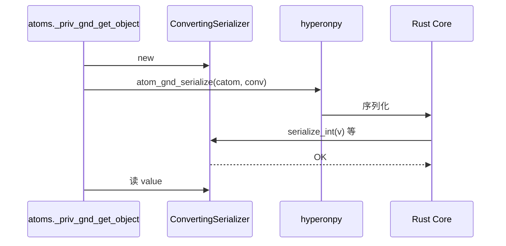
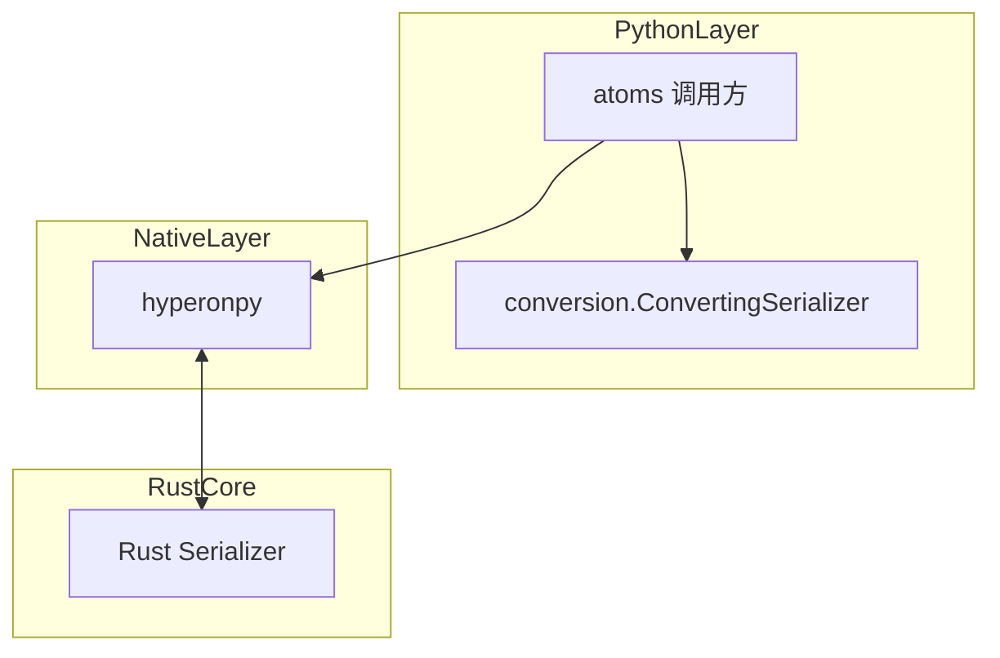

# `python/hyperon/conversion.py` Python 源码分析报告

## 1. 文件定位与职责

- 实现 **`ConvertingSerializer`**：继承 `hyperonpy.Serializer`，在 Rust 侧序列化 grounded 值时将 **bool / int / float / str** 落入 Python 属性 `self.value`（`L1-L29`）。
- 供 `atoms._priv_gnd_get_object` 在无法直接 `atom_get_object` 时，通过 `hp.atom_gnd_serialize(atom.catom, converter)` 完成跨运行时值桥接（调用点在 **`atoms.py`**）。
- 角色：**类型转换**；Python 层对 `Serializer` 协议的具体实现。

## 2. 公共 API 清单

| 符号名 | 类型 | 参数签名 | 返回值 | hp.* | MeTTa 语义 |
|--------|------|----------|--------|------|------------|
| `ConvertingSerializer` | class | `__init__(self)` | 实例 | 无（基类来自 hp） | 将 grounded 值还原为 Python 标量 |

## 3. 核心类与数据结构

| 类名 | 父类 | 关键属性 | C 对象 | `__del__` | 设计意图 |
|------|------|----------|--------|-----------|----------|
| `ConvertingSerializer` | `Serializer`（hp） | `value`，初值 `None` | 由基类管理 | 继承基类 | Rust→Python 值捕获 |

**无法从当前文件确定**：基类 `Serializer` 的 C 层资源管理细节。

## 4. hyperonpy 调用映射

本文件不直接调用 `hp`；**重写**由 Rust 经绑定调用的方法：

| Python 方法 | 调用方 | Rust 操作（推断） | 返回值 |
|-------------|--------|-------------------|--------|
| `serialize_bool` | Rust Serializer | 布尔 grounded | `SerialResult.OK` |
| `serialize_int` | 同上 | 整数 | `SerialResult.OK` |
| `serialize_float` | 同上 | 浮点 | `SerialResult.OK` |
| `serialize_str` | 同上 | 字符串 | `SerialResult.OK` |

**注释笔误**（`L26-L28`）：`serialize_str` 文档写「Accept float value」，应为 string。

## 5. 回调函数分析

| 函数 | 被谁调用 | 触发时机 | 返回值契约 |
|------|----------|----------|------------|
| `serialize_*` | Rust（经 hyperonpy） | `atom_gnd_serialize` | `SerialResult.OK` |

## 6. 算法与关键策略

### 6.1 算法清单

| 算法名 | 目标 | 步骤 | 复杂度 |
|--------|------|------|--------|
| 捕获序列化 | 保存标量到 `self.value` | 赋值并返回 OK | O(1) |

### 6.2 详解

- **动机**：部分 grounded 不能 `get_object`，需序列化协议（见 `atoms.py` `L186-L194`）。
- **失败路径**：类型不支持时由 `atoms._priv_gnd_get_object` 检查 `SerialResult` 与 `value`。

## 7. 执行流程

1. 调用方 `ConvertingSerializer()`。
2. `hp.atom_gnd_serialize(catom, serializer)`（在 `atoms.py`）。
3. Rust 调用对应 `serialize_*`。
4. 读取 `serializer.value`。

## 8. 装饰器与模块发现机制

不涉及。

## 9. 状态变更与副作用矩阵

| 操作 | 状态变更 | 可观测 |
|------|----------|--------|
| `serialize_*` | `self.value` 覆盖 | 返回 `OK` |

## 10. 流程图（Mermaid）

## 11. 时序图（Mermaid）

## 12. 架构图（Mermaid）

## 13. 复杂度与性能要点

- 每种转换 O(1) 回调；FFI 次数由 Rust 决定。

## 14. 异常处理全景

- 本文件无 `raise`。

## 15. 安全性与一致性检查点

- 多次 `serialize_*` 会覆盖 `self.value`；应单次使用后读取。

## 16. 对外接口与契约

- 成功：`SerialResult.OK` 且调用方确认 `value` 非 `None`（在 `atoms.py`）。

## 17. 关键代码证据

- `ConvertingSerializer` 与四个 `serialize_*`（`L3-L29`）。

## 18. 与 MeTTa 语义的关联

- 对应 **Bool / Number / String** 等 primitive grounded 在 Python 互操作中的还原。

## 19. 未确定项与最小假设

- `Serializer` 基类底层释放策略未知。

## 20. 摘要

- **职责**：`Serializer` 的 Python 实现，捕获标量到 `value`。
- **核心类**：`ConvertingSerializer`。
- **hyperonpy**：继承 `Serializer`/`SerialResult`，由 Rust 回调。
- **MeTTa**：primitive 值桥接。
- **依赖**：`atoms` 再导出的 `Serializer`, `SerialResult`。
