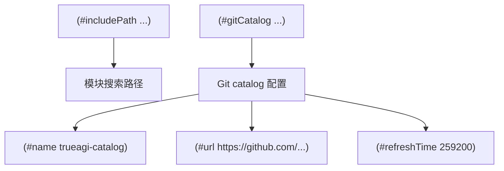
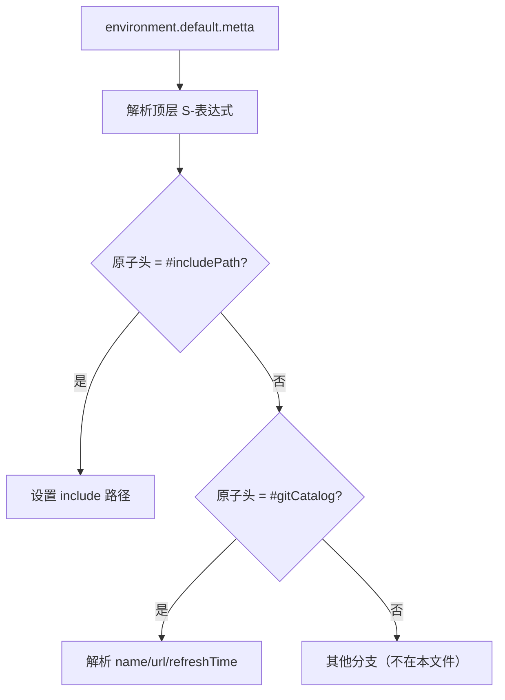
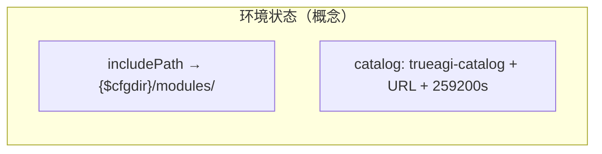

# `lib/src/metta/runner/environment.default.metta` MeTTa 源码分析报告

## 1. 文件定位与职责

- 通过 **环境配置文件** 补充 `EnvironmentBuilder` 的设定；注释明确：**API 程序化配置与文件冲突时，API 优先**（`L4-L5`）。
- 配置 **模块搜索路径**（`#includePath`）与 **Git 模块目录（catalog）**（`#gitCatalog`），用于包管理/远程模块发现（与 `pkg_mgmt` 特性相关）。
- 注释指出：加载本文件时 **stdlib 级操作（字符串、算术等）尚不可用**（`L7-L8`），因此文件语法必须是解释器在“贫瘠”阶段仍能解析的 **S-表达式结构**，而非依赖已加载的 stdlib 等式。
- **文件类别**：REPL/Runner 配置 / 内置模块接口（环境 DSL）。

## 2. 原子清单与分类

| 行号 | 表达式（截断至80字符） | 分类 | 涉及的关键符号 | 语义说明 |
|------|------------------------|------|----------------|----------|
| L1-L8 | 分号注释 | 文档/注释 | — | 说明用途、API 优先级、stdlib 不可用 |
| L9-L11 | `(#includePath "{$cfgdir}/modules/")` | 事实/配置原子（专用指令） | `#includePath`, `$cfgdir` | 将模块查找路径设为配置目录下 `modules/` |
| L13-L17 | `(#gitCatalog (#name ...) (#url ...) (#refreshTime 259200))` | 事实/配置原子（专用指令） | `#gitCatalog`, `#name`, `#url`, `#refreshTime` | 注册名为 `trueagi-catalog` 的 Git catalog，URL 与刷新间隔（秒） |

**说明**：`#includePath` / `#gitCatalog` 并非普通 MeTTa 用户函数，而是由 **环境解析器** 识别的顶层构造（见 Rust 映射）。

## 3. 知识图谱（空间内容分析）

本文件**不面向** `corelib` 的 `&self` 规则空间，而是由 **Environment** 加载器消费：

- **配置事实**：include 路径、catalog 名称/URL/刷新时间。  
- **与 stdlib 的关系**：无直接等式/类型注入。

## 4. 函数定义详解

无 `(= …)` 函数定义。

### 4.1 核心函数详解

不适用。配置语义由 Rust 侧 `#includePath` / `#gitCatalog` 分支完成。

## 5. 求值流程分析

### 5.1 执行表达式流程

无 `!(expr)`。顶层为配置原子列表。

### 5.2 关键求值链详解

```
读取 environment.default.metta
→ 解析为原子列表
→ Environment 解释器匹配 (#includePath ...) → 设置模块搜索路径
→ 匹配 (#gitCatalog (#name ...) (#url ...) (#refreshTime n)) → 注册/更新 catalog
→ （若无 pkg_mgmt）可能记录警告并跳过部分逻辑
```

**无法从当前文件确定**：`$cfgdir` 的具体展开规则（由构建/运行时注入）。

## 6. 类型系统分析

无 `(: …)`。配置项为**非类型化 DSL**。

## 7. 推理模式分析

不涉及。

## 8. 状态与副作用分析

| 操作 | 行号 | 副作用类型 | 影响范围 | 时序依赖 |
|------|------|------------|----------|----------|
| `#includePath` | L9-L11 | 环境：模块路径 | 全局模块解析 | 在加载用户模块之前 |
| `#gitCatalog` | L13-L17 | 环境：catalog 注册 | 包管理/远程模块 | 依赖 `pkg_mgmt` 与网络 |

## 9. 断言与预期行为

无测试断言。

## 10. 知识图谱图（Mermaid）



## 11. 求值链图（Mermaid）



## 12. 空间快照图（Mermaid）



## 13. MeTTa 语言特性覆盖

| 语言特性 | 使用位置(行号) | 使用方式 | 底层实现 |
|----------|----------------|----------|----------|
| 顶层符号原子与嵌套表达式 | L9-L17 | 配置 DSL | `lib/src/metta/runner/environment.rs` 中 `#includePath` / `#gitCatalog` 分支 |
| 字符串原子 | L10, L14-L15 | 路径与 URL | 同上 |

## 14. 底层实现映射

| MeTTa 操作 / 构造 | Rust 实现位置 | 关键逻辑摘要 |
|-------------------|---------------|----------------|
| `#includePath` | `lib/src/metta/runner/environment.rs`（约 L398 起） | 读取路径子表达式；无 `pkg_mgmt` 时可能警告 |
| `#gitCatalog` | 同上（约 L407 起） | 要求 `name`/`url`/`refreshTime`；构造 catalog 配置 |
| 文件整体加载 | `EnvironmentBuilder` / 项目目录解析 | 与 `ProjectDirs` 等配合（**细节无法仅从本文件确定**） |

## 15. 复杂度与性能要点

- `refreshTime` 为 259200 秒（3 天），影响 catalog **刷新频率**，而非单次解析复杂度。

## 16. 关键代码证据

- `L4-L8`：API 优先、stdlib 不可用说明。  
- `L9-L11`：`#includePath` 与 `$cfgdir` 占位。  
- `L13-L17`：`#gitCatalog` 三元组属性。

## 17. 教学价值分析

说明 **Hyperon 环境与 MeTTa 标准库加载顺序**：环境文件须在“无 stdlib 操作”阶段可解析；适合理解部署时模块路径与远程 catalog 的配置方式。

## 18. 未确定项与最小假设

- `$cfgdir` 的解析规则。  
- 无 `pkg_mgmt` 时 catalog 是否静默忽略或告警（以 `environment.rs` 实现为准）。

## 19. 摘要

- **功能**：默认环境配置——模块 include 路径 + TrueAGI Git catalog。  
- **核心函数**：无；为 DSL 原子。  
- **语言特性**：嵌套列表配置、专用指令符号。  
- **底层**：`environment.rs` 解析 `#includePath` / `#gitCatalog`。  
- **注意**：注释强调 API 覆盖文件、且加载阶段 stdlib 操作不可用。
