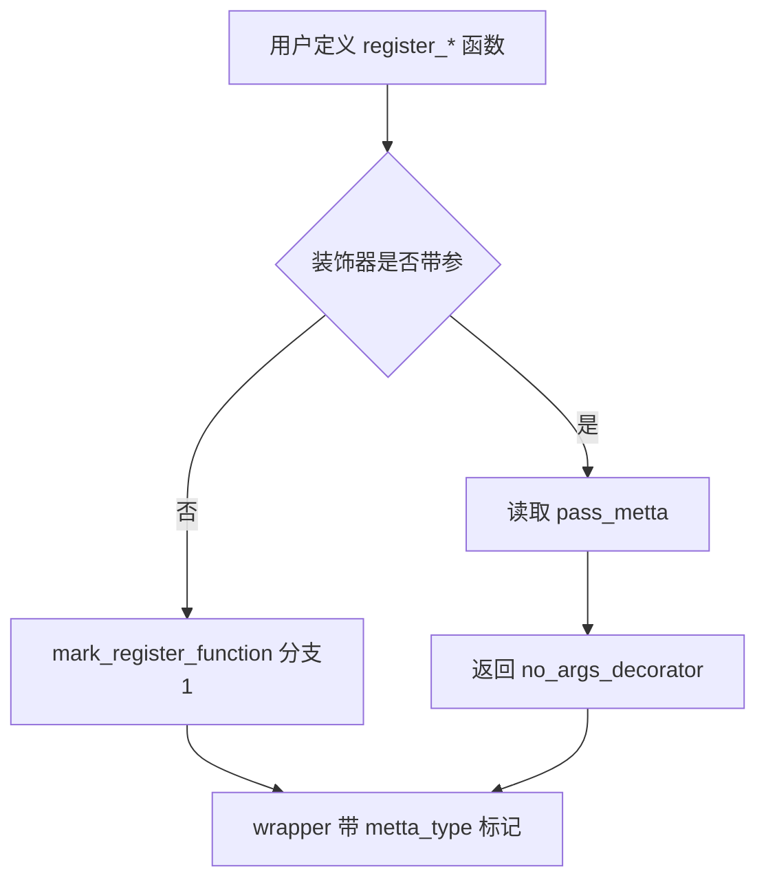
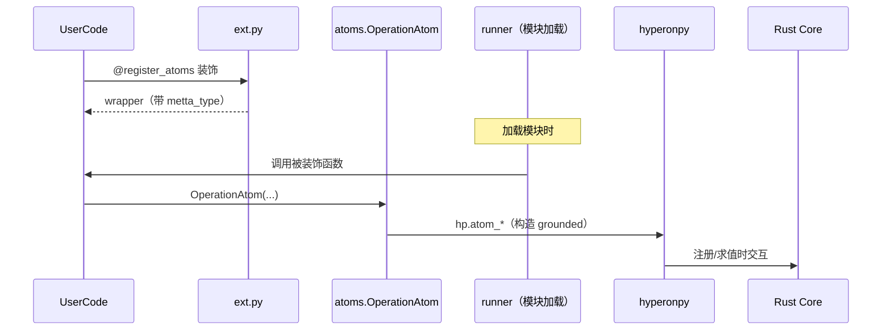
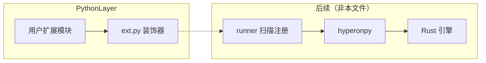

# `python/hyperon/ext.py` Python 源码分析报告

## 1. 文件定位与职责

- 提供 **MeTTa 扩展注册用装饰器**：`register_atoms`、`register_tokens`、`grounded`，以及枚举 `RegisterType`（`L5-L7`、`L59-L81`、`L91-L104`）。
- 通过 `mark_register_function` 在被装饰函数上挂载 **`metta_type`** 与 **`metta_pass_metta`** 属性，供 `runner._priv_register_module_tokens` 扫描并注册到 `Tokenizer`（与 `runner.py` 协作，`L9-L57`）。
- **`grounded`** 将 Python 函数包装为 `OperationAtom` 并可选择立即向给定 `MeTTa` 实例注册 token（`L83-L104`）。
- **不导入 hyperonpy**；与 Rust 的交互发生在运行器加载模块之后由核心通过 Tokenizer 回调 Python 侧构造的原子。
- 角色：**扩展装饰器**；位于「用户扩展代码 → hyperon 模块扫描 → Tokenizer」链路的上游。

## 2. 公共 API 清单

| 符号名 | 类型 | 参数签名 | 返回值 | 对应的 hp.* | MeTTa 语义 |
|--------|------|----------|--------|-------------|------------|
| `RegisterType` | `Enum` | — | 枚举类 | 无 | 区分 ATOM/TOKEN 注册 |
| `mark_register_function` | function | `(type, args, kwargs)` | 装饰器或包装函数 | 无 | 内部：打标记 |
| `register_atoms` | function | `(*args, **kwargs)` | 装饰器 | 无 | 注册「正则→Atom」映射 |
| `register_tokens` | function | `(*args, **kwargs)` | 装饰器 | 无 | 注册「正则→构造 lambda」 |
| `grounded` | function | `(arg)` 或 `@grounded(metta)` | 装饰器 / 部分应用 | 无 | 将函数变为可执行 Operation |

## 3. 核心类与数据结构

| 类名 | 父类 | 关键属性 | C 对象 | `__del__` | 设计意图 |
|------|------|----------|--------|-----------|----------|
| `RegisterType` | `Enum` | `ATOM`, `TOKEN` | 无 | 无 | 标记注册类别 |

**包装函数对象**（`wrapper`）：动态属性 `metta_type`、`metta_pass_metta`（`L38-L39`、`L52-L53`）。

## 4. hyperonpy 调用映射

本文件**无** `hp.*` 调用。

| Python 方法 | hp.* | 说明 |
|-------------|------|------|
| — | — | — |

## 5. 回调函数分析

本文件定义的函数**不是**被 Rust 通过 `_priv_call_*` 直接调用的 FFI 回调；它们由 **Python 模块加载逻辑**（`runner._priv_register_module_tokens`）在导入模块时调用。

| 回调函数名 | 被谁调用 | 触发时机 | 参数格式 | 返回值契约 | 错误处理 |
|------------|----------|----------|----------|------------|----------|
| 被 `@register_*` 装饰的用户函数 | `importlib.import_module` 后的扫描逻辑（见 `runner.py`） | 模块作为 MeTTa 模块加载时 | `()` 或 `(metta)` 视 `pass_metta` | `dict`：regex → atom 或 regex → lambda | 由调用方与用户函数决定 |

## 6. 算法与关键策略

### 6.1 算法清单

| 算法名 | 目标 | 输入 | 输出 | 关键步骤 | 复杂度 | 依赖 |
|--------|------|------|------|----------|--------|------|
| 无参装饰器分支 | 支持 `@register_atoms` 形式 | `args` 长度为 1 的可调用 | 带标记的 wrapper | `len(args)==1 and callable` | O(1) | — |
| 有参装饰器分支 | 支持 `@register_atoms(pass_metta=True)` | `kwargs` 可含 `pass_metta` | 返回内层装饰器 | 闭包捕获 `pass_metta` | O(1) | — |
| `_register_grounded` | 生成 `OperationAtom` 并可选注册 | `metta`, `func` | 装饰结果或副作用 | `OperationAtom(name, func, unwrap=True)` | O(1) | `OperationAtom` 正确性 |

### 6.2 核心算法详解：`mark_register_function`

- **动机**：统一 `register_atoms` / `register_tokens` 的两种装饰器写法（`L30-L57`）。
- **路径**：分支 1（`L31-L41`）无参；分支 2（`L42-L57`）有参并读取 `pass_metta`。
- **hyperonpy**：无。
- **失败路径**：若使用方式不符合两种分支，可能得不到预期 wrapper（**无法从当前文件确定**运行时是否校验）。

## 7. 执行流程

### 7.1 主流程

1. 用户用 `@register_atoms` 等装饰模块级函数。
2. 解释器定义函数时，`mark_register_function` 返回 `wrapper`，并写入 `metta_type` / `metta_pass_metta`。
3. 模块被 MeTTa 加载时，外部代码调用该函数，取得 `dict` 并注册到 `Tokenizer`。

### 7.2 异常与边界

- `grounded` 在传入 `metta` 时立即 `register_atom`；若 `metta` 状态异常，错误在 `MeTTa.register_atom` 中暴露（**不在本文件**）。

## 8. 装饰器与模块发现机制

- **标记方式**：`wrapper.__dict__['metta_type']` 与 `metta_pass_metta`（`L38-L39`、`L52-L53`）。
- **与 `runner` 协作**：**无法从当前文件单独确认**完整扫描逻辑，需结合 `runner._priv_register_module_tokens`（`L372-L392` 在 `runner.py`）。

## 9. 状态变更与副作用矩阵

| 操作 | 状态变更 | hyperonpy | 可观测输出 | 失败后行为 |
|------|----------|-----------|------------|------------|
| `@grounded(metta)` | 向 `metta` 注册 token | 间接（经 MeTTa） | tokenizer 多一条规则 | 见 MeTTa 层 |
| `@register_*` | 仅函数属性 | 无 | 无 | — |

## 10. 流程图（Mermaid）

## 11. 时序图（Mermaid）

## 12. 架构图（Mermaid）

## 13. 复杂度与性能要点

- 装饰器为 O(1)；性能敏感点在**模块加载时**批量 `register_token`（在 runner 与用户 dict 大小）。

## 14. 异常处理全景

- 本文件无 `try/except`；`OperationAtom` 构造异常向上传播。

## 15. 安全性与一致性检查点

- `grounded` 使用 `func.__name__` 作为 token 名，命名冲突由上层 tokenizer 规则顺序决定。

## 16. 对外接口与契约

- `register_atoms` / `register_tokens`：被装饰函数应返回 `dict`（**契约由 runner 消费方定义**）。
- `grounded(metta)`：`metta` 为 `MeTTa` 实例（`L91-L104`）。

## 17. 关键代码证据

- `RegisterType`（`L5-L7`）。
- `mark_register_function` 两分支（`L30-L57`）。
- `register_atoms` / `register_tokens`（`L59-L81`）。
- `_register_grounded` / `grounded`（`L83-L104`）。

## 18. 与 MeTTa 语义的关联

- **扩展点**：将 Python 侧函数/原子注册为 MeTTa 源码中的可解析 token 与可约简操作。
- `unwrap=True` 的默认 grounded 操作语义在 `OperationObject.execute`（`atoms.py`）中实现。

## 19. 未确定项与最小假设

- **无法从当前文件确定**：`runner._priv_register_module_tokens` 对返回值类型的完整校验与错误消息。
- 假设：被装饰函数返回的 `dict` 键为正则字符串、值为 `Atom` 或可调用。

## 20. 摘要

- **职责**：扩展装饰器与注册元数据标记。
- **核心**：`RegisterType`、`mark_register_function`、`register_*`、`grounded`。
- **hyperonpy**：本文件不直接调用；通过 `OperationAtom` 间接进入原生层。
- **MeTTa**：模块与 tokenizer 扩展机制的用户侧 API。
- **性能**：装饰器极轻；注册发生在加载期。
- **依赖**：`OperationAtom`（`atoms.py`）。
