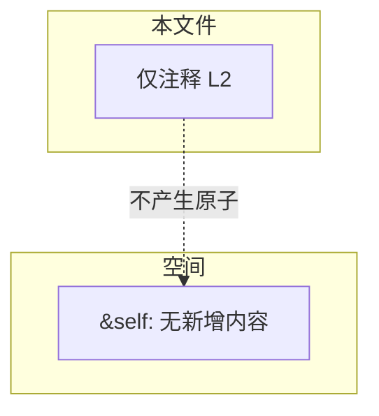
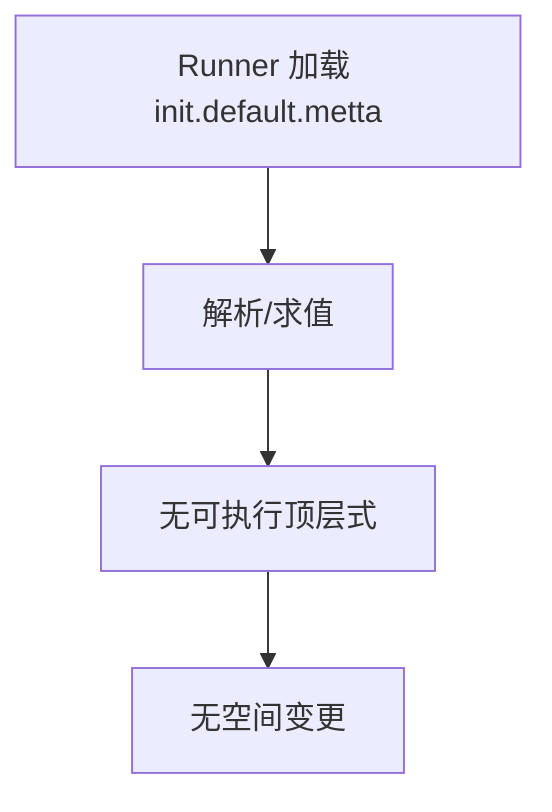

# `lib/src/metta/runner/init.default.metta` MeTTa 源码分析报告

## 1. 文件定位与职责

- 每个新建 Runner 时，会在 **Runner 顶层上下文** 中对该文件内容进行求值（与 `CoreLibLoader` 等初始化路径配合；具体加载顺序**无法仅从本文件确定**，需结合 `RunContext` / `Metta::new` 实现）。
- 当前仓库版本中，文件**仅含注释**，不向 `&self` 注入任何事实、类型或等式。
- 用途是占位/说明：提示“此处可放入每次 Runner 创建时需在顶层执行的 MeTTa 代码”。
- **文件类别**：REPL/Runner 配置（初始化钩子脚本，当前为空实现）。

## 2. 原子清单与分类

| 行号 | 表达式（截断至80字符） | 分类 | 涉及的关键符号 | 语义说明 |
|------|------------------------|------|----------------|----------|
| L2 | `; The contents of this file are evaluated for each new runner in the runner's top context` | 文档/注释 | — | 说明本文件在 Runner 生命周期中的角色；非 MeTTa 原子 |

**说明**：无 `(: …)`、`(= …)`、`!(…)`、`(@doc …)` 等可执行或声明性顶层表达式。

## 3. 知识图谱（空间内容分析）

执行（求值）本文件后，**若不考虑注释被解析器忽略**，`&self` 中不会因本文件增加：

- **事实原子**：无  
- **类型声明**：无  
- **函数等式**：无  

**依赖关系**：无。

## 4. 函数定义详解

本文件**无** `(= (pattern) body)` 定义。

### 4.1 核心函数详解（1-5个）

不适用。

## 5. 求值流程分析

### 5.1 执行表达式流程

无 `!(expr)`。

### 5.2 关键求值链详解

对本文件而言，若 Runner 仍“运行”该脚本，则求值结果等价于**空程序**：不产生可观察结果分支。

## 6. 类型系统分析

无 `(: name Type)` 声明。

## 7. 推理模式分析

不涉及推理/知识查询。

## 8. 状态与副作用分析

| 操作 | 行号 | 副作用类型 | 影响范围 | 时序依赖 |
|------|------|------------|----------|----------|
| — | — | — | — | — |

## 9. 断言与预期行为

无 `assertEqual` / `assertEqualToResult` 等断言。

## 10. 知识图谱图（Mermaid）

## 11. 求值链图（Mermaid）

## 12. 空间快照图（Mermaid）

## 13. MeTTa 语言特性覆盖

| 语言特性 | 使用位置(行号) | 使用方式 | 底层实现(Rust函数/最小指令) |
|----------|----------------|----------|----------------------------|
| — | — | — | — |

## 14. 底层实现映射

本文件未引用任何 MeTTa 操作。Runner 如何定位并执行 `init.default.metta`：**无法从当前文件确定**；需在 `lib/src/metta/runner/` 下检索默认初始化与模块加载逻辑。

## 15. 复杂度与性能要点

可忽略（空脚本）。

## 16. 关键代码证据

- 注释证据 `L2`：说明 Runner 顶层求值语义。

## 17. 教学价值分析

展示 **Runner 级初始化钩子** 的扩展点；当前为空，适合作为自定义全局前置代码的入口说明。

## 18. 未确定项与最小假设

- 该文件在代码中的**确切加载路径与失败行为**需查 Runner 实现。  
- 假设：注释行被标准 MeTTa 文本解析忽略，不改变空间。

## 19. 摘要

- **功能**：Runner 每次创建时可选的顶层 MeTTa 初始化脚本；现版本仅为注释。  
- **核心函数**：无。  
- **语言特性**：无。  
- **推理/状态**：无。  
- **教学价值**：说明扩展点位置。  
- **底层依赖**：由 Runner 加载机制决定，本文件本身无操作映射。
