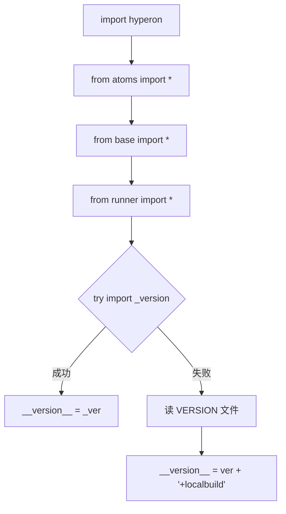
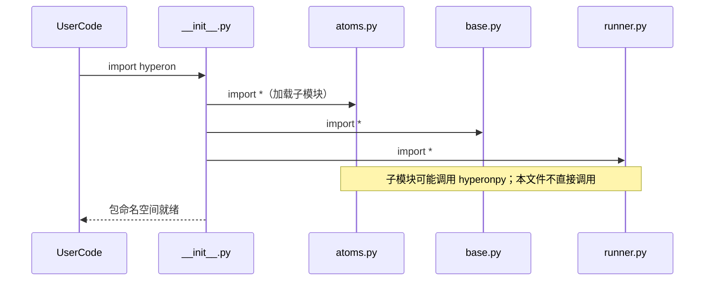
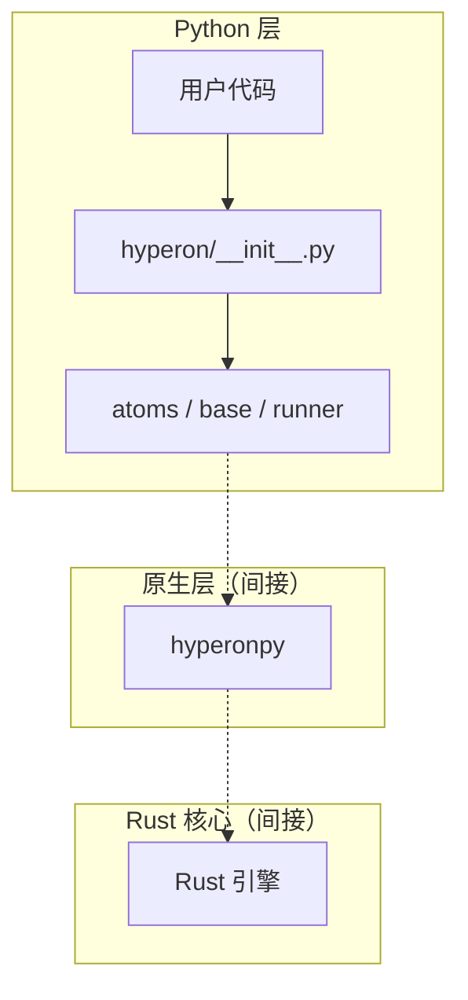

# `python/hyperon/__init__.py` Python 源码分析报告

## 1. 文件定位与职责

- 作为 `hyperon` 包的**聚合入口**：通过 `from .atoms import *`、`from .base import *`、`from .runner import *` 将原子、空间/解析器、MeTTa 运行器相关符号提升到包顶层，便于 `import hyperon` 后直接使用 `MeTTa`、`Atom` 等（`L1-L3`）。
- **不负责**实现业务逻辑；不包含对 `hyperonpy` 的直接导入或 FFI 调用。
- 提供 **`__version__` 解析策略**：优先从构建生成的 `hyperon._version` 读取；失败则回退读取仓库 `VERSION` 文件并附加 `+localbuild` 标记（`L5-L12`）。
- 在 Python → hyperonpy → Rust 链中处于**最外层用户可见 API 聚合层**；不穿透到原生扩展。

**角色标签**：包入口 / Runner·MeTTa 封装（再导出）/ 原子类型包装（再导出）

## 2. 公共 API 清单

本文件通过 `import *` 再导出同包子模块的公共符号；**下表仅列出本文件直接定义或绑定的符号**。

| 符号名 | 类型 | 参数签名 | 返回值 | 对应的 hp.* 调用 | MeTTa 语义对应 |
|--------|------|----------|--------|------------------|----------------|
| `__version__` | 常量（模块级） | — | `str` | 无 | 无 |
| （再导出）`atoms`、`base`、`runner` 中全部 `__all__` 所含符号 | 混合 | — | — | 由子模块决定 | 由子模块决定 |

**无法从当前文件确定**：`atoms` / `base` / `runner` 各自的 `__all__` 列表需阅读对应文件。

## 3. 核心类与数据结构

本文件未定义类。`__version__` 为模块级字符串。

| 类名 | 父类 | 关键属性 | C 对象引用 | `__del__` | 设计意图 |
|------|------|----------|------------|-----------|----------|
| — | — | — | — | — | — |

## 4. hyperonpy 调用映射

| Python 方法 | hp.* 函数 | C API / Rust | 参数转换 | 返回值转换 |
|-------------|-----------|--------------|----------|------------|
| — | — | — | — | — |

本文件**无** `import hyperonpy`。

## 5. 回调函数分析

| 回调函数名 | 被谁调用 | 触发时机 | 参数格式 | 返回值契约 | 错误处理 |
|------------|----------|----------|----------|------------|----------|
| — | — | — | — | — | — |

## 6. 算法与关键策略

### 6.1 算法清单

| 算法/策略名 | 目标 | 输入 | 输出 | 关键步骤 | 复杂度 | 正确性依赖 |
|-------------|------|------|------|----------|--------|------------|
| 版本回退解析 | 在未安装构建产物时仍能给出版本字符串 | `VERSION` 首行 | `str` | 读文件 → `splitlines()[0].split("'")[1]` → 拼接 `+localbuild` | O(1) 文件行 | `VERSION` 首行格式固定 |

### 6.2 核心算法详解：`__version__` 双路径

- **动机**：支持 setuptools-scm 生成的 `_version.py` 与源码树本地开发并存（`L5-L12`）。
- **路径**：`try: from ._version import __version__` → `except` 时用 `Path(__file__).parent / "../VERSION"` 解析。
- **与 hyperonpy**：无交互。
- **失败路径**：`except Exception` 吞掉所有异常后走回退；若 `VERSION` 也不存在或格式不符，可能再次异常（`L10-L12`）。

## 7. 执行流程

### 7.1 主流程

1. 解释器加载 `hyperon` 包时执行 `__init__.py`。
2. 执行三条 `from ... import *`，将子模块公共符号注入 `hyperon` 命名空间。
3. 尝试导入 `_version` 并设置 `__version__`；失败则读 `VERSION` 文件。

### 7.2 异常与边界流程

- `_version` 导入失败：任意 `Exception` 均触发回退（范围较宽，`L5-L8`）。
- 回退路径依赖相对路径 `../VERSION`：若包被以非预期方式打包/移动，可能找不到文件。

## 8. 装饰器与模块发现机制

本文件不涉及。

## 9. 状态变更与副作用矩阵

| 操作 | 状态变更 | hyperonpy | 可观测输出 | 失败后行为 |
|------|----------|-----------|------------|------------|
| `import hyperon` | 填充包命名空间 | 无 | 子模块可能加载 hp | 子模块导入失败则包导入失败 |
| 读 `VERSION` | 打开文件 | 无 | 设置 `__version__` | 可能抛出 IO/解析异常 |

## 10. 流程图（Mermaid）

## 11. 时序图（Mermaid）

## 12. 架构图（Mermaid）

## 13. 复杂度与性能要点

- 包导入为**一次性**成本；`*` 导入可能略增启动时间与命名空间体积。
- 无 FFI、无 GIL 敏感循环。

## 14. 异常处理全景

- `try/except Exception` 覆盖 `_version` 导入（`L5-L8`）。
- 自定义异常：无。

## 15. 安全性与一致性检查点

- 回退路径对 `VERSION` 使用固定解析假设；恶意篡改 `VERSION` 仅影响显示的版本字符串。
- 无 `catom` 生命周期问题。

## 16. 对外接口与契约

- 用户通过 `import hyperon` 获得再导出 API 与 `hyperon.__version__`。
- `__version__` 在本地构建场景带 `+localbuild` 后缀（`L12`）。

## 17. 关键代码证据

- 再导出（`L1-L3`）：`from .atoms import *` 等。
- 版本解析（`L5-L12`）：`try` / `except` 与 `Path` 读 `VERSION`。

## 18. 与 MeTTa 语义的关联

- 本文件不直接表达 MeTTa 语义；仅通过再导出使 `MeTTa`、`Atom` 等对用户可见。

## 19. 未确定项与最小假设

- **无法从当前文件确定**：`atoms`/`base`/`runner` 的精确导出列表（依赖各模块 `__all__` 或隐式导出）。
- 假设：`VERSION` 首行包含用单引号包裹的版本片段（与 `get_version` 在 `setup.py` 中逻辑一致）。

## 20. 摘要

- **职责**：包入口聚合与版本字符串解析。
- **核心类**：无。
- **hyperonpy**：本文件不调用。
- **MeTTa 对应**：无直接对应，仅为 API 门面。
- **性能**：导入时一次性开销。
- **依赖**：`atoms`、`base`、`runner`、可选 `_version`、可选 `VERSION` 文件。
