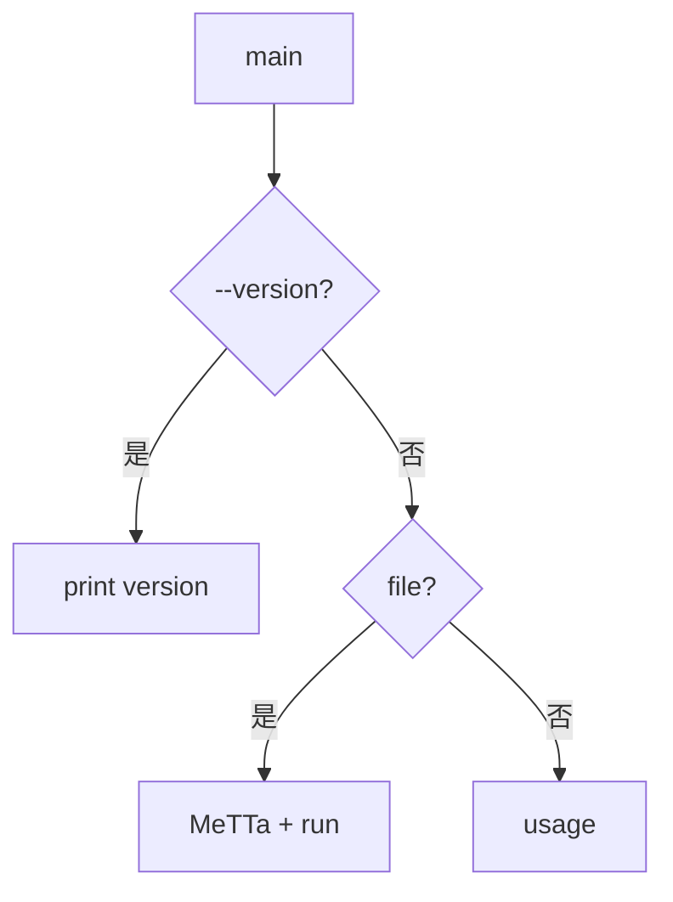
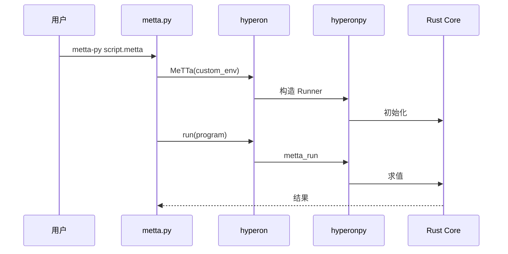
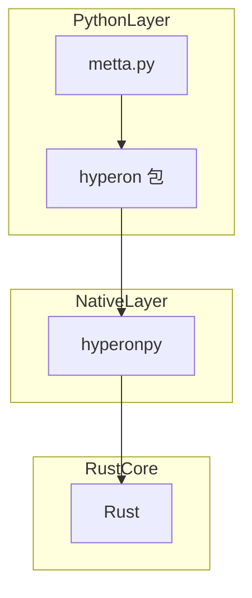

# `python/hyperon/metta.py` Python 源码分析报告

## 1. 文件定位与职责

- **`metta-py` CLI 入口**：`argparse` 解析 `--version` 或脚本路径（`L9-L38`）。
- 使用 **`hyperon.MeTTa`** 与 **`hyperon.Environment.custom_env`**：`working_dir` 为脚本目录，`config_dir=""`（`L31-L35`）。
- **不直接导入 hyperonpy**；原生能力经 `hyperon` 包。
- 角色：**CLI 入口**。

## 2. 公共 API 清单

| 符号名 | 类型 | 参数 | 返回值 | hp.* | MeTTa |
|--------|------|------|--------|------|-------|
| `main` | function | `()` | `None` | 无 | 解释器入口 |

## 3. 核心类与数据结构

无类定义。

## 4. hyperonpy 调用映射

无直接 `hp.*`；间接经 `runner.MeTTa`。

## 5. 回调函数分析

无。

## 6. 算法与关键策略

### 6.1 算法清单

| 算法 | 目标 | 步骤 |
|------|------|------|
| CLI | 路由 | `argparse` → version / run / usage |
| 运行脚本 | 执行 | `open` → `MeTTa().run(program)` → `print` |

### 6.2 详解

- **动机**：零样板运行 `.metta` 文件（`L31-L36`）。

## 7. 执行流程

1. 解析参数（`L22-L28`）。
2. `--version` → `print(hyperon.__version__)`（`L29-L30`）。
3. 有 `file` → `custom_env` + `MeTTa` + `run`（`L31-L36`）。
4. 否则 `print_usage`（`L37-L38`）。

## 8. 装饰器与模块发现机制

无。

## 9. 状态变更与副作用矩阵

| 操作 | 副作用 |
|------|--------|
| `run` | 解释器状态（经 MeTTa） |
| 打印 | stdout |

## 10. 流程图（Mermaid）

## 11. 时序图（Mermaid）

## 12. 架构图（Mermaid）

## 13. 复杂度与性能要点

- 整文件读入内存（`L33`）。

## 14. 异常处理全景

- 无自定义异常；IO/MeTTa 错误向上抛出。

## 15. 安全性与一致性检查点

- 仅读文件与解释执行，无 `eval`。

## 16. 对外接口与契约

- `file` 与 `--version` 互斥（`L23-L28`）。

## 17. 关键代码证据

- `main`（`L9-L38`）；`__main__`（`L40-L41`）。

## 18. 与 MeTTa 语义的关联

- 命令行执行 MeTTa 脚本；工作目录为脚本父目录。

## 19. 未确定项与最小假设

- `config_dir=""` 精确语义见 `runner.Environment.custom_env`（`L275-L278`）。

## 20. 摘要

- **职责**：`metta-py` CLI。
- **hyperonpy**：仅间接。
- **MeTTa**：脚本运行与版本输出。
- **依赖**：`hyperon`。
