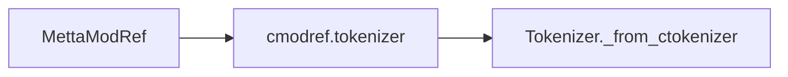
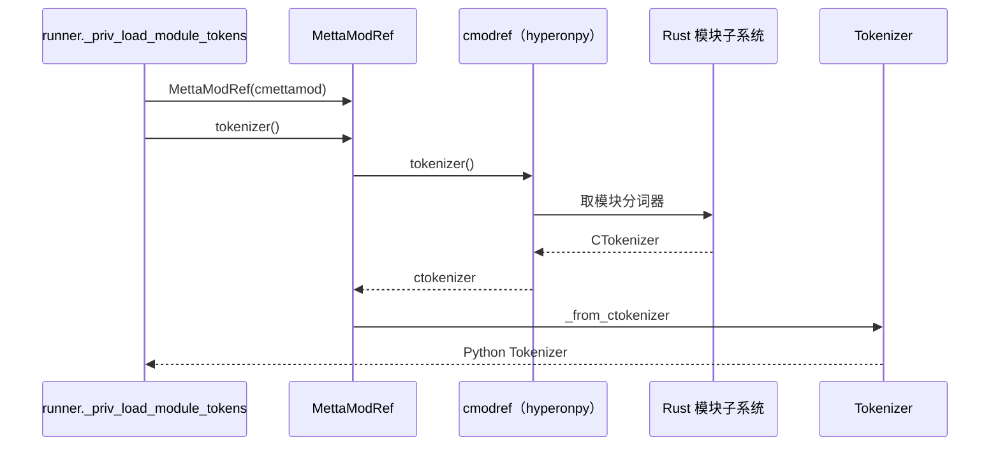
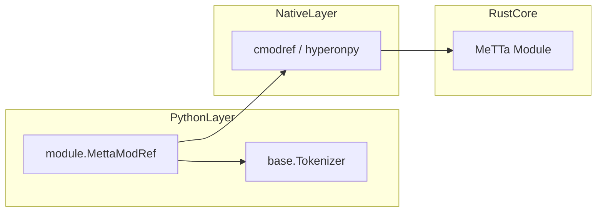

# `python/hyperon/module.py` Python 源码分析报告

## 1. 文件定位与职责

- 提供 **`MettaModRef`**：对「MeTTa 模块结构」的 Python 薄包装，持有一个由上层传入的 **`cmodref`**（`L3-L14`）。
- **`tokenizer()`** 将模块级分词器暴露为 `hyperon.base.Tokenizer` Python 包装（`L11-L13`）。
- 在 `runner._priv_load_module_tokens` 中用于把 `cmettamod` 包装后取 tokenizer（**调用关系在 `runner.py`**）。
- 角色：**模块引用**；处于 Python ↔ hyperonpy 边界上「模块句柄」一侧。

## 2. 公共 API 清单

| 符号名 | 类型 | 参数签名 | 返回值 | hp.*（模块级） | MeTTa 语义 |
|--------|------|----------|--------|----------------|------------|
| `MettaModRef` | class | `__init__(self, cmodref)` | 实例 | 无直接 `hp.` | 表示已加载的 MeTTa 模块视图 |
| `MettaModRef.tokenizer` | method | `(self)` | `Tokenizer` | 无：`cmodref.tokenizer()` | 模块内词法规则 |

## 3. 核心类与数据结构

| 类名 | 父类 | 关键属性 | C 对象 | `__del__` | 设计意图 |
|------|------|----------|--------|-----------|----------|
| `MettaModRef` | `object` | `cmodref`（绑定对象） | 由 `cmodref` 表示 | 无 | 延迟封装 `Tokenizer` |

**生命周期**：本文件**不释放** `cmodref`；**无法从当前文件确定** 所有权在 Rust 还是 Python。

## 4. hyperonpy 调用映射

本文件**未** `import hyperonpy as hp`。交互通过 **`cmodref` 对象的方法**（由扩展模块实现）：

| Python 方法 | 原生调用 | 推断 Rust 操作 | 参数转换 | 返回值转换 |
|-------------|----------|----------------|----------|------------|
| `tokenizer()` | `self.cmodref.tokenizer()` | 获取模块 Tokenizer 句柄 | 无 | `Tokenizer._from_ctokenizer(...)` |

## 5. 回调函数分析

本文件无 `_priv_call_*` 及向 Rust 注册的 Python 回调。

## 6. 算法与关键策略

### 6.1 算法清单

| 算法名 | 目标 | 步骤 | 复杂度 |
|--------|------|------|--------|
| 包装 tokenizer | 统一 Python API | 调用 `cmodref.tokenizer()` → `Tokenizer._from_ctokenizer` | O(1) |

### 6.2 详解

- **动机**：向模块加载逻辑提供与 `MeTTa.tokenizer()` 一致的 Python 类型（`L11-L13`）。
- **hyperonpy 交互点**：`cmodref.tokenizer()`（**具体符号在扩展中**）。

## 7. 执行流程

1. `MettaModRef(cmodref)` 保存引用。
2. 调用 `tokenizer()` 获取 CTokenizer 并包装为 `Tokenizer`。

## 8. 装饰器与模块发现机制

不涉及。

## 9. 状态变更与副作用矩阵

| 操作 | 状态变更 | 原生交互 | 可观测 |
|------|----------|----------|--------|
| `tokenizer()` | 新建 `Tokenizer` 包装 | 调用 `cmodref.tokenizer()` | Python 对象 |

## 10. 流程图（Mermaid）

## 11. 时序图（Mermaid）

## 12. 架构图（Mermaid）

## 13. 复杂度与性能要点

- 每次 `tokenizer()` 创建新 `Tokenizer` 包装（`L13`）；若热点路径频繁调用可考虑缓存（**当前文件未做**）。

## 14. 异常处理全景

- 无显式 `try/except`；`cmodref.tokenizer()` 异常向上传播。

## 15. 安全性与一致性检查点

- 无输入校验；错误 `cmodref` 类型由调用方保证。

## 16. 对外接口与契约

- `cmodref` 必须提供无参 `tokenizer()` 返回可被 `Tokenizer._from_ctokenizer` 接受的对象。

## 17. 关键代码证据

- 类与 `tokenizer`（`L3-L14`）。

## 18. 与 MeTTa 语义的关联

- **模块**：MeTTa 模块化加载后，每个模块拥有独立 tokenizer 视图；本类暴露该视图。

## 19. 未确定项与最小假设

- **无法从当前文件确定**：`cmodref` 的确切类型名与 Rust 侧结构体。
- 假设：`cmodref.tokenizer()` 返回 CTokenizer 兼容句柄。

## 20. 摘要

- **职责**：MeTTa 模块引用的 Python 包装，暴露 `tokenizer()`。
- **核心类**：`MettaModRef`。
- **hyperonpy**：通过 `cmodref` 实例方法间接交互，无 `hp.*` 顶层调用。
- **MeTTa**：模块级分词器访问。
- **性能**：O(1) 包装；注意重复创建 `Tokenizer`。
- **依赖**：`base.Tokenizer`。
