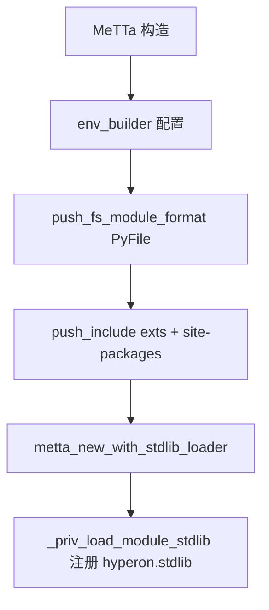
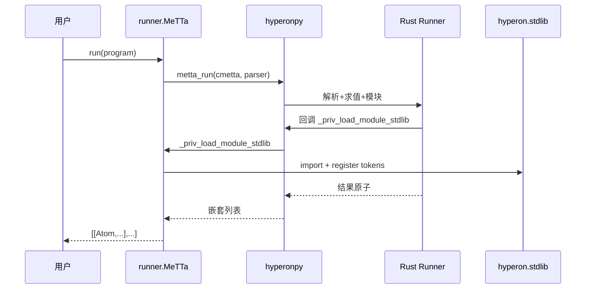
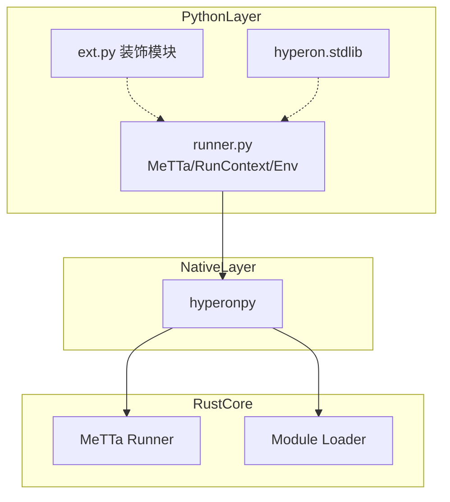

# `python/hyperon/runner.py` Python 源码分析报告

## 1. 文件定位与职责

- **`MeTTa`**：高层运行器——构造默认 `GroundingSpaceRef`、配置 **`EnvBuilder`**（含默认配置目录、**Python 文件模块格式** `_PyFileMeTTaModFmt`、`exts` 与 **site-packages** include 路径）、通过 **`metta_new_with_stdlib_loader`** 绑定 **stdlib 加载回调** `_priv_load_module_stdlib`（`L107-L132`）。
- **`RunnerState`**：基于 `SExprParser` 与 `hp.runner_state_new_with_parser` 的**增量运行**状态机（`L13-L53`）。
- **`RunContext`**：模块加载器内使用的上下文——初始化本模块空间、取 `MeTTa`/space/tokenizer、加载依赖、注册 token（`L63-L105`）。
- **`Environment`**：静态方法封装 **`env_builder_*`** 与 **`environment_config_dir`**，用于 CLI/测试/多环境（`L226-L286`）。
- **`_PyFileMeTTaModFmt`**：从文件系统加载 `*.py` 或 `__init__.py` 包目录形式的 MeTTa 模块，返回 `loader_func` 供 Rust 调用（`L288-L334`）。
- **模块加载私有链**：`_priv_load_module`、`_priv_load_module_tokens`、`_priv_register_module_tokens`、`_priv_load_module_stdlib`（`L336-L392`）。
- 调用链：**用户 / CLI → `MeTTa` → `hp.metta_*` / `hp.runner_state_*` / `hp.env_builder_*` → Rust Runner & Module 系统**。

**角色标签**：Runner/MeTTa 封装 / 模块加载 / 环境配置

## 2. 公共 API 清单

| 符号名 | 类型 | 参数签名 | 返回值 | hp.* | MeTTa 语义 |
|--------|------|----------|--------|------|------------|
| `RunnerState` | class | `(metta, program)` | 实例 | `runner_state_*` | 增量解释 |
| `ModuleDescriptor` | class | `(c_module_descriptor)` | 包装 | 无直接调用 | 模块描述 |
| `RunContext` | class | `(c_run_context)` | 实例 | `run_context_*` | 加载器上下文 |
| `MeTTa` | class | `(cmetta=None, space=None, env_builder=None)` | 实例 | `metta_*`, `env_builder_*` | 主运行器 |
| `Environment` | class | 静态方法 | 多种 | `environment_*`, `env_builder_*` | 进程环境 |
| `_PyFileMeTTaModFmt` | class | 静态方法 `path_for_name`/`try_path` | dict 或 None | `log_error` | `.py` 模块发现 |
| `_priv_*` | function | — | — | 部分 | 加载与注册 |

## 3. 核心类与数据结构

| 类名 | 父类 | 关键属性 | C 引用 | `__del__` | 设计意图 |
|------|------|----------|--------|-----------|----------|
| `RunnerState` | — | `parser`, `cstate` | `cstate` | `runner_state_free` | 保持 parser 存活（注释 `L20-L22`） |
| `ModuleDescriptor` | — | `c_module_descriptor` | ✅ | 无 | 透明包装 |
| `RunContext` | — | `c_run_context` | ✅ | 无 | 加载期 API |
| `MeTTa` | — | `cmetta` | ✅ | `metta_free` | 主句柄 |
| `Environment` | — | 无状态 | — | 无 | 构建器工厂 |

**MeTTa 构造路径**（`L110-L132`）：无 `cmetta` 时新建 space → `env_builder_start` → 默认配置目录 → `push_fs_module_format(_PyFileMeTTaModFmt)` → `push_include_path(exts)` → 遍历 `site.getsitepackages()` → `metta_new_with_stdlib_loader(_priv_load_module_stdlib, space.cspace, env_builder)`。

## 4. hyperonpy 调用映射

### 4.1 RunnerState

| Python | hp.* |
|--------|------|
| `__init__` | `runner_state_new_with_parser` |
| `__del__` | `runner_state_free` |
| `run_step` | `runner_state_step`, `runner_state_err_str`（非 None 则 `RuntimeError`） |
| `is_complete` | `runner_state_is_complete` |
| `current_results` | `runner_state_current_results` → 包装为 `Atom` 列表的列表 |

### 4.2 RunContext

| Python | hp.* |
|--------|------|
| `init_self_module` | `run_context_init_self_module` |
| `metta` | `run_context_get_metta` |
| `space` | `run_context_get_space` |
| `tokenizer` | `run_context_get_tokenizer` |
| `load_module` | `run_context_load_module` |
| `import_dependency` | `run_context_import_dependency` |

### 4.3 MeTTa

| Python | hp.* |
|--------|------|
| `__del__` | `metta_free` |
| `__eq__` | `metta_eq` |
| `space` / `tokenizer` / `working_dir` | `metta_space`, `metta_tokenizer`, `metta_working_dir` |
| `register_token` | 委托 `Tokenizer.register_token` → `tokenizer_register_token` |
| `load_module_direct_from_func` | `metta_load_module_direct`, `metta_err_str` |
| `load_module_at_path` | `metta_load_module_at_path`, `metta_err_str` |
| `run` | `metta_run`, `metta_err_str` |
| `evaluate_atom` | `metta_evaluate_atom`, `metta_err_str` |

### 4.4 Environment

| Python | hp.* |
|--------|------|
| `config_dir` | `environment_config_dir` |
| `init_common_env` | `custom_env` → `env_builder_init_common_env` |
| `test_env` | `env_builder_use_test_env` |
| `custom_env` | `env_builder_start`, `set_working_dir`, `set_config_dir`, `set_default_config_dir`, `create_config_dir`, `set_is_test`, `push_include_path` |

### 4.5 模块格式

| Python | hp.* |
|--------|------|
| `_PyFileMeTTaModFmt` 失败 | `log_error` |

## 5. 回调函数分析

| 回调名 | 被谁调用 | 触发时机 | 参数 | 返回值/契约 | 错误处理 |
|--------|----------|----------|------|-------------|----------|
| `_priv_load_module_stdlib` | Rust stdlib 加载器 | 初始化内置 stdlib | `tokenizer`, `metta` | 注册 `hyperon.stdlib` tokens | 依赖 `import_module` |
| `_priv_load_module` | Rust（`loader_func` 包装） | Python 模块体加载 | `loader_func`, `path`, `c_run_context` | 初始化空间并调用 `loader_func(tokenizer, metta)` | 异常→**可能跨 FFI** |
| `_priv_load_module_tokens` | Rust | 仅注册 tokens | `loader_func`, `cmettamod`, `cmetta` | 调 `loader_func` | 同上 |
| `_PyFileMeTTaModFmt.try_path` 内 `loader_func` | 返回给 Rust 的 dict | 模块实例化 | `tokenizer`, `metta` | 调 `_priv_register_module_tokens` | 异常记录 `log_error` 返回 None |
| `metta_load_module_direct` 的 `loader_func` | 用户传入 | 直接加载 | `tokenizer`, `metta` | 用户定义 | `metta_err_str` |

## 6. 算法与关键策略

### 6.1 算法清单

| 策略 | 目标 | 步骤 | 复杂度 |
|------|------|------|--------|
| `_parse_all` | 流式解析 | `while True: parse` 直到 `None` | O(原子数) |
| `_PyFileMeTTaModFmt.try_path` | 找 `.py` 或包 | 存在性检查 → `spec_from_file_location` → `exec_module` | O(1) IO |
| `_priv_register_module_tokens` | 扫描注册 | `dir(mod)` → 检查 `metta_type` | O(符号数) |

### 6.2 详解：`_priv_register_module_tokens`（`L372-L392`）

- **动机**：约定优于配置，扫描模块内被 `ext.register_*` 标记的函数。
- **路径**：`import_module` → `dir` → 若 `metta_pass_metta` 则 `obj(metta)` 否则 `obj()` → 按 `RegisterType.ATOM` 注册 atom 或 `TOKEN` 注册 lambda。
- **失败**：导入失败等在调用链上层体现。

## 7. 执行流程

### 7.1 主流程：`MeTTa.run`（`L206-L214`）

1. 新建 `SExprParser(program)`。
2. `hp.metta_run(cmetta, parser.cparser)`。
3. `_run_check_for_error` 读 `metta_err_str`。
4. 将结果嵌套列表包装为 `Atom`。

### 7.2 异常与边界

- `runner_state_step`、`metta_*`：`err_str` 非 None → `RuntimeError`（`L35-L37`、`L221-L224`）。
- `RunContext.import_dependency`：`ModuleId` 无效 → `RuntimeError`（`L100-L105`）。

## 8. 装饰器与模块发现机制

- 与 **`ext.py`** 配合：`metta_type` / `metta_pass_metta`（`L377-L392`）。
- **`importlib.util.spec_from_file_location`** 加载文件路径模块（`L315-L320`）。

## 9. 状态变更与副作用矩阵（节选）

| 操作 | 状态 | hp | 可观测 |
|------|------|-----|--------|
| `MeTTa()` | 新 runner、环境 | `metta_new_with_stdlib_loader` | — |
| `run` | 空间/模块副作用 | `metta_run` | 结果或 `RuntimeError` |
| `load_module_at_path` | 模块表变 | `metta_load_module_at_path` | `mod_id` |
| `_priv_register_module_tokens` | tokenizer 规则变 | `tokenizer_register_token` | — |

## 10. 流程图（Mermaid）

## 11. 时序图（Mermaid）

## 12. 架构图（Mermaid）

## 13. 复杂度与性能要点

- `run` 与 `RunnerState` 均为 FFI 密集；`current_results` 可能频繁分配 Python 列表。
- `site.getsitepackages()` 在 **每个** `MeTTa()` 默认构造时执行（`L128-L130`）。

## 14. 异常处理全景

- 统一模式：`RuntimeError(err_str)`（`metta_err_str` / `runner_state_err_str`）。
- `_PyFileMeTTaModFmt`：`except Exception` → `log_error` → `None`（`L332-L334`）。

## 15. 安全性与一致性检查点

- `sys.modules[metta_mod_name] = module` 可能覆盖已存在模块名（注释 `L309-L314`）。
- `find_py_obj` 在 `stdlib` 使用 `exec`（**不在本文件**）。

## 16. 对外接口与契约

- `run(program, flat=False)`：默认返回 **按「求值轮次」分组的列表的列表**；`flat=True` 展平（`L206-L214`）。
- `load_module_*`：失败抛 `RuntimeError` 并带 Rust 错误串。

## 17. 关键代码证据

- `RunnerState`（`L13-L53`）。
- `MeTTa.__init__`（`L110-L132`）。
- `MeTTa.run` / `evaluate_atom`（`L206-L219`）。
- `_priv_register_module_tokens`（`L372-L392`）。
- `_PyFileMeTTaModFmt`（`L288-L334`）。

## 18. 与 MeTTa 语义的关联

- **Runner**：对应 MeTTa 程序执行、模块解析路径、顶层空间与 tokenizer。
- **RunContext**：对应 `!` 模块加载与依赖导入语义（Rust 侧具体规则 **无法从当前文件确定**）。

## 19. 未确定项与最小假设

- `ModuleId`、`EnvBuilder` 的 C 层所有权与线程安全。
- `run_context_init_self_module` 失败处理（`L74` TODO）。

## 20. 摘要

- **职责**：`MeTTa` 运行器、增量 `RunnerState`、环境构建、Python 文件模块加载与 stdlib 注册。
- **核心类**：`MeTTa`、`RunContext`、`RunnerState`、`Environment`。
- **hyperonpy**：`metta_*`、`runner_state_*`、`env_builder_*`、`run_context_*`。
- **MeTTa**：执行、模块、tokenizer、工作目录与配置目录。
- **性能**：默认构造扫描 site-packages；运行期 FFI。
- **依赖**：`atoms`、`base`、`ext.RegisterType`、`module.MettaModRef`、`importlib`、`site`。
