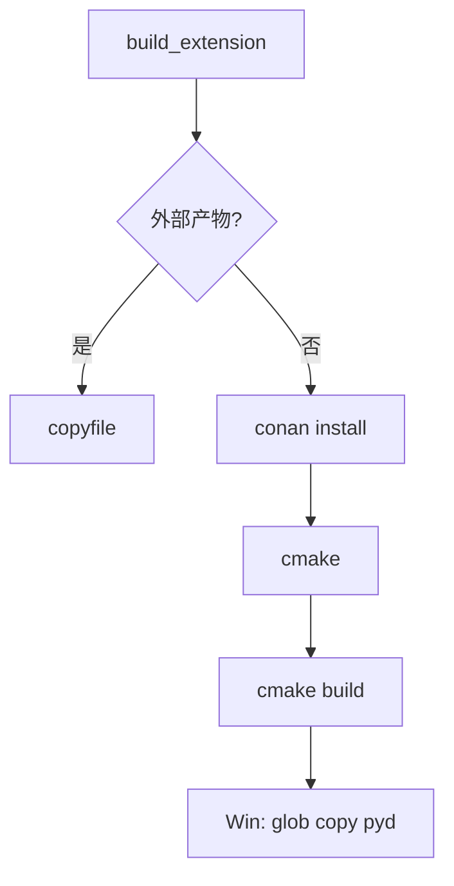
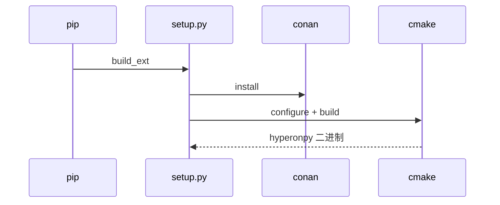
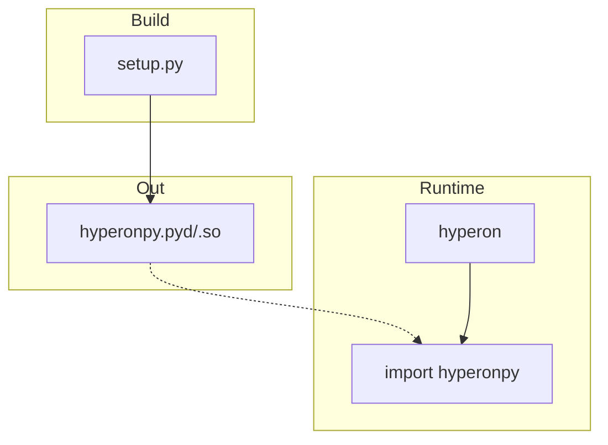

# `python/setup.py` Python 源码分析报告

## 1. 文件定位与职责

- **setuptools 构建**：扩展名 **`hyperonpy`**，自定义 **`CMakeBuild`**（Conan + CMake）（`L111-L118`）。
- **`CMakeExtension`**：无 `sources`，带 `sourcedir`（`L14-L17`）。
- **版本**：`use_scm_version` + 从 `./VERSION` 读的 `version_scheme`，生成 `hyperon/_version.py`（`L100-L117`）。
- **Windows**：glob 找 `.pyd` 复制到 setuptools 路径（`L85-L98`）。
- 角色：**构建配置**；运行时无关。

## 2. 公共 API 清单

| 符号名 | 类型 | 说明 |
|--------|------|------|
| `resolve_path` | function | 绝对路径 |
| `CMakeExtension` | class | CMake 扩展占位 |
| `CMakeBuild` | class | `build_ext` 子类 |
| `get_version` | function | 读 VERSION 文件 |
| `version_scheme` | function | setuptools-scm 钩子 |
| `setup(...)` | 调用 | 包元数据与 ext_modules |

## 3. 核心类与数据结构

| 类名 | 父类 | 关键属性 | 设计意图 |
|------|------|----------|----------|
| `CMakeExtension` | `Extension` | `sourcedir` | CMake 根 |
| `CMakeBuild` | `build_ext` | — | 构建管线 |

## 4. hyperonpy 调用映射

构建产物为 **`hyperonpy`**；无运行时 `import hyperonpy`。

| 步骤 | 命令/操作 |
|------|-----------|
| 外部构建 | `shutil.copyfile` 预编译 |
| 源码构建 | `conan install` → `cmake` → `cmake --build` |

## 5. 回调函数分析

无 Python→Rust 运行时回调；仅有 setuptools **`build_extension`** 钩子（`L19-L23`）。

## 6. 算法与关键策略

### 6.1 算法清单

| 策略 | 步骤 |
|------|------|
| `_copy_externally_built` | 若 `sourcedir/basename` 存在则复制 |
| `_build_with_cmake` | Conan → CMake 配置 → build → Win 下 copy pyd |

### 6.2 失败路径

- `subprocess.run(..., check=True)` 非零退出抛异常。

## 7. 执行流程

1. `build_extension` → 尝试复制外部产物。
2. 否则 Conan + CMake 构建。
3. Windows 下 glob `hyperonpy.cp*` 复制。

## 8. 装饰器与模块发现机制

无。

## 9. 状态变更与副作用矩阵

| 操作 | 副作用 |
|------|--------|
| CMake/Conan | 写 `build_temp`、编译产物 |
| copy | 安装 tree 中的扩展路径 |

## 10. 流程图（Mermaid）

## 11. 时序图（Mermaid）

> 图示为**构建期**生成 `hyperonpy`，非运行时 Python→hp 调用。

## 12. 架构图（Mermaid）

## 13. 复杂度与性能要点

- 构建 CPU/IO 密集；`glob` 多匹配时取 `[0]` 可能不确定（`L97-L98`）。

## 14. 异常处理全景

- `get_version`：`except` 打 stderr（`L100-L105`）。

## 15. 安全性与一致性检查点

- 构建信任 Conan 与 CMake 工程；`CMAKE_PREFIX_PATH` 含 `~/.local`（`L42`）。

## 16. 对外接口与契约

- 环境变量：`DEBUG`、`CMAKE_ARGS`、`CMAKE_BUILD_PARALLEL_LEVEL`（`L40-L62`）。

## 17. 关键代码证据

- `CMakeExtension`/`CMakeBuild`（`L14-L98`）；`setup(...)`（`L111-L118`）。

## 18. 与 MeTTa 语义的关联

- 间接：产出 `hyperonpy` 供 MeTTa Python 绑定。

## 19. 未确定项与最小假设

- CMake 工程细节不在本文件。

## 20. 摘要

- **职责**：Conan/CMake 构建安装 `hyperonpy` + 版本方案。
- **hyperonpy**：构建目标名，无运行时调用。
- **依赖**：setuptools、conan、cmake、工具链。
