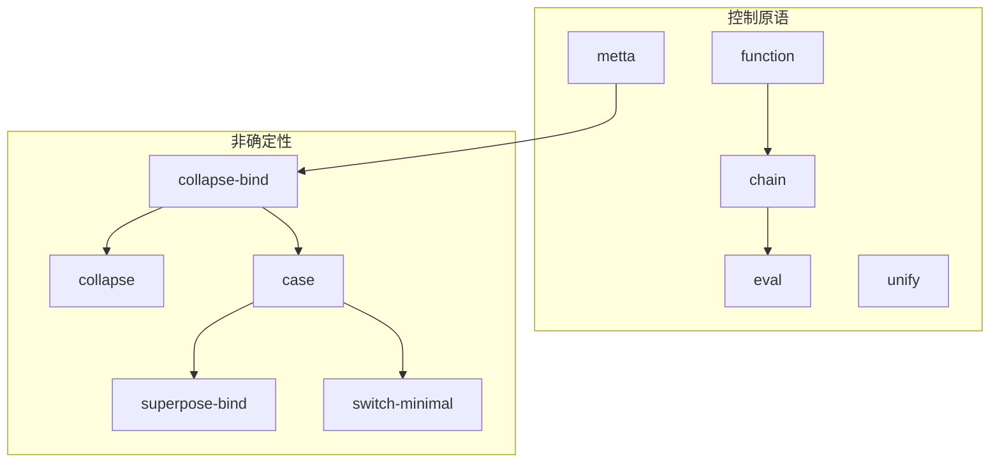
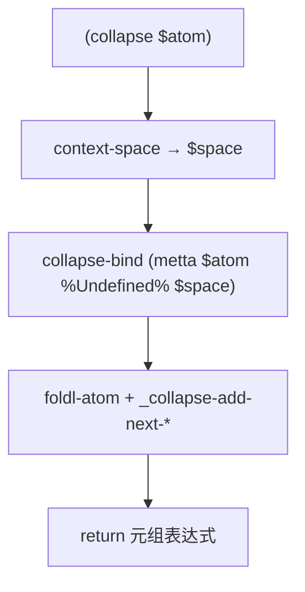

# `lib/src/metta/runner/stdlib/stdlib.metta` MeTTa 源码分析报告

> **规模**：1421 行；通过 `lib/src/metta/runner/stdlib/mod.rs` 中 `include_str!("stdlib.metta")` 作为 **corelib** 源码加载（`METTA_CODE`）。

## 1. 文件定位与职责

- **Hyperon MeTTa 标准库核心**：在 `corelib` 模块空间中注入类型事实、归约规则与 `@doc`，与 Rust 侧注册的 **Grounded 操作**（`stdlib/*.rs`）共同构成可编程语义。
- **解释器原语的类型化文档**：`eval` / `chain` / `function` / `unify` / `metta` / `collapse-bind` / `superpose-bind` 等，在 MeTTa 层给出 `(: …)` 签名，便于类型检查 pragma 与 `get-doc`。
- **控制与抽象**：`switch` / `switch-minimal` / `switch-internal`、`case`、`collapse` 协调 **非确定性** 与 **Empty** 语义（注释 `L331-L337` 明确 `case` 与 `switch` 对 Empty 的差异）。
- **数据结构/集合**：`map-atom` / `filter-atom` / `foldl-atom` 基于 `sealed` + `atom-subst` 实现高阶风格列表操作；`unique` / `union` / `intersection` / `subtraction` 基于 `collapse` 与 `*-atom` Grounded。
- **类型辅助**：`is-function`、`type-cast`、`match-types`、`match-type-or`、`first-from-pair` 支撑运行时类型与文档。
- **文档子系统**：`@doc`/`@desc`/`@param`/`@return`/`@doc-formal` 等类型声明 + `get-doc*` / `help!` / `help-space!` / `help-param!`。
- **测试断言**：`assertEqual*`、`assertAlphaEqual*`、`assertIncludes`、`assert` 定义在 stdlib 内，供 `lib/tests/*.metta` 使用。
- **文件类别**：标准库核心定义 / 类型系统声明 / 文档系统 / 状态管理示例（`new-state`）/ 非确定性语义规范。

## 2. 原子清单与分类

### 2.1 按逻辑段落的顶层表达式汇总

下列将 **连续同主题** 的顶层式合并为一行描述；`@doc` 块计为文档类；`(: …)` 为类型声明；`(= …)` 为函数定义；分号注释为文档/注释。

| 行号区间 | 表达式摘要 | 分类 | 涉及的关键符号 | 语义说明 |
|----------|------------|------|----------------|----------|
| L1-L7 | `@doc` 描述 `=`；`(: = (-> $t $t %Undefined%))` | 文档+类型 | `=` | 等式符号的类型事实 |
| L8-L40 | `ErrorType`/`SpaceType`/`BadType`/`BadArgType`/`IncorrectNumberOfArguments`/`Error` | 文档+类型 | 错误类型 ADT | 错误原子类型骨架 |
| L42-L69 | `return`/`function`/`eval`/`evalc`/`chain` | 文档+类型 | 解释器控制原语 | 最小完备求值组合子类型 |
| L71-L88 | `unify` | 文档+类型 | `unify` | 合一选择分支 |
| L90-L134 | `cons-atom`/`decons-atom`/`context-space`/`min-atom`/`max-atom`/`size-atom`/`index-atom` | 文档+类型（部分仅文档） | 表达式解构、上下文空间 | Grounded 在 Rust；此处多为文档+类型 |
| L136-L232 | `pow-math`…`isinf-math` | 文档（+类型在 Rust 注册） | 数学库 | 浮点/三角/特殊值 |
| L234-L255 | `collapse-bind`/`superpose-bind`/`metta` | 文档+类型 | 非确定性收集、子解释器 | 与 `interpreter.rs` 强绑定 |
| L257-L283 | `id`/`noeval`/`atom-subst` | 类型+`=` | `id`, `noeval`, `atom-subst` | 恒等、防求值、替换 |
| L284-L329 | `if-decons-expr`/`if-error`/`return-on-error` | 类型+`=` | 条件解构、错误处理 | `function`+`chain` 组合 |
| L331-L365 | `switch`/`switch-minimal`/`switch-internal` | 文档+类型+`=` | 多分支匹配 | 注释讨论 Empty |
| L367-L385 | `is-function` | 文档+类型+`=` | `get-metatype`, `decons-atom` | 通过形 `->` 识别函数类型 |
| L387-L446 | `type-cast`/`match-types`/`first-from-pair`/`match-type-or` | 类型+`=` | `collapse-bind`, `get-type` | 运行时类型兼容 |
| L447-L498 | `filter-atom`/`map-atom`/`foldl-atom` | 文档+类型+`=` | `sealed`, `_minimal-foldl-atom` | 高阶列表；foldl 调 Rust 辅助 |
| L500-L559 | 分段注释 + `if`/`let`/`let*` | 文档+类型+`=` | `if`, `let`, `let*` | 布尔与绑定 |
| L561-L683 | `add-reduct`/`car-atom`/`cdr-atom`/`quote`/`unquote`/`nop`/`empty`/`unique*`/`add-reducts`/`add-atoms` | 类型+`=` | 空间、引用、集合 | 核心数据与空间批注 |
| L685-L704 | `assertIncludes`/`assert` | 类型+`=` | `collapse`, `metta`, `subtraction-atom` | 测试与真值断言 |
| L706-L787 | `@doc` 元文档 + `(: @doc`/`@desc`/… | 文档+类型 | 文档 ADT | 文档类型闭包 |
| L789-L933 | `get-doc*` / `help!` / `help-internal!` / `help-space!` / `help-param!` | 类型+`=` | `println!`, `format-args`, `mod-space!` | 文档检索与打印；**`help-space!` 有两条同头 `(= (help-space! $space) …)`（L924-L928 与 L929-L933）** |
| L945-L967 | `for-each-in-atom`/`noreduce-eq` | 类型+`=` | 递归迭代 | |
| L969-L1056 | Grounded 操作仅 `@doc`（`add-atom`…`match`…`module-space-no-deps` 等） | 文档 | 对应 Rust 注册名 | 无 MeTTa 体 |
| L1031-L1035 | `new-state` | 类型+`=` | `_new-state`, `get-type-space`, `collapse` | 状态 monad 包装 |
| L1088-L1190 | `assertEqual*` / `assertAlphaEqual*` | 类型+`=` | `metta`, `collapse`, `_assert-results-*` | 与 debug.rs 辅助 Grounded 协作 |
| L1192-L1233 | `superpose`/`collapse`/`case` | 文档+类型+`=` | `collapse-bind`, `superpose-bind`, `switch-minimal` | **非确定性核心** |
| L1235-L1303 | `capture`/`pragma!`/`import!`/`include`/`bind!`/`trace!`/`println!`/`format-args`/`sort-strings`/`sealed` | 文档 | Rust 实现 | 模块与 IO |
| L1305-L1421 | 算术比较 `@doc` + `git-module!` | 文档 | `+ - * / % < > <= >= == xor`, `unique-atom` 等 | 实现在 `arithmetics.rs`/`atom.rs` |

### 2.2 附录 A：本文件内 **全部** `(: …)` 类型声明（行号）

`L7, L10, L13, L21, L30, L32, L40, L47, L54, L61, L69, L78, L88, L96, L103, L109, L239, L246, L255, L262, L270, L280, L293, L307, L325, L345, L349, L361, L376, L454, L474, L494, L511, L542, L552, L567, L575, L586, L597, L605, L629, L638, L649, L660, L671, L681, L691, L700, L717-L718, L725, L732-L733, L740-L741, L753-L755, L762, L769, L773, L780, L787, L795, L808, L822, L835, L849, L868, L882, L888, L891, L912, L923, L940, L951, L966, L1031, L1094, L1108, L1121, L1135, L1148, L1161, L1173, L1186, L1203, L1224`

### 2.3 附录 B：本文件内 **全部** `(= …)` 函数等式（起始行）

`L263, L271, L281, L294, L308, L326, L346, L350, L362, L377, L394, L413, L429, L442, L455, L475, L495, L512-L513, L543, L553, L568, L576, L587, L598, L606, L614-L615, L622, L630, L639, L650, L661, L672, L682, L692, L701, L796, L809, L823, L836, L850, L869, L883, L889, L892, L913, L924, L929, L941, L952, L967, L1032, L1095, L1109, L1122, L1136, L1149, L1162, L1174, L1187, L1204, L1225`

**说明**：`help-space!` 于 `L924` 与 `L929` **重复相同模式头**；两条体分别匹配 **四段式 `@doc`** 与 **两段式 `@doc`**，在调用 `(help-space! $space)` 时两条 `(= …)` 均可匹配同一模式，构成 **多定义重叠**（非确定性或多结果行为依赖解释器对多条 `=` 的调度策略）。

## 3. 知识图谱（空间内容分析）

执行加载后 `corelib` 空间大致包含：

- **类型事实**：错误 ADT、`->` 相关、`StateMonad`、`Doc*` 系列、各内置操作类型（与 Rust `type_()` 可能重复或互补）。  
- **归约规则**：从 `id` 到 `case` 的纯 MeTTa 定义；断言族；文档查询族。  
- **仅文档、无 MeTTa 体**：大量数学、`+`、模块原语等——依赖 Rust tokenizer。

**依赖关系（摘取）**：

- `collapse` → `collapse-bind` + `metta` + `foldl-atom` + `_collapse-add-next-atom-from-collapse-bind-result`（Rust）。  
- `case` → `collapse-bind` + `superpose-bind` + `switch-minimal`。  
- `type-cast` → `get-metatype` + `get-type` + `collapse-bind` + `map-atom` + `foldl-atom` + `match-type-or`。  
- `assertEqual` → `metta` + `collapse` + `_assert-results-are-equal`（Rust）。  
- `foldl-atom` → `_minimal-foldl-atom`（Rust，`core.rs`）。

## 4. 函数定义详解

### 4.1 总表（函数名 | 等式数 | 递归 | 主要内置）

| 函数名 | 等式数 | 递归? | 主要依赖 |
|--------|--------|-------|----------|
| id | 1 | 否 | — |
| noeval | 1 | 否 | — |
| atom-subst | 1 | 否 | function, chain, eval, noeval |
| if-decons-expr | 1 | 否 | eval, decons-atom, unify, if-equal |
| if-error | 1 | 否 | 嵌套 eval / decons / unify |
| return-on-error | 1 | 否 | if-equal, if-error |
| switch | 1 | 否 | switch-minimal |
| switch-minimal | 1 | 否 | decons-atom, chain, eval, switch-internal, if-equal |
| switch-internal | 1 | 否 | unify, chain, switch-minimal |
| is-function | 1 | 否 | get-metatype, size-atom, decons-atom, unify |
| type-cast | 1 | 否 | chain, eval, get-metatype, collapse-bind, get-type, map-atom, foldl-atom, match-type-or, if |
| match-types | 1 | 否 | if-equal, unify |
| first-from-pair | 1 | 否 | unify |
| match-type-or | 1 | 否 | chain, match-types, or |
| filter-atom / map-atom | 各1 | 是（列表） | sealed, decons-atom, cons-atom, atom-subst |
| foldl-atom | 1 | 否（委托） | context-space, _minimal-foldl-atom |
| if | 2 | 否 | 模式 True/False |
| let | 1 | 否 | unify |
| let* | 1 | 是（对子列表） | decons-atom, unify, let |
| add-reduct | 1 | 否 | add-atom |
| car-atom / cdr-atom | 各1 | 否 | decons-atom, unify |
| quote / unquote | 各1 | 否 | NotReducible 特殊 |
| nop | 2 | 否 | 多 arity |
| empty | 1 | 否 | Empty |
| unique / union / intersection / subtraction | 各1 | 否 | collapse, superpose, *-atom |
| add-reducts / add-atoms | 各1 | 是（foldl） | foldl-atom, add-atom |
| assertIncludes | 1 | 否 | collapse, subtraction-atom, if, Error |
| assert | 1 | 否 | context-space, metta, unify |
| get-doc 族 | 多 | 部分递归 | case, unify, get-type-space, is-function, car-atom, cdr-atom |
| help! 族 | 多 | 部分 | println!, format-args, mod-space!, module-space-no-deps, collapse |
| for-each-in-atom | 1 | 是 | noreduce-eq, car-atom, cdr-atom |
| noreduce-eq | 1 | 否 | ==, quote |
| new-state | 1 | 否 | chain, context-space, collapse, get-type-space, _new-state |
| assertEqual* 族 | 各1 | 否 | chain, metta, collapse, _assert-results-* |
| collapse | 1 | 否 | function, chain, collapse-bind, metta, foldl-atom, _collapse-add-next-* |
| case | 1 | 否 | function, chain, collapse-bind, metta, superpose-bind, switch-minimal, == |

### 4.2 核心函数详解（精选）

#### 4.2.1 `atom-subst`（`L281-L282`）

- **功能**：将 `$templ` 中变量 `$var` 替换为 **已求值** 的 `$atom`；通过 `(function (chain (eval (noeval $atom)) $var (return $templ)))` 保证先算值再代入模板。  
- **终止**：单次 `function/chain`。  
- **非确定性**：若 `$atom` 求值多分支，由 `eval`/`metta` 语义决定。

#### 4.2.2 `switch-minimal` 与 `case`（`L350-L365`, `L1225-L1233`）

- **`switch-minimal`**：`decons-atom $cases` → `switch-internal`；若结果为 `NotReducible` 则映射为 `Empty`（`if-equal $res NotReducible Empty $res`），避免裸 `NotReducible` 泄漏。  
- **`case`**：先用 `collapse-bind (metta $atom …)` 得 `$c`；若 `$c` 为空列表（`== $c ()` 为 True），走 `switch-minimal Empty $cases`；否则 `superpose-bind $c` 得单枝 `$e` 再 `switch-minimal $e $cases`。  
- **与 `switch` 差异**：注释 `L331-L337`——在完整解释器中 `switch` 的第一参若为 `Empty` 可能被外层打断；`case` 在体内部处理 Empty。

#### 4.2.3 `collapse`（`L1204-L1209`）

- **链**：`collapse-bind (metta $atom %Undefined% $space)` → `foldl-atom` 聚合为 **单一表达式**，其中每项来自 `_collapse-add-next-atom-from-collapse-bind-result`（Rust 从 `(Atom Bindings)` 对中提取原子）。  
- **意义**：把非确定性结果 **收束** 为元组（表达式），供比较与调试。

#### 4.2.4 `type-cast`（`L394-L403`）

- **流程**：元类型与目标类型相同则直接返回；否则 `collapse-bind (eval (get-type $atom $space))` 得可能多类型，取每对之 `first-from-pair`，再 `foldl-atom` + `match-type-or` 判断是否存在与 `$type` 可合一的实际类型；否则 `(Error $atom BadType)`。  
- **依赖类型味道**：`get-type` 可返回多事实；用 `or` 聚合。

#### 4.2.5 `map-atom` / `filter-atom`（`L455-L483`）

- **模式**：对列表 head **密封**映射/谓词表达式（`sealed ($var) …)`）防变量捕获，再 `atom-subst` 代入 head，递归尾。  
- **递归**：结构递归，终止于空列表返回 `()`。

#### 4.2.6 `assertEqual`（`L1095-L1099`）

- **体**：对 `$actual` 与 `$expected` 分别 `metta (collapse …)` 得结果集，再调用 `_assert-results-are-equal`（Rust）比较集合Equality。  
- **与 `assertEqualToResult` 差异**：后者不对 `$expected-results` 求值（`L1142-L1147` 文档）。

#### 4.2.7 `new-state`（`L1032-L1035`）

- **体**：取 `context-space` 中 `$x` 的类型（`collapse (get-type-space $space $x)`）传给 `_new-state`（Rust），构造 `State` Grounded。

## 5. 求值流程分析

### 5.1 执行表达式流程

本文件 **自身** 无 `!(expr)`；执行表达式出现在用户脚本或测试中。

### 5.2 关键求值链示例：`case` 与非确定性

```
!(case (superpose (A B)) ((A 1) (B 2)))
→ metta 求值第一参 → collapse-bind 得多分支
→ 各分支 superpose-bind → switch-minimal
```

**证据**：`L1225-L1233`。

## 6. 类型系统分析

- **多声明与重载**：`@doc`、`help!`、`help-internal!` 等同名多个 `(: …)` arity/返回不同，模拟重载。  
- **`%Undefined%`**：广泛用于“未知返回/参数类型”。  
- **`->` 构造子**：`is-function` 通过检测表达式首元素是否为 `->` 判断（`L377-L384`），注释 `L367-L370` 承认 **`->` 本身类型不完备**，依赖 `%Undefined%` 宽松匹配。  
- **`StateMonad`**：`new-state` 返回 `(StateMonad $t)`（`L1031`）。  
- **错误类型**：`BadType`、`BadArgType`、`Error` 等构成轻量类型层错误。

## 7. 推理模式分析

- **以前向事实与空间查询为主**：`type-cast` 使用 `get-type` 非后向链。  
- **`match` 在注释与 `get-doc` 中**：通过 `unify $space (@doc …)` 扫描文档事实，属 **模式查询**，非谓词逻辑推理。

## 8. 状态与副作用分析

| 操作 | 行号 | 副作用类型 | 影响范围 | 时序依赖 |
|------|------|------------|----------|----------|
| add-reduct / add-reducts / add-atoms | L568-L683 | 空间修改 | 目标 space | — |
| assert | L701-L704 | 求值 + 可能 Error | 当前上下文空间 | — |
| help! / println! | L883+ | 输出 | stdout | — |
| new-state / change-state!（文档 L1026+） | L1031+ | 可变状态 | State GND | Rust |

## 9. 断言与预期行为

本文件 **定义** 断言而非自测。行为摘要：

| 行号 | 断言符号 | 语义 |
|------|----------|------|
| L692-L698 | assertIncludes | `collapse` 实际结果集包含期望子集 |
| L701-L704 | assert | `metta` 得 True |
| L1095+ | assertEqual* | 双通道 collapse + 集合比较 |
| L1149+ | assertEqualToResult* | 仅左通道求值 |

## 10. 知识图谱图（Mermaid）



## 11. 求值链图（Mermaid）



## 12. 空间快照图（Mermaid）


## 13. MeTTa 语言特性覆盖

| 语言特性 | 使用位置(行号) | 使用方式 |
|----------|----------------|----------|
| `(:` / `->` / 参数化 | 通篇 | 类型事实 |
| `(=` | 附录 B | 归约规则 |
| `function` / `chain` / `return` | L281+, L350+, L1205+ | 控制流 |
| `unify` / `let` / `let*` | L543+, L553+ | 绑定 |
| `if` / `if-equal` | L512+, 多处 | 条件 |
| `match`（在 type-cast 外主要在 get-doc unify） | L823+ | 空间模式 |
| `superpose` / `collapse` / `collapse-bind` | L630+, L1204+ | 非确定性 |
| `case` / `switch` | L346+, L1225+ | 分支 |
| `quote` / `noeval` | L598+, L271+ | 防求值 |
| `sealed` | L458+, L478+ | 高阶安全替换 |
| `@doc` 元语言 | L706+ | 文档 ADT |
| `Error` 构造 | L394+, L692+ | 类型错误与断言错误 |

## 14. 底层实现映射

| MeTTa 操作 | Rust 实现位置 | 关键逻辑摘要 |
|------------|---------------|----------------|
| `stdlib.metta` 整体加载 | `runner/stdlib/mod.rs` | `METTA_CODE` + `CoreLibLoader::load` |
| `match` | `stdlib/core.rs` `MatchOp` | `space.query` |
| `if-equal` | `stdlib/core.rs` `IfEqualOp` | 结构等价 |
| `==` / `+` / … | `stdlib/core.rs` / `arithmetics.rs` | Grounded |
| `superpose` / `_minimal-foldl-atom` / `_collapse-add-next-*` | `stdlib/core.rs` | 注册 token |
| `sealed` | `stdlib/core.rs` `SealedOp` | 变量唯一化 |
| `metta` / `eval` / `chain` / `function` / `collapse-bind` | `lib/src/metta/interpreter.rs` | 解释器栈机 |
| `_assert-results-are-equal*` | `stdlib/debug.rs` | 集合比较 |
| `_new-state` | `stdlib/space.rs`（约 L214 引用） | State 构造 |
| `println!` / `format-args` | `stdlib/string.rs` 等 | I/O |
| `import!` / `bind!` / `mod-space!` | `stdlib/module.rs` | 模块系统 |
| 数学 `*-math` | `stdlib/math.rs` | |
| `unique-atom` / `union-atom` / … | `stdlib/atom.rs` | |

## 15. 复杂度与性能要点

- **`type-cast`**：`collapse-bind` + `foldl-atom` 开销随类型候选数量线性增长。  
- **`map-atom`/`filter-atom`**：O(n) 次 `sealed` 与 `atom-subst`，`sealed` 遍历 AST。  
- **`collapse`**：枚举所有非确定性分支，**组合爆炸风险**取决于 `$atom`。  
- **`help-space!`**：对空间 `collapse` + `unify @doc`，文档多时昂贵；且 **双 `=` 定义** 可能放大分支。

## 16. 关键代码证据

- `L331-L337`：`case` vs `switch` 与 `Empty`。  
- `L367-L370`：`->` 类型不完备的 TODO。  
- `L394-L403`：`type-cast` 完整体。  
- `L1204-L1209`：`collapse`。  
- `L1225-L1233`：`case`。  
- `L924-L933`：重复 `help-space!` 头。

## 17. 教学价值分析

**推荐阅读顺序**：先 `eval/chain/function/unify` 类型（L42-L88）→ `switch/case/collapse`（L331-L365, L1192-L1233）→ 列表函数（L447-L498）→ 断言（L1088+）→ 文档子系统（L706+）。前置：Grounded 与空间的基本概念。

## 18. 未确定项与最小假设

- 多条相同头部的 `(= (help-space! $space) …)` 在实际解释器中的 **优先级/确定性**。  
- 类型 pragma 打开时，`%Undefined%` 与 `->` 的精确行为以运行时为准。

## 19. 摘要

- **功能**：corelib 的 MeTTa 层 **类型 + 归约 + 文档 + 测试原语**，与 Rust tokenizer 双轨交付完整标准库。  
- **核心**：`case`/`collapse` 非确定性模型；`switch-minimal` 对 `NotReducible`/`Empty` 的处理；`type-cast`；高阶 `map`/`filter`/`foldl`；`assert*`；`get-doc`/`help!`。  
- **语言特性**：覆盖依赖类型痕迹、homiconic 等式、合一、`function` 抽象、文档 ADT。  
- **实现**：`stdlib.metta` + `runner/stdlib/*.rs` + `interpreter.rs`。  
- **注意**：`is-function`/`->` 类型故事仍标为 TODO；`help-space!` 重复定义值得实现者与用户留意。
