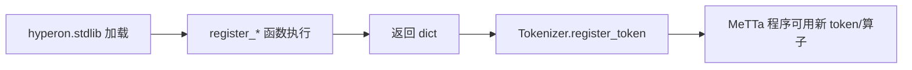
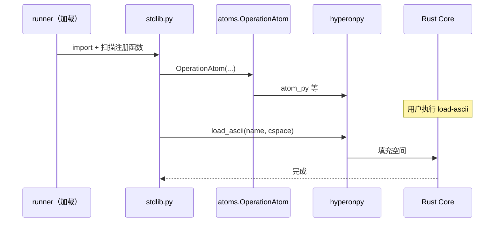
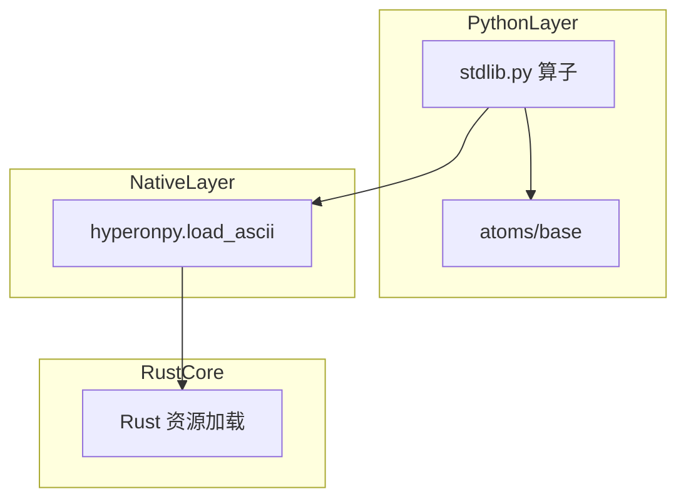

# `python/hyperon/stdlib.py` Python 源码分析报告

## 1. 文件定位与职责

- **Python 侧标准库扩展**：通过 `@register_atoms` / `@register_tokens` 向 MeTTa **注册** 文本操作、类型 token、`py-atom`/`py-dot`、ASCII 加载、以及 `py-tuple`/`py-list`/`py-dict`/`py-chain` 等（`L61-L231`）。
- **与 Rust 的唯一直接 FFI 调用**：`load_ascii` 中调用 **`hp.load_ascii`** 将 ASCII 资源载入给定空间（`L170-L176`）。
- **Python 互操作**：`import_from_module`、`find_py_obj`、`get_py_atom` 等从字符串路径解析 Python 对象并包装为 `OperationAtom` 或 `ValueAtom`（`L96-L167`）。
- **辅助类型**：`Char`、`RegexMatchableObject`（`L11-L49`）。
- 在加载链中的位置：模块 **`hyperon.stdlib`** 由 **`runner._priv_load_module_stdlib`** 在 Runner 初始化时导入并注册（**调用在 `runner.py`**）。

**角色标签**：标准库操作（Python 端）/ Grounding（`unwrap=False` 为主）/ 少量 hyperonpy

## 2. 公共 API 清单

| 符号名 | 类型 | 参数 | 返回值 | hp.* | MeTTa 语义 |
|--------|------|------|--------|------|------------|
| `Char` | class | `(char)` | 实例 | 无 | 单字符类型模拟 |
| `RegexMatchableObject` | class | `(content, id=None)` | 实例 | 无 | `regex:` 模式匹配 |
| `parseImpl` | function | `(atom, metta)` | `[Atom]` | 无（用 `SExprParser`） | `parse` 算子实现 |
| `text_ops` | function | `(metta)` | `dict` | 无 | `repr`/`parse`/字符转换 |
| `type_tokens` | function | `()` | `dict` | 无 | `Char`/`regex:` token |
| `import_from_module` | function | `(path, mod=None)` | 任意 | 无 | 动态导入 |
| `find_py_obj` | function | `(path, mod=None)` | 任意 | 无 | 解析 Python 对象 |
| `get_py_atom` | function | `(path, typ=..., unwrap=True, mod=None)` | `[Atom]` | 无 | `py-atom` 核心 |
| `do_py_dot` | function | `(mod, path, ...)` | `[Atom]` | 无 | `py-dot` |
| `py_obj_atoms` | function | `()` | `dict` | 无 | 注册 py-atom/py-dot |
| `load_ascii` | 内嵌 + `register_atoms` | — | `dict` | **`load_ascii`** | 载入 ASCII 到空间 |
| `try_unwrap_python_object` | function | `(a, is_symbol_to_str=False)` | 任意 | 无 | 结构转换辅助 |
| `_py_tuple_list` | function | `(tuple_list, metta_tuple)` | tuple/list | 无 | 递归unwrap |
| `py_tuple` / `py_list` / `py_dict` / `py_chain` | function | `(metta_tuple)` | `[ValueAtom]` | 无 | Python 集合/链 |

> 注：`text_ops`、`type_tokens` 等由装饰器标记，**公共性**体现在被 MeTTa 加载时注册，而非传统 `__all__`。

## 3. 核心类与数据结构

| 类名 | 父类 | 关键属性 | C 引用 | `__del__` | 设计意图 |
|------|------|----------|--------|-----------|----------|
| `Char` | — | `char` | 无 | 无 | FPL 风格字符 |
| `RegexMatchableObject` | `MatchableObject` | `content`（规范化后） | 无 | 无 | 正则匹配产生绑定 |

**OperationAtom 实例**：多数 `unwrap=False`，在 MeTTa 侧传递 **Atom** 而非直接 Python 值（`L74-L80`、`L165-L166`、`L228-L231`）。

## 4. hyperonpy 调用映射

| Python | hp.* | Rust 语义（推断） | 参数转换 | 返回值 |
|--------|------|-------------------|----------|--------|
| `load_ascii_atom` 内 | `load_ascii(name.get_name(), space_obj.cspace)` | 从资源名加载 ASCII 到空间 | `str` + `CSpace` | Python 侧返回 `[Atoms.UNIT]`（`L172-L176`） |

**其余符号**：通过 `atoms`、`base` 间接使用 hyperonpy（如 `OperationAtom` → `atom_py`），**本文件无其他 `hp.*` 顶层调用**（`L9` 仅导入）。

## 5. 回调函数分析

本文件**不定义** `_priv_call_*`。被 **`runner._priv_register_module_tokens`** 调用的 **`text_ops`/`type_tokens`/…** 属于「模块加载时调用的注册函数」，不是 Rust 直接 FFI 回调。

| 函数 | 调用方 | 时机 | 契约 |
|------|--------|------|------|
| `text_ops(metta)` | 模块注册流程 | 加载 `hyperon.stdlib` | 返回 `regex → Atom` |
| `type_tokens()` | 同上 | 同上 | 返回 `regex → lambda` |

## 6. 算法与关键策略

### 6.1 算法清单

| 算法 | 目标 | 关键步骤 | 复杂度 |
|------|------|----------|--------|
| `import_from_module` | 模糊导入 | 尝试缩短模块路径 + `sys.path` 临时追加 cwd | O(k) 尝试次数 |
| `find_py_obj` | 解析对象 | 导入 → `__main__` 回退 → **`exec(f"__obj = {path}")`** | 依赖路径 |
| `RegexMatchableObject.match_` | 文本匹配 | 规范化空白 → `re.search` | O(文本长) |
| `_py_tuple_list` | MeTTa 嵌套 expr → Python | DFS `get_children` | O(节点数) |

### 6.2 详解：`get_py_atom`（`L139-L157`）

- **动机**：在 MeTTa 中按名称取 Python 可调用或值并包装为原子。
- **路径**：解析 `path`（grounded/str）→ `find_py_obj` → 若 `callable` 则 `OperationAtom` 否则 `ValueAtom`。
- **hyperonpy**：无直接调用。
- **失败**：`NoReduceError`、`RuntimeError`（在 `find_py_obj`）。

### 6.3 详解：`find_py_obj` 中的 `exec`（`L131-L136`）

- **动机**：支持类似 `(py-obj str)` 的路径（注释 `L129-L130`）。
- **风险**：等效受限 eval，**输入应视为可信**（MeTTa 程序能力边界）。

## 7. 执行流程

### 7.1 主流程（加载 stdlib）

1. Runner 初始化触发 `_priv_load_module_stdlib`（`runner.py`）。
2. `import_module("hyperon.stdlib")`。
3. `_priv_register_module_tokens` 扫描带 `metta_type` 的函数并注册。

### 7.2 运行时：`load-ascii`

1. MeTTa 调用 `load-ascii` 操作（`unwrap=False`）。
2. `load_ascii_atom` 取 `space` 与 `name`，调用 `hp.load_ascii`（`L172-L175`）。
3. 返回 `Unit`（`L176`）。

## 8. 装饰器与模块发现机制

- `@register_atoms(pass_metta=True)`：`text_ops`（`L61-L86`）。
- `@register_tokens`：`type_tokens`（`L88-L93`）。
- `@register_atoms`：`py_obj_atoms`、`load_ascii`、`py_funs`（`L162-L231`）。

与 **`ext.mark_register_function`**、`**runner._priv_register_module_tokens**` 配合（**机制定义不在本文件**）。

## 9. 状态变更与副作用矩阵

| 操作 | 状态 | hp | 可观测 |
|------|------|-----|--------|
| `load_ascii` | 目标空间原子增加 | `load_ascii` | `[UNIT]` |
| `import_from_module` | 可能修改 `sys.path` 临时 | 无 | 副作用 |
| `py_chain` | Python 对象 `|` 组合 | 无 | 新对象 |

## 10. 流程图（Mermaid）

## 11. 时序图（Mermaid）

## 12. 架构图（Mermaid）

## 13. 复杂度与性能要点

- `re.search` 与嵌套 `_py_tuple_list` 在 Python 层执行；大结构可能较慢。
- `find_py_obj` 的导入与 `exec` 非热路径假设。

## 14. 异常处理全景

- `Char`：`ValueError`（`L14-L15`）。
- `parseImpl`：`IncorrectArgumentError`（`L55-L57`）。
- `tuple_to_keyvalue`：`Exception`（`L210-L211`）。
- `get_py_atom`：`NoReduceError`（`L142-L143` 等）。

## 15. 安全性与一致性检查点

- **`exec(f"__obj = {path}")`**：代码注入风险（`L133`）。
- `import_from_module` 临时修改 `sys.path`（`L102-L116`）。

## 16. 对外接口与契约

- 注册的操作名与正则键见各 `return { ... }` 字典（`L81-L85`、`L90-L92`、`L164-L167`、`L180-L182`、`L228-L231`）。
- `load-ascii` 期望 `unwrap=False` 且参数为 Space 与 Symbol（注释类型 `L175`）。

## 17. 关键代码证据

- `text_ops` / `parseImpl`（`L51-L86`）。
- `get_py_atom` / `find_py_obj`（`L122-L157`）。
- `load_ascii` + `hp.load_ascii`（`L170-L176`）。
- `py_funs`（`L226-L231`）。

## 18. 与 MeTTa 语义的关联

- **文本与解析**：`repr`/`parse` 连接 MeTTa 字符串与原子语法。
- **Python 桥**：`py-atom`/`py-dot` 嵌入 Python 生态。
- **数据结构**：`py-tuple`/`py-list`/`py-dict` 在 MeTTa 表达式与 Python 值之间转换。
- **`load-ascii`**：对应将资源载入工作空间的内置能力（Rust 实现）。

## 19. 未确定项与最小假设

- **`hp.load_ascii`** 的确切资源查找规则与错误行为（**无法从当前文件确定**）。
- 假设：`space.get_object()` 返回带 `cspace` 的 `SpaceRef`（`L173-L174`）。

## 20. 摘要

- **职责**：Python 端 stdlib——注册大量 grounded 操作与 token；一处 `load_ascii` FFI。
- **核心**：`text_ops`、`py_obj_atoms`、`load_ascii`、`py_funs`；辅助 `get_py_atom`/`find_py_obj`。
- **hyperonpy**：仅 **`hp.load_ascii`** 于本文件直接调用。
- **MeTTa**：字符串/解析、Python 互操作、集合构造、资源加载。
- **性能**：正则与递归 unwrap；避免在热路径滥用 `find_py_obj`。
- **依赖**：`atoms`、`base`、`ext`、`hyperonpy`（`load_ascii`）。
