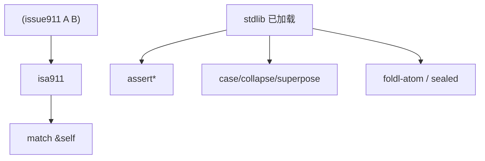
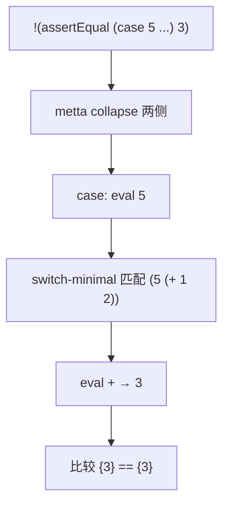
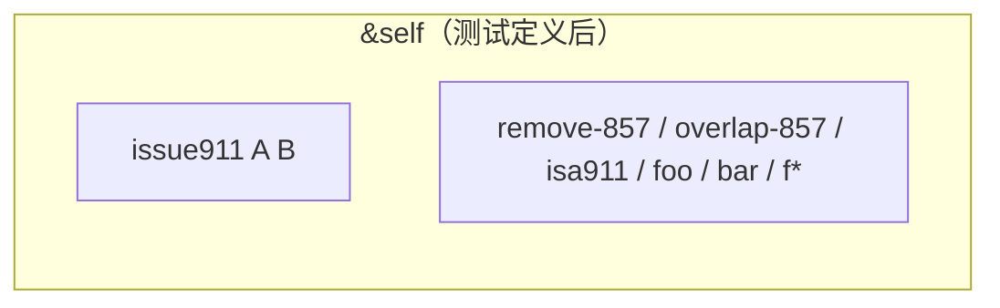

# `lib/tests/test_stdlib.metta` MeTTa 源码分析报告

## 1. 文件定位与职责

- **回归测试** `stdlib.metta` 与解释器协同行为：`superpose`、`case`/`switch`/`switch-minimal` 对 `Empty` 与求值差异、`assert*` 族、`noeval`/`quote`、`sealed`+`foldl-atom`、`match &self`、`sort-strings` 等。
- 通过 `!(assertEqual …)` / `!(assertEqualToResult …)` 等强制可执行求值。
- **文件类别**：语言特性测试 / 标准库核心定义（验证脚本）。

## 2. 原子清单与分类

| 行号 | 表达式（截断至80字符） | 分类 | 涉及的关键符号 | 语义说明 |
|------|------------------------|------|----------------|----------|
| L1 | `; superpose` | 文档/注释 | — | 分组标记 |
| L2-L4 | `!(assertEqualToResult (superpose (red yellow green)) (red yellow green))` | 执行+断言 | `superpose`, `assertEqualToResult` | 元组展开为非确定性集合并与期望集比较 |
| L5-L6 | `(= (foo) FOO)` … | 函数定义 | `foo` | 配合 superpose 测试 |
| L7-L9 | `!(assertEqualToResult (superpose ((foo) (bar) BAZ)) …)` | 执行+断言 | `superpose` | 子调用与字面混合 |
| L11-L23 | `case` + `unify` + `Empty` 多段 | 执行+断言 | `case`, `unify`, `Empty` | `case` 对空结果分支行为 |
| L27-L37 | `assertEqual` 比较 `case` vs `switch` vs `switch-minimal` | 执行+断言 | `case`, `switch`, `switch-minimal` | 5 的归约 vs `(noeval (+ 1 2))` |
| L39-L48 | `assertIncludes` | 执行+断言 | `assertIncludes`, `superpose` | 子集检查与错误形态 |
| L50-L58 | `=`, `noeval`, `quote` 与 `assertEqualToResult` | 执行+断言 | `noeval`, `quote` | 等式归约与阻止归约 |
| L60-L65 | `noeval` + `id` | 执行+断言 | `id`, `noeval` | `id` 对未求值式仍可规约子项（若存在） |
| L69-L71 | `assert` / `or` / `and` | 执行+断言 | `assert` | 布尔与错误 |
| L77-L108 | `*Msg` 与失败消息 | 执行+断言 | `assertEqualMsg` 等 | 自定义错误串 |
| L87-L94 | `(= (f1 $x) $x)` 等 | 函数定义 | `f1`, `f2`, `f3` | α 等价与自由变量测试 |
| L112-L126 | `remove-857`, `overlap-857` | 函数定义+断言 | `if-decons-expr`, `foldl-atom`, `cons-atom` | issue 857 / sealed 相关 |
| L128 | `!(assertEqual (let $f_hyps …) (⟨P⟩ ⟨Q⟩))` | 执行+断言 | `map-atom`, `let` | 结构映射 |
| L131-L133 | `issue911` 事实 + `isa911` + 断言 | 事实声明+函数定义+执行 | `match`, `&self` | issue 911：`match` 与变量绑定 |
| L135-L136 | `sort-strings` | 执行+断言 | `sort-strings` | 字符串排序 |

## 3. 知识图谱（空间内容分析）

执行后 `&self` 含：

- **事实**：`(issue911 A B)`（`L131`）。  
- **函数等式**：`foo`, `bar`, `f1`, `f2`, `f3`, `remove-857`, `overlap-857`, `isa911`。  
- **无** 显式 `(: …)`（依赖已加载 stdlib）。

**依赖**：必须先加载 **corelib/stdlib**（提供 `assert*`, `superpose`, `case`, `foldl-atom`, `sort-strings`, `match` 等）。

## 4. 函数定义详解

| 函数名 | 等式数 | 模式 | 递归? | 内置操作 | 备注 |
|--------|--------|------|-------|----------|------|
| foo | 1 | `()` | 否 | — | 返回 `FOO` |
| bar | 1 | `()` | 否 | — | 返回 `BAR` |
| f1,f2 | 各1 | `($x)` | 否 | — | α 等价测试 |
| f3 | 1 | `()` | 否 | — | 体中 `$x` 未绑定，用于特殊断言 |
| remove-857 | 1 | `($list $elem)` | 是 | `if-decons-expr`, `unify`, `let`, `cons-atom` | 列表删除 |
| overlap-857 | 1 | `($list1 $list2)` | 是 | `foldl-atom`, `if`, `==` | 三份组结果 |
| isa911 | 1 | `($x $y)` | 否 | `match &self` | 查询事实 |

### 4.1 核心函数详解

#### `isa911`（`L132-L133`）

- **体**：`(match &self (issue911 $x $y) True)`。  
- **与断言** `!(assertEqual ((isa911 $a B) $a) (True A))`：展示 `match` 绑定 `$a` 与 `True` 组合成结果表达式（**非确定性/元组语义**依解释器对 `assertEqual` 的 collapse 规则）。

#### `overlap-857`（`L118-L124`）

- **递归**：`foldl-atom` 累积 `(left intersection right)`；内用 `remove-857`。  
- **测试**：`L126` 期望 `((a) (c b) (d))`。

## 5. 求值流程分析

### 5.1 执行表达式流程（示例）

**`L27-L28`**：`!(assertEqual (case 5 ((4 False) (5 (+ 1 2)))) 3)`  
- `case` 先求值第一参为 `5`；`switch-minimal` 风格匹配；分支 `(5 (+ 1 2))` 中模板被求值 → `+` 得 `3`；`assertEqual` 对两侧做 `collapse`+集合比较。

**`L31-L37`**：`switch-minimal` 对 `(+ 1 2)` **不再求值**（与 `case` 对比）。

### 5.2 关键求值链详解

```
!(case (unify (C B) (C B) ok Empty) ((ok ok) (Empty nok)))
→ metta 求值 unify → ok（非 Empty）
→ switch-minimal ok cases → 匹配 (ok ok) → ok
→ assertEqualToResult 期望 (ok)
```

## 6. 类型系统分析

本文件**无** `(: …)`；类型来自已加载 stdlib。

## 7. 推理模式分析

- `isa911` + `issue911`：**前向事实** + **空间查询**，非后向链。  
- `remove-857` / `overlap-857`：**函数式列表算法**，非逻辑推理。

## 8. 状态与副作用分析

| 操作 | 行号 | 副作用类型 | 影响范围 | 时序依赖 |
|------|------|------------|----------|----------|
| 断言失败 | 多处 | 错误原子/消息 | 测试结果 | — |
| 空间添加 `issue911` | L131 | 空间修改 | `&self` | 先于 L133 断言 |

## 9. 断言与预期行为

| 行号 | 断言类型 | 测试表达式 | 预期结果 | 测试的语言特性 | 非确定性 |
|------|----------|------------|----------|----------------|----------|
| L2-L4 | assertEqualToResult | superpose 三原子 | 三原子集 | superpose | 是（结果集） |
| L7-L9 | assertEqualToResult | superpose 混合 | FOO,BAR,BAZ | superpose + 调用 | 是 |
| L12-L23 | assertEqualToResult | case+unify | 各分支 | case 与 Empty | 部分 |
| L27-37 | assertEqual | case/switch/switch-minimal | 3 / noeval | 求值深度 | 否 |
| L40-48 | assertEqualToResult | assertIncludes | () 或 Error | 子集 | 是 |
| L50-65 | assertEqualToResult / assertEqual | quote/noeval/id | 见文件 | 引用透明 | 否 |
| L69-71 | assert / assertEqual | 布尔 | True / Error | assert | 否 |
| L77-108 | *Msg 族 | 多种 | 消息或 Error | 失败文案 | 否 |
| L126 | assertEqual | overlap-857 | 三元组 | foldl + sealed | 否 |
| L128 | assertEqual | map-atom | ⟨P⟩⟨Q⟩ | map-atom | 否 |
| L133 | assertEqual | isa911 | True A | match &self | 依绑定 |
| L136 | assertEqual | sort-strings | 排序 | 字符串 grounded | 否 |

## 10. 知识图谱图（Mermaid）



## 11. 求值链图（Mermaid）



## 12. 空间快照图（Mermaid）



## 13. MeTTa 语言特性覆盖

| 语言特性 | 使用位置(行号) | 使用方式 |
|----------|----------------|----------|
| superpose / collapse | L2-L9, L40+ | 非确定性集合 |
| case / switch / switch-minimal | L12-L37 | Empty 与求值差异 |
| assert* 族 | 通篇 | 测试 |
| noeval / quote | L50-65 | 控制归约 |
| let / let* | L128 | 绑定 |
| match &self | L132-L133 | 空间查询 |
| foldl-atom, sealed | L112-L124 | 高阶与变量隔离 |
| map-atom | L128 | 列表映射 |
| sort-strings | L136 | Grounded 字符串 |
| if / or / and | L71 等 | 逻辑 |

## 14. 底层实现映射

| MeTTa 操作 | Rust / 位置 | 摘要 |
|------------|-------------|------|
| assertEqual* | `stdlib/debug.rs` | `_assert-results-are-equal*` |
| superpose | `stdlib/core.rs` | `SuperposeOp` |
| case / collapse | `stdlib.metta` + `interpreter.rs` | `collapse-bind`, `METTA_SYMBOL` |
| switch-minimal | `stdlib.metta` | 等式 |
| match | `stdlib/core.rs` | `MatchOp` |
| foldl-atom | `stdlib/core.rs` | `_minimal-foldl-atom` |
| sort-strings | `lib/src/metta/runner/stdlib/string.rs` | `SortStringsOp` |
| sealed | `stdlib/core.rs` | `SealedOp` |

## 15. 复杂度与性能要点

- `overlap-857` 为 O(n·m) 量级列表操作；测试规模小。  
- `assertEqual` 对结果集比较，非确定性大时分支膨胀。

## 16. 关键代码证据

- `L12-L23`：`case` 与 `Empty`。  
- `L27-L37`：`case` vs `switch` vs `switch-minimal`。  
- `L112-L126`：foldl + sealed。  
- `L131-L133`：`match &self`。

## 17. 教学价值分析

**难度递进**：superpose → case/switch 语义细节 → 断言矩阵 → 高阶 `foldl-atom` + `sealed` → 空间 `match`。前置：已理解 `stdlib.metta` 中 `collapse`/`case` 注释（L331-L337）。

## 18. 未确定项与最小假设

- （已确认）`sort-strings` 在 `stdlib/string.rs`。  
- 假设测试在 **已加载 stdlib** 的 Runner 上运行。

## 19. 摘要

- **功能**：stdlib 与解释器关键语义的黑盒测试。  
- **重点**：非确定性、Empty、`switch` vs `case`、断言、foldl+sealed、`match &self`。  
- **依赖**：`stdlib.metta` + 多类 Grounded 操作。
