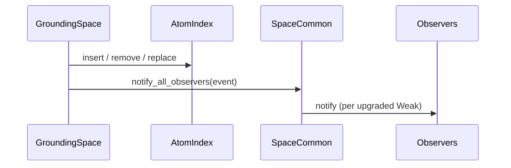
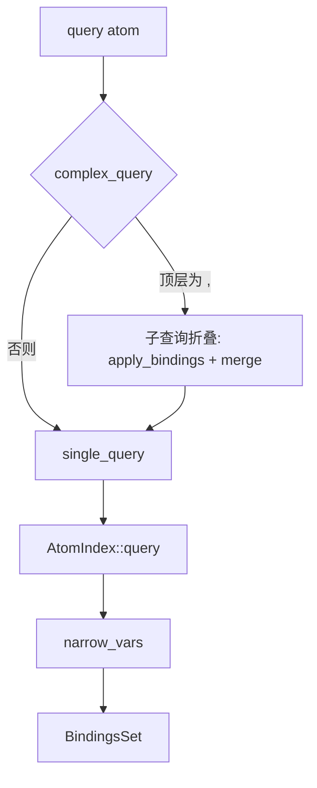

# `lib/src/space/grounding/mod.rs` 源码分析报告

**源文件**：`lib/src/space/grounding/mod.rs`  
**类型**：**主要的内存型 Space 实现** — `GroundingSpace<D: DuplicationStrategy>`

## 1. 文件角色与职责

- 实现 **GroundingSpace**：在内存中存储 `Atom`（含 **grounded**），基于 **`hyperon_space::index::AtomIndex`** 做插入与模式查询。
- 集成 **`SpaceCommon`**：在 `add` / `remove` / `replace` 时 **通知观察者**（`SpaceEvent`）。
- 实现 **`Space` + `SpaceMut`**，与 `hyperon-space` 生态一致；支持 **`DuplicationStrategy`** 泛型（默认 `AllowDuplication`），控制重复 atom 策略。
- 提供 **`set_name` / `name`** 便于调试与日志。
- 含大量 **单元测试**（观察者、查询、合取查询、`subst` 相关场景等）；`#[cfg(test)]` 下 `metta_space` 辅助从 S-表达式文本构建 `DynSpace`。

## 2. 公开 API 一览

| 名称 | 签名（摘要） | 说明 |
|------|----------------|------|
| `GroundingSpace` | `struct GroundingSpace<D: DuplicationStrategy = AllowDuplication>` | 内存空间主体。 |
| `GroundingSpace::new` | `() -> Self` | 空空间，默认重复策略。 |
| `GroundingSpace::from_vec` | `Vec<Atom> -> Self` | 从向量批量插入。 |
| `GroundingSpace::with_strategy` | `(D) -> Self` | 指定 `DuplicationStrategy` 的空空间。 |
| `add` | `&mut self, Atom` | 插入并 `notify_all_observers(Add)`。 |
| `remove` | `&Atom -> bool` | 删除一个匹配项；成功则 `Remove` 事件。 |
| `replace` | `&Atom, Atom -> bool` | 先删后插；成功则 `Replace` 事件。 |
| `query` | `&Atom -> BindingsSet` | **复合查询**：内部调用 `complex_query`，子查询由 `,`（`COMMA_SYMBOL`）连接。 |
| `set_name` / `name` | 调试名 | 可选字符串名。 |
| `impl Space for GroundingSpace` | — | `common`、`query`、`atom_count`、`visit`、`as_any`。 |
| `impl SpaceMut for GroundingSpace` | — | 委托到 inherent `add`/`remove`/`replace`、`as_any_mut`。 |
| `Debug` / `Display` | — | 输出 `GroundingSpace` 指针或带名形式。 |

`into_vec`、`metta_space` 为 **`#[cfg(test)]`**，非公开稳定 API。

## 3. 核心数据结构

| 成员/类型 | 说明 |
|-----------|------|
| `index: AtomIndex<D>` | 存储与查询引擎；`iter()` 用于 `visit` 与 `atom_count`。 |
| `common: SpaceCommon` | 观察者列表（`Weak<RefCell<dyn SpaceObserver>>`），见 `hyperon-space`。 |
| `name: Option<String>` | 可选调试名。 |

## 4. Trait 定义与实现

### `Space`（`hyperon-space`）

| 方法 | `GroundingSpace` 行为 |
|------|------------------------|
| `common()` | `FlexRef::from_simple(&self.common)`，共享只读/可变由 `FlexRef` 表达。 |
| `query` | 调用 inherent `GroundingSpace::query` → `complex_query` + `single_query`。 |
| `atom_count` | `Some(self.index.iter().count())`。 |
| `visit` | 对 `index.iter()` 每个 atom 调用 `v.accept(atom)`，成功返回 `Ok(())`。 |
| `as_any` | `self`，支持向下转型。 |

### `SpaceMut`

| 方法 | 行为 |
|------|------|
| `add` / `remove` / `replace` | 与 inherent 方法一致。 |
| `as_any_mut` | `self`。 |

### 默认方法（`Space` trait 自带）

- **`subst`**：未在本文件覆盖；使用默认实现 `query(pattern)` 后对 `template` 做 `apply_bindings_to_atom_move`（定义在 `hyperon-space`）。

### 与 `SpaceObserver` 的关系

- 修改路径 **仅** `add` / `remove` / `replace` 调用 `common.notify_all_observers`；**不**在 `query` 中通知。

## 5. 算法

### 5.1 查询：`complex_query` + `single_query`

1. **`query(&Atom)`**  
   - 调用 `hyperon_space::complex_query(query, |q| self.single_query(q))`。  
   - 若顶层为 **`,` 表达式**（操作符为 `COMMA_SYMBOL`），则对子查询 **从左到右折叠**：每一步将前一步的 `Bindings` 代入下一子查询，再 **merge** 绑定集合（合取语义）。  
   - 否则整 atom 作为 **单查询** 交给 `single_query`。

2. **`single_query`**  
   - `self.index.query(query)`：由 `AtomIndex` 做 **模式匹配**，产生多个 `Bindings`。  
   - 对每个结果调用 **`narrow_vars(&query_vars)`**：`query_vars` 为查询 atom 中出现的 **变量集合**，用于 **限制返回绑定中仅含查询里出现的变量**（避免数据侧多余变量泄漏）。  
   - 合并入 `BindingsSet`。

### 5.2 观察者通知

- **`add`**：`insert` 后 `SpaceEvent::Add(atom)`（注意 `atom.clone()` 传入事件）。  
- **`remove`**：仅当 `index.remove` 为真时 `SpaceEvent::Remove(atom.clone())`。  
- **`replace`**：成功时 `SpaceEvent::Replace(from.clone(), to)`。  
- 与 **`SpaceCommon::notify_all_observers`** 配合：遍历 `Weak` 升级后 `notify`；顺带清理已失效的 `Weak`（实现细节在 `hyperon-space`）。

### 5.3 克隆语义

- `#[derive(Clone)]`：`SpaceCommon::clone` 在依赖 crate 中 **不克隆观察者**（避免多空间共享观察者时事件来源不清）；注释提及 **C API 需要 `Clone`**。

## 6. 所有权分析

| 场景 | 要点 |
|------|------|
| `add(atom)` | `atom` 被 **clone** 后存入 index；事件携带 **clone**。 |
| `remove` / `replace` | 按值/引用与 `AtomIndex` 约定；事件中的 `Remove`/`Replace` 含 **clone**。 |
| `query` | 不可变借用 `&self`；结果 `BindingsSet` 为新分配。 |
| `visit` | `index.iter()` 产出 `Cow<Atom>`，由 `SpaceVisitor::accept` 消费。 |
| `FlexRef<SpaceCommon>` | 允许在只读 `Space` 视图上注册观察者时访问 `common`（与 `DynSpace` 的 `FlexRef` 用法一致）。 |

## 7. Mermaid 图

### 修改路径与观察者

### 查询路径

## 8. 与 MeTTa 语义的对应关系

| 概念 | 本实现中的体现 |
|------|----------------|
| **Atomspace / 知识库** | `GroundingSpace` 内存存储，可含 **grounded** 值。 |
| **模式匹配 / 统一** | `AtomIndex::query` + matcher 绑定；测试中覆盖变量、表达式、冲突绑定、查询变量优先级等。 |
| **合取查询** | MeTTa 中用 **`,`** 连接多个子模式；对应 `complex_query` 与 `COMMA_SYMBOL`。 |
| **类型检查式查询** | 测试 `test_type_check_in_query`：`(":" h "Human")` 与 `("Cons" h t)` 联合查询，对应 MeTTa 类型与结构关系。 |
| **Space 作为值匹配** | `test_custom_match_with_space`：`DynSpace` grounded 与 `match_atoms` 结合，对应 **把空间当作可匹配对象** 的语义。 |

## 9. 小结

- **GroundingSpace** 是 **Hyperon Rust 侧默认的、功能完整的内存 Atomspace**：索引查询 + **复合（逗号）查询** + **修改事件**。
- **`Space` / `SpaceMut`** 实现完整，便于装入 **`DynSpace`** 或与其他 `SpaceMut` 组合（如 **ModuleSpace** 的主空间）。
- 查询侧关键细节：**`narrow_vars` 裁剪绑定**；复合查询的 **语义在 `complex_query`**，与 `ModuleSpace` 共用同一套逻辑。
