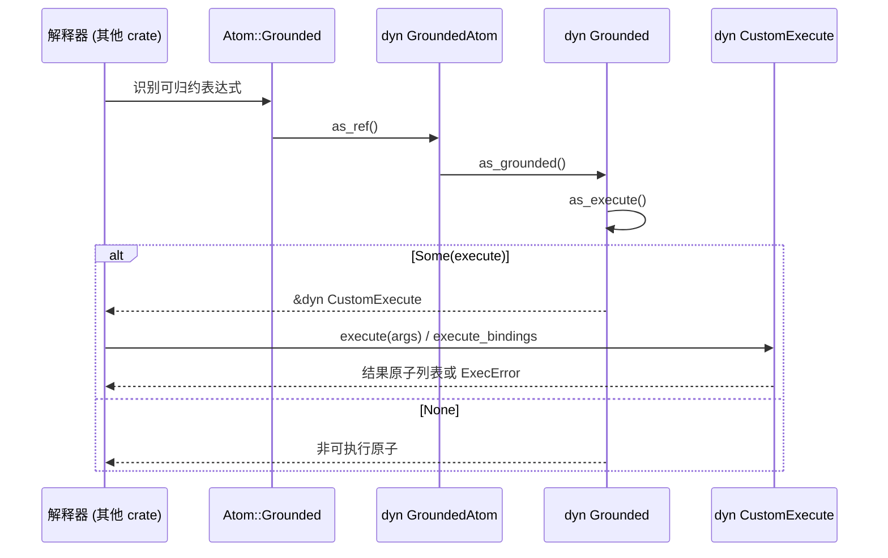
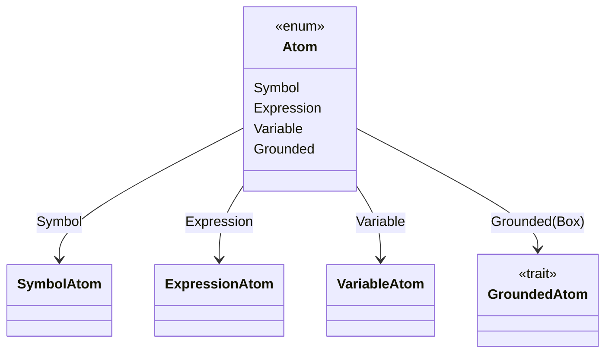
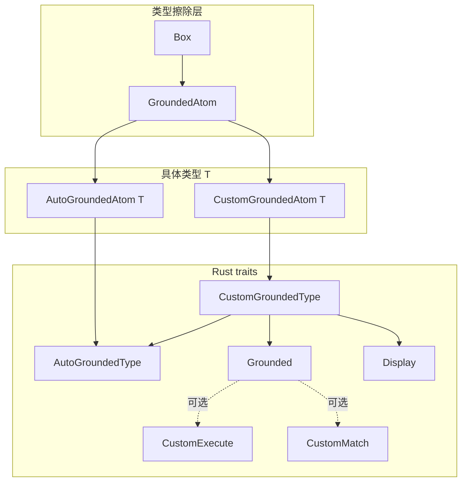

# `hyperon-atom/src/lib.rs` 源码分析报告：Atom ADT 与 Grounded 体系

本文档对 OpenCog Hyperon 工程中 **`hyperon-atom` 库根模块** `src/lib.rs` 做系统性解读。该文件定义 MeTTa 所操作的 **原子（Atom）代数数据类型（ADT）** 及 **Grounded（接地/承载 Rust 值）** 扩展机制，是整个符号–子符号桥梁的根基。

---

## 1. 文件角色与职责

### 1.1 在工程中的位置

- **crate 根**：`lib.rs` 声明子模块 `matcher`、`subexpr`、`serial`、`gnd` 及内部模块 `iter`，并通过 `pub use iter::*` 将迭代器 API 提升到 crate 根。
- **数据模型核心**：在此定义四种「元类型」原子——**符号、变量、表达式、Grounded**，对应 MeTTa 中概念名、模式变量、S 表达式树、以及内嵌 Rust 数据与可执行行为。
- **Grounded 双通道**：
  - **自动接地**（`AutoGroundedAtom<T>`，内部结构体：`AutoGroundedType`）：凡满足 `'static + PartialEq + Clone + Debug` 的 Rust 类型可用 `Atom::value` 包入；类型名由 `rust_type_atom::<T>()` 生成；匹配默认走值相等；**不可执行**；`Display` 借 `Debug` 实现。
  - **自定义接地**（`CustomGroundedAtom<T>`，内部结构体：`CustomGroundedType`）：需实现 `Grounded + Display`（并继承 `AutoGroundedType` 约束），用 `Atom::gnd` 构造；可自定义 **MeTTa 类型**、**执行**（`CustomExecute`）、**匹配**（`CustomMatch`）、**序列化**（`serial::Serializer`）。

### 1.2 与周边模块的边界

| 职责 | 本文件 | 其他模块 |
|------|--------|----------|
| 原子构造与相等性 | ✓ `Atom`、`PartialEq`（Grounded 分支委托 `gnd::gnd_eq`） | `gnd/mod.rs` 中 `gnd_eq` 对字符串/数/布尔等嵌入类型做补充比较 |
| 模式匹配与绑定 | 提供 `CustomMatch` 接口与 `match_by_equality` 等辅助 | `matcher.rs` 实现 `match_atoms`、`Bindings` 等 |
| 子表达式访问 | `ExpressionAtom::children` | `subexpr.rs` 等 |
| 序列化协议 | `Grounded::serialize`、`ConvertingSerializer` | `serial.rs` |

---

## 2. 公开 API 总览（本 crate 根由 `lib.rs` + `iter` 再导出构成）

> 说明：下列包含 **`lib.rs` 中 `pub` 项** 以及 **`pub use iter::*` 再导出** 的迭代器类型与方法。`AutoGroundedAtom` / `CustomGroundedAtom` 为 **非 `pub` 内部包装**，不单独列入「公开类型」表，但通过 `Atom::value` / `Atom::gnd` 对外可见其行为。

### 2.1 模块

| 项 | 可见性 | 说明 |
|----|--------|------|
| `matcher` | `pub mod` | 匹配、绑定集合 |
| `subexpr` | `pub mod` | 子表达式相关 |
| `serial` | `pub mod` | Grounded 序列化 |
| `gnd` | `pub mod` | 预置 Grounded 类型、`GroundedFunctionAtom`、`gnd_eq` 等 |

### 2.2 宏

| 名称 | 说明 |
|------|------|
| `expr!` | 类 S 表达式构造 `Atom`：字面量为符号、`ident` 为变量、`{expr}` 为 Grounded（经 `Wrap` 与 autoref 特化选自动/自定义包装）、`(...)` 或并列 token 组成 `Atom::expr`。**文档注明有性能代价**（额外包装与 `Clone`），宜主要用于测试。 |
| `sym!` | 从字符串字面量构造 **常量** `SymbolAtom`（`UniqueString::Const`），可用于 `const` 上下文。 |

### 2.3 枚举

| 类型 | 变体 / 用途 |
|------|-------------|
| `ExecError` | `Runtime(String)`：运行时错误，解释器可中断；`NoReduce`：不归约，保持表达式原样；`IncorrectArgument`：参数无法识别，类比纯函数未匹配。实现 `From<String>`、`From<&str>`。 |
| `Atom` | `Symbol(SymbolAtom)`、`Expression(ExpressionAtom)`、`Variable(VariableAtom)`、`Grounded(Box<dyn GroundedAtom>)`。 |

### 2.4 结构体

| 类型 | 主要公开方法 / 说明 |
|------|---------------------|
| `SymbolAtom` | `new`、`name`；字段 `name: UniqueString`。 |
| `ExpressionAtom` | `new`、`is_plain`、`children`、`children_mut`、`into_children`、`set_evaluated`、`is_evaluated`；子节点 `CowArray<Atom>`；`evaluated` 标记由解释器管线使用。 |
| `VariableAtom` | `new`、`new_const`、`new_id`（测试）、`parse_name`、`name`、`make_unique`；`name` + `id` 区分同名变量不同实例。 |
| `Wrap<T>` | `#[doc(hidden)]`，仅供 `expr!` 做 Grounded 包装分发。 |

### 2.5 类型别名

| 名称 | 定义 |
|------|------|
| `BoxedIter<'a, T>` | `Box<dyn Iterator<Item=T> + 'a>`，简化 `CustomExecute::execute_bindings` 返回类型。 |

### 2.6 特征（trait）

| Trait | 实现方 / 用途 |
|-------|----------------|
| `GroundedAtom` | 类型擦除的 Grounded 对象安全接口：`eq_gnd`、`clone_gnd`、`as_any_ref` / `as_any_mut`、`type_`、`serialize`、`as_grounded`。用户一般不直接实现，用 `Atom::value` 或 `Atom::gnd`。 |
| `Grounded` | 自定义 Grounded 核心：必选 `type_()`；可选 `as_execute`、`as_match`、`serialize`（默认 `NotSupported`）。超trait：`Display`。 |
| `CustomExecute` | `execute`、`execute_bindings`（默认调 `execute` 且无绑定）。 |
| `CustomMatch` | `match_(&self, other: &Atom) -> MatchResultIter`。 |
| `AutoGroundedType` | 标记 trait：`'static + PartialEq + Clone + Debug`，自动为符合类型实现。 |
| `CustomGroundedType` | `AutoGroundedType + Display + Grounded`，自动实现。 |
| `AutoGroundedTypeToAtom` | `#[doc(hidden)]`，`Wrap<T>` → `Atom`（自动包装）。 |
| `CustomGroundedTypeToAtom` | `#[doc(hidden)]`，`&Wrap<T>` → `Atom`（自定义包装，优先级通过 autoref 规则高于自动路径）。 |
| `ConvertingSerializer<T>` | `Serializer + Default`：从 Grounded 提取/反序列化为 `T` 的 `check_type`、`into_type`、`convert`。 |

### 2.7 自由函数

| 函数 | 作用 |
|------|------|
| `make_variables_unique` | 深度遍历原子树，将所有 `VariableAtom` 替换为同名但新 `id` 的实例（见 §5）。 |
| `rust_type_atom::<T>()` | `Atom::sym(std::any::type_name::<T>())`，作自动 Grounded 的默认类型。 |
| `match_by_equality` | 若 `other` 为同类型 Grounded 且 `PartialEq` 相等，则返回单次空 `Bindings` 的迭代器，否则空。 |
| `match_by_string_equality` | `this` 与 `other.to_string()` 相同则同上。 |

### 2.8 `dyn GroundedAtom` 固有方法

| 方法 | 说明 |
|------|------|
| `downcast_ref<T: Any>` | 通过 `as_any_ref` 向下转型。 |
| `downcast_mut<T: Any>` | 可变向下转型。 |

### 2.9 `Atom` 上的构造与访问（`lib.rs` + `iter.rs`）

| 方法 | 所在文件 | 说明 |
|------|----------|------|
| `sym`、`expr`、`var`、`gnd`、`value` | `lib.rs` | 四种原子构造；`expr` 接受 `Into<CowArray<Atom>>`。 |
| `as_gnd`、`as_gnd_mut` | `lib.rs` | 仅 `Grounded` 变体且类型完全一致时成功。 |
| `iter`、`iter_mut` | `iter.rs` | 深度优先遍历子原子（见 §6）。 |

### 2.10 迭代器类型（`iter.rs` 再导出）

| 类型 | 方法 | 说明 |
|------|------|------|
| `AtomIter<'a>` | `new`、`filter_type`、实现 `Iterator<Item=&'a Atom>` | 对表达式用栈模拟 DFS；叶子（符号/变量/Grounded）仅产出一个元素。 |
| `AtomIterMut<'a>` | `new`、`filter_type`、实现 `Iterator<Item=&'a mut Atom>` | 同上，可变引用。 |

### 2.11 `TryFrom` 便捷转换（`Atom` ↔ 具体变体）

- `TryFrom<Atom>` / `TryFrom<&Atom>` / `TryFrom<&mut Atom>` → `VariableAtom`、`ExpressionAtom`、`SymbolAtom`、引用形式。
- `TryFrom<Atom>` → `[Atom; N]`（从表达式子节点，长度须为 `N`）。
- `TryFrom<&Atom>` / `TryFrom<&mut Atom>` → `&[Atom]` / `&mut [Atom]`（表达式子切片）。
- `TryFrom<&Atom>` → `&dyn GroundedAtom`。

### 2.12 其它 `impl`

- `PartialEq`、`Eq`、`Display`、`Debug` for `Atom`：`Debug` 对 Grounded 使用 `<code>&#123;&#123;&#123;&#125;&#125;&#125;</code>` 包裹以区分。
- `Clone for Box<dyn GroundedAtom>`：委托 `clone_gnd()`。

---

## 3. 核心数据结构详解

### 3.1 `Atom` 四变体

| 变体 | 承载类型 | MeTTa 语义概要 |
|------|----------|----------------|
| `Symbol` | `SymbolAtom` | 按 **名字** 标识概念；同名 `UniqueString` 即同一符号（与 intern 策略一致）。 |
| `Variable` | `VariableAtom` | 模式中的逻辑变量；**值** 存放在匹配器 `Bindings` 中，而非原子内部。 |
| `Expression` | `ExpressionAtom` | 列表结构，可嵌套；可标记是否已由解释器「求值过」。 |
| `Grounded` | `Box<dyn GroundedAtom>` | 任意满足对象安全约束的 Rust 侧值/函数；类型、匹配、执行可插拔。 |

### 3.2 `SymbolAtom`

- 单字段 `name: UniqueString`（来自 `hyperon_common`），保证符号比较与存储效率。
- `Display` 直接输出名称（无 `$` 前缀）。

### 3.3 `VariableAtom`

- 字段：`name: UniqueString`、`id: usize`。
- `id == 0`：`name()` 仅返回名字；否则 `name#id` 格式，用于 **α 变换** 后仍可读的唯一标识。
- `parse_name` 解析 `name` 或 `name#数字`；多个 `#` 或 `#` 后非数字会返回 `Err(String)`。
- **禁止** 名字中含 `#`（`check_name` 中 `assert!`），保留给格式化编码。

### 3.4 `ExpressionAtom`

- `children: CowArray<Atom>`：可为 **已分配 `Vec`** 或 **`'static` 字面切片**，利于常量表达式与少分配场景（见 §7）。
- `evaluated: bool`：`set_evaluated` / `is_evaluated` 供求值管线标记「该节点是否已规约」类语义。
- `is_plain`：子节点中无 `Expression` 变体则为真。
- `PartialEq`：**仅比较 `children`**，**不包含** `evaluated` 标志（两棵结构相同但 evaluated 不同的树仍相等）。

### 3.5 Grounded 相关（对外可见的概念层）

- **`GroundedAtom`**：对象安全的 **vtable 表面**；实际数据在 `AutoGroundedAtom<T>` 或 `CustomGroundedAtom<T>` 中。
- **`AutoGroundedAtom<T>`**（私有）：`Grounded::type_` → `rust_type_atom::<T>()`；`eq_gnd` 对 `T` 做 `downcast` 后 `PartialEq`；`Display` 用 `Debug`。
- **`CustomGroundedAtom<T>`**（私有）：`as_grounded` 返回 `&T`（即 `&dyn Grounded`）；`Display` 用 `T: Display`。

---

## 4. Trait 定义要点

### 4.1 `GroundedAtom`

- 超trait：`Any + Debug + Display`（对象安全组合上的实用约束）。
- `type_()` 默认体调用 `self.as_grounded().type_()`；注释中 TODO：未来或改为 `Vec<Atom>` 以支持非确定性类型。
- `serialize` 接受 `&mut dyn Serializer`，与具体序列化后端解耦。

### 4.2 `Grounded`

- 必须实现：`fn type_(&self) -> Atom`。
- 默认 `as_execute` / `as_match` 返回 `None` → **不可执行**、**按值相等匹配**（经 matcher 与 `match_by_equality` 等路径配合）。
- `serialize` 默认 `Err(NotSupported)`。

### 4.3 `CustomExecute`

- `execute(&[Atom]) -> Result<Vec<Atom>, ExecError>` 默认返回 `Err(NoReduce)`。
- `execute_bindings` 默认将 `execute` 的结果映射为 `(atom, None)` 流，供需要 **带绑定** 的多结果归约扩展。

### 4.4 `CustomMatch`

- `match_` 返回 `matcher::MatchResultIter`，即对模式变量绑定集合的惰性迭代；与 `match_atoms` 框架对接。

### 4.5 `AutoGroundedType` / `CustomGroundedType`

- **仅标记与约束汇总**，无自有方法；由 blanket impl 自动满足，**无需手写 impl**。
- `CustomGroundedType` 额外要求 `Display`，以便用户可见字符串与 `CustomGroundedAtom` 的 `Display` 委托一致。

### 4.6 `ConvertingSerializer<T>`

- `convert`：优先 `downcast_ref::<T>().cloned()`；失败则 `check_type` 后用默认 `Self` 序列化再 `into_type()`。注释中提及该 fast path 是否必要尚待性能验证。

---

## 5. 算法与辅助逻辑

### 5.1 `make_variables_unique`

1. 以 `hyperon_common::CachingMapper::new` 缓存「同名 `VariableAtom` → 已 `make_unique` 的新变量」，避免同一遍历中重复替换不一致。
2. `atom.iter_mut().filter_type::<&mut VariableAtom>()` 仅命中变量节点（`TryFrom<&mut Atom>` 由 `lib.rs` 提供）。
3. 对每个变量执行 `mapper.replace`，内部调用 `clone().make_unique()`（新全局 `id`）。

**复杂度**：与树中 **节点总数** 线性相关；`CachingMapper` 使 **同名变量** 的替换在单次扫描内一致。

### 5.2 `next_variable_id` / `NEXT_VARIABLE_ID`

- 静态 `AtomicUsize`，初值 `1`，`fetch_add(1, Ordering::Relaxed)`。
- **Relaxed** 顺序：仅保证 ID 唯一，不用于跨线程同步其它数据；适合统计型/α 重命名 ID。

### 5.3 `match_by_equality<T>`

- `log::trace!` 记录调试信息。
- `other.as_gnd::<T>()`：仅当 `Grounded` 内值类型 **精确为 `T`**（自动或自定义包装的内部 `T`）且相等时，产生 **一个** 空 `Bindings`；否则空迭代器。用于 `AutoGroundedAtom` 的默认匹配语义实现（在 matcher 侧组合）。

### 5.4 `match_by_string_equality`

- 将 `other` **整体** `to_string()` 与 `&str` 比较；适用于以字符串形式为值身份的 Grounded。

### 5.5 `expr!` 中 Grounded 路径的 autoref 特化

- `(&&Wrap($x)).to_atom()` 利用 **广义 autoref** 选择 `CustomGroundedTypeToAtom`（`&Wrap<T>`）或 `AutoGroundedTypeToAtom`（`Wrap<T>`），使自定义类型优先于自动包装。参见模块注释中的 Lukas Kalbertodt 博文链接。

### 5.6 `Atom` 相等性中的 Grounded

- `lib.rs` 中 `PartialEq` 对 `Grounded` 调用 `gnd::gnd_eq`：**先** `eq_gnd`，**再** 对相同 `type_()` 的内置 `String` / `Number` / `Bool` 做跨具体类型的值比较（见 `gnd/mod.rs`）。这是针对嵌入类型的实用补丁，注释标明未来或改为模块级可配置相等语义。

---

## 6. 执行流（概念）

本文件 **不实现** MeTTa 解释器，但定义执行挂钩：

- **`ExecError::NoReduce`**：显式请求「不要继续归约」，用于部分纯符号或惰性构造场景。
- **`IncorrectArgument`**：与「未匹配到函数子句」类似处理，利于统一回溯/搜索策略。

---

## 7. 所有权与内存布局分析

### 7.1 `Box<dyn GroundedAtom>`

- **堆分配 + fat pointer**：运行时多态；`clone_gnd` 产生新 `Box`，深拷贝内部 `T`（要求 `Clone`）。
- **动态派发成本**：`type_`、`serialize`、`eq_gnd`、`as_grounded` 等均虚调用。

### 7.2 `CowArray<Atom>`（`hyperon-common`）

- `Allocated(Vec<Atom>)` 或 `Literal(&'static [Atom])`。
- `Atom::expr([...])` 常把数组转入 `Vec`；静态数据可走 `Literal` 减少分配。
- `as_vec_mut`：若当前为 `Literal`，会 **克隆到 `Vec`** 并变为 `Allocated`（写时复制）。

### 7.3 全局 `NEXT_VARIABLE_ID`

- **进程级** 计数器；测试或长运行服务中 ID **单调增长**，不回收（通常可接受；若需确定性可测性可用 `new_id` 固定 ID）。
- 与 **变量名** 分离：`PartialEq`/`Hash` 对 `VariableAtom` 同时考虑 `name` 与 `id`。

### 7.4 `Atom` 的 `Clone`

- `Atom` 派生 `Clone`：`Grounded` 分支使用 `Box<dyn GroundedAtom>` 的 `Clone`（即 `clone_gnd`），其余变体按字段克隆。

---

## 8. Mermaid 图

### 8.1 Atom 类型层次（代数结构）

### 8.2 Grounded trait 体系

---

## 9. 复杂度与性能注意事项

| 主题 | 说明 |
|------|------|
| 遍历 | `iter` / `iter_mut` 为 **DFS**，栈深度 = 表达式嵌套深度；每节点均摊 O(1) 摊销访问。 |
| `make_variables_unique` | O(节点数)；`CachingMapper` 降低同名变量重复 `make_unique` 开销。 |
| `expr!` | 文档写明 **性能惩罚**：Grounded 分支经 `Wrap` + trait 方法，且可能 **`Clone`** 值；热路径应用 `Atom::value`/`Atom::gnd` 直接移动。 |
| Grounded 相等 | 默认同类型 `downcast` + `PartialEq`；`gnd_eq` 对少数内建类型额外分支，避免仅因包装类型不同而失配。 |
| 变量 ID | `Relaxed` 原子操作，低开销；无全局锁。 |

---

## 10. 与 MeTTa 语义的对应关系

| Rust / 本模块概念 | MeTTa 侧直觉 |
|-------------------|--------------|
| `Symbol` | 原子符号 / 类型常元 / 关系名等 |
| `Variable`（`$name` 显示） | 规则与查询中的 **模式变量**；绑定在匹配结果中 |
| `Expression` | S 表达式；头位置常与函数或构造子对应 |
| `Grounded` | **子符号** 层：数值、字符串、宿主函数、不透明对象；可挂 **类型**、**求值**、**匹配** |
| `ExecError::NoReduce` | 「此项不继续展开」，保留为数据或延迟 |
| `ExpressionAtom::evaluated` | 实现可区分「尚未规约的语法表达式」与「已走过解释器」的节点（具体语义由上层 MeTTa 引擎定义） |
| `rust_type_atom::<T>()` | 将 Rust 类型名暴露为符号类型，便于与 MeTTa 类型系统对齐（与手写 `type_()` 相对） |

---

## 11. 小结

- **`lib.rs` 是 Hyperon Rust 引擎的 Atom 核心**：四种 ADT 变体 + **双轨 Grounded**（自动 / 自定义）+ **执行与匹配的可选 trait 扩展**。
- **变量** 通过 `name` + 全局递增 `id` 支持 **α 等价** 与唯一化；`make_variables_unique` 与 `CachingMapper` 实现树级批量重命名。
- **表达式** 借 `CowArray` 在 **共享静态子节点** 与 **可变 Vec** 间折衷；`evaluated` 不参与相等性比较，需注意若语义依赖该标志，不能单靠 `==`。
- **Grounded** 通过 `GroundedAtom` 对象安全 trait 与 `Box` 擦除类型，配合 `gnd_eq`、matcher、`CustomExecute` 构成 **符号推理 + 宿主计算** 的闭环。
- 阅读本文件时建议 **同时打开** `iter.rs`（遍历）、`matcher.rs`（匹配语义）、`gnd/mod.rs`（`gnd_eq` 与预置类型），以获得完整运行时图景。

---

*文档生成自仓库版本 `0.2.10`、提交 `cf4c5375` 所对应的 `hyperon-atom/src/lib.rs` 静态分析；若源码变更，请同步更新表格与行号引用。*
