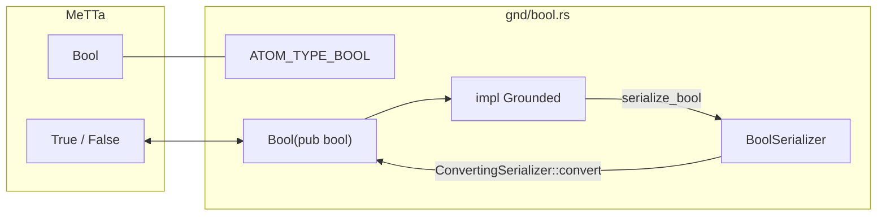

# `gnd/bool.rs` 源码分析：Bool

## 1. 文件角色与职责

本文件实现 MeTTa 内置布尔 grounded 类型 **`Bool`**，与类型符号 **`Bool`**（`sym!("Bool")`）对应。职责包括：

- 声明 **`ATOM_TYPE_BOOL`**。
- 提供从 MeTTa 风格字符串 **`"True"` / `"False"`** 的解析、与 `Atom` / `GroundedAtom` 的 **TryFrom**。
- 通过 **`Grounded::serialize`** 与 **`BoolSerializer` + `ConvertingSerializer<Bool>`** 接入序列化接口（`serialize_bool`）。

**无可执行语义**（不实现 `CustomExecute`）。

## 2. 公共 API 一览

| 名称 | 类别 | 说明 |
|------|------|------|
| `ATOM_TYPE_BOOL` | `pub const Atom` | `sym!("Bool")` |
| `Bool` | `pub struct` | 元组结构体 **`Bool(pub bool)`**，字段公开 |
| `Bool::from_str` | 方法 | `"True"` → `true`，`"False"` → `false`，其它 **`panic!`** |
| `Bool::from_atom` | 方法 | `&Atom` → `Option<Bool>` |
| `Into<Bool>` | `impl` | `bool` → `Bool` |
| `TryFrom<&Atom>` / `TryFrom<&dyn GroundedAtom>` | `impl` | `BoolSerializer::convert` |
| `Display` | `impl` | 输出 **`True`** 或 **`False`**（与 `from_str` 对称） |
| `PartialEq` / `Clone` / `Debug` | `derive` | 标准派生 |

## 3. 核心数据结构

| 类型 | 可见性 | 说明 |
|------|--------|------|
| `Bool` | `pub` | 单字段 `pub bool`，便于直接访问 |
| `BoolSerializer` | 私有 | `Option<Bool>`，在 `serialize_bool` 中写入 |

## 4. Trait 实现要点

### `Grounded`

| 方法 | 行为 |
|------|------|
| `type_()` | **`ATOM_TYPE_BOOL`** |
| `as_execute()` | 默认 `None` |
| `serialize()` | `serializer.serialize_bool(self.0)` |

### `CustomExecute`

- **未实现**。

### `Serializer`

- **`Bool` 不实现 `serial::Serializer`**；**`BoolSerializer`** 实现 `serialize_bool`，并通过 **`ConvertingSerializer<Bool>`** 提供 `check_type`（比对 `ATOM_TYPE_BOOL`）与 `into_type`。

## 5. 与 MeTTa 类型的对应关系

| Rust | MeTTa / Atom 层 |
|------|-----------------|
| `ATOM_TYPE_BOOL` | 符号 **`Bool`** |
| `Display` / `from_str` | 文本形式 **`True` / `False`**（首字母大写），与常见 MeTTa 布尔字面习惯一致 |
| `gnd/mod.rs` 的 `gnd_eq` | `type_() == ATOM_TYPE_BOOL` 时用 `Bool::try_from` 比较 |

`hyperon-macros` 中 `metta!` 可识别布尔 grounded 词法；本文件保证 **类型符号与序列化** 与运行时一致。

## 6. 架构示意（Mermaid）

## 7. 小结

`gnd/bool.rs` 是体量最小的内置 grounded 类型之一：**MeTTa 类型 `Bool`、文本 `True`/`False`、以及 `serialize_bool`** 三者通过 `Grounded` 与 `BoolSerializer` 对齐。`from_str` 对非法输入 **直接 panic**，适合假定输入已词法合法的解析路径；若需鲁棒 API，应在更上层做校验。类型**不可执行**，与 `Number`、`Str` 同属值类 grounded。
