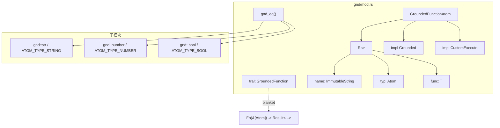

# `gnd/mod.rs` 源码分析：GroundedFunction 包装与 grounded 相等性

## 1. 文件角色与职责

本文件是 `hyperon_atom::gnd` 子模块的根模块，负责：

- **声明子模块**：导出 `str`、`number`、`bool` 三个内置 grounded 类型模块。
- **定义可执行 grounded 函数的抽象**：`GroundedFunction` trait 及其对闭包 `Fn(&[Atom]) -> Result<...>` 的 blanket 实现。
- **提供 `GroundedFunctionAtom<T>`**：用 `Rc` 共享存储函数名、MeTTa 类型原子与可调用体，使 Rust 函数可作为 `Atom::Grounded` 嵌入并参与 `CustomExecute` 执行路径。
- **实现跨类型 grounded 相等辅助函数 `gnd_eq`**：在 `eq_gnd` 失败时，对 `String` / `Number` / `Bool` 三类原子按 MeTTa 类型常量做结构化比较（代码中标注为临时方案，TODO 建议由模块级机制替代）。

本文件**不**定义 `Number`、`Str`、`Bool` 本体，而是通过 `use` 引入其符号供 `gnd_eq` 使用。

## 2. 公共 API 一览

| 名称 | 类别 | 说明 |
|------|------|------|
| `pub mod str` | 子模块 | 字符串 grounded 类型与工具函数 |
| `pub mod number` | 子模块 | 数值 grounded 类型 |
| `pub mod bool` | 子模块 | 布尔 grounded 类型 |
| `GroundedFunction` | `trait` | `execute(&self, args: &[Atom]) -> Result<Vec<Atom>, ExecError>` |
| `GroundedFunctionAtom<T>` | `struct` | 包装 `T: GroundedFunction`，共享所有权 |
| `GroundedFunctionAtom::new` | 关联函数 | `ImmutableString` 名称、`Atom` 类型、`T` 函数体 |
| `GroundedFunctionAtom::name` | 方法 | 返回注册为 token 用的名称（`&str`） |
| `gnd_eq` | 函数 | `(&dyn GroundedAtom, &dyn GroundedAtom) -> bool` |

## 3. 核心数据结构

| 类型 | 可见性 | 字段 / 含义 |
|------|--------|-------------|
| `GroundedFunctionAtom<T>` | `pub` | 内部 `Rc<GroundedFunctionAtomContent<T>>` |
| `GroundedFunctionAtomContent<T>` | 私有 | `name: ImmutableString`，`typ: Atom`，`func: T` |

`Rc` 使 `GroundedFunctionAtom` 可 `Clone` 而无需复制函数体，适合在 atom 图中多处引用同一内置操作。

## 4. Trait 实现要点

### `GroundedFunction`

- 用户实现或闭包：`execute` 接收参数切片，返回结果向量或 `ExecError`。

### `PartialEq`（`GroundedFunctionAtom<T>`）

- **`eq` 恒为 `true`**：任意两个 `GroundedFunctionAtom` 在 `PartialEq` 语义下视为相等（与“按名称/类型区分”的直觉不同，属刻意简化或历史折衷，调用方需注意）。

### `Display` / `Debug` / `Clone`

- `Display`：仅输出 `name`。
- `Debug`：输出 `GroundedFunctionAtom[name=..., typ=...]`。
- `Clone`：克隆 `Rc`（浅拷贝）。

### `Grounded`（`GroundedFunctionAtom<T>`）

| 方法 | 行为 |
|------|------|
| `type_()` | 返回构造时传入的 `typ`（克隆） |
| `as_execute()` | `Some(self)`，表示可执行 |
| `serialize()` | **未重写**，使用 `Grounded` 默认实现 → `Err(serial::Error::NotSupported)` |

### `CustomExecute`

- `execute` 委托给内部 `self.0.func.execute(args)`。

### `Serializer`

- **本类型不直接实现** `serial::Serializer`；序列化由 `Grounded::serialize` 默认拒绝支持。

## 5. 与 MeTTa 类型的对应关系

本文件**不**定义 `ATOM_TYPE_*` 常量；`gnd_eq` **消费**子模块中的类型常量：

| 常量（定义位置） | 用途（本文件） |
|------------------|----------------|
| `ATOM_TYPE_STRING`（`gnd/str.rs`） | `a.type_() == ATOM_TYPE_STRING` 时用 `Str::try_from` 比较 |
| `ATOM_TYPE_NUMBER`（`gnd/number.rs`） | 同上，`Number::try_from` |
| `ATOM_TYPE_BOOL`（`gnd/bool.rs`） | 同上，`Bool::try_from` |

`GroundedFunctionAtom` 的 MeTTa 类型由调用方在 `new` 时传入的 `typ: Atom` 决定，**不限于**上述三种内置类型。

## 6. 架构示意（Mermaid）

## 7. 小结

`gnd/mod.rs` 把 **Rust 可调用体** 包装成 **带名称与显式 MeTTa 类型** 的 grounded 原子，并通过 `CustomExecute` 接入求值管线；与 `Number`/`Str`/`Bool` 不同，该包装**默认不支持** `Serializer` 往返。`gnd_eq` 为内置三类值类型提供了在 `eq_gnd` 之外的相等性分支，但实现上带有 TODO，长期应替换为模块可扩展的相等策略。`PartialEq` 对 `GroundedFunctionAtom` 恒真属于易踩坑点，文档与测试场景需特别留意。
