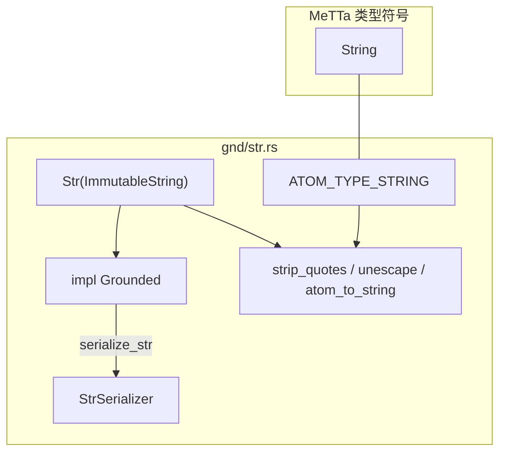

# `gnd/str.rs` 源码分析：Str 与字符串工具

## 1. 文件角色与职责

本文件实现 MeTTa 内置 **`String`** 类型的 Rust grounded 封装 **`Str`**，并补充字符串与 atom 互转、引号剥离、转义等工具函数。主要职责：

- 定义 **`ATOM_TYPE_STRING`**（`sym!("String")`）。
- 用 **`ImmutableString`**（`hyperon_common`）避免不必要的分配，支持字面量与堆分配两种存储。
- 通过 **`Grounded::serialize`** 与 **`StrSerializer` + `ConvertingSerializer<Str>`** 支持序列化管线中的字符串读写。
- 提供 **`atom_to_string`**、**`expect_string_like_atom`** 等，在“grounded 字符串 vs 符号字面量”之间统一得到可读的 `String`。

## 2. 公共 API 一览

| 名称 | 类别 | 说明 |
|------|------|------|
| `ATOM_TYPE_STRING` | `pub const Atom` | `sym!("String")` |
| `Str` | `pub struct` | 元组结构体，内含 `ImmutableString` |
| `Str::from_str` | 方法 | 静态字面量 → `Str` |
| `Str::from_string` | 方法 | 拥有 `String` → `Str` |
| `Str::as_str` | 方法 | `&str` 视图 |
| `Str::from_atom` | 方法 | `&Atom` → `Option<Str>` |
| `AsRef<str>` | `impl` | 委托 `as_str` |
| `Into<String>` | `impl` | 从 `Str` 复制/分配为 `String` |
| `TryFrom<&Atom>` / `TryFrom<&dyn GroundedAtom>` | `impl` | `StrSerializer::convert` |
| `Display` | `impl` | 对内部 `as_str()` 使用 **带转义的调试风格**（`{:?}`），与 Rust 字符串字面量展示一致 |
| `strip_quotes` | 函数 | 去掉首尾 `"` 的引用形式子串 |
| `unescape` | 函数 | 基于 `unescaper` 解转义，并去掉结果首尾字符（实现假定外层引号） |
| `atom_to_string` | 函数 | 若为 `Grounded` 且 `type_() == ATOM_TYPE_STRING`，提取真实字符串内容；否则 `atom.to_string()` |
| `expect_string_like_atom` | 函数 | 符号或 grounded → `Some(atom_to_string(...))`，其它 → `None` |

## 3. 核心数据结构

| 类型 | 可见性 | 说明 |
|------|--------|------|
| `Str` | `pub` | `Str(ImmutableString)`，新类型包装 |
| `StrSerializer` | 私有 | 通过 `serialize_str` 累积 `Str::from_string` |

## 4. Trait 实现要点

### `Grounded`

| 方法 | 行为 |
|------|------|
| `type_()` | **`ATOM_TYPE_STRING`** |
| `as_execute()` | 默认 `None` |
| `serialize()` | `serializer.serialize_str(self.as_str())` |

### `CustomExecute` / `Str` 本体

- **不实现** `CustomExecute`（非函数原子）。

### `Serializer`

- **`Str` 不实现 `serial::Serializer`**；**`StrSerializer`** 实现 `Serializer`（`serialize_str`），并实现 **`ConvertingSerializer<Str>`**：`check_type` 判断 `gnd.type_() == ATOM_TYPE_STRING`。

## 5. 与 MeTTa 类型的对应关系

| Rust | MeTTa / Atom 层 |
|------|-----------------|
| `ATOM_TYPE_STRING` | 符号 **`String`**（`sym!("String")`） |
| `Grounded::type_()` | 与 MeTTa 内置字符串类型名对齐 |
| `gnd/mod.rs` 的 `gnd_eq` | `type_()` 为 `ATOM_TYPE_STRING` 时按 `Str` 值比较 |

`metta!` 过程宏（`hyperon-macros`）可识别 grounded 字符串字面量并生成相应 atom；本文件负责 **运行时** 类型与序列化一致性。

## 6. 架构示意（Mermaid）

## 7. 小结

`gnd/str.rs` 将 **`ImmutableString`** 包装为 MeTTa 的 **`String`** grounded 类型，完成 **类型常量、`Grounded::serialize`、TryFrom/ConvertingSerializer** 的闭环。`Display` 采用 **转义后的引号形式**，便于日志与测试对比字面量；`atom_to_string` 在 grounded 字符串与符号形式之间做了实用分支。`unescape` 对结果做 **首尾字符删除**，调用方需符合其“带外层引号”的约定。本类型**不可执行**。
