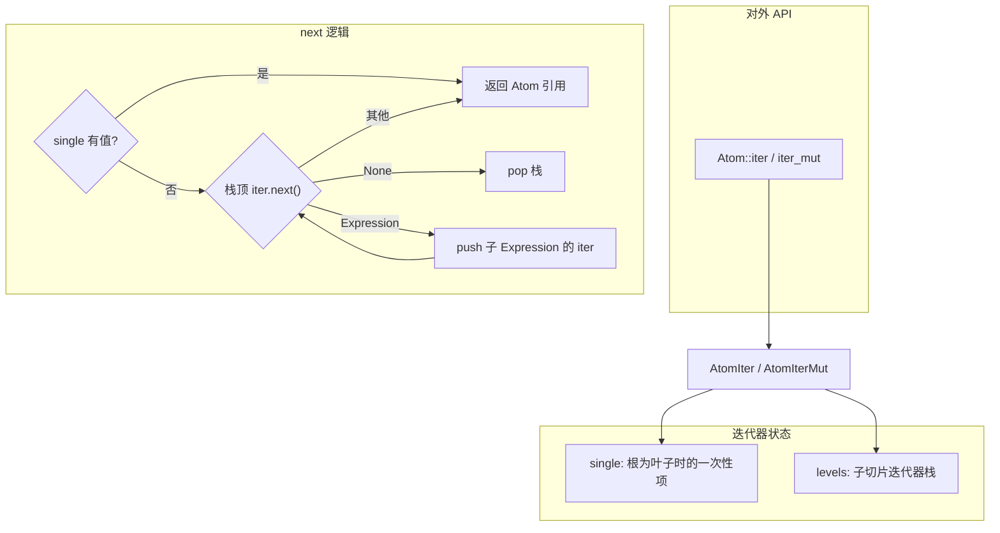

# `iter.rs` 源码分析

## 1. 文件角色与职责

`iter.rs` 为 [`Atom`](crate::Atom) 提供**子原子（sub-atoms）的深度优先遍历**：对表达式树从左到右、先深入子表达式再回溯。迭代项为**符号、变量、Grounded**；遇到子项为 `Atom::Expression` 时仅下钻其 `children`，**不会**把该表达式节点本身作为 `next` 的返回值。文件同时提供**不可变**与**可变**两种迭代器，并支持按目标类型过滤（`TryFrom`）。

与 `subexpr.rs` 的区别：本模块遍历**所有**子原子（含符号、变量、Grounded、表达式）；`subexpr.rs` 主要针对**子表达式节点**并按可选策略行走。

## 2. 公开 API 一览

| 名称 | 类型 | 说明 |
|------|------|------|
| `Atom::iter` | 方法 `(&self) -> AtomIter<'_>` | 返回子原子不可变迭代器 |
| `Atom::iter_mut` | 方法 `(&mut self) -> AtomIterMut<'_>` | 返回子原子可变迭代器 |
| `AtomIter` | `pub struct` | 不可变深度优先迭代器 |
| `AtomIter::new` | 关联函数 | 从 `&Atom` 构造迭代器 |
| `AtomIter::filter_type` | 方法 | 将迭代项过滤并映射为 `T: TryFrom<&'a Atom>` |
| `AtomIter` 的 `Iterator` 实现 | trait impl | `Item = &'a Atom` |
| `AtomIterMut` | `pub struct` | 可变深度优先迭代器 |
| `AtomIterMut::new` | 关联函数 | 从 `&mut Atom` 构造 |
| `AtomIterMut::filter_type` | 方法 | `T: TryFrom<&'a mut Atom>` |
| `AtomIterMut` 的 `Iterator` 实现 | trait impl | `Item = &'a mut Atom` |

## 3. 核心数据结构

### `AtomIter<'a>`

- `levels: Vec<std::slice::Iter<'a, Atom>>`：栈，每层对应当前 `Expression` 子切片上的迭代器；用于模拟 DFS。
- `single: Option<&'a Atom>`：若根为叶子（Symbol / Variable / Grounded），先产出该唯一元素；表达式根则为 `None`，直接从 `levels` 开始。

### `AtomIterMut<'a>`

- 与 `AtomIter` 对称，使用 `IterMut<'a, Atom>` 与 `Option<&'a mut Atom>`。

源码中有 `TODO`：可考虑用枚举区分「单子」与「表达式」以简化结构。

## 4. Trait 定义与实现

| Trait | 实现者 | 要点 |
|-------|--------|------|
| `Iterator` | `AtomIter<'a>` | `next` 先消费 `single`，再在 `levels` 上循环：弹出空迭代器；遇 `Expression` 则 `push` 其子迭代器；否则返回当前原子引用 |
| `Iterator` | `AtomIterMut<'a>` | 逻辑同 `AtomIter`，使用 `children_mut().iter_mut()` |
| （无自定义 trait） | — | `filter_type` 依赖标准库 `Iterator::filter_map` 与 `TryFrom` |

## 5. 算法说明

**深度优先、仅产出「非表达式叶子」**（按子节点顺序下钻）：

1. 根为 Symbol / Variable / Grounded：仅一次 `next` 返回该原子。
2. 根为表达式：栈顶为根子列表的 `slice::Iter`，**根表达式自身不会作为迭代项出现**。
3. 每次从栈顶迭代器取下一项：
   - 若为 `Expression`：将该子表达式的 `children().iter()`（或 `iter_mut`）压栈并**继续循环**，不返回该 `Expression`。
   - 若为其他变体：立即 `return Some(atom)`。
4. 迭代器耗尽则 `pop` 一层，相当于回溯。

因此遍历的是树中所有**非 `Expression` 的 Atom**（与测试中断言的 `expr!("A")`、`expr!(a)` 等一致）。

**复杂度**：每个节点被栈操作访问常数次，总体 **O(n)**，`n` 为子树节点总数；额外空间为栈深度 **O(h)**，`h` 为树高。

## 6. 所有权与借用分析

- **生命周期**：`'a` 绑定到被遍历的整棵子树，所有 `Item` 均为 `&'a Atom` 或 `&'a mut Atom`，与 `Atom` 的嵌套借用规则一致。
- **可变迭代**：同一时间通过 `AtomIterMut` 最多暴露一个 `&mut Atom`（`Iterator::next` 语义），但调用方若保存多个 `next` 得到的可变引用会违反 Rust 规则——与标准库切片 `iter_mut` 相同，需由使用者保证不重叠使用。
- **`filter_type`**：消费 `self`，返回的 `impl Iterator` 仍携带 `'a`，不延长借用 beyond 原 `Atom` 的寿命。

## 7. Mermaid 架构图

## 8. 小结

`iter.rs` 用**显式栈 + 切片迭代器**实现了 `Atom` 表达式的深度优先下钻，**迭代结果不含 `Expression` 节点本身**，只含符号、变量与 Grounded。API 精简（`iter` / `iter_mut` + `filter_type`），测试覆盖了单子、扁平表达式与嵌套表达式的收集及可变原地更新。实现与 `ExpressionAtom::children` / `children_mut` 紧密耦合，适合对「所有叶子级原子」做只读或就地更新；若需按子表达式步进，应使用 `subexpr.rs` 的 `SubexprStream`。
