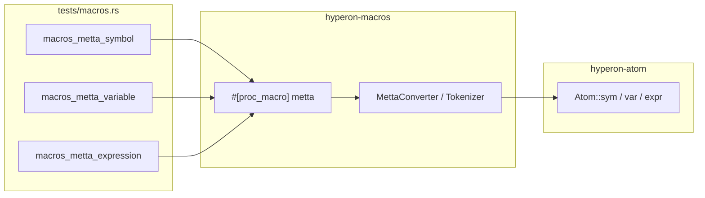

# `tests/macros.rs` 源码分析：`metta!` 宏集成测试

## 1. 文件角色与职责

本文件是 **`hyperon-atom`  crate 的集成测试**，验证依赖包 **`hyperon-macros`** 提供的过程宏 **`metta!`** 能否正确将类 MeTTa 语法展开为 **`hyperon_atom::Atom`** 的构造结果。

测试范围**仅限于**：

- **符号**（symbol）
- **变量**（variable，`$` 前缀）
- **S 表达式**（嵌套 `()`）

本文件**未**覆盖 `metta!` 对 **整型、浮点、字符串、布尔、花括号 grounded** 等字面量的展开（过程宏实现支持这些类别，见 `hyperon-macros` 文档与实现）。

## 2. 公共 API 一览

| 名称 | 类别 | 说明 |
|------|------|------|
| （无） | — | 测试模块仅含 `#[test]` 函数，不导出 API |

| 测试函数 | 断言内容 |
|----------|----------|
| `macros_metta_symbol` | `metta!{A}` ≡ `Atom::sym("A")` |
| `macros_metta_variable` | `metta!{$a}` ≡ `Atom::var("a")`；`metta!{$a+}` ≡ `Atom::var("a+")` |
| `macros_metta_expression` | 空表达式、扁平与嵌套表达式与手写 `Atom::expr([...])` 一致 |

## 3. 核心数据结构

- 无自有数据结构；仅使用 **`Atom`** 及宏展开产物。

## 4. Trait 实现要点

- 不涉及 `Grounded`、`CustomExecute`、`Serializer` 等 trait 的直接实现或测试。
- 间接依赖：`Atom` 的 **`PartialEq`**（或相等语义）用于 `assert_eq!`。

## 5. 与 MeTTa 类型的对应关系（`ATOM_TYPE_*`）

本测试文件**不**引用 `ATOM_TYPE_NUMBER`、`ATOM_TYPE_STRING`、`ATOM_TYPE_BOOL`，也**不**构造 `gnd::Number` / `Str` / `Bool` grounded 值。

若需验证内置类型与 `sym!("Number")` 等常量的对应关系，应阅读 **`gnd/number.rs`、`gnd/str.rs`、`gnd/bool.rs`** 或补充针对 `metta!{ 42 }`、`metta!{"hi"}` 等用例的测试。

**说明**：`hyperon-macros::metta` 的过程宏实现中定义了 `GndType::{Int, Float, Str, Bool}` 等词法分支，与本仓库内置 grounded 类型在语义上配套，但**本文件未测试**这些分支。

## 6. 架构示意（Mermaid）

## 7. 小结

`tests/macros.rs` 是 **`metta!` 过程宏** 的窄范围回归测试，确保 **符号、变量、表达式** 三类语法与 `hyperon_atom` 手工构造一致。它不涉及 **grounded 内置类型** 或 **`ATOM_TYPE_*` 常量**；与 `gnd` 模块文档互补——后者描述运行时类型与序列化，本文件仅覆盖宏展开的最小子集。扩展测试时建议增加对 **数值 / 字符串 / 布尔** 字面量及 `GroundedFunctionAtom` 花括号形式的用例，以与 `gnd` 实现及 `metta!` 完整能力对齐。
