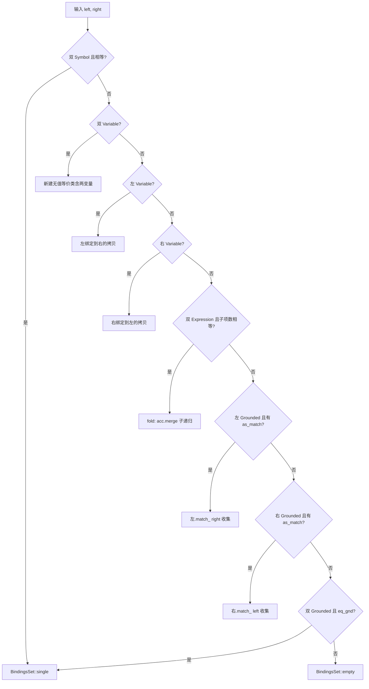
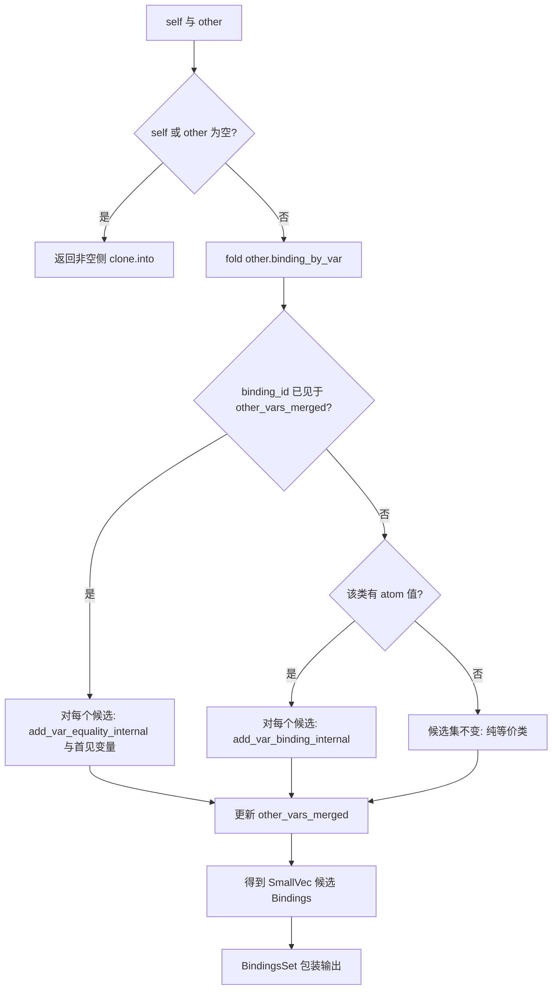

# `hyperon-atom/src/matcher.rs` 源码分析报告

本文档基于工作区版本 **0.2.10**、提交 **cf4c5375** 下的 `hyperon-atom/src/matcher.rs`，对 Hyperon 原子层面的**模式匹配与合一（unification）**实现做系统梳理。

---

## 1. 文件角色

`matcher.rs` 是 **Hyperon 原子匹配与变量约束求解的核心模块**，承担三类职责：

1. **结构合一**：对两个 `Atom`（可双侧含变量）做对称匹配，生成满足「相同位置可合一」的变量赋值与变量等价关系。
2. **`Bindings` 数据结构**：在内部用「等价类 + 可选值」表示多变量共享同一约束；支持解析（`resolve`）、合并（`merge`）、裁剪（`narrow_vars`）、环检测（`has_loops`）等。
3. **`BindingsSet`**：当单次操作可能产生**多个互斥的合一结果**（例如自定义 `CustomMatch` 返回多条绑定、或两条已绑定值需递归 `match_atoms` 且有多解）时，用**绑定集合**表示非确定性结果；`match_atoms` 对外以迭代器形式暴露过滤后的 `Bindings` 流。

与「仅做模式测试」不同，本实现会**构造并传播** `Bindings` / `BindingsSet`，并在表达式情况下通过 `merge` 组合子问题的约束，属于完整的**合一风格**匹配引擎（含变量等价与值冲突消解）。

---

## 2. 公开 API 清单

### 2.1 宏（`#[macro_export]`，根 crate 可见）

| 名称 | 作用 |
|------|------|
| `bind!` | 由若干 `变量: 原子` 对构造 `Bindings`；右值为单个变量时表示**变量等价**，否则为**赋值**。主要用于测试。 |
| `bind_set!` | 构造 `BindingsSet`：支持 `[]`、`{ ... }` 单组、`expr` 单项及递归列表合并。 |

### 2.2 Trait

| 名称 | 作用 |
|------|------|
| `VariableSet` | 抽象「变量集合」，使 `narrow_vars` 可同时接受 `HashSet<&VariableAtom>` 与 `HashSet<VariableAtom>`。 |

### 2.3 类型

| 名称 | 可见性 / 说明 |
|------|----------------|
| `Bindings` | `pub struct`：合一结果的主载体。 |
| `BindingsSet` | `pub struct`：多个 `Bindings` 的容器（内部 `SmallVec`）。 |
| `BindingsIter<'a>` | `pub struct`：按 `binding_by_var` 遍历，每项为 `resolve` 后的 `(&VariableAtom, Atom)`。 |
| `MatchResultIter` | `pub type` = `BoxedIter<'static, Bindings>`：`match_atoms` 的返回类型。 |

### 2.4 函数

| 名称 | 作用 |
|------|------|
| `match_atoms` | 对 `left`、`right` 对称匹配；内部先 `match_atoms_recursively`，再**过滤掉** `has_loops()` 为真的结果。 |
| `apply_bindings_to_atom_move` | 对 `Atom` 做拷贝/移动式应用绑定。 |
| `apply_bindings_to_atom_mut` | 原地将变量替换为 `resolve` 结果；若修改了表达式子节点则置 `evaluated = false`。 |
| `atoms_are_equivalent` | 在允许**双向变量重命名**的前提下判断两原子是否结构等价（独立的小型算法，使用 `HashMap` 记录左右变量对应关系）。 |

### 2.5 `Bindings` 主要公开方法

`new`、`len`、`is_empty`、`resolve`、`add_var_equality`、`add_var_binding`、`merge`、`narrow_vars`、`convert_var_equalities_to_bindings`、`has_loops`、`iter`、`vars`、`rename_vars`、`apply_and_retain`，以及 `Display` / `Debug` / `PartialEq`（文档注明 `PartialEq` 主要用于测试）。

### 2.6 `BindingsSet` 主要公开方法

`empty`、`single`、`count`、`is_empty`、`is_single`、`drain`、`push`、`add_var_equality`、`add_var_binding`、`merge`（与另一个 `BindingsSet` 做笛卡尔式合并），以及 `Deref`/`DerefMut` 到 `[Bindings]`。

---

## 3. 核心数据结构

### 3.1 内部 `Binding`

每条物理「绑定记录」包含：

- `id: usize`：在 `HoleyVec` 中的槽位标识（与 `HoleyVec` 的索引一致）。
- `count: usize`：指向该等价类的**变量名个数**（`binding_by_var` 中映射到此 `id` 的条目数）。
- `var: VariableAtom`：该等价类的**代表变量名**（用于无值时的 `resolve`、以及 `Display` 展示）。
- `atom: Option<Atom>`：`None` 表示仅变量等价、尚无地面值；`Some` 表示该类已关联一个原子值（可再含子变量）。

### 3.2 `Bindings`：`HashMap` + `HoleyVec`

```rust
pub struct Bindings {
    binding_by_var: HashMap<VariableAtom, usize>,
    bindings: HoleyVec<Binding>,
}
```

- **`binding_by_var`**：每个**变量名** → 其所属 `Binding` 在 `HoleyVec` 中的索引。多变量可共享同一索引，即**并查集式等价类**的外显接口。
- **`bindings: HoleyVec<Binding>`**：存放活的 `Binding`；合并或删除等价类时会对槽位 `remove`，`HoleyVec` 通过**空洞链表**复用索引，避免大量搬移并保持外部存储的 `id` 与实现细节一致（见 `hyperon-common` 中 `HoleyVec::remove` / `push`）。

**设计意图**：`HashMap` 提供 O(1) 期望时间的按名查找；`HoleyVec` 支持**删除绑定记录**而不破坏「按 id 索引」的稳定性需求（例如 `merge_bindings` 中 `remove` 一侧绑定）。

### 3.3 `BindingsSet`：`SmallVec<[Bindings; 1]>` 优化

```rust
pub struct BindingsSet(smallvec::SmallVec<[Bindings; 1]>);
```

- 绝大多数成功路径只产生**一个** `Bindings`；`SmallVec` 内联容量为 1，避免堆分配。
- 当自定义匹配或值冲突递归产生多解时，再扩展到堆上向量。

---

## 4. 核心算法

### 4.1 `match_atoms` / `match_atoms_recursively`

- **`match_atoms`**：包装递归函数，并 `.filter` 丢弃 `has_loops()` 的绑定（文档示例：`($a ($a))` 与 `($x $x)` 一类无穷展开）。
- **`match_atoms_recursively`**：对 `(left, right)` 做**有序**分支（Rust `match` 顺序即优先级）：

下文第 6 节按分支逐项说明。

**表达式情况**：子节点逐对 zip，`fold` 初值为 `BindingsSet::single()`（一个空绑定），每一步：

```rust
            a.iter().zip(b.iter()).fold(BindingsSet::single(),
            |acc, (a, b)| {
                acc.merge(&match_atoms_recursively(a, b))
            })
```

即**从左到右**把当前累积的 `BindingsSet` 与下一对子节点的 `BindingsSet` 做 `BindingsSet::merge`（见 4.5），实现约束的**组合**。

### 4.2 `Bindings::merge`（与 `other: &Bindings` 合一）

算法骨架：

1. 若 `self` 或 `other` 为空，直接返回另一侧（克隆）的 `BindingsSet`。
2. 否则对 **`other.binding_by_var` 的每个条目** `(var, binding_id)` 做折叠：
   - 维护 `other_vars_merged: HashMap<usize, &VariableAtom>`：同一 `other` 侧等价类已处理过时，后续变量只做 **`add_var_equality_internal`** 与已记录的「代表」变量合一，避免对同一类重复 `add_var_binding`。
   - 若该 `binding_id` 首次出现：取 `other` 中该类的 `atom`；有值则对每个当前候选 `Bindings` 调用 **`add_var_binding_internal`**；无值则**不增加约束**（纯变量等价类在 `other` 侧由后续同名或等式边处理）。

**要点**：`HashMap` 迭代顺序**非稳定**；合并语义不依赖顺序，但**调试日志与某些测试**可能表现出顺序相关的不稳定（文件中已有 `#[ignore]` 测试注明 HashMap 顺序问题）。

### 4.3 `resolve`

- 入口 `resolve(var)`：新建 `used_vars`，调用 `resolve_internal`。
- **`resolve_internal`**：找到 `var` 对应 `Binding`：
  - `atom` 为 `None`：返回**代表变量**的 `Atom::Variable(binding.var)`（成功，值为「仍是变量」）。
  - `atom` 为 `Some`：调用 `resolve_vars_in_atom` 深度展开。
- **`resolve_vars_in_atom`**：对原子树做可变遍历；每遇变量若已在 `used_vars` 则 **`Loop`**（与入口 `resolve` 配合返回 `None`）；否则克隆 `used_vars` 并下探。子变量解析失败为 `None` 时**保留原变量**（部分解析）。

### 4.4 `add_var_equality` / `add_var_binding`

- **`add_var_equality_internal`**：四类情况——两变量均已绑定到同一类；两类已绑定到不同类则 **`merge_bindings`**；一侧未绑定则并入已有类；两侧都未绑定则新建无值类并挂两个变量名。
- **`merge_bindings(a_id, b_id)`**：
  - 两侧都有值且**相等**：删掉一侧类，变量并入另一侧。
  - 两侧都有值且**不等**：**`match_values`** → 对两值递归 `match_atoms_recursively`，再对每个结果与 `self` 做 `merge`（可能爆炸为多解）。
  - 一侧无值：`move_binding_to_binding`，把变量指针统一到「有值」或任意一侧（代码分支保证方向）。
- **`add_var_binding_internal`**：若变量已有值且与新值不同，同样走 **`match_values`**；若已有值相同则不变；若无值则写入 `Some(value)`；若变量不存在则 `new_binding`。

**`Bindings` 上的 `add_var_equality` / `add_var_binding`**：调用 internal 后若 `BindingsSet` 长度为 0 返回 Err，为 1 取唯一元素，大于 1 则 Err 提示改用 `BindingsSet` 版本（**分裂**）。

### 4.5 `BindingsSet::merge`（两集合的乘积）

```rust
    pub fn merge(self, other: &BindingsSet) -> Self {
        let mut new_set = BindingsSet::empty();
        for other_binding in other.iter() {
            new_set.extend(self.clone().merge_bindings(other_binding).into_iter());
        }
        new_set
    }
```

对 `other` 中**每一个** `Bindings` 克隆 `self` 并做 `Bindings::merge`，再 `extend`——典型 **|A| × |B|** 式组合（注释说明其替代了历史上的 `match_result_product`）。

### 4.6 `narrow_vars`

1. 对传入集合中每个变量 `find_deps`：沿**已绑定值**中的子变量**深度优先**收集依赖闭包。
2. 新建 `Bindings`，用 `prev_to_new` 映射旧 `Binding.id` → 新 id，对「用户请求的变量」及其依赖做浅拷贝式重建，保持等价结构与赋值。

### 4.7 `has_loops` / `binding_has_loops`

在**绑定图**上检测环：从每个 `Binding` 出发，沿其 `atom` 中出现的**已绑定变量**递归；用 `BitSet` 记录访问过的 `binding.id`。与 `resolve` 用的「变量名环」检测角度不同，用于过滤病态合一结果。

### 4.8 `rename_vars`

1. `into_vec_of_pairs`：先收集「有地面值」的 `(代表变量, 值)`，清空值侧；再为「名字与代表不一致」的变量追加 `(var, Variable(代表))`。
2. 对每对应用用户闭包 `rename`，并递归重写值中的变量节点。
3. 再 `collect` 回 `Bindings`（通过 `From` 路径）。

---

## 5. 算法复杂度与爆炸风险

记号：\(n\) = 涉及变量数，\(m\) = `binding_by_var` 规模，\(L\) = 原子树规模，\(R\) = 当前 `BindingsSet` 中绑定个数，\(k\) = 表达式子项个数。

### 5.1 `match_atoms_recursively`（单解路径）

- **符号/变量/等长表达式**：单次递归 \(O(1)\) 结构操作；表达式 fold 为 \(O(k)\) 次 `BindingsSet::merge` 调用。
- **最坏情况**：若多处分支各自产生 \(R_i\) 个 `Bindings`，则 fold 后规模约为 **\(\prod_i R_i\)**（与 `BindingsSet::merge` 的乘积行为一致）。

### 5.2 `Bindings::merge(self, other)`

- 外层 fold 遍历 **`other` 的每个变量条目**，期望 \(O(m)\) 轮；每轮对当前 `SmallVec` 中**每个**候选执行 `add_var_equality_internal` 或 `add_var_binding_internal`。
- 若每轮将候选数乘以常数因子或更糟，总候选数上界为 **指数级**：**\(O(R \cdot \alpha^m)\)** 的直观表述是：存在一族输入使 \(R\) 随约束数量指数增长；常数 \(\alpha\) 来自 `match_values` 与自定义匹配的分支数。

### 5.3 `match_values`（合并冲突值）

对两个已绑定原子做完整 `match_atoms_recursively`，再 `flat_map(|b| b.merge(self))`：既可能增加 **Bindings 数量**，又使单次 `merge` 的 `self` 更大，是**组合爆炸的关键路径**之一。

### 5.4 `resolve`

- 每条路径上对每个子变量克隆 `HashSet`（`used_vars`），最坏 **\(O(L^2)\)** 时间与额外空间（深树 + 宽树）；通常为 \(O(L \cdot d)\)，\(d\) 为路径深度。
- 检测环正确，但代价是克隆集合。

### 5.5 `narrow_vars` / `find_deps`

- `find_deps` 类似图上 DFS，\(O(m + L)\) 量级（依赖原子中变量出现次数）。
- 拷贝构建新 `Bindings` 与 `binding_by_var` 规模相当。

### 5.6 小结

| 操作 | 乐观情况 | 高风险情况 |
|------|-----------|------------|
| 表达式匹配 | 单路径 \(O(k)\) 次合并 | 多解 `CustomMatch` 或值冲突递归 → **指数级** `BindingsSet` |
| `Bindings::merge` | \(O(m)\) 更新 | 多候选 × 多分裂 → **指数级** |
| `resolve` | \(O(L)\) | 深树频繁 `HashSet` 克隆 → \(O(L^2)\) |

**工程含义**：Hyperon 在通用合一与可插件 `CustomMatch` 下**刻意保留**非确定性；调用方应对 `BindingsSet` 大小与 `match_atoms` 收集行为（见文件顶部 TODO：无限迭代器 `.collect()` 会挂死）有警觉。

---

## 6. `match_atoms` 各情形执行流

以下按 **`match_atoms_recursively` 中 `match` 分支顺序**（前者优先）。

### 6.1 `Symbol` — `Symbol`

- 条件：`a == b`。
- 结果：`BindingsSet::single()`（空约束）。
- 否则：落入最终 `_ => empty()`。

### 6.2 `Variable` — `Variable`

- 新建 `Bindings`，`new_binding(dv, None)` 再 `add_var_to_binding` 把 `pv` 并入**同一无值类**。
- 语义：**两变量等价**，无地面值。

### 6.3 `Variable` — 任意非左变量分支的 `b`

- **左为变量、右非变量**（且右不是先于本分支被其它规则吃掉的情况）：`new_binding(v, Some(b.clone()))`。
- 语义：变量绑定到右部结构的**一份拷贝**。

### 6.4 非上述左 — `Variable`

- **右为变量**：对称地 `new_binding(v, Some(a.clone()))`。
- 注意：与 6.3 互斥顺序保证**恰好一侧为变量**时走赋值分支；双侧变量已由 6.2 处理。

### 6.5 `Expression` — `Expression`

- 条件：`children` 长度相等。
- 否则最终 `empty()`。
- 相等：子节点 zip + `fold` + `BindingsSet::merge`（第 4.1 节）。

### 6.6 `Grounded`（自定义匹配）— 任意 / 任意 — `Grounded`

- 若 **`left` 为 `Grounded` 且 `as_match().is_some()`**：调用 `match_(right)`，**`.collect()`** 为 `BindingsSet`（惰性迭代器在此被耗尽）。
- 否则若 **`right` 为 `Grounded` 且带 `as_match`**：调用 `match_(left)`。
- **优先级**：左先尝试自定义匹配；仅当左无 `as_match` 时才试右。因此**两侧都有 `CustomMatch` 时只执行左侧**（与注释 TODO 一致：变量与 Grounded 的双向语义尚未同时返回）。

### 6.7 `Grounded` — `Grounded`（无自定义匹配或已跳过）

- 条件：`a.eq_gnd(AsRef::as_ref(b))`。
- 结果：`single()`；否则若未被上面 grounded 规则处理则 `empty()`。

### 6.8 其它组合

- `_ => BindingsSet::empty()`：类型/结构不兼容。

**`match_atoms` 最终过滤**：丢弃 `has_loops()` 的绑定。

---

## 7. 所有权与 API 风格

- **`Bindings` 的消耗式 API**：`add_var_equality`、`add_var_binding`、`merge`、`rename_vars`、`convert_var_equalities_to_bindings` 等接收 **`self` by value**，强制「每次更新产生新所有者」，便于在链式调用中表达状态变迁，并与 `Result<Bindings, _>` 配合。
- **`RefOrMove`**：`add_var_binding` 对变量名与值既可传引用又可传拥有值，减少不必要的克隆。
- **`merge(self, other: &Bindings)`**：消费 `self`，借用 `other`；合并后产生新的 `BindingsSet`，不修改 `other`。
- **`BindingsSet::merge(self, other: &BindingsSet)`**：消费 `self`，对 `other` 的每个元素克隆 `self` 再合并——**成本与 `self` 的基数线性相关**，需注意。
- **`match_atoms`**：返回 `Box<dyn Iterator>`，内部已将 `BindingsSet` **物化**再过滤，调用方获得 `'static` 迭代器。
- **`apply_bindings_to_atom_mut`**：借用 `bindings`；对 `Atom` 为 `&mut`，可能替换子树并清除表达式「已求值」标记。

---

## 8. Mermaid 图示

### 8.1 `match_atoms_recursively` 决策树（简化）



### 8.2 `Bindings::merge` 数据流



---

## 9. 与 MeTTa 语义的对应关系（概念层）

Hyperon 的 MeTTa 层在模式、查询与规则触发上依赖「两个表达式能否在同一替换下一致」。本模块在 Rust 引擎侧提供的基础设施可对应理解为：

| MeTTa / 逻辑编程概念 | 本模块机制 |
|----------------------|------------|
| **模式匹配（match）** | `match_atoms`：在**双侧**模式上建立约束；同一变量多次出现通过后续 `merge` / `add_var_binding` 强制一致。 |
| **合一（unification）** | `Bindings` 同时表示 **变量等价**（`atom == None` 的类）与 **变量到项的绑定**；冲突时通过 `match_values` 递归合一。 |
| **非确定性 / 多解** | `BindingsSet`、`CustomMatch::match_` 返回多条 `Bindings`；`BindingsSet::merge` 做解的乘积。 |
| **代入（substitution）** | `apply_bindings_to_atom_mut` / `resolve`：将约束落实到具体 `Atom` 树上。 |
| **Occurs check 变体** | `resolve` 用变量访问集检测**展开环**；`has_loops` 用绑定 id 检测**绑定图环**；`match_atoms` 默认丢弃 `has_loops` 为真的解。 |

注意：MeTTa 前端具体内置原语名与参数顺序可能随版本变化；**语义锚点**是「对称合一 + 可扩展 grounded 匹配 + 多解集合」。

---

## 10. 总结

- `matcher.rs` 实现了 Hyperon **原子层对称合一匹配**，以 `Bindings`（`HashMap` 变量索引 + `HoleyVec<Binding>` 等价类）为核心，`BindingsSet` + `SmallVec<[Bindings;1]>` 承载**非确定性**结果。
- **表达式匹配**通过子问题 `BindingsSet::merge` 组合约束；**冲突消解**在 `merge_bindings` / `add_var_binding_internal` 中可回落到对两子项的完整 `match_atoms_recursively`，具有**指数级**组合爆炸潜力。
- **`match_atoms`** 对 `Grounded` 优先调用**左侧** `CustomMatch`；双侧均有自定义匹配时的并集语义尚未实现（代码注释 TODO）。
- **所有权**上以消费式 `Bindings` 更新为主，利于链式构造与错误处理；性能敏感路径应注意 `BindingsSet::merge` 的克隆与 `resolve` 中的集合克隆。
- 与 MeTTa 的对应关系：**match / unify / 多解 / 代入** 均可在此模块找到直接实现或等价物。

---

*文档由源码静态分析生成；若实现变更请以仓库最新 `matcher.rs` 为准。*
