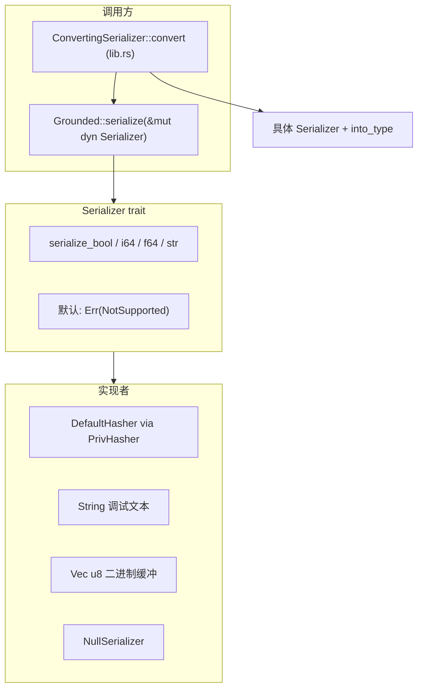

# `serial.rs` 源码分析

## 1. 文件角色与职责

`serial.rs` 定义 **Grounded 原子序列化** 的 Rust 侧接口：将布尔、整数、浮点、字符串等**原生形态**写入各类「接收端」（哈希器、调试字符串、字节缓冲等）。设计目标在模块注释中说明：用于落盘、网络传输，以及**跨运行时**（如 Rust 与 Python）的值转换；优先使用各端原生类型，避免先统一到某一 MeTTa 标准类型再转换的开销。

**说明**：[`ConvertingSerializer<T>`](crate::ConvertingSerializer) 定义在 `lib.rs`（非本文件），它继承 `serial::Serializer + Default`，通过 `Grounded::serialize` 填充缓冲区再 `into_type()` 还原为 `T`。本报告在 §4、§8 简述其与 `Serializer` 的配合。

## 2. 公开 API 一览

| 名称 | 类型 | 说明 |
|------|------|------|
| `Serializer` | `pub trait` | `serialize_bool` / `serialize_i64` / `serialize_f64` / `serialize_str`，默认返回 `Err(Error::NotSupported)` |
| `Error` | `pub enum` | 当前仅 `NotSupported` |
| `Result` | `pub type alias` | `std::result::Result<(), Error>` |
| `NullSerializer` | `pub struct` | 空操作序列化器，`#[derive(Default)]` |
| `impl Serializer for NullSerializer` | — | 所有方法返回 `Ok(())` |
| `impl Serializer for String` | — | 调试/文本：写入 `to_string()` 或原样 `push_str` |
| `impl Serializer for Vec<u8>` | — | 紧凑二进制：`bool` 单字节，`i64`/`f64` 小端字节，`str` 按 UTF-8 字节序列（注释注明**可能非合法 UTF-8 拼接**） |
| `impl<H: PrivHasher> Serializer for H` | — | **非直接公开**：`PrivHasher` 为私有 trait，仅对实现它的哈希器开放（当前即 `DefaultHasher`） |

私有项：`trait PrivHasher : Hasher`、`impl PrivHasher for DefaultHasher` — 用于限制 `Hasher` 的序列化实现可见性。

## 3. 核心数据结构

| 类型 | 作用 |
|------|------|
| `Error` | 可扩展的序列化错误枚举，现仅表示「不支持该类型」 |
| `NullSerializer` | 零大小、无字段，用于只需遍历序列化接口而不关心输出的场景 |

无复杂状态结构；序列化状态由各 `impl Serializer` 的类型自身承载（如 `String`、`Vec<u8>`、`DefaultHasher`）。

## 4. Trait 定义与实现

### `Serializer`

- 四方法均为**默认体**：未覆盖即 `NotSupported`，便于按需实现子集。

### `impl<H: PrivHasher> Serializer for H`

- `bool` → `write_u8(v as u8)`
- `i64` → `write_i64(v)`
- `f64` → `f64::to_bits(v).cast_signed()` 再 `write_i64`（位模式与 `i64` 哈希区分，测试中 `1i64` 与 `1.0f64` 哈希不同）
- `str` → 逐字节 `write_u8`

### `String` / `Vec<u8>` / `NullSerializer`

见 §2 表格。

### 与 `ConvertingSerializer<T>`（`lib.rs`）

- `ConvertingSerializer::convert`：在类型匹配或 `check_type` 通过后，以 `Self::default()` 为 `&mut dyn Serializer` 调用 `gnd.serialize`，再 `into_type()`。
- 各具体类型（如 `gnd/number.rs` 中的 `NumberSerializer`）在本模块的 `Serializer` 上实现写入逻辑，在 `lib` 侧实现 `ConvertingSerializer`。

## 5. 算法说明

本模块无复杂算法，仅为**类型到字节的确定性映射**：

- **浮点**：使用 IEEE 754 位模式转 `i64` 写入哈希器，保证与整数序列化路径可区分。
- **字符串（`Vec<u8>`）**：原始字节拼接，不做长度前缀（由上层协议负责分帧时需注意）。

## 6. 所有权与借用分析

- `Serializer` 方法均为 `&mut self`，接收端可变借用，可链式多次写入。
- `Grounded::serialize`（crate 内别处）使用 `&mut dyn Serializer`，**对象安全**：`Serializer` 无泛型方法，适合动态分发。
- `serialize_str` 接受 `&str`，不取得字符串所有权。
- `PrivHasher` 密封：`Serializer for H` 的 blanket impl 不向用户类型开放，避免任意 `Hasher` 与序列化语义混淆（注释亦提到可选用更快哈希器但权衡依赖）。

## 7. Mermaid 架构图

## 8. 小结

`serial.rs` 用**小 trait + 多目标 impl** 统一 Grounded 值的写出格式：`DefaultHasher` 适合指纹/去重，`String` 适合调试，`Vec<u8>` 适合紧凑缓冲，`NullSerializer` 适合占位。`Error::NotSupported` 使部分实现可只支持子集类型。**`ConvertingSerializer<T>` 不在本文件**，但在架构上与 `Serializer` 紧密衔接，完成「原子 → 序列化 → Rust 值」的转换闭环。若跨语言协议演进，可在保留 `Serializer` 的前提下扩展 `Error` 变体或新增序列化方法。
