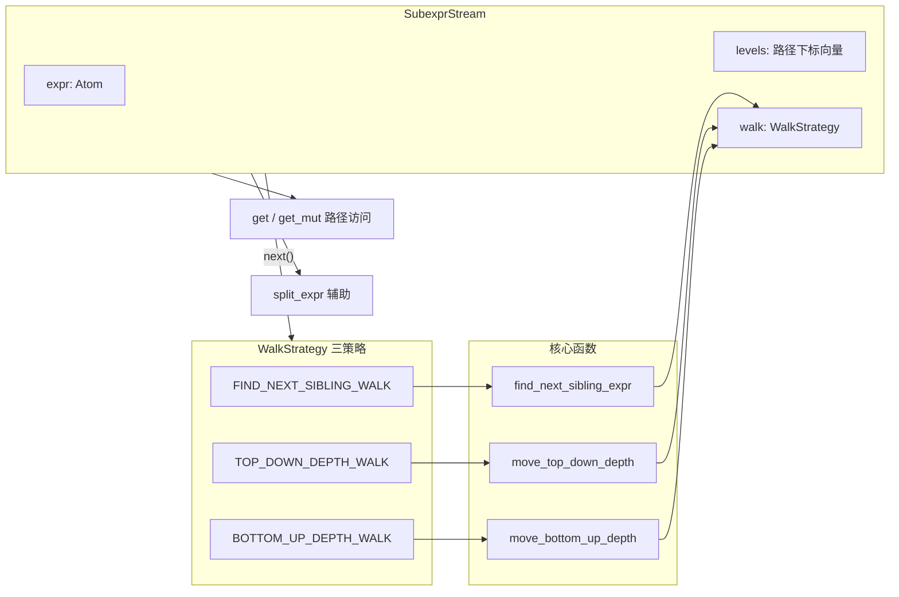

# `subexpr.rs` 源码分析

## 1. 文件角色与职责

`subexpr.rs` 提供在**表达式树**上按不同策略遍历**子表达式（sub-expressions）**的算法：只关注类型为 `Atom::Expression` 的节点（不将纯符号、变量、Grounded 叶子作为「子表达式」步进目标）。核心抽象为函数指针类型 `WalkStrategy` 与有状态流 `SubexprStream`，并附带 `split_expr` 等辅助函数。模块顶部文档说明其为「以多种方式走过表达式子结构」的算法集合。

## 2. 公开 API 一览

| 名称 | 类型 | 说明 |
|------|------|------|
| `WalkStrategy` | `type`（函数指针） | `for<'a> fn(&mut Vec<usize>, &'a ExpressionAtom, usize) -> Option<&'a Atom>` |
| `FIND_NEXT_SIBLING_WALK` | `pub static` | 指向 `find_next_sibling_expr` |
| `BOTTOM_UP_DEPTH_WALK` | `pub static` | 自底向上深度优先 |
| `TOP_DOWN_DEPTH_WALK` | `pub static` | 自顶向下深度优先 |
| `SubexprStream` | `pub struct` | 持有根 `Atom`、路径 `levels`、行走策略 |
| `SubexprStream::from_expr` | 方法 | 用 `Atom` 与 `WalkStrategy` 构造；`levels` 初始为 `vec![MINUS_ONE]` |
| `SubexprStream::next` | 方法 | 调用策略，返回当前指向的 `&Atom`（子表达式节点） |
| `SubexprStream::as_atom` / `into_atom` | 方法 | 借用 / 消费取出根表达式 |
| `SubexprStream::get` / `get_mut` | 方法 | 按 `levels` 路径取当前子树中的原子 |
| `SubexprStream` | `Clone` | 可复制流状态 |
| `SubexprStream` | `Iterator` | `Item = Atom`，每次克隆当前指向节点 |
| `SubexprStream` | `Debug` | 递归格式化并在当前焦点两侧加 `>` `<` |
| `split_expr` | `pub fn` | 若为表达式，返回 `(首子项, 剩余子项迭代器)`，否则 `None` |

## 3. 核心数据结构

### 路径编码 `levels: Vec<usize>`

- 每层索引表示在**该层 `ExpressionAtom::children()`** 中选中的子节点下标。
- `MINUS_ONE`（即 `usize::MAX`）用作哨兵：表示「尚未下钻到下一层」，配合 `move_top_down_depth` / `move_bottom_up_depth` 控制首次进入子树的行为。

### `SubexprStream`

| 字段 | 含义 |
|------|------|
| `expr` | 根 `Atom`（必须为表达式；策略与 `as_expr` 假定如此） |
| `levels` | 从根到当前焦点的子下标路径 |
| `walk` | `WalkStrategy`，无状态算法 + 有状态 `levels` |

## 4. Trait 定义与实现

| Trait | 实现者 | 要点 |
|-------|--------|------|
| `Iterator` | `SubexprStream` | `next` 内部调用**固有方法** `next()` 得到 `Option<&Atom>`，再 `cloned()` 得到 `Option<Atom>`（方法解析优先选固有 `next`，避免无限递归） |
| `Debug` | `SubexprStream` | `fmt_rec` 带 `current` 标记，在 `level == levels.len()` 且 `current` 时对焦点加 `>` `<` |
| `Clone` | `SubexprStream` | 派生：整棵 `Atom` 与路径一并克隆 |

无用户自定义 trait；`WalkStrategy` 为函数指针类型别名。

## 5. 算法说明

### `find_next_sibling_expr`

在当前层的 `children` 中，从 `levels[level] + 1` 起扫描，找到**下一个为 `Atom::Expression` 的兄弟**，更新 `levels[level]` 并返回其引用；若无则 `levels.pop()`，返回 `None`。

### `move_top_down_depth`（`TOP_DOWN_DEPTH_WALK`）

深度优先**先下后横**：优先沿 `levels` 已记录路径向下；到底后通过 `find_next_sibling_expr` 找下一个表达式兄弟。`MINUS_ONE` 表示第一次从当前节点进入第一个需深入的子表达式。

### `move_bottom_up_depth`（`BOTTOM_UP_DEPTH_WALK`）

深度优先**先深后父**：在叶子表达式层先尝试兄弟分支；若子树耗尽则**返回当前子表达式节点本身**（后序语义），再横向移动。测试表明对 `(+ (* 3 (+ 1 n)) (- 4 3))` 产出顺序为最深子式先出，再较大子式。

### `get_rec` / `get_mut_rec`

按 `levels` 逐层下标进入 `ExpressionAtom`，`level >= levels.len()` 时返回当前 `atom`（即路径终点）。

### `split_expr`

常见「操作符 + 参数列表」拆分：取第一个孩子为 operator，其余为 `Iter`。

**日志**：`find_next_sibling_expr`、`move_*` 使用 `log::trace!` 便于调试遍历过程。

## 6. 所有权与借用分析

- **`SubexprStream::next`**：`&mut self`，返回 `Option<&Atom>`，借用来自内部 `expr`，生命周期与 `self` 的不可变借用区间一致；**不可**在持有该引用的同时调用 `get_mut`。
- **`get_mut`**：按路径取 `&mut Atom`，与 `next` 交替使用时需遵守 Rust 借用规则（通常先完成一轮 `next` 再 `get_mut`，或分开作用域）。
- **`Iterator::Item = Atom`**：每次 `cloned()`，适合收集子表达式副本，成本与树大小、克隆实现相关。
- **`as_expr` / `as_expr_mut`**：非表达式则 `panic`，调用方需保证根为 `Atom::Expression`。

## 7. Mermaid 架构图

## 8. 小结

`subexpr.rs` 用 **`Vec<usize>` 路径 + 可插拔行走函数** 实现仅针对**表达式节点**的多种遍历顺序，与 `iter.rs` 的「全原子 DFS」形成互补。`SubexprStream` 同时支持引用步进（`next`）、路径上的可变访问（`get_mut`）以及 `Iterator<Item=Atom>` 的克隆消费。实现依赖根为表达式的约定；`Debug` 输出对可视化当前焦点很有帮助。若需扩展新策略，可实现与 `WalkStrategy` 签名一致的函数并挂到新的 `static` 上。
