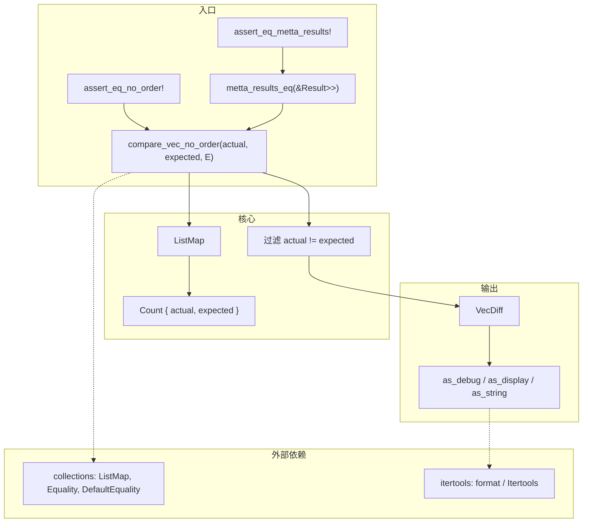

# assert 模块源码分析

## 1. 文件角色与职责

本文件为 **hyperon-common** 的 **测试与断言辅助**（*test/assertion helpers*），核心能力是：

1. **忽略顺序**（*order-insensitive*）比较两个 **迭代器**（*iterator*）产生的 **多重集**（*multiset*，即允许重复元素的集合）是否一致。
2. 将差异编码为 **`VecDiff`**，并格式化为人类可读的 **缺失**（*missed*）与 **多余**（*excessive*）项说明。
3. 提供 **`assert_eq_no_order!`**、**`assert_eq_metta_results!`** 宏，便于在单元测试中书写断言。
4. **`metta_results_eq`**：针对 **`Result<Vec<Vec<T>>, String>`** 的嵌套结构，逐「内层向量」做无序相等判定（在 `Ok` 且外层长度一致时）。

模块依赖 **`collections::ListMap`**（基于线性表的映射，*list-backed map*）与 **`Equality<T>`**（自定义相等谓词，*equality predicate*），以支持非 `PartialEq` 或需语义相等的键比较（与 `DefaultEquality` 配合时退化为 `PartialEq`）。

---

## 2. 公开 API 一览

| 名称 | 类型 | 可见性 | 说明 |
|------|------|--------|------|
| `compare_vec_no_order` | `fn` | `pub` | 输入两个迭代器与 `E: Equality<T>`，返回 `VecDiff<T, E>` |
| `VecDiff` | `struct` | `pub` | 封装差异映射（内部 `ListMap<T, Count, E>`） |
| `VecDiff::has_diff` | 方法 | `pub` | 是否存在任何计数不一致的键 |
| `VecDiff::as_display` | 方法 | `pub` | `T: Display` 时生成差异字符串 |
| `VecDiff::as_debug` | 方法 | `pub` | `T: Debug` 时生成差异字符串 |
| `assert_eq_no_order!` | 宏 | `macro_export` | 用 `DefaultEquality` 比较两集合，失败时打印 `Debug` 与差异 |
| `metta_results_eq` | `fn` | `pub` | 比较两个 `Result<Vec<Vec<T>>, String>`（`T: PartialEq`） |
| `assert_eq_metta_results!` | 宏 | `macro_export` | 包装 `metta_results_eq` 的断言 |

**非公开**：`Count`、`FormatAsDebug`、`FormatAsDisplay`、`VecDiff::as_string`。

---

## 3. 核心数据结构

### `Count`（私有）

| 字段 | 含义 |
|------|------|
| `actual` | 来自 **实际迭代器**（*actual iterator*）的出现次数 |
| `expected` | 来自 **期望迭代器**（*expected iterator*）的出现次数 |

### `VecDiff<T, E: Equality<T>>`（公开）

- 持有 **`ListMap<T, Count, E>`**：键为元素类型 `T`，值为上述计数；仅保留 **`actual != expected`** 的条目（在 `compare_vec_no_order` 末尾过滤后装入）。

### 辅助 newtype（私有）

- **`FormatAsDebug<T>`** / **`FormatAsDisplay<T>`**：在格式化差异字符串时，分别用 **`Debug`** 或 **`Display`** 展示元素，满足 `itertools::format` 对 **`Display`** 的要求。

---

## 4. Trait 定义与实现

本文件 **不定义** `Equality`（定义于 `collections.rs`），仅 **使用** `E: Equality<T>`。

| 实现 | 说明 |
|------|------|
| `Display for FormatAsDebug<T>` | `T: Debug` 时委托 `Debug::fmt` |
| `Display for FormatAsDisplay<T>` | `T: Display` 时委托 `Display::fmt` |
| `Default for Count` | 计数从零开始（`or_default` 使用） |

---

## 5. 算法

### `compare_vec_no_order`

1. 创建空 **`ListMap<T, Count, E>`**。
2. 遍历 **`actual`**：对每个元素 `entry(i).or_default().actual += 1`（**多重集计数**）。
3. 遍历 **`expected`**：同理递增 `expected`。
4. **`into_iter().filter(|(_, c)| c.actual != c.expected).collect()`** 重建只含差异键的 `ListMap`。
5. 包装为 **`VecDiff { diff }`**。

时间复杂度：设 `n = |actual|`，`m = |expected|`，在 `ListMap` 为线性探测的前提下，约为 **O((n+m)·k)**，其中 `k` 为不同键数量上的平均查找成本（实现为 Vec 线性扫描，见 `collections.rs` 的 `E::eq`）。

### `VecDiff::as_string`

- **`missed`**：`actual < expected` 的键，用 **`repeat_n`** 重复 **`expected - actual`** 次，表示「期望有而实际少」的副本数。
- **`excessive`**：`actual > expected` 时同理重复 **`actual - expected`** 次。
- 用 **`itertools`** 的 **`.format(", ")`** 连接；两段分别冠以 `"Missed results: "` 与 `"Excessive results: "`，中间换行。

### `metta_results_eq`

- 双 **`Ok`** 且 **`actual.len() == expected.len()`**：按索引 **zip** 内层 `Vec`，对每一对调用 **`compare_vec_no_order`** 与 **`DefaultEquality`**，任一层 **`has_diff`** 则返回 `false`。
- 其余情况（含 **`Err`**、长度不等）返回 `false`。

### 宏行为简述

- **`assert_eq_no_order!`**：对 `actual.iter()` 与 `expected.iter()` 调用比较，**`as_debug()`** 得 `Option<String>`；期望为 **`None`**（无差异），否则 **`assert!`** 失败并打印双方 **`Debug`** 与差异文本。
- **`assert_eq_metta_results!`**：取引用后调用 **`metta_results_eq`**，失败消息中 **`actual` / `expected`** 均为 **`Debug`** 输出。

---

## 6. 所有权与借用分析

- **`compare_vec_no_order`**：消费两个迭代器的 **`Item` 类型**（记为泛型 `T`）。每个元素经 **`ListMap::entry`** 进入映射；若 `T` 为 **`Copy`**（例如 **`&U`** 在 **`metta_results_eq`** 中：`Vec<U>` 的 **`iter()`** 产生 **`&U`**，引用类型 **`Copy`**），则按 **拷贝** 进入键槽位；若 `T` 非 **`Copy`** 则 **移动** 入表。适用于一次性遍历。
- **`VecDiff::as_string`**：通过 **`&self`** 只读借用内部 **`ListMap`**；输出 **`String`** 为新分配；格式化闭包 **`F: Copy + Fn(&'a T) -> I`** 将 **`&T`** 转为可 **`Display`** 的包装类型。
- **`metta_results_eq`**：仅借用两个 **`Result`**，不取得 **`Vec` 或 `T` 的所有权**。内层调用 **`compare_vec_no_order(actual.iter(), expected.iter(), ...)`** 时，推断 **`compare_vec_no_order` 的 `T` 为 `&U`**（`U` 为 **`metta_results_eq`** 的元素类型）；**`ListMap`** 的键为 **元素引用的拷贝**，相等性由 **`DefaultEquality`** 与 **`PartialEq for &U`** 决定，语义仍为 **按元素相等性计数的多重集比较**（不移动 **`Vec`** 内 **`U`**）。
- **`assert_eq_no_order!`**：要求 **`$actual` / `$expected`** 支持 **`.iter()`**（如 **`Vec`**、数组等）。

---

## 7. Mermaid 架构图

---

## 8. 小结

`assert.rs` 将 **无序多重集相等** 问题归约为 **按自定义 `Equality` 聚合计数**，再 **过滤差分** 并 **格式化** 为测试失败信息；宏与 **`metta_results_eq`** 把该模式固定为 **OpenCog Hyperon / MeTTa** 相关测试结果的可读断言。使用上应注意：**`compare_vec_no_order` 会消费迭代器元素**（键进入 `ListMap`）；**`ListMap` 的复杂度** 在大键空间下为线性查找，若未来性能敏感可换 **哈希表**（*hash map*）但需为 `T` 提供 **哈希**（*hash*）与一致 **`Equality`**。**`metta_results_eq`** 在 **`Err`** 或外层长度不等时一律 `false`**，错误分支不比较错误消息内容。
