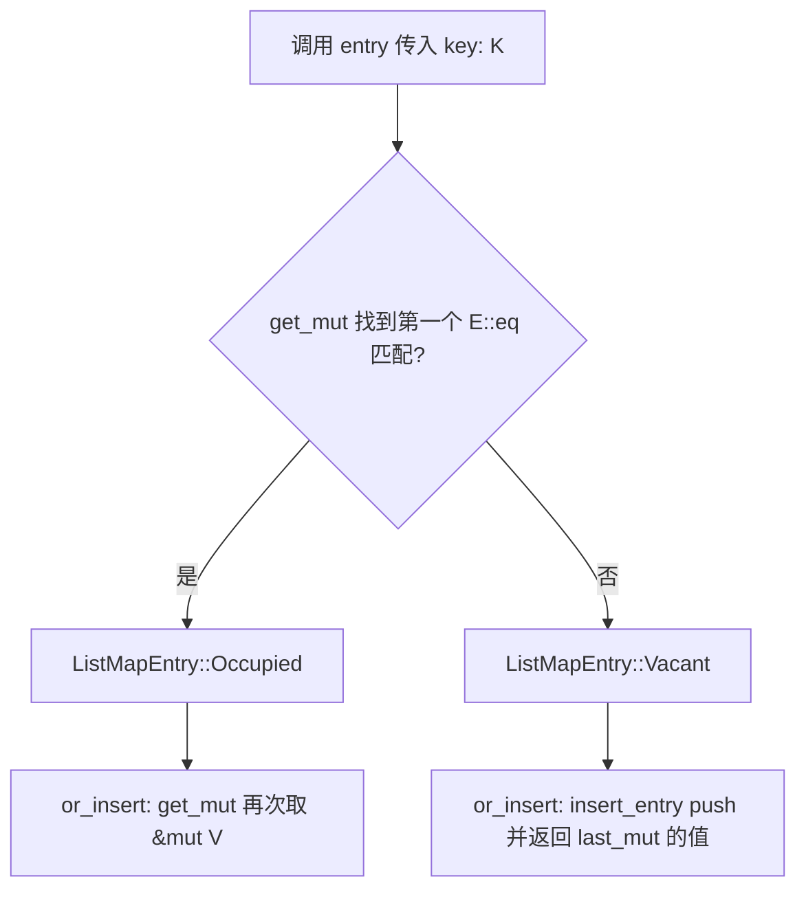
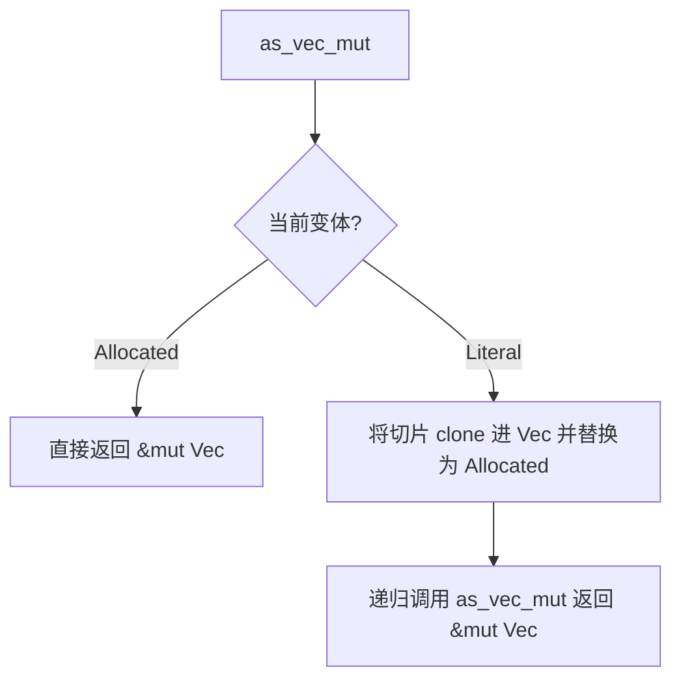
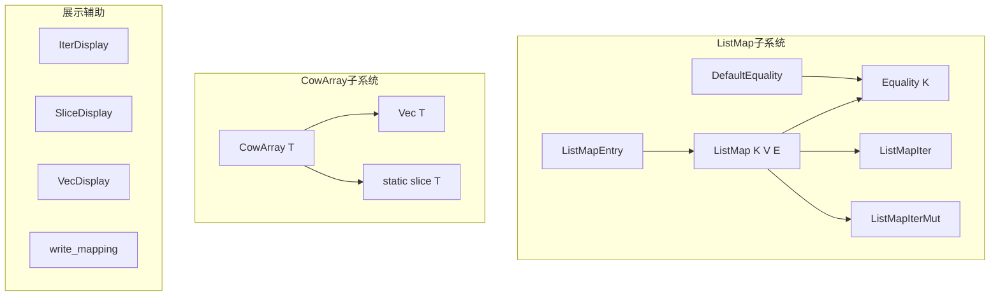
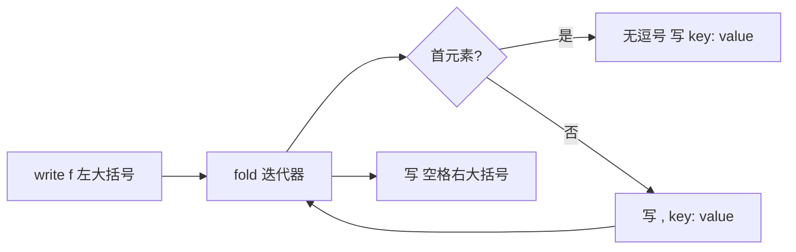

# `hyperon-common/src/collections.rs` 源码分析

本文档对 OpenCog Hyperon 子 crate `hyperon-common` 中的 `collections.rs` 进行结构化源码解读，便于理解其在引擎中的数据结构与格式化职责。

---

## 1. 文件角色与职责

- **模块定位**：由 `hyperon-common/src/lib.rs` 以 `pub mod collections` 导出，属于「跨模块复用的通用数据结构（common datastructures）」的一部分。
- **核心职责**：
  1. **可插拔相等性（pluggable equality）的线性映射**：`ListMap` 以 `Vec<(K, V)>` 存储键值对，通过自定义 `Equality<K>` 替代 `Hash`/`Ord` 约束，适合键类型无法或不宜做哈希/排序的场景。
  2. **类 COW 数组（Cow-like array）**：`CowArray<T>` 在「编译期字面量切片 `&'static [T]`」与「堆上 `Vec<T>`」之间切换，读多写少时可避免不必要的分配。
  3. **调试/展示辅助**：`IterDisplay`、`SliceDisplay`、`VecDisplay` 与 `write_mapping` 将迭代器或切片格式化为人类可读字符串（依赖 `itertools` 的 `Itertools::format`）。

- **依赖**：标准库 + `itertools`（`Display` 相关实现）、`#[cfg(test)]` 内建单元测试。

---

## 2. 公开 API 一览

| 符号 | 类型 | 简要说明 |
|------|------|----------|
| `Equality<T>` | `trait` | 自定义键相等：`fn eq(a: &T, b: &T) -> bool` |
| `DefaultEquality` | `struct` | 对 `T: PartialEq` 委托 `==` |
| `ListMap<K, V, E>` | `struct` | 默认 `E = DefaultEquality`；内部 `Vec<(K,V)>` |
| `ListMapEntry` | `enum` | `entry` API：`Occupied` / `Vacant` |
| `ListMapEntry::or_default` | 方法 | `V: Default` 时插入默认值并返回 `&mut V` |
| `ListMapEntry::or_insert` | 方法 | 不存在则 `insert_entry`，存在则 `get_mut` |
| `ListMap::new` | 构造 | 空表 |
| `ListMap::entry` | 方法 | 按 `E::eq` 查找后返回 `ListMapEntry` |
| `ListMap::get` / `get_mut` | 方法 | 线性扫描第一个匹配键 |
| `ListMap::insert` | 方法 | **总是** `push` 新条目（允许重复键） |
| `ListMap::insert_entry` | `fn`（模块内 `pub(crate)` 语义上为私有辅助） | `pub fn` 但实际为内部 `insert` 路径；返回新值可变引用 |
| `ListMap::is_empty` / `clear` | 方法 | 委托 `Vec` |
| `ListMap::iter` / `iter_mut` | 方法 | 返回 `ListMapIter` / `ListMapIterMut` |
| `ListMap::into_iter` | 方法 | 类型别名 `ListMapIntoIter = IntoIter<(K,V)>` |
| `ListMap` | `PartialEq` | 双向「包含」语义（见第 5 节） |
| `ListMap` | `From<Vec<(K,V)>>` | 逐对 `insert` |
| `ListMap` | `FromIterator<(K,V)>` | 逐对 `insert` |
| `CowArray<T>` | `enum` | `Allocated(Vec<T>)` \| `Literal(&'static [T])` |
| `CowArray::new` | 构造 | `Literal(&[])` |
| `CowArray::as_slice` | 方法 | 统一只读视图 |
| `CowArray::as_vec_mut` | 方法 | `T: Clone`；字面量路径先分配再递归 |
| `CowArray::len` / `iter` | 方法 | 基于 `as_slice` |
| `CowArray` | `PartialEq` / `Eq` / `Display` | 切片相等；`Display` 手写 `[a b c]` 形式 |
| `CowArray` | `From` | `&'static [T]`、`[T;N]`、`Vec<T>` |
| `CowArray` | `Into<Vec<T>>` | `T: Clone`；字面量经 `into()` 克隆入 `Vec` |
| `&'a CowArray<T>` | `Into<&'a [T]>` | 等价 `as_slice()` |
| `IterDisplay` / `SliceDisplay` / `VecDisplay` | `struct` | `Display` 包装，格式 `[a, b, c]` |
| `write_mapping` | `fn` | `{ key: value, ... }` 风格写入 `Formatter` |

---

## 3. 核心数据结构（含所有权/内存）

### 3.1 `ListMap<K, V, E>`

- **布局**：`list: Vec<(K, V)>` 拥有全部键值；`_phantom: PhantomData<E>` 仅为满足泛型参数 `E` 不参与字段时的类型检查（zero-sized type，ZST（零大小类型）时不占空间）。
- **所有权**：`ListMap` 拥有 `K`、`V`；迭代器借出 `&K`、`&V` 或 `&mut V`。
- **语义注意**：`insert` **不**替换已有键，而是追加；`get`/`get_mut` 返回**第一个** `E::eq` 匹配的项。这与 `HashMap::insert` 的「插入或替换」不同。

### 3.2 `ListMapEntry<'a, K, V, E>`

- **布局**：`Occupied(K, &'a mut ListMap)` / `Vacant(K, &'a mut ListMap)`。
- **所有权**：`K` 由 `entry(key: K)` **按值移入**；`ListMap` 通过 `&'a mut` 出借，保证 `or_insert` 返回的 `&'a mut V` 与映射同生命周期。

### 3.3 `CowArray<T: 'static>`

- **`Literal(&'static [T])`**：不拥有元素存储本体，指向程序静态/常量区（或调用方保证的 `'static` 切片）；**零拷贝**只读。
- **`Allocated(Vec<T>)`**：堆向量拥有 `T`；`as_vec_mut` 在字面量分支通过 `(*array).into()`（需 `T: Clone`）**克隆**到 `Vec` 并完成写时分配（allocate-on-write）。
- **`Display` 实现**：首元素单独 `write`，后续 `skip(1)` 前导空格，避免尾部多余空格。

---

## 4. Trait 定义与实现

| Trait | 主体 | 约束与行为 |
|-------|------|------------|
| `Equality<T>` | 自定义 | 静态方法比较两引用；可对接非 `PartialEq` 或语义相等 |
| `Equality<T>` for `DefaultEquality` | `T: PartialEq` | `a == b` |
| `Iterator` | `ListMapIter` / `ListMapIterMut` | 委托 `slice::Iter` / `IterMut`，项为 `(&K,&V)` / `(&K,&mut V)` |
| `PartialEq` | `ListMap` | `V: PartialEq`；双向子集检查（见下） |
| `PartialEq` / `Eq` | `CowArray` | 比较 `as_slice()` |
| `Display` | `CowArray` | `T: Display`；`[elem ...]` |
| `Display` | `IterDisplay` / `SliceDisplay` / `VecDisplay` | 逗号分隔列表 |
| `From` / `FromIterator` | `ListMap` | 构建时多次 `insert` |
| `From` / `Into` | `CowArray` | 与 `Vec`、数组、静态切片互转 |

---

## 5. 算法与关键策略

1. **ListMap 查找**：对 `get`/`get_mut` 为 **O(n) 线性扫描**，`n = list.len()`；相等性由 `E::eq` 决定，可定制。
2. **ListMap 插入**：**O(1) 摊销** `Vec::push`；不查重、不更新已有键。
3. **`ListMap::entry` + `or_insert`**：先 `get_mut` 判断是否已存在；存在则 `Occupied` 分支再次 `get_mut`（第二次扫描）；不存在则 `insert_entry` 一次 push。
4. **`PartialEq`（ListMap）**：定义内部函数 `left_includes_right`：对 `right` 中每个 `(k,v)`，要求 `left.get(k) == Some(v)`（`get` 为第一个匹配）。两侧互推得等价。重复键时 `get` 始终看第一个匹配，**与多重集（multiset）语义不完全一致**，更接近「在插入顺序下，右侧每个条目都能在左侧找到相同键且值等于第一个匹配」。
5. **CowArray 写路径**：`as_vec_mut` 仅在需要可变 `Vec` 且当前为 `Literal` 时克隆分配；之后常驻 `Allocated`。
6. **格式化**：`write_mapping` 用 `fold` 维护首项无逗号、后续 `", k: v"` 前缀逗号。

---

## 6. 执行流程

### 6.1 `ListMap::entry` → `or_insert`

### 6.2 `CowArray::as_vec_mut`

---

## 7. 所有权与借用分析

- **`ListMap::entry(&mut self, key: K)`**：消耗 `key`；`get_mut(&key)` 期间 `self` 被可变借用，返回后结束；`ListMapEntry` 携带 `&mut ListMap` 延长可变借用到 `or_insert` 完成。
- **`or_insert` 中的 `unwrap()`**：`Occupied` 分支在构造时已保证存在匹配键；理论上与 `E` 一致性下不会 panic；`Vacant` 路径 `insert_entry` 后 `last_mut` 非空。
- **`ListMapIterMut`**：独占整个 `list` 的可变借用，与同时 `get_mut` 互斥；符合 Rust 别名规则。
- **`CowArray::as_vec_mut`**：`self` 为 `&mut`，可能将 `*self` 整体替换为 `Allocated`，需 `T: Clone` 以从共享字面量复制出独有缓冲区。
- **`IterDisplay`**：持有 `&'a I`，`I: Clone`；`Display::fmt` 中 `clone()` 迭代器，适合 cheap clone 的迭代器适配器，**需注意**重型迭代器克隆成本。

---

## 8. Mermaid 图示

### 8.1 模块内类型关系（架构）

### 8.2 `write_mapping` 控制流

---

## 9. 复杂度与性能注记

| 操作 | 时间复杂度 | 说明 |
|------|------------|------|
| `ListMap::get` / `get_mut` | O(n) | 线性扫描 |
| `ListMap::insert` | O(1) 摊销 | 仅 push |
| `ListMap::entry` | O(n) | 内部 `get_mut` |
| `ListMap::PartialEq` | O(n × m) 量级 | 双重循环调用 `get`，最坏近似 O(n·m)，n、m 为两侧长度 |
| `ListMap` 内存 | O(n) | 紧凑连续，缓存友好；键重复时浪费空间 |
| `CowArray::as_slice` / `len` / `iter` | O(1) | 不分配 |
| `CowArray::as_vec_mut`（从 Literal） | O(k) | k 为切片长度，`clone` 全部元素 |
| `Display`（CowArray / *Display） | O(n) | n 为元素个数，格式化输出 |

**工程建议（文档性，非修改代码）**：若需唯一键或频繁查找，应在更高层改用 `HashMap`/`BTreeMap` 或维护索引；`ListMap` 适合小规模、自定义相等、或保持插入顺序且重复键可接受的场景。

---

## 10. 小结

- **`collections.rs`** 为 Hyperon 公共库提供三类能力：**可定制相等性的顺序映射 `ListMap`**、**静态/堆二分的 `CowArray`**，以及 **基于 `itertools` 的列表/映射格式化工具**。
- **ListMap** 语义上更接近「带查找辅助的向量」，而非标准关联容器；`PartialEq` 通过双向「逐条 `get` 一致」定义等价，使用者应留意**重复键**与**首次匹配**行为。
- **CowArray** 在只读场景可指向 `'static` 数据，写时克隆为 `Vec`，与 Rust 标准库 `Cow` 思想一致但专门化为「切片字面量 vs 向量」两分支。
- 模块测试覆盖 `ListMap` 的 `PartialEq` 基本性质；其余行为依赖类型系统与简单委托，集成风险主要在 **API 语义**（插入不替换）而非内存安全。

---

*文档基于仓库版本 `0.2.10`、提交 `cf4c5375` 下的源码整理；若上游变更 `ListMap` 插入语义或 `PartialEq` 定义，需同步修订本节。*
