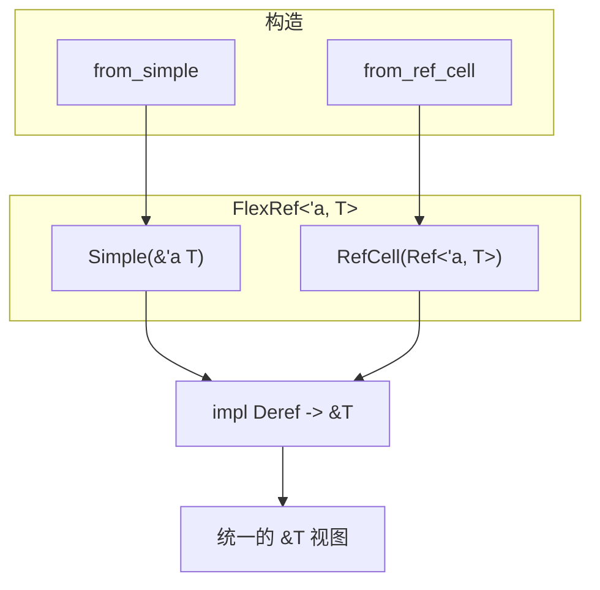

# 灵活引用（FlexRef）

## 1. 文件角色与职责

`flex_ref.rs` 提供 **`FlexRef<'a, T>`（灵活引用）**：在 **同一类型** 中统一表示对 `T` 的两种只读访问方式——

1. **普通共享引用** `&'a T`（**`Simple`** 变体）；  
2. 经由 **`RefCell<T>`（单线程内部可变性容器）** 已获取的 **`Ref<'a, T>`（借用守卫，borrow guard）**（**`RefCell`** 变体）。

库根通过 **`pub use flex_ref::FlexRef`** 对外导出，供调用方在「有时是直接引用、有时是 `RefCell` 动态借用」的场景下用 **`Deref`（解引用）** 统一成 `&T` 使用。

## 2. 公共 API 一览

| 名称 | 类型 | 说明 |
|------|------|------|
| `FlexRef::Simple` | 枚举变体 | 包装 `&'a T` |
| `FlexRef::RefCell` | 枚举变体 | 包装 `Ref<'a, T>` |
| `from_simple` | `fn(&'a T) -> Self` | 构造 `Simple` |
| `from_ref_cell` | `fn(Ref<'a, T>) -> Self` | 构造 `RefCell` |
| `into_simple` | `fn(self) -> &'a T` | 仅当为 `Simple` 时取出引用；否则 **`panic!`** |
| `Deref` | `type Target = T` | 统一解引用为 `&T` |

**注意**：`FlexRef` 未派生 `Copy` / `Clone`；`RefCell` 变体持有 **`Ref`**，通常按需移动使用。

## 3. 核心数据结构

```rust
pub enum FlexRef<'a, T> {
    Simple(&'a T),
    RefCell(Ref<'a, T>),
}
```

- **`Simple`**：零成本抽象，即裸 `&T`。  
- **`RefCell`**：承载 **`RefCell` 的共享借用守卫**，解引用时得到 `&T`（见 `Deref`）。

## 4. Trait（特征）定义与实现

| Trait | 实现要点 |
|-------|----------|
| `Deref<Target = T>` | `Simple` 直接返回内部 `&T`；`RefCell` 使用 `&*the_ref`，即对 **`Ref`** 解引用得到 `&T`。 |

本文件 **未定义自定义 trait**。

## 5. 算法

无独立算法；仅为 **分支匹配（pattern matching）** 与 **`Deref` 强制多态（deref coercion）** 的薄封装。

## 6. 所有权与借用分析

| 场景 | 说明 |
|------|------|
| 生命周期 `'a` | `FlexRef<'a, T>` 中引用与 `Ref` 均受 `'a` 约束，不能超过被借用的数据存活期。 |
| `Simple` | 不获取所有权，仅延长对已有 `&T` 的借用形式。 |
| `RefCell` | **`Ref<'a, T>`** 表示已满足 **`RefCell` 的借用规则** 的一次共享读锁；`FlexRef` 不再负责 `borrow()`，只消费已有 `Ref`。 |
| `into_simple` | **消耗（consume）** `self`；若非 `Simple` 则 **`panic!`**，属于 **API 契约**：调用方需确保仅在已知为 `Simple` 时使用。 |
| 线程模型 | 依赖 **`Ref` / `RefCell`**，**仅适用于单线程**；多线程场景应使用 **`Mutex` / `RwLock`** 等，而非本类型。 |

## 7. Mermaid 架构图



## 8. 小结

**`FlexRef`** 是面向 **`Deref` 多态** 的小型适配枚举，把 **`&T`** 与 **`Ref<T>`** 两条只读路径合并为同一使用方式。设计代价是 **`into_simple` 在错误分支会 panic**，适合内部或已区分来源的代码路径；若需可恢复错误，可改为返回 **`Result<&'a T, Self>`** 等（当前源码未提供）。 crate 通过 **`lib.rs`** 将其 **`pub use`**，作为 **hyperon-common** 公共表面的一部分。
