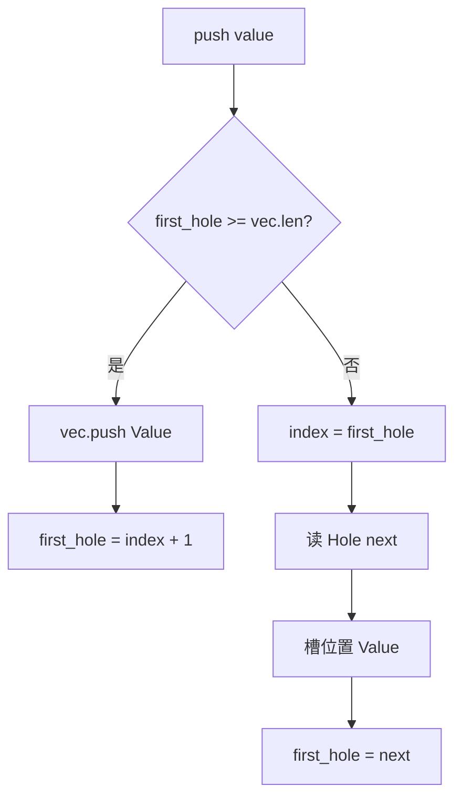
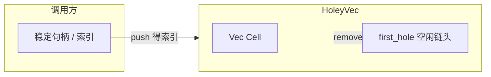

# HoleyVec 源码分析（`holeyvec.rs`）

## 1. 文件角色与职责

`holeyvec.rs` 实现 **`HoleyVec<T>`**：在连续 `Vec` 上模拟「可删除、可复用槽位」的分配器式容器。典型用途是：为元素分配稳定整数下标（`push` 返回索引），在 `remove` 后该下标变为「洞」，下次 `push` 优先填入最小编号的洞，从而 **避免删除引起的大量元素搬移**，同时保持 **O(1) 均摊** 的插入与按索引访问（在已知有效索引的前提下）。

与 `Vec<Option<T>>` 相比，本实现用 **显式空闲链表**（洞与洞之间用 `usize` 链接）记录下一个可复用下标，而不是用 `Option` 判别每个槽位。

## 2. 公共 API 一览

| 符号 | 类型 / 签名 | 说明 |
|------|-------------|------|
| `HoleyVec<T>` | `pub struct` | 对外主类型 |
| `new` | `fn() -> Self` | 构造空表 |
| `next_index` | `fn(&self) -> usize` | 下次 `push` 将使用的索引（若无洞则为 `len()`） |
| `index_upper_bound` | `fn(&self) -> usize` | 当前 `vec.len()`，合法索引范围为 `0..upper_bound` |
| `capacity` | `fn(&self) -> usize` | 底层 `Vec` 容量 |
| `is_hole` | `fn(&self, usize) -> bool` | 该下标是否为洞 |
| `get` / `get_mut` | `fn(...) -> Option<...>` | 洞返回 `None` |
| `get_unchecked` / `get_unchecked_mut` | `unsafe fn` | 调用方保证为 `Value`；否则 `unreachable!` |
| `push` | `fn(&mut self, T) -> usize` | 插入并返回索引 |
| `remove` | `fn(&mut self, usize) -> T` | 删除并返回元素；若已是洞则 `panic` |
| `iter` / `iter_mut` | 返回过滤后的迭代器 | 仅遍历现存 `Value`，跳过洞 |
| `Iter` / `IterMut` | `pub struct` | 迭代器类型别名包装 |
| `Index` / `IndexMut` | `impl` | 与 `get`/`get_mut` 一致，无效则 `expect` panic |

内部 `enum Cell<T>` 为 **非公开**，对外语义完全由上述 API 表达。

## 3. 核心数据结构与内存布局

### 3.1 `Cell<T>`

```rust
enum Cell<T> {
    Value(T),
    Hole(usize),  // 下一空闲洞的下标
}
```

- **判别式**：Rust 枚举默认带标签；`Hole` 与 `Value` 互斥。
- **载荷大小**：`size_of::<Cell<T>>()` 约为 `max(size_of::<T>(), size_of::<usize>())` 加上对齐与标签开销（具体取决于 `T` 的对齐与 niche 优化，此处不展开到平台字节级）。
- **语义**：`Hole(next)` 表示当前槽空闲，且 **下一个洞** 在 `next`（单链表头由 `first_hole` 维护）。

### 3.2 `HoleyVec<T>`

```rust
pub struct HoleyVec<T> {
    first_hole: usize,   // 空闲链表头
    vec: Vec<Cell<T>>,
}
```

- **`first_hole`**：下一个 `push` 应填入的下标；若 `first_hole >= vec.len()`，则无洞，在尾部 `push` 新 `Value`。
- **`vec`**：物理槽位序列；洞通过 `Hole(next)` 链接。

**不变量（设计意图）**：

- 空闲槽组成以 `first_hole` 为头的链表（通过 `Hole` 内 `usize`）。
- `push` 在尾部新增时：`first_hole = index + 1`（紧接在最后一个元素之后，表示「下次仍往尾后扩」）。

## 4. Trait 定义与实现

本文件 **未定义** 自定义 trait，仅 **实现标准库 trait**：

| Trait | 说明 |
|-------|------|
| `Default` | `first_hole: 0`，空 `Vec` |
| `Clone` / `Debug` / `PartialEq` / `Eq` | 派生自 `Cell` 与字段 |
| `Index<usize>` / `IndexMut<usize>` | 与 `get`/`get_mut` 一致，缺失则 panic |
| `Iterator` | `Iter`、`IterMut` 委托内部 `FilterMap` |
| `IntoIterator` | `&HoleyVec` → `Iter`；`&mut HoleyVec` → `IterMut` |

## 5. 算法与关键策略

### 5.1 `push`

- **无洞**（`first_hole >= len`）：尾部 `push(Cell::Value)`，`first_hole = len`（即新尾后位置）。
- **有洞**：在 `first_hole` 写入 `Value`，原 `Hole(next)` 读出后令 `first_hole = next`。

### 5.2 `remove`

- `mem::swap` 将槽位置为 `Hole(self.first_hole)`，原 `Value` 取出；`first_hole = index`，把刚释放的索引 **插到链表头**。

### 5.3 迭代

- `iter` / `iter_mut` 使用 `filter_map` **跳过洞**，仅暴露有效 `T` 引用；顺序为 **物理下标递增**，但 **不连续**（洞被跳过）。

## 6. 所有权与借用分析

- **`HoleyVec<T>` 拥有** 所有 `T`（通过 `Vec<Cell<T>>`）。
- `get` / `get_mut` / `Index` 系列返回的引用 **与 `self` 生命周期绑定**，符合独占可变规则。
- `remove` **按值移出** `T`，调用方获得所有权。
- **无** 内部可变或 `unsafe` 暴露给调用方（除 `get_unchecked*` 外）；`unsafe` 块仅用于在已证明为 `Value` 时跳过边界检查。

## 7. Mermaid 图

### 7.1 `push` 决策流



### 7.2 与上层模块的抽象关系



## 8. 复杂度与性能要点

| 操作 | 时间 | 说明 |
|------|------|------|
| `push` | 均摊 O(1) | `Vec::push` 或一次槽位写入 |
| `remove` | O(1) | `swap` + 链表头更新 |
| `get` / `get_mut` | O(1) | 随机访问 |
| `iter` | O(n) | n 为 `vec.len()`，过滤洞仍有扫描开销 |
| 空间 | O(已分配槽位数) | 洞不释放 `Vec` 已分配容量；不收缩 |

**注意**：洞不会自动压缩 `Vec`；长期大量删除后可能 **容量偏大**，若需紧缩需另行策略（本模块未提供）。

## 9. 小结

`HoleyVec` 在 Rust 中用 **标签枚举 + 空闲链表** 实现 **稳定索引、O(1) 删除与复用**，适合需要「句柄式」下标且不希望 `swap_remove` 打乱索引的场景。API 清晰；`remove` 对已洞索引会 panic；`get_unchecked*` 将正确性交给调用方。与 `hyperon-common` 中图结构、索引等模块配合时，常作为 **稠密存储 + 稀疏有效元素** 的底层块。
