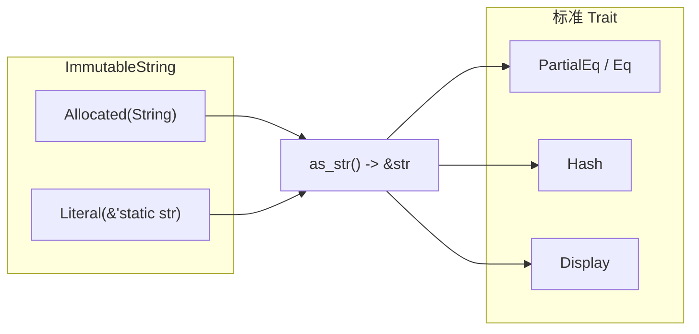

# 不可变字符串（ImmutableString）

## 1. 文件角色与职责

`immutable_string.rs` 在 **hyperon-common** 中提供 **`ImmutableString`（不可变字符串）** 类型：用单一枚举统一表示「堆上拥有的 `String`」与「编译期字面量 `&'static str`」。  
该类型为 **值语义上的不可变视图**：不暴露可变修改接口，便于与 **`UniqueString`（唯一化字符串，见 `unique_string` 模块）** 等上层结构组合，在符号、原子名等场景中复用同一抽象。

## 2. 公共 API 一览

| 名称 | 类型 | 说明 |
|------|------|------|
| `ImmutableString` | `pub enum` | 两种变体：`Allocated(String)`、`Literal(&'static str)` |
| `ImmutableString::as_str` | `fn(&self) -> &str` | 返回底层内容的 `&str` 视图 |
| `PartialEq` / `Eq` | `impl` | 按 **UTF-8 字节序列**（通过 `as_str`）比较 |
| `Hash` | `impl` | 对 `as_str()` 的结果做哈希 |
| `Display` | `impl` | 按字符串内容格式化输出 |
| `From<&'static str>` | `impl` | 构造 `Literal` |
| `From<String>` | `impl` | 构造 `Allocated` |

**说明**：`Debug`、`Clone` 由 `#[derive]` 提供，亦为公共行为。

## 3. 核心数据结构

```rust
pub enum ImmutableString {
    Allocated(String),      // 堆分配，拥有所有权
    Literal(&'static str),  // 静态生命周期字面量引用
}
```

- **`Allocated`**：运行时分配的字符串，适合从 `String` 或需堆存储的内容转换而来。  
- **`Literal`**：指向程序静态数据的引用，无额外堆分配，适合已知字面量。

## 4. Trait（特征）定义与实现

| Trait | 实现要点 |
|-------|----------|
| `Clone` | 对 `String` 深拷贝；对 `&'static str` 仅复制指针。 |
| `Debug` | 派生，便于调试打印。 |
| `PartialEq` / `Eq` | **不比较枚举变体**，仅比较 `as_str()` 结果，故 `Literal("a")` 与 `Allocated("a".into())` 相等。 |
| `Hash` | 与 `PartialEq` 一致：对 `as_str()` 哈希，可作 **`HashMap` 键** 等与相等性一致的使用。 |
| `Display` | 写入 `as_str()` 内容。 |
| `From<&'static str>` | 包装为 `Literal`。 |
| `From<String>` | 包装为 `Allocated`。 |

本文件 **未定义新 trait**，仅实现标准库与派生 trait。

## 5. 算法

本模块 **无复杂算法**，均为 **O(1)** 或 **O(n)**（`n` 为字符串长度）的常规操作：

- **`as_str`**：分支取 `String::as_str` 或直接使用字面量引用。  
- **`eq`**：委托 `str` 的逐字节比较。  
- **`hash`**：委托 `str` 的 `Hash` 实现。

## 6. 所有权与借用分析

| 场景 | 说明 |
|------|------|
| `ImmutableString` 自身 | 拥有 `String`，或持有 **`'static`** 借用的 `&str`；无内部可变性（**interior mutability，内部可变性**）。 |
| `as_str(&self) -> &str` | 返回的 **`&str` 生命周期** 绑定到 `&self`，不长于借用 `self` 的周期。 |
| `Clone` | `Allocated` 克隆会复制堆数据；`Literal` 克隆成本极低。 |
| 与 `UniqueString` | `unique_string` 用 **`Arc<ImmutableString>`** 做全局驻留表的键；`ImmutableString` 本文件不负责 **`Arc`（原子引用计数）** 或全局表逻辑。 |

## 7. Mermaid 架构图



## 8. 小结

`ImmutableString` 是轻量、语义清晰的 **不可变字符串载体（immutable string carrier）**，通过 **`Allocated` / `Literal`** 双轨表示平衡堆分配与静态字面量。相等性与哈希均基于 **字符串内容** 而非指针身份，适合作为符号名、键类型的一部分；与 **`UniqueString`** 配合时可进一步做 **字符串驻留（string interning）**，但驻留逻辑不在本文件内。
