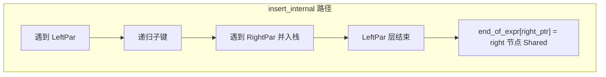
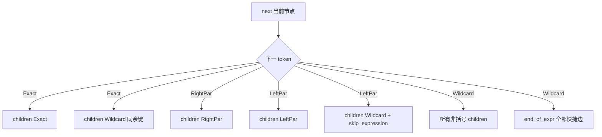
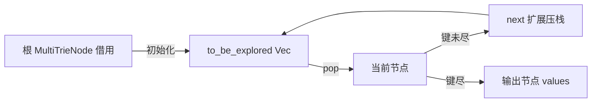

# `multitrie.rs` 源码分析（重点：AtomIndex 依赖的多值 Trie）

## 1. 文件角色与职责

`multitrie.rs` 实现 **MultiTrie&lt;K, V&gt;**：键为 **符号序列**（`TrieKey<K>`，元素为 `TrieToken<K>`），支持

- **精确匹配**（`Exact`）；
- **通配符**（`Wildcard`，文档记为 `*`）；
- **括号子表达式**（`LeftPar` / `RightPar`），用于把一段 token 作为 **不可分割的整体** 参与匹配。

与经典 Trie 不同，本结构强调 **双面匹配（double-side matching）**：查询键与存储键可以 **在通配符与子表达式边界上互为模式与实例**。因此 **同一查询键可能命中多条存储路径**，**同一逻辑值也可能被多种查询键检索到**。`get` 因此返回 **迭代器**（扁平化为多个节点上 `HashSet<V>` 的并集），而不是单一 `Option`。

在 Hyperon 工程语境中，**MultiTrie 是 AtomIndex 等索引层的键数据结构**：原子或模式化的索引键被编码为 token 序列，需要同时支持精确段、通配与子表达式整体匹配，与本模块语义一致。

## 2. 公共 API 一览

| 符号 | 可见性 / 签名 | 说明 |
|------|----------------|------|
| `TrieToken<K>` | `pub enum` | `Exact(T)` / `Wildcard` / `LeftPar` / `RightPar` |
| `TrieToken::is_parenthesis` | `fn`（`T: PartialEq`） | 判断是否为左/右括号 token |
| `TrieKey<K>` | `pub struct` | 内部 `tokens` + 预计算 `expr_size` |
| `TrieKey::from` | `impl From<V>`，`V: Into<VecDeque<TrieToken<K>>>` | 构造并校验括号平衡；失败 `panic` |
| `MultiTrie<K, V>` | `pub struct` | 对外 trie 句柄 |
| `MultiTrie::new` | `fn() -> Self` | 空 trie |
| `MultiTrie::insert` | `fn(&mut self, TrieKey<K>, V)` | 插入键值对（值存入叶侧节点集合） |
| `MultiTrie::get` | `fn(&'a self, &'a TrieKey<K>) -> impl Iterator<Item=&'a V>` | 所有匹配路径上的值 |
| `MultiTrie::remove` | `fn(&mut self, &TrieKey<K>, &V) -> bool` | 按 **查询键语义** 与 **值相等** 删除至少一处；空子树清理 |
| `Display` | `TrieToken` / `TrieKey` | 调试输出 |

**非公开**：`TrieKey::precalculate_expr_size`、`pop_head`、`iter`、`TrieKeyIter`、`MultiTrieNode`、`MultiValueIter`；测试下 `MultiTrie::size`、`MultiTrieNode::size`。

**约束**：`MultiTrie<K, V>` 要求 `K: Debug + Clone + Eq + Hash`，`V: Debug + Eq + Hash`（与 `HashMap`/`HashSet` 一致）。

## 3. 核心数据结构与内存布局

### 3.1 `TrieToken<K>`

- 四 VARIANT，带 `#[derive(Hash, Eq, ...)]`，作为 **HashMap 键**。
- **`Exact(K)`**：承载具体符号；`K` 为 token 负载类型（如原子 ID、字符串句柄等）。

### 3.2 `TrieKey<K>`

```text
TrieKey {
    tokens:     VecDeque<TrieToken<K>>,  // 键序列（头端弹出顺序与遍历一致）
    expr_size:  VecDeque<usize>,         // 与 tokens 等长；仅在 LeftPar 位置非 0
}
```

- **`expr_size[i]`**（当 `tokens[i] == LeftPar`）：设为 **从左括号下标到匹配右括号下标** 的距离 `right_index - left_index`（源码 `pos - left_pos`）。其余位置为 `0`。
- **用途**：当查询在某一节点选择 **通配符吃掉整个子表达式** 时，迭代器可 **O(1) 跳过** 子表达式剩余 token，无需再跑栈。

**构造**：`From` 时调用 `precalculate_expr_size`，括号不平衡返回 `Err` 字符串，随后 `unwrap_or_else(panic)`。

### 3.3 `MultiTrieNode<K, V>`

```text
MultiTrieNode {
    children:    HashMap<TrieToken<K>, Shared<Self>>,  // 按下一 token 分岔
    end_of_expr: HashMap<*mut Self, Shared<Self>>,     // 通配「整段子表达式」的快捷边
    values:      HashSet<V>,                           // 键在此节点结束的取值集合
}
```

- **`children`**：标准 trie 边；值为 **`Shared<MultiTrieNode>`**（`Rc<RefCell<...>>`），便于 **共享子图** 与 **`as_ptr` 键**。
- **`end_of_expr`**：键为 **右括号对应子节点指针**，值为指向 **该子树中代表「子表达式结束」语义** 的节点（实现上在插入 `LeftPar` 完成后，把从栈弹出的 `RightPar` 节点注册到 **左括号所在父层** 的 `end_of_expr`）。查询侧当 **当前待匹配 token 为 `Wildcard`** 时，除展开所有非括号 `children` 外，还向所有 `end_of_expr` 目标 **并行延伸**，对应「`*` 匹配整个括号块」。
- **`values`**：同一节点可存 **多个值**（多值 trie）；`get` 对每个匹配终点节点做 `values.iter()` 再 `flat_map` 合并。

### 3.4 `MultiValueIter`

- 维护 `Vec<(*mut MultiTrieNode, TrieKeyIter)>` 作为 **DFS 栈**（显式栈而非递归）。
- **`_root_node_ref: PhantomData<&'a MultiTrieNode>`**：把迭代器声明周期与 **根借用** 关联，配合 `unsafe { &*node }` 满足借用检查者的 ** soundness 义务**（指针来自仍被 `Shared`/`Rc` 持有的节点）。

## 4. Trait 定义与实现

| Trait | 类型 | 说明 |
|-------|------|------|
| `PartialEq, Eq, Clone, Debug, Hash` | `TrieToken<K>` | 派生 |
| `Display` | `TrieToken<K>`，`K: Display` | 格式化输出 |
| `From<V>` | `TrieKey<T>`，`V: Into<VecDeque<...>>` | 构造 + 括号校验 |
| `PartialEq, Clone, Debug` | `TrieKey<T>` | 派生 |
| `Display` | `TrieKey<T>`，`T: Display` | 序列打印 |
| `Iterator` | `TrieKeyIter` | 按位扫描 |
| `Clone, Debug` | `MultiTrie` / `MultiTrieNode` | 派生（整棵 trie 可 `clone`） |

**无** 自定义业务 trait；测试模块内有 `IntoSorted` 辅助 trait。

## 5. 算法与关键策略（重点）

### 5.1 匹配语义（与模块文档一致）

- **`Exact(a)`** 只与 **`Exact(a)`** 匹配（相等由 `K: Eq` 决定）。
- **`LeftPar` / `RightPar`**：与子表达式边界对齐匹配；**`Exact` 不能匹配子表达式内部的「片段」** 除非双方在同一子表达式结构下对齐。
- **`Wildcard`**：可匹配任意 **`Exact`**、另一 **`Wildcard`**、或 **从左括号到右括号的整体子表达式**；**不匹配** 单独一个 `LeftPar`/`RightPar`，也不匹配「子表达式的一部分」。

### 5.2 `MultiTrieNode::next` —— 单步扩展（插入/查询/删除的核心）

输入：当前节点引用 + **`TrieKeyIter`（已消费掉「当前边」上的那个 token）** 后的余下键。

对 **第一个待消费 token**（即 `key.next()` 的结果）分情况：

| 当前 token | 产生的分支（三元组：边标签, 子节点, 新迭代器状态） |
|------------|---------------------------------------------------|
| `Exact(_)` | （1）走 `children[token]`；（2）若有 `children[Wildcard]`，走通配，**键迭代器状态相同**（通配不消费精确 token —— 注意：此处是把「查询精确、存储通配」与对称情况纳入同一套转移） |
| `RightPar` | 仅 `children[RightPar]` |
| `LeftPar` | （1）`children[LeftPar]`，键克隆前进；（2）`children[Wildcard]`，键 **`skip_expression`**：跳过整个括号子串 |
| `Wildcard` | （1）对所有 **非括号** token 的 `children` 边各一分支（键克隆）；（2）对 **`end_of_expr` 每个目标** 一分支（`token` 记为 `None`，键克隆） |

**分支数量** 在 `Wildcard` 步可达 **O(出度)**；`end_of_expr` 规模与 **已插入的、含子表达式的键** 相关。

### 5.3 插入 `insert_internal`

- 使用 **`TrieKey::pop_head`** 同步从 **`tokens` 与 `expr_size` 队头** 弹出（保持对齐）。
- **递归 / 隐式栈**：沿 `children` 创建 `Shared::new` 节点。
- **`LeftPar`**：进入左括号子节点递归；返回后 **`right_par_nodes.pop()`** 必须得到与本次子表达式匹配的 **右括号节点**，在当前层执行  
  `self.end_of_expr.insert(right_par.as_ptr(), right_par)`。  
  从而在 **左括号的父层** 注册「从通配一步跳到子表达式结束」的快捷指针。
- **`RightPar`**：进入右括号子节点递归；返回前将 **`right_par` 节点 push** 到栈，供外层 `LeftPar` 配对。

**前置条件**：键括号平衡（构造时已保证）；否则 `pop` 会 `expect` panic。

### 5.4 查询 `get` / `MultiValueIter`

- `MultiTrie::get` → 根节点 `MultiValueIter::new` → 对每个 **键已耗尽** 的节点 `yield`，再对该节点 `values.iter()` 展平。
- **遍历**：栈弹出 `(node, key_iter)`；若键结束则产出节点；否则 `node.next(key)` 将全部后继压栈 —— **深度优先**，顺序依赖 `Vec::pop`（LIFO）与 `next` 中 `result` 的填充顺序。

### 5.5 删除 `remove_internal`

- 与查询相同的 **`next` 分支**，先 **收集** `(Option<TrieToken>, Shared child, key_iter)`（需 `clone` `Shared`），再对每个子递归 `remove_internal`。
- 若子树返回已删除 **且** `child.borrow().is_empty()`：  
  - 若 `token == Some(t)`：从 **`children`** 移除；  
  - 若 `token == None`：从 **`end_of_expr`** 移除（以 `child_node.as_ptr()` 为键）。
- 多分支 **`fold(false, |a,b| a || b)`**：任一路删除成功即 `true`。

**注意**：`remove` 的 **第一个参数是查询键模式**，不是存储时的物理路径；语义与 `get` 一致，能删掉 **所有匹配该模式且值相等** 的条目（在实现上是对所有匹配分支尝试删除）。

### 5.6 与 AtomIndex 的关系（设计层面）

- AtomIndex 需要将 **模式查询**（含变量/通配/结构化子项）映射到 **候选原子集合**；MultiTrie 提供的正是 **键空间上的非单射、多结果索引**。
- **复杂度敏感点**：通配与子表达式使 **单键查询可能呈多路径指数级**（见下节）；工程上应通过 **键形状限制、索引分区、或上层过滤** 控制分支因子。

## 6. 所有权与借用分析

- **图结构**：节点由 `Shared`（`Rc<RefCell>`）持有，`clone` trie 为 **浅拷贝 Rc**（测试 `multi_trie_clone`）。
- **`get`**：仅不可变借用 `MultiTrie`；`MultiValueIter` 用 **`unsafe` 裸指针** 解引用子节点，**安全依赖**：指针来自有效 `Shared`，且迭代器生命期不超过根节点引用（`PhantomData`）。
- **`insert` / `remove`**：`borrow_mut()` 沿路径获取 `RefMut`，运行时借用规则与 `RefCell` 一致；路径上 **不可重叠借用**（顺序递归）。
- **`end_of_expr` 以 `*mut Self` 为键**：依赖 **节点地址稳定**（`Rc` 内堆分配不移动）；节点被移除时同步 `remove` map 项。

## 7. Mermaid 图

### 7.1 插入：括号与 `end_of_expr`（概念）



### 7.2 查询：`next` 分支总览



### 7.3 `MultiValueIter` 遍历架构



## 8. 复杂度与性能分析（详细）

记：

- \(L\)：**当前查询或插入键**的 token 数（`TrieKey` 长度）。
- \(d\)：单节点 **`children` 出度**（不同 `TrieToken` 数量）。
- \(e\)：单节点 **`end_of_expr` 条目数**。
- \(B\)：**单步 `next` 产生的最大分支数**。粗略上，对 `Wildcard` 步 \(B \le d + e\)（非括号子集 + 快捷边）；对 `Exact` 步 \(B \le 2\)（精确 + 可选 Wildcard 边）。

### 8.1 插入

- **每层**：`HashMap` 查找或插入 `TrieToken` → **均摊 O(1)**（哈希函数成本与 `K` 相关）。
- **总时间**：**O(L)** 次 map 操作 + 沿路径 `Shared` 创建/克隆引用；`LeftPar`/`RightPar` 仅常数额外栈操作与一次 `end_of_expr.insert`。
- **空间**：新建节点数 **O(L)**（每条插入路径上的新前缀）；共享子图时实际节点增长可能小于「所有插入长度之和」。

### 8.2 查询 `get`

- **最坏路径数**：若几乎每步都遇到 **`Wildcard`** 且 \(B\) 较大，**不同路径数** 可近似按 **乘积** 增长，上界约为 **O(B^L)** 的量级（与 NFA 子集构造类似，这里是显式栈 DFS）。
- **单条路径成本**：每 token **O(B)** 生成后继向量 + `HashMap`/`HashSet` 访问；键耗尽时对每个命中节点 **O(|values|)** 迭代（值集通常期望较小）。
- **子表达式优化**：`skip_expression` 使 **`LeftPar` + `Wildcard`** 分支 **跳过 O(子表达式长度)** 的逐步匹配，避免在通配「整段匹配」时逐 token 走进括号内部。

### 8.3 删除 `remove`

- **与 `get` 同形的多分支 DFS**；每层收集 `next` 结果 **O(B)**，再对子节点递归。
- **额外**：子树判空、`HashMap`/`HashSet` 删除；成功删除后可能 **收缩图**。
- **最坏时间** 同样受 **路径指数** 与 **值集合大小** 影响。

### 8.4 哈希与相等

- **`V: Eq + Hash`**：`HashSet` 存储与删除依赖 **哈希 + 相等**；若 `V` 较大，可考虑外层使用 **ID 间接**（本模块未做）。

### 8.5 实践建议（面向 AtomIndex / 调用方）

- 控制 **`Wildcard` 密度** 与 **`end_of_expr` 规模**（由带括号模式插入频率决定）。
- 对「仅精确键」访问路径，行为接近 **标准 trie**：每步 **O(1)~O(2)** 转移。
- **`clone()` 整 trie**：O(节点数) 量级 Rc 递增，**不复制 `K`/`V` 负载**（除非后续独立修改触发新节点 —— 本实现插入总是 `get_or_insert` 共享子节点，**写时复制未在节点层显式使用**；`RefCell` 可变借用会改变子节点内容，共享仍生效）。

## 9. 小结

`multitrie.rs` 在 `hyperon-common` 中提供 **带通配符与子表达式的多值 Trie**，通过 **`children` + `end_of_expr`（裸指针键）** 实现文档所述 **双面匹配**；`TrieKey` 的 **`expr_size` 预计算** 优化了通配跳过括号段的效率。`get`/`remove` 与 **`next` 统一**，语义一致。**时间复杂度在通配密集时可能随分支指数增长**，这是表达力的代价；AtomIndex 等上层应将此结构用于 **结构化模式索引**，并辅以查询形状约束或结果限制以保证性能。

**测试覆盖要点**（源码内）：宏构造 `TrieKey`、精确/通配/括号组合、`remove` 后节点回收、`clone` 一致性、多层嵌套括号插入的规模测试等，可作为阅读模块行为的补充示例。
