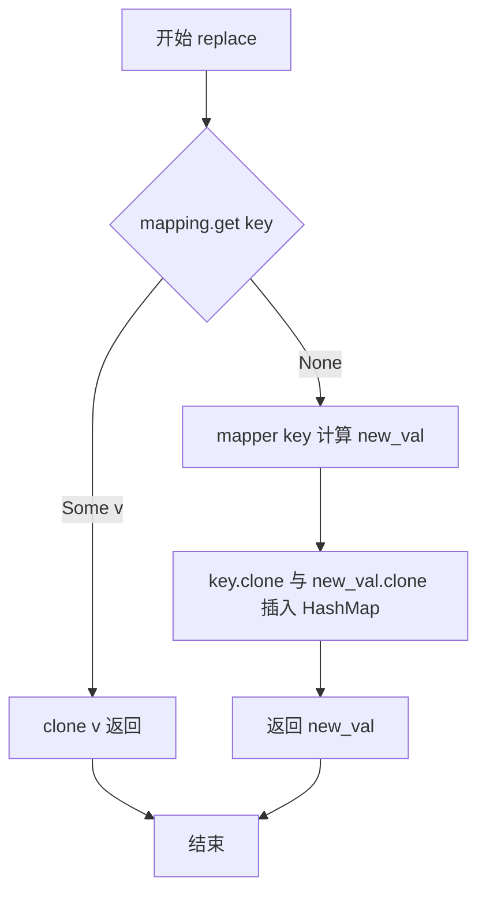
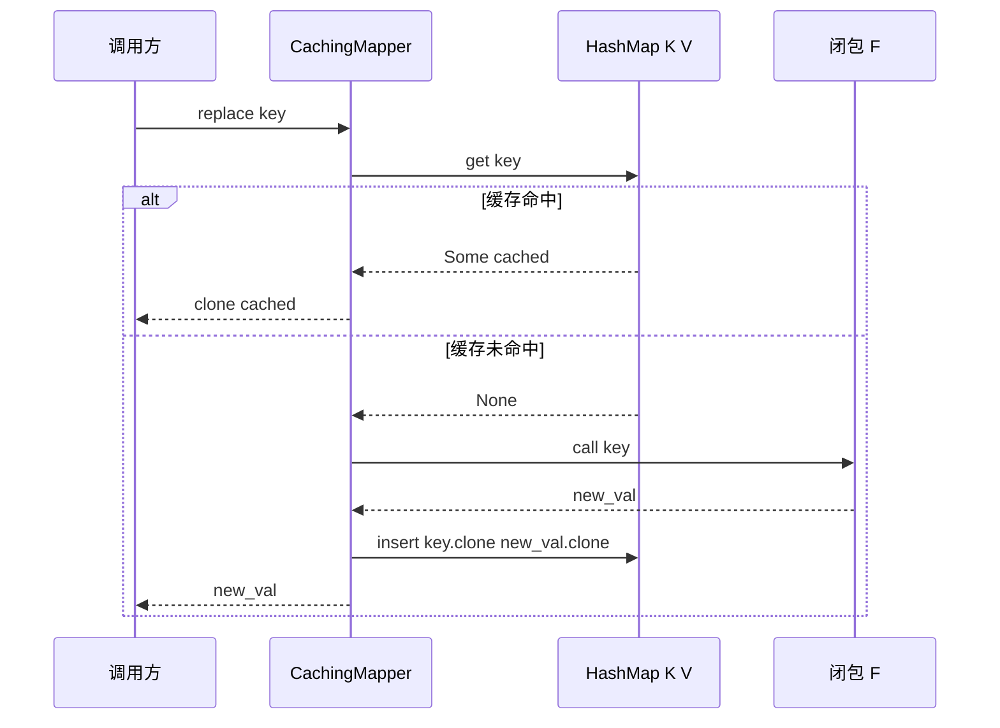
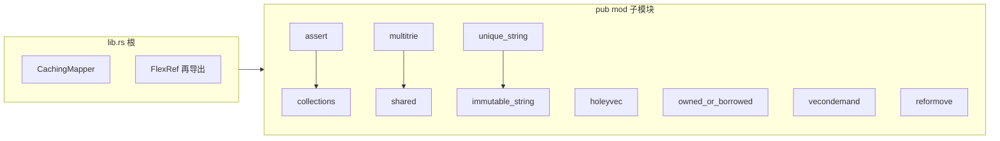

# hyperon-common/src/lib.rs 源码分析

本文档以 `hyperon-common/src/lib.rs` 为入口，分析该 crate 根文件的本体实现，并梳理其通过 `pub mod` / `pub use` 暴露的公共 API 与各子模块职责，便于理解 OpenCog Hyperon 实验代码库中「通用数据结构（common data structures）」与「有根原子（grounded atoms）相关公共库」的组织方式。

## 1. 文件角色与职责

`lib.rs` 承担三类职责：

1. **crate 文档（module documentation）**：顶层 `//!` 说明本 crate 提供其他模块共用的数据结构，以及与 grounded atoms 相关的公共库。
2. **模块聚合（module aggregation）**：声明并公开多个子模块（`collections`、`shared`、`multitrie` 等），将功能按主题拆分；`flex_ref` 为私有模块，仅通过 `pub use flex_ref::FlexRef` 再导出类型。
3. **内联类型定义**：在根路径直接定义 `CachingMapper`，为「带闭包映射 + `HashMap` 缓存」的通用记忆化（memoization）包装器，供依赖 `hyperon-common` 的代码复用。

除上述内容外，`lib.rs` 不包含业务算法实现；具体逻辑分布在对应子模块的 `.rs` 文件中。

## 2. 公共 API 清单（表）

以下按「在 crate 根可见」的方式列出：`lib.rs` 直接定义或再导出的项，以及各 `pub mod` 下的主要公开类型/函数（子模块内尚有更多方法，此处列核心入口）。

| 符号 / 模块 | 类别 | 简要说明 |
|-------------|------|----------|
| `CachingMapper<K, V, F>` | 结构体 | 对 `Fn(&K) -> V` 的结果做 `HashMap` 缓存；`K`/`V` 需 `Clone` |
| `CachingMapper::new` / `replace` / `mapping` / `mapping_mut` / `as_fn_mut` | 方法 | 构造、查询或填充缓存、访问底层表、闭包适配 |
| `FlexRef<'a, T>` | 枚举（再导出） | 统一「裸引用」与 `RefCell::Ref` 的只读借用，实现 `Deref` |
| `collections` | 模块 | `Equality`、`ListMap`、`CowArray`、显示辅助类型与 `write_mapping` |
| `shared` | 模块 | `LockBorrow` / `LockBorrowMut`、`Shared<T>`（`Rc<RefCell<T>>` 包装） |
| `assert` | 模块 | `compare_vec_no_order`、`VecDiff`、`metta_results_eq`、宏 `assert_eq_no_order!` |
| `reformove` | 模块 | `RefOrMove<T>` trait（值与 `&T` 统一取拥有/引用语义） |
| `multitrie` | 模块 | `TrieToken`、`TrieKey`、`MultiTrie`（支持通配符与子表达式的多值 trie） |
| `holeyvec` | 模块 | `HoleyVec<T>`（带空洞索引复用的向量） |
| `owned_or_borrowed` | 模块 | `OwnedOrBorrowed<'a, T>` |
| `vecondemand` | 模块 | `VecOnDemand<T>`（按需分配的 `Vec`） |
| `immutable_string` | 模块 | `ImmutableString`（静态字面量或堆分配字符串） |
| `unique_string` | 模块 | `UniqueString`（进程内去重字符串，配合 `Arc` 与全局表） |

**依赖（workspace）**：`hyperon-common` 依赖 `log`、`itertools`（见 `hyperon-common/Cargo.toml`）。

## 3. 核心数据结构（含所有权/内存）

### 3.1 `CachingMapper`（定义于 `lib.rs`）

```rust
#[derive(Clone)]
pub struct CachingMapper<K: Clone + std::hash::Hash + Eq + ?Sized, V: Clone, F: Fn(&K) -> V> {
    mapper: F,
    mapping: HashMap<K, V>,
}

impl<K: Clone + std::hash::Hash + Eq + ?Sized, V: Clone, F: Fn(&K) -> V> CachingMapper<K, V, F> {
    pub fn new(mapper: F) -> Self {
        Self{ mapper, mapping: HashMap::new() }
    }

    pub fn replace(&mut self, key: &K) -> V {
        match self.mapping.get(key) {
            Some(mapped) => mapped.clone(),
            None => {
                let new_val = (self.mapper)(key);
                self.mapping.insert(key.clone(), new_val.clone());
                new_val
            }
        }
    }
    // ...
}
```

- **所有权**：拥有闭包 `F` 与 `HashMap<K, V>`；键类型在插入时需 `clone`（`?Sized` 允许如 `str` 等需通过引用使用的键，但存储时仍为拥有的 `K`）。
- **内存**：缓存增长与不同键数量成正比；命中路径额外 `clone` 已有 `V`，未命中路径对 `V` **克隆两次**（一次插入表、一次返回），适合 `V` 较小或克隆成本可接受的场景。

### 3.2 子模块中的代表性结构（摘要）

| 类型 | 所有权/内存要点 |
|------|-----------------|
| `ListMap<K, V, E>` | 内部为 `Vec<(K,V)>`；`insert` 总是 `push`，**允许重复键**；`get`/`get_mut` 线性扫描，首个匹配项生效。 |
| `CowArray<T>` | `Allocated(Vec<T>)` 或 `Literal(&'static [T])`；可变写路径可能从字面量克隆为 `Vec`（需 `T: Clone`）。 |
| `Shared<T>` | `Rc<RefCell<T>>`；运行时借用规则，多所有者共享可变内部数据。 |
| `HoleyVec<T>` | `Vec<Cell<T>>` + 空闲索引链表；`remove` 留洞，`push` 优先填洞。 |
| `VecOnDemand<T>` | `Option<Box<Vec<T>>>`；空时表现为零容量切片，首次 `push` 才分配。 |
| `FlexRef<'a, T>` | 不持有 `T` 的所有权，仅延长一种只读借用形式的生命周期。 |
| `UniqueString` | `Const` 或 `Store(Arc<ImmutableString>, u64)`；全局 `Mutex` 表做插入去重（运行时成本与锁竞争相关）。 |

## 4. Trait 定义与实现

### 4.1 本文件内

`CachingMapper` **未**实现自定义 trait；其约束来自泛型边界：`K: Clone + Hash + Eq + ?Sized`，`V: Clone`，`F: Fn(&K) -> V`。

### 4.2 通过子模块暴露的重要 trait

| Trait | 用途 |
|-------|------|
| `collections::Equality<T>` | 抽象键相等，供 `ListMap`、无序向量比较等使用；`DefaultEquality` 委托 `PartialEq`。 |
| `shared::LockBorrow` / `LockBorrowMut` | 统一从 `Arc<Mutex<T>>`、`Rc<RefCell<T>>`、引用等取得 `Deref`/`DerefMut` 的 trait 对象。 |
| `reformove::RefOrMove<T>` | 对 `T` 与 `&T`（`T: Clone`）提供 `as_value` / `as_ref`，便于 API 同时接受拥有与借用。 |

`FlexRef` 实现 `std::ops::Deref`，目标类型为 `T`。

## 5. 算法与关键策略

### 5.1 `CachingMapper::replace`

- **策略**：标准缓存旁路（cache-aside）：先 `HashMap::get`，命中则返回克隆值；未命中则调用 `mapper`，写入后再返回。
- **注意**：方法名为 `replace` 但语义更接近「获取或计算并缓存」（get-or-insert with clone）；并非按 key 替换已有条目的 API。

### 5.2 子模块策略摘要

- **`ListMap`**：以向量顺序表模拟映射，适合小集合或需自定义相等语义；非哈希平均路径 \(O(n)\)。
- **`HoleyVec`**：空闲列表（freelist）复用槽位，避免删除时压缩整块向量。
- **`MultiTrie`**：基于 token 序列的 trie，结合 `expr_size` 预计算括号匹配跨度，支持通配符与子表达式双向匹配；`get` 返回匹配值的迭代器。
- **`assert::compare_vec_no_order`**：用 `ListMap` 统计 multiset 差分，过滤相等计数后构造 `VecDiff`。
- **`VecOnDemand`**：延迟分配（lazy allocation），读路径在无内层 `Vec` 时返回空切片迭代器。

## 6. 执行流程

### 6.1 `replace` 控制流

1. 以 `key` 引用查询 `mapping`。
2. 若存在值 → `clone` 返回。
3. 若不存在 → 调用 `mapper(key)` 得 `new_val` → `insert(key.clone(), new_val.clone())` → 返回 `new_val`。

### 6.2 `as_fn_mut` 行为

返回的闭包捕获 `&mut self`，每次调用转发到 `replace`，从而在需要 `FnMut(&K) -> V` 的 API 中复用同一缓存状态。

## 7. 所有权与借用分析

| 场景 | 说明 |
|------|------|
| `CachingMapper::replace(&mut self, key: &K)` | `self` 可变借用；`key` 为共享借用；插入时 `clone` 出拥有的 `K`。 |
| `mapping()` / `mapping_mut()` | 分别返回对内部 `HashMap` 的共享/独占引用，调用方需注意与后续 `replace` 的别名规则。 |
| `as_fn_mut` | 返回的 `impl FnMut` 生命周期 `'a` 绑定到 `&'a mut self`，同一期间不能再有其他 `self` 的可变借用。 |
| `FlexRef` | `Simple(&'a T)` 与 `RefCell(Ref<'a, T>)` 均为只读视图；`into_simple` 在 `RefCell` 变体上会 `panic`。 |
| 子模块 `Shared` / `LockBorrow*` | 通过 `Box<dyn Deref>` 擦除具体守卫类型，每次 `borrow` 可能分配堆内存（`Box`）。 |

## 8. Mermaid 图示

### 8.1 流程图：`CachingMapper::replace`



### 8.2 时序图：调用方与 `CachingMapper`



### 8.3 架构图：`hyperon-common` crate 根依赖关系（逻辑分层）



## 9. 复杂度与性能备注

| 项目 | 复杂度 / 备注 |
|------|----------------|
| `CachingMapper::replace` 均摊 | `HashMap` 查找/插入均摊 \(O(1)\)（假设哈希质量正常）；额外开销为 `V` 的克隆次数。 |
| `ListMap::get` / `get_mut` | \(O(n)\)，\(n\) 为条目数；`insert` 不检查重复键，可能使 `n` 膨胀。 |
| `HoleyVec` 索引访问 | \(O(1)\)；`push`/`remove` 维护空洞链表，摊销良好。 |
| `MultiTrie` | 与键长、分支因子及匹配分支相关；文档说明双向匹配下一键可对应多值，需迭代消费。 |
| `UniqueString` 全局表 | 插入路径持锁并操作 `HashMap`；高并发下可能成为瓶颈。 |
| `LockBorrow` 返回 `Box<dyn Deref>` | 动态分发与小对象堆分配，适合统一抽象而非极致热点路径。 |

## 10. 小结

- `lib.rs` 体量小但角色关键：声明 **10 个公开子模块**、**1 个私有子模块的再导出**，并内联实现 **`CachingMapper`** 作为通用的「闭包 + `HashMap`」缓存适配器。
- **设计取向**：将字符串变体（`ImmutableString` / `UniqueString`）、拷贝语义抽象（`CowArray`、`OwnedOrBorrowed`）、共享可变（`Shared`）、惰性容器（`VecOnDemand`）、稀疏向量（`HoleyVec`）与模式匹配 trie（`MultiTrie`）集中于一 crate，供 `hyperon-atom`、`hyperon-space` 等上层复用。
- **使用 `CachingMapper` 时**应注意：`V` 克隆成本、`replace` 未命中时的双克隆，以及 `K` 需可哈希且可克隆；子模块中 **`ListMap` 的重复键语义** 与线性查找特性需在调用侧心中有数。

---

*分析基于仓库版本 `0.2.10`、提交 `cf4c5375`；若后续 API 变更，请以当前源码为准。*
