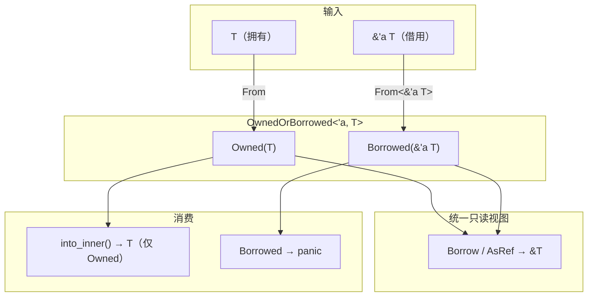

# OwnedOrBorrowed 源码分析

## 1. 文件角色与职责

本文件定义 **`OwnedOrBorrowed<'a, T>`**（拥有或借用的统一包装，*owned-or-borrowed wrapper*）：在 API 中既可传入 **拥有值**（*owned value*，`T`），也可传入 **引用**（*reference*，`&'a T`），调用方通过同一类型表达两种来源，便于在 **泛型**（*generics*）与 **借用检查**（*borrow checker*）下统一处理「要么拥有、要么借用」的语义。

职责边界：不包含业务逻辑，仅提供 **枚举**（*enum*）、**类型转换**（*conversion*）与 **借用视图**（*borrowed view*）及 **消费为拥有**（*consume into owned*）的入口。

---

## 2. 公开 API 一览

| 名称 | 类型 | 可见性 | 说明 |
|------|------|--------|------|
| `OwnedOrBorrowed` | `enum` | `pub` | 变体 `Owned(T)` / `Borrowed(&'a T)` |
| `From<T>` | `impl` | （标准库 trait，公开） | 从 `T` 构造 `Owned` |
| `From<&'a T>` | `impl` | 同上 | 从引用构造 `Borrowed` |
| `Borrow<T>` | `impl` | 同上 | 统一得到 `&T` |
| `AsRef<T>` | `impl` | 同上 | 委托给 `Borrow` |
| `into_inner` | 方法 | `pub` | 仅 `Owned` 时返回 `T`，否则 **panic**（*panic*） |

---

## 3. 核心数据结构

### `OwnedOrBorrowed<'a, T>`

- **`Owned(T)`**：值由本枚举 **拥有**（*own*），生命周期与 `'a` 无关。
- **`Borrowed(&'a T)`**：不拥有数据，生命周期受 `'a` 约束，需与引用来源一致。

**不变量**：`Borrowed` 变体下调用 `into_inner` 违反类型设计意图，运行时主动失败。

---

## 4. Trait 定义与实现

本文件 **不定义** 新 trait，仅 **实现**（*implement*）标准库与核心库 trait：

| Trait | 目标类型 | 行为摘要 |
|-------|----------|----------|
| `From<T>` | `OwnedOrBorrowed<'_, T>` | `val` → `Owned(val)` |
| `From<&'a T>` | `OwnedOrBorrowed<'a, T>` | `val` → `Borrowed(val)` |
| `std::borrow::Borrow<T>` | 同上 | `borrow()` 在两种变体下均返回 `&T` |
| `AsRef<T>` | 同上 | `as_ref()` 调用 `Borrow::borrow` |

`Borrow` 与 `AsRef` 组合使该类型可参与期望 **`AsRef<T>`** 或 **`Borrow<T>`** 的泛型 API（例如哈希映射查找键的借用形式）。

---

## 5. 算法

无独立算法；仅有 **模式匹配**（*pattern matching*）分支：

- `borrow` / `as_ref`：`Owned` 取 `&val`，`Borrowed` 直接返回存储的引用。
- `into_inner`：`Owned` 解构出 `T`；`Borrowed` 触发 `panic!("Can't take unowned reference")`。

时间复杂度均为 **O(1)**（*constant time*）。

---

## 6. 所有权与借用分析

- **生命周期参数 `'a`**：仅出现在 `Borrowed(&'a T)` 与 `From<&'a T>` 中，保证借用变体不 **悬垂**（*dangling*）。
- **`Owned` 变体**：枚举拥有 `T`，`into_inner` 通过 **移动**（*move*）交出所有权，调用后原枚举不可用。
- **`Borrowed` 变体**：枚举仅持 **共享引用**（*shared reference*），无法合法给出 `T` 的所有权，故 `into_inner` 设计为 panic 而非返回 `Result`（*result type*），属于 **契约**（*contract*）：调用方须在语义上保证仅在 `Owned` 时调用。
- **`From<T>`** 使用 `'_` **占位生命周期**（*placeholder lifetime*），表示由编译器推断，与 `Borrowed` 无关。

---

## 7. Mermaid 架构图

---

## 8. 小结

`owned_or_borrowed.rs` 是 **hyperon-common** 中的轻量 **适配类型**（*adapter type*），用单一枚举抹平「拥有 / 借用」差异，并通过 `From`、`Borrow`、`AsRef` 融入 Rust 生态。`into_inner` 以 panic 强化「仅拥有方可取出」的约定；若需错误处理，上层可改为先匹配变体或使用 `Result`，但当前实现追求 API 极简。
